# CameraSubsystem 实现状态

**更新日期:** 2026-04-26

> **文档硬规范**
>
> - 本项目的系统架构图、模块框图、部署拓扑图、数据路径框图和工程结构框图必须使用 `architecture-diagram` skill 生成独立 HTML / inline SVG 图表产物；每个 HTML 图必须同步导出同名 `.svg`，Markdown 中默认直接显示 SVG，并附完整 HTML 图表链接。
> - 时序图、状态机图、纯目录结构图等仍使用 Mermaid fenced code block（语言标识为 `mermaid`）。
> - 禁止新增 ASCII art/text 框图；普通日志、命令输出、代码片段按其原始语言使用 fenced code block。
> - 每份项目文档必须在文档元信息和硬规范之后维护 `## 目录`，目录至少覆盖二级标题，并使用相对链接或页内锚点。
> - `README.md` 是团队入口文档，开头必须维护工程结构概览、项目文档索引和常用入口链接。
> - 评审建议、风险、ARCH-* 跟踪项只维护在 [docs/ARCHITECTURE_REVIEW.md](docs/ARCHITECTURE_REVIEW.md)，其他文档只链接引用，避免重复漂移。

## 目录

- [项目概述](#项目概述)
- [目录结构](#目录结构)
- [已完成模块](#已完成模块)
- [构建系统](#构建系统)
- [测试状态](#测试状态)
- [文档状态](#文档状态)
- [下一步工作计划](#下一步工作计划)
- [架构完善项（面向边缘设备）](#架构完善项面向边缘设备)
- [DMA-BUF Phase 1 后续修改入口](#dma-buf-phase-1-后续修改入口)
- [发布端/订阅端解耦模型状态](#发布端订阅端解耦模型状态)
- [架构设计细化（Buffer 生命周期与背压策略）](#架构设计细化buffer-生命周期与背压策略)
- [边缘设备适配与交叉编译状态](#边缘设备适配与交叉编译状态)
- [技术债务](#技术债务)
- [贡献指南](#贡献指南)
- [许可证](#许可证)
- [联系方式](#联系方式)

## 项目概述

CameraSubsystem 项目已完成核心模块的实现，进入优化和完善阶段。项目旨在构建一个高性能、低延迟、可扩展的通用 Camera 数据流基座，作为 AI 推理、视频编码、预览显示等上层应用的统一数据来源。

本文档只维护实现进度、测试状态和技术债务执行状态。架构评审建议与 ARCH-* 跟踪项统一维护在 [docs/ARCHITECTURE_REVIEW.md](docs/ARCHITECTURE_REVIEW.md)。

## 目录结构

```mermaid
flowchart TB
    Root["CameraSubsystem/"]
    Root --> Include["include/camera_subsystem/<br/>头文件目录"]
    Include --> IncludeCore["core/<br/>核心数据结构"]
    Include --> IncludeBroker["broker/<br/>分发层接口"]
    Include --> IncludeCamera["camera/<br/>Camera 层接口"]
    Include --> IncludeIpc["ipc/<br/>控制面/数据面协议与接口"]
    Include --> IncludePlatform["platform/<br/>平台抽象层"]
    Include --> IncludeUtils["utils/<br/>工具类"]

    Root --> Src["src/<br/>源文件目录"]
    Src --> SrcCore["core/"]
    Src --> SrcBroker["broker/"]
    Src --> SrcCamera["camera/"]
    Src --> SrcIpc["ipc/"]
    Src --> SrcPlatform["platform/"]
    Src --> SrcUtils["utils/"]

    Root --> Tests["tests/"]
    Tests --> Unit["unit/<br/>单元测试"]
    Tests --> Stress["stress/<br/>压力测试"]

    Root --> Docs["docs/"]
    Docs --> Overview["PROJECT_OVERVIEW.md"]
    Docs --> Review["ARCHITECTURE_REVIEW.md"]

    Root --> Examples["examples/<br/>双进程示例"]
    Examples --> PublisherExample["camera_publisher_example.cpp"]
    Examples --> SubscriberExample["camera_subscriber_example.cpp"]

    Root --> Scripts["scripts/"]
    Scripts --> Build["build.sh<br/>本机构建"]
    Scripts --> BuildRk["build-rk3576.sh<br/>RK3576 交叉编译"]
    Scripts --> Format["format.sh"]
    Scripts --> Count["count_loc.sh"]

    Root --> CMakeDir["cmake/"]
    CMakeDir --> Toolchains["toolchains/"]
    Toolchains --> RkToolchain["rk3576.cmake"]

    Root --> MainCMake["CMakeLists.txt"]
    Root --> Readme["README.md"]
    Root --> Structure["structure.md"]
    Root --> Api["API_REFERENCE.md"]
    Root --> Naming["NAMING_CONVENTION.md"]
    Root --> Status["IMPLEMENTATION_STATUS.md"]
```

## 已完成模块

### 1. 核心数据结构 (Core) ✅

**状态:** 已完成并测试

**实现内容:**

- ✅ `types.h/cpp` - 类型定义
  - PixelFormat 枚举
  - MemoryType 枚举
  - IoMethod 枚举
  - ErrorCode 枚举
  - LogLevel 枚举
  - 辅助函数（GetErrorString, PixelFormatToString, MemoryTypeToString）

- ✅ `frame_handle.h/cpp` - 帧句柄结构
  - POD 结构设计
  - 多平面格式支持
  - Stride 和 Offset 信息
  - 辅助方法（GetPlaneData, GetPlaneSize, IsValid, Reset）

- ✅ `frame_descriptor.h/cpp` - DMA-BUF Phase 1 帧描述模型
  - `FrameDescriptor` 显式描述 fd、plane、stride、offset、bytes_used 和 buffer_id
  - `FramePacket` 承载 `FrameDescriptor + FrameHandle + FrameLease`
  - 第一阶段先支持单 fd 单平面，字段预留多 fd 多平面扩展

- ✅ `camera_config.h/cpp` - Camera配置结构
  - 配置参数定义
  - 验证方法（IsValid）
  - 默认配置（GetDefault）
  - 重置方法（Reset）

**测试覆盖:**

- ✅ FrameHandle 单元测试（12个测试用例）
- ✅ CameraConfig 单元测试（11个测试用例）
- ✅ 类型转换测试
- ✅ BufferPool 单元测试
- ✅ BufferGuard 单元测试（新增）
- ✅ BufferState 状态机测试（新增）
- ✅ FrameHandleEx 单元测试（新增）
- ✅ FrameDescriptor / FrameLease 单元测试（新增）

**新增组件:**

- ✅ `buffer_pool.h/cpp` - BufferPool 统一生命周期与复用池
- ✅ `buffer_guard.h/cpp` - BufferGuard RAII 所有权管理
- ✅ `buffer_state.h` - Buffer 状态机定义
- ✅ `frame_handle_ex.h/cpp` - FrameHandleEx 扩展结构（绑定 Buffer 生命周期）
- ✅ `frame_lease.h/cpp` - HeapFrameLease / DmaBufFrameLease 生命周期抽象

### 2. 平台抽象层 (Platform) ✅

**状态:** 已完成

**实现内容:**

- ✅ `platform_logger.h/cpp` - 日志系统封装（spdlog）
- ✅ `platform_thread.h/cpp` - 线程封装
- ✅ `platform_epoll.h/cpp` - Epoll封装

### 3. 分发层 (Broker) ✅

**状态:** 已完成

**实现内容:**

- ✅ `frame_subscriber.h` - 订阅者接口定义
- ✅ `frame_broker.h/cpp` - 分发中心实现

### 4. Camera层 (Camera) ✅

**状态:** 已完成基础实现

**已实现:**

- ✅ `camera_source.h/cpp` - Camera数据源实现（当前 V4L2 + MMAP 后端）
- ✅ 设备打开/格式配置/帧采集/回调分发
- ✅ BufferPool 复用池接入（拷贝模式）
- ✅ 显式 `IoMethod::kDmaBuf` 时尝试 V4L2 `VIDIOC_EXPBUF` 导出 DMA-BUF fd
- ✅ `FramePacketCallback` 接入，用于交付 `FrameDescriptor + FrameLease`
- ✅ DMA-BUF lease in-flight 上限与 release 后 QBUF 的基础闭环
- ✅ DMA-BUF export 不可用时自动回退 MMAP + copy
- ✅ 跨进程 `DataPlaneV2` / `SCM_RIGHTS` fd 传递与独立 `ReleaseFrame` 回收通道
- ✅ 基础背压：池耗尽时丢帧
- ✅ `camera_session_manager.h/cpp` - 会话管理（按订阅启停）

**待实现:**

- ⏳ V4L2 多平面、RKISP/MIPI 节点 EXPBUF 与多 fd import 验证
- ⏳ DataPlaneV2 长稳、慢消费者、多订阅者与异常断连压测
- ⏳ 高级 Buffer 管理机制与慢消费者隔离

### 5. 工具类 (Utils) 🚧

**状态:** 部分完成

**已实现:**

- ✅ signal_handler 信号处理工具

**待实现:**

- ⏳ 字符串工具类
- ⏳ 时间工具类
- ⏳ 数学工具类

## 构建系统

**状态:** 基本完成

**实现内容:**

- ✅ `CMakeLists.txt` - 主CMake配置文件
- ✅ `tests/CMakeLists.txt` - 测试配置文件
- ✅ `examples/CMakeLists.txt` - 双进程示例构建配置
- ✅ `cmake/toolchains/rk3576.cmake` - RK3576 官方工具链配置
- ✅ `scripts/build-rk3576.sh` - RK3576 一键交叉构建脚本
- ✅ 库目标定义
  - camera_subsystem_core (静态库)
  - camera_subsystem_platform (静态库)
  - camera_subsystem_broker (静态库)
  - camera_subsystem_camera (静态库)
  - camera_subsystem_ipc (静态库)
- ✅ 依赖配置
  - pthread
  - spdlog
  - Google Test

## 测试状态

**状态:** 部分完成

**已实现测试:**

- ✅ FrameHandle 单元测试（12个测试用例，全部通过）
- ✅ CameraConfig 单元测试（11个测试用例，全部通过）
- ✅ PlatformLayer 压测程序（platform_stress_test）
- ✅ FrameBroker 压测程序（frame_broker_stress_test）
- ✅ CameraSource 压测程序（camera_source_stress_test）
- ✅ CameraSessionManager 单元测试
- ✅ 控制面 IPC 单元测试（含沙箱受限跳过策略）
- ✅ FrameDescriptor / FrameLease 单元测试

**待添加测试:**

- ⏳ PlatformLayer 单元测试
- ⏳ FrameBroker 单元测试
- ⏳ CameraSource 单元测试
- ⏳ 集成测试
- ⏳ 性能测试

## 文档状态

**已完成文档:**

- ✅ README.md - 项目主文档
- ✅ structure.md - 架构设计文档
- ✅ docs/ARCHITECTURE_REVIEW.md - 架构评审文档
- ✅ API_REFERENCE.md - API接口文档
- ✅ NAMING_CONVENTION.md - 命名规范文档
- ✅ IMPLEMENTATION_STATUS.md - 本文件

**待添加文档:**

- ⏳ 开发者指南
- ⏳ 用户手册
- ⏳ 部署指南
- ⏳ 故障排查指南

## 下一步工作计划

### 短期目标（1-2周）

1. **完善 CameraSource 数据通路**
   - 增加多平面格式验证用例
   - 推进 DMA-BUF 零拷贝主链路

2. **完善 Broker 背压策略**
   - 策略参数化（阈值 / 优先级 / 延迟窗口）
   - 观测指标联动压测

3. **提升进程模型健壮性**
   - 控制面心跳与断链恢复
   - 订阅抖动场景下的会话防抖策略

### 中期目标（3-4周）

1. **完善测试覆盖**
   - 增加集成测试
   - 添加性能测试
   - 扩展压力测试场景

2. **示例工程强化**
   - 增加子发布端（编解码链路）示例
   - 增加多订阅端并发示例
   - 增加故障注入示例（设备断连/重连）

3. **文档完善**
   - 架构评审文档与实现状态联动
   - 补充 RK3576 部署手册
   - 补充运维排障手册

### 长期目标（1-2月）

1. **性能优化**
   - 零拷贝传输优化
   - 内存占用优化
   - CPU 占用优化

2. **功能扩展**
   - 支持 Android HAL
   - 完善发布端/订阅端解耦通信（生产级协议与安全控制）
   - 支持更多像素格式

3. **监控与诊断**
   - 实现性能指标采集
   - 实现实时监控接口
   - 实现诊断日志

## 架构完善项（面向边缘设备）

架构评审建议统一维护在 [docs/ARCHITECTURE_REVIEW.md](docs/ARCHITECTURE_REVIEW.md)。实现状态文档只记录模块完成度与技术债务执行状态。

当前实现状态摘要：

1. Buffer 生命周期与复用池基础治理已完成，当前默认 V4L2 后端仍保留 MMAP -> BufferPool 的拷贝 fallback。
2. 发布端/订阅端解耦、按订阅启停、控制面/数据面协议已形成双进程可运行原型。
3. DMA-BUF Phase 2 已完成最小跨进程闭环：`FrameDescriptor` / `FrameLease` / V4L2 `VIDIOC_EXPBUF`、DataPlaneV2 descriptor、`SCM_RIGHTS` fd 传递、独立 release channel、publisher/subscriber 示例接入，并已在 RK3576 `/dev/video45` 冒烟通过。
4. 长稳压测、慢消费者隔离、多订阅者、设备恢复、统一 metrics、通用板端自检流程仍是下一阶段重点。

## DMA-BUF Phase 1 后续修改入口

下一次修改建议优先围绕“板端可验证的最小闭环”推进，不要直接进入跨进程 fd 传递。

| 优先级 | 任务 | 验收口径 |
|--------|------|----------|
| P0 | 在 RK3576 上显式启用 `IoMethod::kDmaBuf`，验证 `/dev/video45` 或目标节点是否支持 `VIDIOC_EXPBUF` | ✅ 2026-04-26 已验证：4 buffers export 成功 |
| P0 | 增加最小 DMA-BUF probe / smoke test 入口 | ✅ 已新增 `dmabuf_smoke_test`，输出 buffer、lease、mmap、sync 统计 |
| P0 | 验证 `DmaBufFrameLease` release 后 QBUF 时序 | ✅ 板端 5 秒 smoke：120 帧、active_leases 回到 0、lease_exhausted=0 |
| P1 | 增加 DMA-BUF 路径统计 | ✅ publisher 与 smoke test 已输出 export_fail、lease_exhausted、dmabuf_frame_count |
| P1 | 设计 CPU mmap 调试读路径和 sync helper | ✅ 已抽象 `DmaBufSyncHelper`，`dmabuf_smoke_test` 已验证 CPU mmap + `DMA_BUF_IOCTL_SYNC` |
| P1 | 明确多平面扩展落点 | ✅ `FrameDescriptor` 已以 per-plane `fd_index` 表达多 fd / 多平面，并补单元测试；MPLANE 采集接入待有硬件后推进 |
| P2 | 进入 `DataPlaneV2` / `SCM_RIGHTS` 设计实现 | ✅ 已完成协议结构、`FrameDescriptor` 映射、SCM_RIGHTS helper、独立 release channel、publisher/subscriber 示例接入与 RK3576 smoke |

本阶段保持两个边界：

1. 默认运行路径仍保留 MMAP + copy fallback，保证现有 publisher/subscriber 和 Web Preview 不被 DMA-BUF 试验影响。
2. DMA-BUF fd 是数据访问句柄，V4L2 buffer 复用权仍由生产端和 `FrameLease` 控制；不要让消费者自行决定 QBUF。

## 发布端/订阅端解耦模型状态

| 能力 | 当前状态 | 权威说明 |
|------|----------|----------|
| 核心发布端独占 Camera 设备或采集后端 | 已落地基础模型 | [README.md](README.md#5-架构概览) |
| 控制面订阅/退订/Ping | 已落地基础协议 | [API_REFERENCE.md](API_REFERENCE.md#17-控制面-ipc-接口新增) |
| 数据面帧传输 | 已落地示例复制链路 | [API_REFERENCE.md](API_REFERENCE.md#18-数据面协议示例) |
| 按订阅引用计数启停 Camera | 已落地基础会话管理 | [API_REFERENCE.md](API_REFERENCE.md#16-camerasessionmanager-接口新增) |
| 多子发布端/多订阅端生产级模型 | 待完善 | [docs/ARCHITECTURE_REVIEW.md](docs/ARCHITECTURE_REVIEW.md#8-架构项跟踪arch-) |

示例运行步骤统一维护在 [README.md](README.md#7-示例运行)，本文档不重复维护命令细节。

## 架构设计细化（Buffer 生命周期与背压策略）

详细设计建议与后续策略统一维护在 [docs/ARCHITECTURE_REVIEW.md](docs/ARCHITECTURE_REVIEW.md)。当前实现侧只确认两点：

1. `BufferPool` / `BufferGuard` / `BufferState` 已落地基础生命周期治理。
2. 背压当前只有池耗尽丢帧与 Broker 队列上限丢帧，尚未形成可配置策略。

## 边缘设备适配与交叉编译状态

- ✅ 已建立可扩展的交叉编译入口，当前示例平台为 RK3576 / Debian
- ✅ 已引入 CMake Toolchain 文件：`cmake/toolchains/rk3576.cmake`
- ✅ 已引入交叉构建脚本：`scripts/build-rk3576.sh`
- ✅ 使用 Luckfox Omni3576 SDK 官方 GCC 10.3 工具链：`aarch64-none-linux-gnu-`
- ✅ 默认输出 RK3576 产物到 `bin/rk3576/`
- ✅ 当前交叉编译已通过，生成 `camera_publisher_example` 与 `camera_subscriber_example` 的 ARM aarch64 ELF
- ✅ 已完成 RK3576 Debian 12 初步 publisher/subscriber smoke test
- ✅ 已完成 RK3576 `/dev/video45` DMA-BUF Phase 1 smoke test：120 帧、`export_fail=0`、`lease_exhausted=0`、CPU mmap/sync 成功
- ⏳ 后续接入 RGA / RKNN / MPP 或其他平台媒体栈时补充设备侧 sysroot 依赖清单
- ⏳ 后续新增平台时补充对应 toolchain、部署脚本和板端自检流程

## 技术债务

- [x] 修复 FrameHandle 悬空指针风险（P0）✅ 2026-02-27
- [x] 修复 BufferPool 析构竞态条件（P1）✅ 2026-02-27
- [x] 完善状态机转换机制（P1）✅ 2026-02-27
- [ ] 添加更多的错误处理和边界检查
- [ ] 实现内存池管理
- [ ] 添加性能分析工具
- [ ] 完善日志系统
- [ ] 添加代码覆盖率检查
- [x] 增加 RK3576 跨架构编译入口 ✅ 2026-04-25
- [x] 增加 DMA-BUF 板端运行时自检，并保留 RK3576 作为首个验证实例 ✅ 2026-04-26
- [x] 新增 FrameDescriptor / FrameLease / DmaBufFrameLease 基础模型 ✅ 2026-04-26
- [x] 接入 V4L2 DMA-BUF export 尝试路径和 copy fallback ✅ 2026-04-26
- [x] 在 RK3576 板端验证 DMA-BUF export、lease 回收和 cache 行为 ✅ 2026-04-26
- [x] 抽象生产可复用 DMA-BUF sync helper，并完成板端验证 ✅ 2026-04-26
- [x] 定义 DataPlaneV2 协议结构与 SCM_RIGHTS fd 传递 helper ✅ 2026-04-26
- [x] 实现 ReleaseFrame 消息 helper、release tracker、超时回收和断连回收策略基础设施 ✅ 2026-04-26
- [x] 实现独立 ReleaseFrame UDS server 并接入 publisher 运行时 ✅ 2026-04-26
- [x] 将跨进程 DataPlaneV2 接入 publisher/subscriber 示例，并在 RK3576 `/dev/video45` 完成 smoke ✅ 2026-04-26
- [ ] 按顺序补 DataPlaneV2 异常验证：subscriber 崩溃、release socket 断开、release 超时、fd 泄漏检查和 publisher 退出清理
- [ ] 补慢消费者与多订阅者验证：观察 `lease_in_flight_max`、pending release、QBUF 时序、帧率和丢帧策略
- [ ] 固化 RK3576 板端 smoke 脚本：上传、运行、停止、日志采集和 counters 校验
- [ ] 接入 V4L2 MPLANE 采集路径并验证 MIPI/RKISP 多平面
- [ ] 背压策略参数化（延迟阈值/优先级规则）
- [ ] 按 [docs/ARCHITECTURE_REVIEW.md](docs/ARCHITECTURE_REVIEW.md) 推进 ARCH-* 评审项

## 贡献指南

欢迎贡献代码！请遵循以下步骤：

1. Fork 本仓库
2. 创建特性分支 (`git checkout -b feature/AmazingFeature`)
3. 提交更改 (`git commit -m 'Add some AmazingFeature'`)
4. 推送到分支 (`git push origin feature/AmazingFeature`)
5. 开启 Pull Request

## 许可证

本项目采用 MIT 许可证。详见 LICENSE 文件。

## 联系方式

- 项目维护者: CameraSubsystem Team
- 问题反馈: [GitHub Issues](https://github.com/SuycxZMZ/CameraSubsystem/issues)

---

**最后更新:** 2026-03-01
**文档版本:** v0.2
