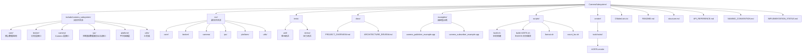

# CameraSubsystem 实现状态

**更新日期:** 2026-05-09

> **文档硬规范**
>
> - 本项目的系统架构图、模块框图、部署拓扑图、数据路径框图和工程结构框图必须使用 `architecture-diagram` skill 生成独立 HTML / inline SVG 图表产物；每个 HTML 图必须同步导出同名 `.svg`，Markdown 中默认直接显示 SVG，并附完整 HTML 图表链接。
> - 时序图、状态机图、纯目录结构图等仍使用 Mermaid fenced code block（语言标识为 `mermaid`）。
> - 禁止新增 ASCII art/text 框图；普通日志、命令输出、代码片段按其原始语言使用 fenced code block。
> - 每份项目文档必须在文档元信息和硬规范之后维护 `## 目录`，目录至少覆盖二级标题，并使用相对链接或页内锚点。
> - `README.md` 是团队入口文档，开头必须维护工程结构概览、项目文档索引和常用入口链接。
> - 评审建议、风险、ARCH-* 跟踪项只维护在 [docs/ARCHITECTURE_REVIEW.md](docs/ARCHITECTURE_REVIEW.md)，其他文档只链接引用，避免重复漂移。
> - Git 提交信息必须遵循项目既有风格：标题使用 `[类别] 简短动词短语`，正文使用 2-3 条 `- ` 列表说明主要修改范围；不要写“验证：XXX”这类独立验证段落，也不要附带外部 AI 生成标记。

## 目录

- [CameraSubsystem 实现状态](#camerasubsystem-实现状态)
  - [目录](#目录)
  - [项目概述](#项目概述)
  - [目录结构](#目录结构)
  - [已完成模块](#已完成模块)
    - [1. 核心数据结构 (Core) ✅](#1-核心数据结构-core-)
    - [2. 平台抽象层 (Platform) ✅](#2-平台抽象层-platform-)
    - [3. 分发层 (Broker) ✅](#3-分发层-broker-)
    - [4. Camera层 (Camera) ✅](#4-camera层-camera-)
    - [5. 工具类 (Utils) 🚧](#5-工具类-utils-)
  - [构建系统](#构建系统)
  - [测试状态](#测试状态)
  - [文档状态](#文档状态)
  - [下一步工作计划](#下一步工作计划)
    - [短期优先级（1-2周）](#短期优先级1-2周)
    - [已完成但需持续回归](#已完成但需持续回归)
    - [中期目标（3-4周）](#中期目标3-4周)
    - [长期目标（1-2月）](#长期目标1-2月)
  - [架构完善项（面向边缘设备）](#架构完善项面向边缘设备)
  - [DMA-BUF Phase 1 后续修改入口](#dma-buf-phase-1-后续修改入口)
  - [发布端/订阅端解耦模型状态](#发布端订阅端解耦模型状态)
  - [架构设计细化（Buffer 生命周期与背压策略）](#架构设计细化buffer-生命周期与背压策略)
  - [边缘设备适配与交叉编译状态](#边缘设备适配与交叉编译状态)
  - [技术债务](#技术债务)
  - [贡献指南](#贡献指南)
  - [许可证](#许可证)
  - [联系方式](#联系方式)

## 项目概述

CameraSubsystem 项目已完成核心模块的实现，进入优化和完善阶段。项目旨在构建一个高性能、低延迟、可扩展的通用 Camera 数据流基座，作为 AI 推理、视频编码、预览显示等上层应用的统一数据来源。

本文档只维护实现进度、测试状态和技术债务执行状态。架构评审建议与 ARCH-* 跟踪项统一维护在 [docs/ARCHITECTURE_REVIEW.md](docs/ARCHITECTURE_REVIEW.md)。

## 目录结构

```mermaid
flowchart TB
    Root["CameraSubsystem/"]
    Root --> Include["include/camera_subsystem/<br/>头文件目录"]
    Include --> IncludeCore["core/<br/>核心数据结构"]
    Include --> IncludeBroker["broker/<br/>分发层接口"]
    Include --> IncludeCamera["camera/<br/>Camera 层接口"]
    Include --> IncludeIpc["ipc/<br/>控制面/数据面协议与接口"]
    Include --> IncludePlatform["platform/<br/>平台抽象层"]
    Include --> IncludeUtils["utils/<br/>工具类"]

    Root --> Src["src/<br/>源文件目录"]
    Src --> SrcCore["core/"]
    Src --> SrcBroker["broker/"]
    Src --> SrcCamera["camera/"]
    Src --> SrcIpc["ipc/"]
    Src --> SrcPlatform["platform/"]
    Src --> SrcUtils["utils/"]

    Root --> Tests["tests/"]
    Tests --> Unit["unit/<br/>单元测试"]
    Tests --> Stress["stress/<br/>压力测试"]

    Root --> Docs["docs/"]
    Docs --> Overview["PROJECT_OVERVIEW.md"]
    Docs --> Review["ARCHITECTURE_REVIEW.md"]

    Root --> Examples["examples/<br/>双进程示例"]
    Examples --> PublisherExample["camera_publisher_example.cpp"]
    Examples --> SubscriberExample["camera_subscriber_example.cpp"]

    Root --> Scripts["scripts/"]
    Scripts --> Build["build.sh<br/>本机构建"]
    Scripts --> BuildRk["build-rk3576.sh<br/>RK3576 交叉编译"]
    Scripts --> Format["format.sh"]
    Scripts --> Count["count_loc.sh"]

    Root --> CMakeDir["cmake/"]
    CMakeDir --> Toolchains["toolchains/"]
    Toolchains --> RkToolchain["rk3576.cmake"]

    Root --> MainCMake["CMakeLists.txt"]
    Root --> Readme["README.md"]
    Root --> Structure["structure.md"]
    Root --> Api["API_REFERENCE.md"]
    Root --> Naming["NAMING_CONVENTION.md"]
    Root --> Status["IMPLEMENTATION_STATUS.md"]
```

## 已完成模块

### 1. 核心数据结构 (Core) ✅

**状态:** 已完成并测试

**实现内容:**

- ✅ `types.h/cpp` - 类型定义
  - PixelFormat 枚举
  - MemoryType 枚举
  - IoMethod 枚举
  - ErrorCode 枚举
  - LogLevel 枚举
  - 辅助函数（GetErrorString, PixelFormatToString, MemoryTypeToString）

- ✅ `frame_handle.h/cpp` - 帧句柄结构
  - POD 结构设计
  - 多平面格式支持
  - Stride 和 Offset 信息
  - 辅助方法（GetPlaneData, GetPlaneSize, IsValid, Reset）

- ✅ `frame_descriptor.h/cpp` - DMA-BUF Phase 1 帧描述模型
  - `FrameDescriptor` 显式描述 fd、plane、stride、offset、bytes_used 和 buffer_id
  - `FramePacket` 承载 `FrameDescriptor + FrameHandle + FrameLease`
  - 第一阶段先支持单 fd 单平面，字段预留多 fd 多平面扩展

- ✅ `camera_config.h/cpp` - Camera配置结构
  - 配置参数定义
  - 验证方法（IsValid）
  - 默认配置（GetDefault）
  - 重置方法（Reset）

**测试覆盖:**

- ✅ FrameHandle 单元测试（12个测试用例）
- ✅ CameraConfig 单元测试（11个测试用例）
- ✅ 类型转换测试
- ✅ BufferPool 单元测试
- ✅ BufferGuard 单元测试（新增）
- ✅ BufferState 状态机测试（新增）
- ✅ FrameHandleEx 单元测试（新增）
- ✅ FrameDescriptor / FrameLease 单元测试（新增）

**新增组件:**

- ✅ `buffer_pool.h/cpp` - BufferPool 统一生命周期与复用池
- ✅ `buffer_guard.h/cpp` - BufferGuard RAII 所有权管理
- ✅ `buffer_state.h` - Buffer 状态机定义
- ✅ `frame_handle_ex.h/cpp` - FrameHandleEx 扩展结构（绑定 Buffer 生命周期）
- ✅ `frame_lease.h/cpp` - HeapFrameLease / DmaBufFrameLease 生命周期抽象

### 2. 平台抽象层 (Platform) ✅

**状态:** 已完成

**实现内容:**

- ✅ `platform_logger.h/cpp` - 日志系统封装（spdlog）
- ✅ `platform_thread.h/cpp` - 线程封装
- ✅ `platform_epoll.h/cpp` - Epoll封装

### 3. 分发层 (Broker) ✅

**状态:** 已完成

**实现内容:**

- ✅ `frame_subscriber.h` - 订阅者接口定义
- ✅ `frame_broker.h/cpp` - 分发中心实现

### 4. Camera层 (Camera) ✅

**状态:** 已完成基础实现

**已实现:**

- ✅ `camera_source.h/cpp` - Camera数据源实现（当前 V4L2 + MMAP 后端）
- ✅ 设备打开/格式配置/帧采集/回调分发
- ✅ BufferPool 复用池接入（拷贝模式）
- ✅ 显式 `IoMethod::kDmaBuf` 时尝试 V4L2 `VIDIOC_EXPBUF` 导出 DMA-BUF fd
- ✅ `FramePacketCallback` 接入，用于交付 `FrameDescriptor + FrameLease`
- ✅ DMA-BUF lease in-flight 上限与 release 后 QBUF 的基础闭环
- ✅ DMA-BUF export 不可用时自动回退 MMAP + copy
- ✅ 跨进程 `DataPlaneV2` / `SCM_RIGHTS` fd 传递与独立 `ReleaseFrame` 回收通道
- ✅ 基础背压：池耗尽时丢帧
- ✅ `camera_session_manager.h/cpp` - 会话管理（按订阅启停）
- ✅ Web Preview + Codec Server 录制联调：Record start/stop 后预览数据面保持可用，publisher 对断开的 codec data fd 走 send_fail 清理而非进程退出

**待实现:**

- ⏳ V4L2 多平面 STREAMON、RKISP/MIPI sensor pipeline 与多 fd import 验证
- ⏳ DataPlaneV2 板端长稳、真实 subscriber 崩溃/断连、慢消费者与多订阅者压测
- ⏳ 高级 Buffer 管理机制与慢消费者隔离

### 5. 工具类 (Utils) 🚧

**状态:** 部分完成

**已实现:**

- ✅ signal_handler 信号处理工具

**待实现:**

- ⏳ 字符串工具类
- ⏳ 时间工具类
- ⏳ 数学工具类

## 构建系统

**状态:** 基本完成

**实现内容:**

- ✅ `CMakeLists.txt` - 主CMake配置文件
- ✅ `tests/CMakeLists.txt` - 测试配置文件
- ✅ `examples/CMakeLists.txt` - 双进程示例构建配置
- ✅ `cmake/toolchains/rk3576.cmake` - RK3576 官方工具链配置
- ✅ `scripts/build-rk3576.sh` - RK3576 一键交叉构建脚本
- ✅ 库目标定义
  - camera_subsystem_core (静态库)
  - camera_subsystem_platform (静态库)
  - camera_subsystem_broker (静态库)
  - camera_subsystem_camera (静态库)
  - camera_subsystem_ipc (静态库)
- ✅ 依赖配置
  - pthread
  - spdlog
  - Google Test

## 测试状态

**状态:** 部分完成

**已实现测试:**

- ✅ FrameHandle 单元测试（12个测试用例，全部通过）
- ✅ CameraConfig 单元测试（11个测试用例，全部通过）
- ✅ PlatformLayer 压测程序（platform_stress_test）
- ✅ FrameBroker 压测程序（frame_broker_stress_test）
- ✅ CameraSource 压测程序（camera_source_stress_test）
- ✅ CameraSessionManager 单元测试
- ✅ 控制面 IPC 单元测试（含沙箱受限跳过策略）
- ✅ FrameDescriptor / FrameLease 单元测试
- ✅ Codec Server writer/session 本机验证
- ✅ RK3576 Web 录制 start/stop smoke：停止录制后 WebSocket 仍持续出帧，8080 服务保持监听
- ✅ RK3576 60 秒录制稳定性：1490 帧输入/解码/编码，0 failures，24MB H.264 文件
- ✅ H.264 文件播放兼容性：ffprobe 确认 H.264 High profile 1920x1080

**待添加测试:**

- ⏳ PlatformLayer 单元测试
- ⏳ FrameBroker 单元测试
- ⏳ CameraSource 单元测试
- ⏳ 集成测试
- ⏳ 性能测试
- ⏳ Web 录制长稳与 H.264 播放兼容性测试

## 文档状态

**已完成文档:**

- ✅ README.md - 项目主文档
- ✅ structure.md - 架构设计文档
- ✅ docs/ARCHITECTURE_REVIEW.md - 架构评审文档
- ✅ docs/MULTI_CAMERA_ARCHITECTURE.md - 多路摄像头架构纠偏文档
- ✅ API_REFERENCE.md - API接口文档
- ✅ NAMING_CONVENTION.md - 命名规范文档
- ✅ IMPLEMENTATION_STATUS.md - 本文件

**待添加文档:**

- ⏳ 开发者指南
- ⏳ 用户手册
- ⏳ 部署指南
- ⏳ 故障排查指南

## 下一步工作计划

### 短期优先级（1-2周）

1. **多路摄像头架构纠偏（USB + MIPI 同时接入）**
   - 已新增 [docs/MULTI_CAMERA_ARCHITECTURE.md](docs/MULTI_CAMERA_ARCHITECTURE.md)，把最终多路目标、当前单路偏差、目标对象模型、DataPlaneV2/release key、codec 多 session 和 Web 多 stream 路线统一固化
   - 已完成 M1 基础贯通：新增 `CameraStreamIdentity`，`CameraEndpoint`、`CameraSessionManager`、`CameraSource`、DMA-BUF `FrameDescriptor`、DataPlaneV2 descriptor 和 publisher/subscriber 关键日志已携带稳定字符串 `stream_id`
   - 已开始 M2 第一刀：publisher 示例由单全局 `CameraSource` 改为 `stream_id -> CameraStreamRuntime` map，新 endpoint 不再强制 stop/reinit 已存在的 stream runtime
   - 已完成 M3：publisher pending lease 从裸 `frame_id` 改为 `stream_id/camera_id + frame_id + buffer_id` 多字段 key；ReleaseFrame tracker 已按 stream/frame/buffer 隔离，并用 consumer set 跟踪每个消费者 release
   - 已完成 codec server 多 session 第一阶段：`RecordingSessionManager` 改为 `stream_id -> RecordingSession`，同一进程可同时管理多路录制状态，单路 stop 不影响其他 stream 状态；RK3576 `codec-multi-session-control` 已验证两路控制面 session 隔离
   - 已补齐 Web Gateway 与 codec server 的显式 `--stream-id` 订阅配置，`/status` 与 record fallback 不再硬编码 `usb_camera_0`；USB-only 默认保持 `stream_id=0`，与当前 Web 二进制帧协议和前端 store 对齐
   - 已完成 Web W1-W2：Gateway status 携带 `stream_index`，前端建立 `stream_index -> stream_id` sideband 映射，预览帧、录制状态和错误状态统一归并到同一个 stream card；WebFrameHeader V1 继续保留 numeric stream index
   - 当前剩余主偏差是真实 MIPI live STREAMON 尚未完成；Web W3/W4 仅在 topology 配置和真实多路输入需要时推进，不能先于主链路继续扩张 UI/协议面
   - USB-only smoke 可以继续保留单 `DEVICE=/dev/video45` 默认入口；生产化配置需要显式声明 stream topology，保证 USB 与 MIPI 可以同时存在

2. **板端 smoke 与启动方式固化**
   - 已新增 `scripts/rk3576-board-smoke-suite.sh` 作为 RK3576 统一自检入口，默认串联 DataPlaneV2 lifecycle、codec multi-session control、codec MP4、Web MP4 record 和 Web codec restart MP4 smoke
   - 已新增 `scripts/rk3576-run-web-stack.sh` 管理 `camera_publisher_example` / `camera_codec_server` / `web_preview_gateway` 的 start / stop / restart / status / logs
   - 已完成 smoke suite quick/full/extended 三档拆分（`TIER` 环境变量选择，默认 `full`）
   - 已新增 `multi-camera-topology` suite：USB live DataPlaneV2 生命周期与 MIPI/RKISP MPLANE readiness 使用同一个 topology smoke 入口；当前 USB-only 环境允许 MIPI readiness SKIP，接入真实 sensor 后用 `REQUIRE_MIPI=1` 强校验
   - 2026-05-09 板端短 smoke 结果：USB `/dev/video45` DataPlaneV2 live `v2_sent=254`、`release_pending=0`、subscriber `frames=254`；RKISP/RKVpss MPLANE readiness `pass=10`、`fail=0`

3. **Web / Codec 扩展能力收敛**
   - Web Preview 与 `camera_codec_server` 当前定位为调试预览、录制 smoke 和主链路验证辅助，不再作为短期主线长期展开
   - 后续只处理影响板端 smoke、录制闭环、错误收敛或多路身份正确性的必要改动；新的 UI 体验、容器格式、推流和自动续录能力暂缓
   - 已将常见 `record_status.error` 内部错误码映射为前端中文说明，并通过 `title` 保留原始错误码，降低现场调试成本
   - 已将错误码格式化逻辑收敛为前端公共工具，录制按钮 tooltip 会提示上次失败原因，避免 codec 未启动时只能在状态行排查
   - 如果 smoke 需要，再增加 Gateway codec health 广播和前端能力状态；不提前引入自动续录、复杂多路控制台或新的封装格式

4. **MIPI/RKISP 多平面准备**
   - 当前调试条件只有 USB 摄像头，不能把真实 MIPI/RKISP sensor 出帧验证标记为完成
   - 已新增 `scripts/rk3576-mplane-readiness-probe.sh`，用于优先枚举 RKISP/RKVpss capture 节点并运行 `mplane_dmabuf_probe`；USB-only 环境没有 MPLANE 节点时返回 `SKIP`，接入 MIPI sensor 后可用 `REQUIRE_MPLANE=1` 作为强校验
   - 2026-05-08 板端 readiness 结果：`pass=10`、`mplane_candidates=10`、`fail=0`、`mplane_readiness_result=PASS`；当前只证明 RKISP/RKVpss `REQBUFS + QUERYBUF + EXPBUF` readiness，不代表真实 sensor live frame
   - 已在 [docs/DMA_BUF_ZERO_COPY_ARCHITECTURE.md](docs/DMA_BUF_ZERO_COPY_ARCHITECTURE.md) 固化 `CameraSource` 内部 backend 拆分、MPLANE descriptor 映射、release QBUF 边界和实现顺序
   - 已完成 `CameraSource` single-planar buffer type 依赖收敛，并新增有效 V4L2 capability 解析与内部 backend selector；当前行为仍固定为 `V4L2_BUF_TYPE_VIDEO_CAPTURE`，MPLANE-only 设备会明确失败
   - 已新增 `CameraSource` 内部 MPLANE format/query/export 初始化骨架和清理逻辑；`CAMERA_SUBSYSTEM_ENABLE_MPLANE_PROBE=1` 时 `Initialize()` 只跑 probe-only 并立即 cleanup，不接入 `StartStream()`、`DQBUF/QBUF` 主循环
   - 后续接入 MPLANE live sensor 后验证 per-plane fd / offset / stride / bytesused
   - 为 DataPlaneV2 -> MPP 低拷贝录制路径准备真实 NV12 输入验证

5. **DataPlaneV2 低拷贝录制架构设计**
   - 在 `camera_codec_server` 接入 DataPlaneV2 前，先明确 copy path 与 fd path 的选择条件、fallback 行为、MPP import 输入契约和 release 时序
   - 涉及跨模块接口或状态机调整时，先更新 [docs/CODEC_SERVER_ARCHITECTURE.md](docs/CODEC_SERVER_ARCHITECTURE.md) 和 [docs/DMA_BUF_ZERO_COPY_ARCHITECTURE.md](docs/DMA_BUF_ZERO_COPY_ARCHITECTURE.md)，讨论确认后再写代码

### 已完成但需持续回归

1. **DataPlaneV2 异常验证**
   - 已完成 RK3576 真实进程 subscriber 崩溃 failover smoke：强杀慢 release subscriber 后，正常 subscriber 持续收帧，publisher 最终 `release_pending=0`、`active_leases=0`
   - 已完成 release socket 主动断开隔离：publisher 收到断连 reclaim 后移除对应 DataPlaneV2 数据客户端，正常 subscriber 保持 24-25fps，`release_timeout=0`、`lease_exhausted=0`
   - 已完成 fd 泄漏长稳与 publisher 退出清理验证：60 秒双 subscriber 运行期间 publisher fd drift=0、subscriber fd drift=0，publisher 主动退出后进程与 socket 均清理为 0

2. **Web 录制与 MP4 主链路**
   - 已完成连续录制 5 分钟+、重复 start/stop 循环、`.h264` 多工具解码验证、Web MP4 参数入口和 RK3576 live `.mp4` 验证
   - 已完成 Web smoke 多轮 start/stop、停止后 WebSocket 重连、codec server 重启恢复，覆盖 raw_h264 和 mp4

3. **编码参数化与容器封装**
   - 已完成请求级 `fps` / `bitrate` / `gop` 覆盖、启动参数默认值、status profile 返回、MP4 最小写入器和 `container=mp4` 主链路
   - MKV、分段录制和断电恢复作为后续扩展，不进入当前短期优先级

### 中期目标（3-4周）

1. **完善测试覆盖**
   - 增加集成测试
   - 添加性能测试
   - 扩展压力测试场景

2. **示例工程强化**
   - 增加子发布端（编解码链路）示例
   - 增加多订阅端并发示例
   - 增加故障注入示例（设备断连/重连）

3. **文档完善**
   - 架构评审文档与实现状态联动
   - 补充 RK3576 部署手册
   - 补充运维排障手册

### 长期目标（1-2月）

1. **性能优化**
   - 零拷贝传输优化
   - 内存占用优化
   - CPU 占用优化

2. **功能扩展**
   - 支持 Android HAL
   - 完善发布端/订阅端解耦通信（生产级协议与安全控制）
   - 支持更多像素格式

3. **监控与诊断**
   - 实现性能指标采集
   - 实现实时监控接口
   - 实现诊断日志

## 架构完善项（面向边缘设备）

架构评审建议统一维护在 [docs/ARCHITECTURE_REVIEW.md](docs/ARCHITECTURE_REVIEW.md)。实现状态文档只记录模块完成度与技术债务执行状态。

当前实现状态摘要：

1. Buffer 生命周期与复用池基础治理已完成，当前默认 V4L2 后端仍保留 MMAP -> BufferPool 的拷贝 fallback。
2. 发布端/订阅端解耦、按订阅启停、控制面/数据面协议已形成双进程可运行原型。
3. DMA-BUF Phase 2 已完成最小跨进程闭环：`FrameDescriptor` / `FrameLease` / V4L2 `VIDIOC_EXPBUF`、DataPlaneV2 descriptor、`SCM_RIGHTS` fd 传递、独立 release channel、publisher/subscriber 示例接入，并已在 RK3576 `/dev/video45` 冒烟通过。
4. 多路摄像头目标架构已重新收敛为 `CameraStreamIdentity` + `stream_id -> CameraStreamRuntime`；后续不能继续在单 `CameraSource`、裸 `frame_id` release key 或单 recording session 上扩展生产能力。
5. 长稳压测、慢消费者隔离、多订阅者、设备恢复、统一 metrics、通用板端自检流程仍是下一阶段重点。
6. Web Preview 录制控制闭环已在 RK3576 正式目录验证通过，后续重点从“能跑通”转为“长稳、可播放、可运维”。

## DMA-BUF Phase 1 后续修改入口

下一次修改建议优先围绕“板端可验证的最小闭环”推进，不要直接进入跨进程 fd 传递。

| 优先级 | 任务 | 验收口径 |
|--------|------|----------|
| P0 | 在 RK3576 上显式启用 `IoMethod::kDmaBuf`，验证 `/dev/video45` 或目标节点是否支持 `VIDIOC_EXPBUF` | ✅ 2026-04-26 已验证：4 buffers export 成功 |
| P0 | 增加最小 DMA-BUF probe / smoke test 入口 | ✅ 已新增 `dmabuf_smoke_test`，输出 buffer、lease、mmap、sync 统计 |
| P0 | 验证 `DmaBufFrameLease` release 后 QBUF 时序 | ✅ 板端 5 秒 smoke：120 帧、active_leases 回到 0、lease_exhausted=0 |
| P1 | 增加 DMA-BUF 路径统计 | ✅ publisher 与 smoke test 已输出 export_fail、lease_exhausted、dmabuf_frame_count |
| P1 | 设计 CPU mmap 调试读路径和 sync helper | ✅ 已抽象 `DmaBufSyncHelper`，`dmabuf_smoke_test` 已验证 CPU mmap + `DMA_BUF_IOCTL_SYNC` |
| P1 | 明确多平面扩展落点 | ✅ `FrameDescriptor` 已以 per-plane `fd_index` 表达多 fd / 多平面，并补单元测试；MPLANE 采集接入待有硬件后推进 |
| P2 | 进入 `DataPlaneV2` / `SCM_RIGHTS` 设计实现 | ✅ 已完成协议结构、`FrameDescriptor` 映射、SCM_RIGHTS helper、独立 release channel、publisher/subscriber 示例接入与 RK3576 smoke |
| P2 | DataPlaneV2 异常验证 | ✅ 已完成本机异常单测、RK3576 subscriber 崩溃 failover、release socket 主动断开、fd 泄漏长稳和 publisher 退出清理验证 |
| P2 | 慢消费者与多订阅者验证 | 进行中：subscriber 已支持 `--process-delay-ms` 和 `--release-delay-ms`，RK3576 slow-consumer smoke 脚本已支持自动密码和 counters 判定；`/dev/video45` 双订阅者 60 秒长稳 PASS |

本阶段保持两个边界：

1. 默认运行路径仍保留 MMAP + copy fallback，保证现有 publisher/subscriber 和 Web Preview 不被 DMA-BUF 试验影响。
2. DMA-BUF fd 是数据访问句柄，V4L2 buffer 复用权仍由生产端和 `FrameLease` 控制；不要让消费者自行决定 QBUF。

## 发布端/订阅端解耦模型状态

| 能力 | 当前状态 | 权威说明 |
|------|----------|----------|
| 核心发布端独占 Camera 设备或采集后端 | 已落地基础模型 | [README.md](README.md#5-架构概览) |
| 控制面订阅/退订/Ping | 已落地基础协议 | [API_REFERENCE.md](API_REFERENCE.md#17-控制面-ipc-接口新增) |
| 数据面帧传输 | 已落地示例复制链路 | [API_REFERENCE.md](API_REFERENCE.md#18-数据面协议示例) |
| 按订阅引用计数启停 Camera | 已落地基础会话管理 | [API_REFERENCE.md](API_REFERENCE.md#16-camerasessionmanager-接口新增) |
| 多子发布端/多订阅端生产级模型 | 待完善 | [docs/ARCHITECTURE_REVIEW.md](docs/ARCHITECTURE_REVIEW.md#8-架构项跟踪arch-) |

示例运行步骤统一维护在 [README.md](README.md#7-示例运行)，本文档不重复维护命令细节。

## 架构设计细化（Buffer 生命周期与背压策略）

详细设计建议与后续策略统一维护在 [docs/ARCHITECTURE_REVIEW.md](docs/ARCHITECTURE_REVIEW.md)。当前实现侧只确认两点：

1. `BufferPool` / `BufferGuard` / `BufferState` 已落地基础生命周期治理。
2. 背压当前只有池耗尽丢帧与 Broker 队列上限丢帧，尚未形成可配置策略。

## 边缘设备适配与交叉编译状态

- ✅ 已建立可扩展的交叉编译入口，当前示例平台为 RK3576 / Debian
- ✅ 已引入 CMake Toolchain 文件：`cmake/toolchains/rk3576.cmake`
- ✅ 已引入交叉构建脚本：`scripts/build-rk3576.sh`
- ✅ 使用 Luckfox Omni3576 SDK 官方 GCC 10.3 工具链：`aarch64-none-linux-gnu-`
- ✅ 默认输出 RK3576 产物到 `bin/rk3576/`
- ✅ 当前交叉编译已通过，生成 `camera_publisher_example` 与 `camera_subscriber_example` 的 ARM aarch64 ELF
- ✅ 已完成 RK3576 Debian 12 初步 publisher/subscriber smoke test
- ✅ 已完成 RK3576 `/dev/video45` DMA-BUF Phase 1 smoke test：120 帧、`export_fail=0`、`lease_exhausted=0`、CPU mmap/sync 成功
- ⏳ 后续接入 RGA / RKNN / MPP 或其他平台媒体栈时补充设备侧 sysroot 依赖清单
- ⏳ 后续新增平台时补充对应 toolchain、部署脚本和板端自检流程

## 技术债务

- [x] 修复 FrameHandle 悬空指针风险（P0）✅ 2026-02-27
- [x] 修复 BufferPool 析构竞态条件（P1）✅ 2026-02-27
- [x] 完善状态机转换机制（P1）✅ 2026-02-27
- [ ] 添加更多的错误处理和边界检查
- [ ] 实现内存池管理
- [ ] 添加性能分析工具
- [ ] 完善日志系统
- [ ] 添加代码覆盖率检查
- [x] 增加 RK3576 跨架构编译入口 ✅ 2026-04-25
- [x] 增加 DMA-BUF 板端运行时自检，并保留 RK3576 作为首个验证实例 ✅ 2026-04-26
- [x] 新增 FrameDescriptor / FrameLease / DmaBufFrameLease 基础模型 ✅ 2026-04-26
- [x] 接入 V4L2 DMA-BUF export 尝试路径和 copy fallback ✅ 2026-04-26
- [x] 在 RK3576 板端验证 DMA-BUF export、lease 回收和 cache 行为 ✅ 2026-04-26
- [x] 抽象生产可复用 DMA-BUF sync helper，并完成板端验证 ✅ 2026-04-26
- [x] 定义 DataPlaneV2 协议结构与 SCM_RIGHTS fd 传递 helper ✅ 2026-04-26
- [x] 实现 ReleaseFrame 消息 helper、release tracker、超时回收和断连回收策略基础设施 ✅ 2026-04-26
- [x] 实现独立 ReleaseFrame UDS server 并接入 publisher 运行时 ✅ 2026-04-26
- [x] 将跨进程 DataPlaneV2 接入 publisher/subscriber 示例，并在 RK3576 `/dev/video45` 完成 smoke ✅ 2026-04-26
- [x] 补 DataPlaneV2 本机异常单测：release 超时、fd 泄漏防护、无效 release、重复/未知 release 和 publisher 退出 pending lease 清理 ✅ 2026-04-27
- [x] 新增 RK3576 DataPlaneV2 subscriber 崩溃 failover smoke 脚本并完成板端验证：强杀慢 release subscriber 后正常 subscriber 持续收帧，publisher 最终 `release_pending=0`、`active_leases=0` ✅ 2026-05-07
- [x] 完成 RK3576 DataPlaneV2 release socket 主动断开验证：publisher 移除断开 release channel 的 DataPlaneV2 数据客户端，正常 subscriber 保持 24-25fps，`release_timeout=0`、`lease_exhausted=0` ✅ 2026-05-07
- [x] 完成 RK3576 DataPlaneV2 fd 泄漏长稳与 publisher 退出清理验证：60 秒双 subscriber 运行期间 publisher fd drift=0、subscriber fd drift=0，publisher 主动退出后进程与 socket 均清理为 0 ✅ 2026-05-07
- [x] 补 subscriber 慢消费者参数：`--process-delay-ms` / `--release-delay-ms` ✅ 2026-04-27
- [x] 新增 RK3576 DataPlaneV2 慢消费者/多订阅者 smoke 脚本 ✅ 2026-04-27
- [x] 在 RK3576 上运行慢消费者与多订阅者验证：`SLOW_RELEASE_DELAY_MS=200` 无 release timeout，`SLOW_RELEASE_DELAY_MS=700` 可触发 timeout 压力场景 ✅ 2026-04-27
- [x] 完善 RK3576 板端 smoke 脚本 counters 自动判定与 SSH 密码自动输入体验 ✅ 2026-04-27
- [x] 完成 RK3576 DataPlaneV2 慢消费者/双订阅者 60 秒长稳验证 ✅ 2026-04-27
- [x] 新增 `mplane_dmabuf_probe` 并验证 RKISP/RKVpss MPLANE 节点 `REQBUFS + QUERYBUF + EXPBUF` ✅ 2026-04-27
- [x] 完成 Web Preview + Codec Server 录制 start/stop 正式目录 smoke，验证停止录制后 WebSocket 继续出帧且 8080 保持监听 ✅ 2026-05-05
- [x] 修正 Web 录制 smoke 默认路径，统一使用 `/home/luckfox/CameraSubsystem` 规范目录 ✅ 2026-05-05
- [x] 完成 RK3576 60 秒录制稳定性验证：1490 帧输入/解码/编码，0 failures ✅ 2026-05-05
- [x] 完成 H.264 文件播放兼容性验证：ffprobe 确认 H.264 High profile 1920x1080 ✅ 2026-05-05
- [x] 完成 RK3576 5 分钟录制长稳：5676 帧输入，5674 帧解码/编码，2 decode failures，0 write failures，91MB 输出 ✅ 2026-05-05
- [x] 完成重复 start/stop 循环验证：10 次 x 5 秒，995 帧编码，0 失败，10 个独立 `.h264` 文件 ✅ 2026-05-05
- [x] 完成 H.264 多工具兼容性验证：ffprobe + ffmpeg 全帧解码通过 ✅ 2026-05-05
- [x] 完成编码参数化：请求级 `fps` / `bitrate` / `gop` 覆盖、启动默认值和 status profile 返回 ✅ 2026-05-05
- [x] 完成 Web smoke 多轮 start/stop + 停止后 WebSocket 重连 + MP4 Web 入口验证 ✅ 2026-05-07
- [x] 完成 codec server 重启恢复 smoke：录制中终止、Stop 错误收敛、重启后重新录制，raw_h264 / mp4 均通过 ✅ 2026-05-07
- [x] 板端 smoke suite 拆分为 quick/full/extended 三档 ✅ 2026-05-07
- [x] Web 录制状态面板补充常见 codec 错误码中文说明 ✅ 2026-05-08
- [x] Web 录制按钮补充上次失败原因提示 ✅ 2026-05-08
- [x] 增加 RK3576 MPLANE readiness 枚举脚本，支持 USB-only 环境 SKIP 与 MIPI 接入后强校验 ✅ 2026-05-08
- [x] 固化 V4L2 MPLANE 采集路径架构拆分设计 ✅ 2026-05-08
- [x] 收敛 `CameraSource` 内部 single-planar buffer type 依赖，补有效 capability 解析和 backend selector 准备 ✅ 2026-05-08
- [x] 新增 `CameraSource` 内部 MPLANE format/query/export 初始化骨架，不接入 STREAMON 主循环 ✅ 2026-05-08
- [x] 增加 `CAMERA_SUBSYSTEM_ENABLE_MPLANE_PROBE=1` 受控开关，支持 `Initialize()` 只跑 MPLANE probe-only 并立即 cleanup ✅ 2026-05-08
- [x] 固化 USB + MIPI 多路摄像头架构纠偏文档，明确 `CameraStreamIdentity`、多 `CameraStreamRuntime`、DataPlaneV2/release 多路 key 和 codec 多 session 迁移顺序 ✅ 2026-05-08
- [x] 引入 `CameraStreamIdentity` 基础模型，`CameraSource`、`FrameDescriptor` 和 DataPlaneV2 descriptor 开始携带稳定字符串 `stream_id` ✅ 2026-05-08
- [x] 补全控制面与关键日志的 `stream_id` 贯通：`CameraEndpoint` 自动生成稳定 stream id，`CameraSessionManager` session key 与 publisher/subscriber 日志开始使用该身份 ✅ 2026-05-08
- [x] 将 publisher app 运行时改为 `stream_id -> CameraStreamRuntime` map，避免新 endpoint stop/reinit 已存在 stream runtime ✅ 2026-05-08
- [x] 将 DataPlaneV2 pending lease 和 ReleaseFrame tracker key 从裸 `frame_id` 纠偏为 stream/frame/buffer/consumer 多字段语义，补同帧跨流和跨 buffer 隔离测试 ✅ 2026-05-08
- [x] 完成 codec server 多 recording session 第一阶段：`RecordingSessionManager` 改为 `stream_id -> RecordingSession`，补多 stream 独立 start/stop/status 测试，并在 RK3576 上通过 27/27 验证 ✅ 2026-05-08
- [x] 新增 RK3576 `codec-multi-session-control` smoke：`--disable-camera-subscriber` 控制面模式下验证两路 session 文件隔离、单路 stop 不影响另一路、重复 stop 返回 `not_recording` ✅ 2026-05-09
- [x] 为 `web_preview_gateway` 与 `camera_codec_server` 增加显式 `--stream-id` 订阅配置，消除 Web status/record fallback 的硬编码流 ID；RK3576 quick smoke 通过 `codec-mp4`、`web-record-mp4`、`web-codec-restart-mp4`，日志确认 publisher/control/codec/gateway 均使用 `stream_id=0` ✅ 2026-05-09
- [x] 完成 Web 多 stream 状态设计：短期采用 sideband status 映射 numeric `stream_index` 到字符串 `stream_id`，避免直接破坏 WebFrameHeader V1 ✅ 2026-05-09
- [x] 完成 Web W1-W2 小步接入：Gateway status 增加 `stream_index`，前端按 `stream_index -> stream_id` 归并预览帧、录制状态和错误状态 ✅ 2026-05-09
- [x] 新增 RK3576 `multi-camera-topology` smoke 入口：USB live DataPlaneV2 生命周期与 MIPI/RKISP readiness 共用 topology 口径，真实 MIPI 接入后可切换为强校验 ✅ 2026-05-09
- [ ] 接入真实 MIPI/RKISP sensor pipeline 后复测 STREAMON、bytesused 和多 fd plane
- [ ] 接入 V4L2 MPLANE 采集路径并验证 MIPI/RKISP 多平面
- [ ] 接入真实 MIPI sensor 后，把 `multi-camera-topology` 从 readiness 升级为 USB live + MIPI live 联合 smoke
- [ ] 背压策略参数化（延迟阈值/优先级规则）
- [ ] 按 [docs/ARCHITECTURE_REVIEW.md](docs/ARCHITECTURE_REVIEW.md) 推进 ARCH-* 评审项

## 贡献指南

欢迎贡献代码！请遵循以下步骤：

1. Fork 本仓库
2. 创建特性分支 (`git checkout -b feature/AmazingFeature`)
3. 提交更改 (`git commit -m 'Add some AmazingFeature'`)
4. 推送到分支 (`git push origin feature/AmazingFeature`)
5. 开启 Pull Request

## 许可证

本项目采用 MIT 许可证。详见 LICENSE 文件。

## 联系方式

- 项目维护者: CameraSubsystem Team
- 问题反馈: [GitHub Issues](https://github.com/SuycxZMZ/CameraSubsystem/issues)

---

**最后更新:** 2026-03-01
**文档版本:** v0.2
