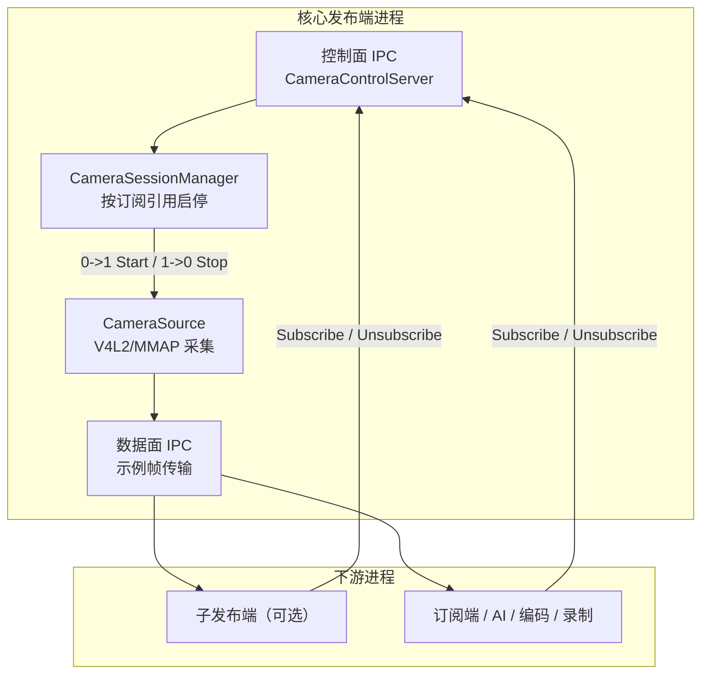
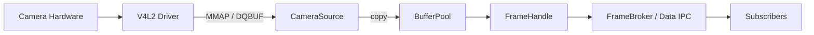

# CameraSubsystem

**目标平台:** Linux / Debian @ RK3576（预留 Android 迁移）<br>
**开发语言:** C++17 / C POD 数据结构<br>
**核心方向:** Camera / V4L2 -> Publish/Subscribe -> AI / 编码 / 录制<br>
**最后更新:** 2026-04-25

> **文档硬规范**
>
> - 本项目所有流程图、框图、时序图、状态机图、目录结构图等图示必须使用 Mermaid fenced code block（语言标识为 `mermaid`）。
> - 禁止新增 ASCII art/text 框图；普通日志、命令输出、代码片段按其原始语言使用 fenced code block。
> - 每份项目文档必须在文档元信息和硬规范之后维护 `## 目录`，目录至少覆盖二级标题，并使用相对链接或页内锚点。
> - `README.md` 是团队入口文档，开头必须维护工程结构概览、项目文档索引和常用入口链接。
> - 评审建议、风险、ARCH-* 跟踪项只维护在 [docs/ARCHITECTURE_REVIEW.md](docs/ARCHITECTURE_REVIEW.md)，其他文档只链接引用，避免重复漂移。

---

## 目录

- [1. 项目定位](#1-项目定位)
- [2. 当前状态](#2-当前状态)
- [3. 工程结构](#3-工程结构)
- [4. 项目文档索引](#4-项目文档索引)
- [5. 架构概览](#5-架构概览)
- [6. 快速开始](#6-快速开始)
- [7. 示例运行](#7-示例运行)
- [8. 开发约定](#8-开发约定)
- [9. 当前限制与下一步](#9-当前限制与下一步)

---

## 1. 项目定位

CameraSubsystem 是面向 RK3576 边缘设备的 Camera 数据流基座。它的职责是把底层 Camera 设备访问、采集会话管理、帧分发、订阅关系治理和平台差异收敛到一个可维护的基础子系统中，向上服务 AI 推理、编码、录制和调试预览等模块。

当前主线目标：

1. 核心发布端独占 V4L2 设备入口，订阅端不直接访问 `/dev/videoX`。
2. 使用控制面 IPC 管理订阅/退订，使用数据面链路传输帧数据。
3. 按订阅引用计数启停 Camera，会话无人订阅时释放设备资源。
4. 在 Ubuntu 本机可调试，在 RK3576 Debian 12 上可交叉编译并逐步验证。

---

## 2. 当前状态

| 项目 | 状态 | 说明 |
|------|------|------|
| 本机构建与测试 | 已通过 | `./scripts/build.sh` 可完成构建与测试 |
| RK3576 交叉编译 | 已通过 | 使用 Omni3576 SDK 官方 GCC 10.3 工具链 |
| 发布端/订阅端示例 | 已落地 | `camera_publisher_example` / `camera_subscriber_example` |
| 控制面 IPC | 基础落地 | Subscribe / Unsubscribe / Ping |
| 数据面 IPC | 示例落地 | Unix Socket 复制帧头 + 帧数据 |
| Buffer 生命周期治理 | 基础落地 | `BufferPool` / `BufferGuard` / 状态机 / 泄漏检测 |
| DMA-BUF 零拷贝主链路 | 未完成 | 当前仍是 V4L2 MMAP -> BufferPool 的拷贝模式 |
| 板端运行验证 | 待完成 | 需在 RK3576 Debian 12 上做 smoke test |

---

## 3. 工程结构

| 路径 | 用途 |
|------|------|
| [`include/camera_subsystem/`](include/camera_subsystem/) | 对外头文件，按 core / camera / broker / ipc / platform / utils 分层 |
| [`src/`](src/) | 模块实现，与公共头文件的模块边界保持一致 |
| [`examples/`](examples/) | 核心发布端与订阅端双进程示例 |
| [`tests/`](tests/) | 单元测试与压力测试 |
| [`scripts/`](scripts/) | 构建、交叉编译、格式化和统计脚本 |
| [`cmake/toolchains/`](cmake/toolchains/) | 交叉编译工具链配置 |
| [`docs/`](docs/) | 项目说明、架构评审、文档索引 |
| [`third_party/`](third_party/) | 第三方依赖源码或 stub，不受本项目文档规范约束 |

---

## 4. 项目文档索引

| 文档 | 角色 | 适合阅读场景 |
|------|------|--------------|
| [docs/README.md](docs/README.md) | 文档总索引 | 查找文档边界、维护规则和推荐阅读路径 |
| [README.md](README.md) | 团队入口 | 快速了解项目状态、工程结构、构建运行入口 |
| [docs/PROJECT_OVERVIEW.md](docs/PROJECT_OVERVIEW.md) | 项目概览 | 了解项目目标、技术栈、功能边界和快速开始 |
| [docs/ARCHITECTURE_REVIEW.md](docs/ARCHITECTURE_REVIEW.md) | 架构评审 | 查看系统/代码架构评审、风险、ARCH-* 跟踪项 |
| [IMPLEMENTATION_STATUS.md](IMPLEMENTATION_STATUS.md) | 实现状态 | 查看模块完成度、测试状态、技术债务和下一步计划 |
| [API_REFERENCE.md](API_REFERENCE.md) | API 参考 | 查询公开数据结构、类接口、IPC 协议和示例用法 |
| [NAMING_CONVENTION.md](NAMING_CONVENTION.md) | 工程规范 | 查询命名、目录、代码格式和跨平台约定 |
| [structure.md](structure.md) | 详细设计/历史设计 | 查看较完整的架构设计长文和历史设计语境 |

文档维护原则：

1. README 只做入口和当前事实摘要，不堆叠长篇详细设计。
2. API 只写接口与用法，不承载架构评审。
3. 实现状态只写完成度和计划，不重复评审建议。
4. 架构建议、风险和优先级统一进入 [docs/ARCHITECTURE_REVIEW.md](docs/ARCHITECTURE_REVIEW.md)。

---

## 5. 架构概览



当前数据路径是可运行示例路径，不是最终生产级零拷贝路径：



---

## 6. 快速开始

### 6.1 本机构建与测试

```bash
./scripts/build.sh
```

该脚本会配置 CMake、编译工程并执行 CTest。

### 6.2 RK3576 交叉编译

默认 SDK 路径为项目同级目录 `../Omni3576-sdk`：

```bash
./scripts/build-rk3576.sh
```

如果 SDK 在其他目录：

```bash
OMNI3576_SDK_ROOT=/path/to/Omni3576-sdk ./scripts/build-rk3576.sh
```

RK3576 产物输出到：

```text
bin/rk3576/
```

### 6.3 常用开发命令

| 任务 | 命令 |
|------|------|
| 格式化全部项目代码 | `./scripts/format.sh` |
| 格式化 Git 变更文件 | `./scripts/format.sh changed` |
| 统计代码量 | `./scripts/count_loc.sh` |
| 清理残留 socket | `rm -f /tmp/camera_subsystem_control.sock /tmp/camera_subsystem_data.sock` |

---

## 7. 示例运行

### 7.1 本机运行

终端 1 启动核心发布端：

```bash
./bin/camera_publisher_example
```

终端 2 启动订阅端：

```bash
./bin/camera_subscriber_example
```

### 7.2 RK3576 运行

将 `bin/rk3576/` 下产物复制到开发板后运行：

```bash
./camera_publisher_example
./camera_subscriber_example
```

板端运行前需要确认：

1. `/dev/video0` 或目标设备节点存在。
2. 当前用户具备 video 设备访问权限，必要时先用 `sudo` 排查。
3. 运行目录可写，订阅端默认会输出图片到 `subscriber_frames/`。

### 7.3 示例参数

发布端：

```bash
./camera_publisher_example [device_path] [control_socket] [data_socket]
```

订阅端：

```bash
./camera_subscriber_example [output_dir] [control_socket] [data_socket] [device_path]
```

---

## 8. 开发约定

1. 文档新增或修改必须遵守本文开头的文档硬规范。
2. 架构风险、评审意见、ARCH-* 项不得分散写入 README 或实现状态文档。
3. 新增公共接口必须同步更新 [API_REFERENCE.md](API_REFERENCE.md)。
4. 新增命名或目录约定必须同步更新 [NAMING_CONVENTION.md](NAMING_CONVENTION.md)。
5. 新增 RK3576 平台依赖必须同步更新 toolchain/build 脚本和文档索引。
6. 代码变更后优先运行 `./scripts/build.sh`；交叉编译相关变更还应运行 `./scripts/build-rk3576.sh`。

---

## 9. 当前限制与下一步

当前限制：

1. 数据面 IPC 是示例复制链路，不适合作为 4K 高帧率生产通路。
2. DMA-BUF 零拷贝主链路尚未打通。
3. 背压策略只有基础队列上限和池耗尽丢帧，尚未参数化。
4. 设备断连恢复、订阅端异常恢复、核心发布端重启恢复仍未形成完整状态机。
5. RK3576 Debian 12 板端 smoke test 尚未完成。

下一步建议按 [docs/ARCHITECTURE_REVIEW.md](docs/ARCHITECTURE_REVIEW.md) 的 P0/P1 优先级推进。
