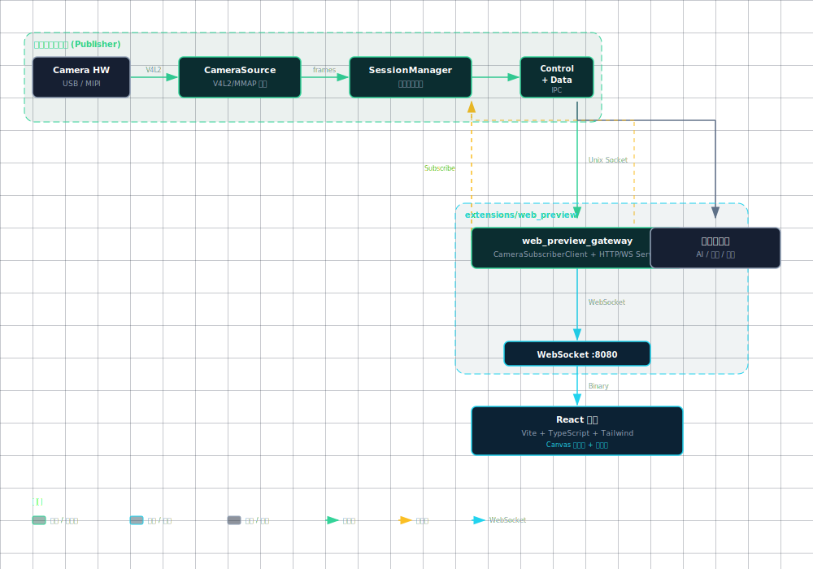

# CameraSubsystem 架构评审与建议

**文档版本:** v0.4 
**评审范围:** 当前主干代码与项目文档（截至 2026-04-26） 
**评审角色:** 高级系统架构师 
**关联文档:** [README.md](../README.md)、[PROJECT_OVERVIEW.md](PROJECT_OVERVIEW.md)、[DMA_BUF_ZERO_COPY_ARCHITECTURE.md](DMA_BUF_ZERO_COPY_ARCHITECTURE.md)、[IMPLEMENTATION_STATUS.md](../IMPLEMENTATION_STATUS.md)、[API_REFERENCE.md](../API_REFERENCE.md)

> **文档硬规范**
>
> - 本项目的系统架构图、模块框图、部署拓扑图、数据路径框图和工程结构框图必须使用 `architecture-diagram` skill 生成独立 HTML / inline SVG 图表产物；每个 HTML 图必须同步导出同名 `.svg`，Markdown 中默认直接显示 SVG，并附完整 HTML 图表链接。
> - 时序图、状态机图、纯目录结构图等仍使用 Mermaid fenced code block（语言标识为 `mermaid`）。
> - 禁止新增 ASCII art/text 框图；普通日志、命令输出、代码片段按其原始语言使用 fenced code block。
> - 每份项目文档必须在文档元信息和硬规范之后维护 `## 目录`，目录至少覆盖二级标题，并使用相对链接或页内锚点。
> - `README.md` 是团队入口文档，开头必须维护工程结构概览、项目文档索引和常用入口链接。
> - 评审建议、风险、ARCH-* 跟踪项只维护在本文档，其他文档只链接引用，避免重复漂移。

---

## 目录

- [1. 评审目标](#1-评审目标)
- [2. 总体结论](#2-总体结论)
- [3. 当前系统架构基线](#3-当前系统架构基线)
- [4. 系统架构评审](#4-系统架构评审)
- [5. 代码架构评审](#5-代码架构评审)
- [6. 从原始文档抽取的评审建议](#6-从原始文档抽取的评审建议)
- [7. 风险清单与优先级](#7-风险清单与优先级)
- [8. 架构项跟踪（ARCH-*）](#8-架构项跟踪arch-)
- [9. 下一阶段验收标准](#9-下一阶段验收标准)
- [10. 结论摘要](#10-结论摘要)

---

## 1. 评审目标

本次评审聚焦三个层面：

1. **系统架构**：当前分层、进程模型、数据通路是否支撑边缘设备上的长期运行与多平台演进。
2. **代码架构**：模块边界、线程模型、生命周期管理、IPC 协议是否具备继续演进的稳定基础。
3. **评审建议归档**：将 README、PROJECT_OVERVIEW、IMPLEMENTATION_STATUS、structure 等文档中分散的架构建议集中维护到本文档，避免主文档重复堆叠。

---

## 2. 总体结论

当前 CameraSubsystem 已经从“单进程概念原型”进入“可运行的核心发布端 + 订阅端双进程原型”阶段，方向正确，工程边界也比早期清晰：核心发布端独占底层 Camera 设备或采集后端、控制面 IPC 管理订阅关系、数据面 IPC 做示例帧传输、BufferPool/BufferGuard 解决了基础生命周期问题，RK3576 官方工具链也已作为首个板端验证链路接入。

但从生产级边缘系统角度看，目前仍是 **可运行原型**，不是稳定生产架构。下一阶段必须优先解决四件事：

1. 将数据面从“socket 复制示例”升级为可部署的数据通路，明确拷贝模式与零拷贝模式边界。
2. 将背压、队列、优先级和延迟阈值从硬编码能力升级为可配置策略。
3. 补齐设备断连、订阅端异常、核心发布端重启后的恢复闭环。
4. 建立统一 Metrics/Tracing 接口，否则不同板端和不同采集后端的问题很难定位。

---

## 3. 当前系统架构基线

[打开完整 HTML 图表](images/system-architecture.html)

已落地模块：

| 模块 | 当前状态 | 评审判断 |
|------|----------|----------|
| `CameraSource` | 当前已落地 V4L2 + MMAP 采集后端，并接入显式 DMA-BUF export 尝试路径 | 默认 copy fallback 可用于 Ubuntu/RK3576 初期调试；显式 DataPlaneV2 链路已完成 RK3576 smoke，生产化仍需长稳与异常场景验证 |
| `FrameBroker` | 订阅者管理、优先级队列、多 worker 分发 | 基础结构合理，策略与观测不足 |
| `BufferPool` / `BufferGuard` | 预分配、RAII 归还、状态机、泄漏检测 | 方向正确，需进一步约束销毁时序与多消费者生命周期 |
| `CameraSessionManager` | 核心发布端单实例、按订阅引用启停 | 职责清晰，但回调持锁执行需要调整 |
| 控制面 IPC | Unix Domain Socket，请求/响应协议 | 适合原型，需补超时、鉴权、版本协商 |
| 数据面 IPC | 示例 socket 传输帧头 + 帧数据 | 只能作为示例，不能作为 4K 高帧率生产路径 |
| 交叉编译 | RK3576 官方 GCC 10.3 toolchain 已接入 | 编译闭环完成，后续应按平台扩展 toolchain 与部署脚本 |

---

## 4. 系统架构评审

### 4.1 优点

1. **设备入口收敛正确**
   核心发布端独占底层 Camera 设备或采集后端入口，订阅端不能直接打开平台设备节点。这是后续做稳定采集、资源仲裁、权限控制和故障恢复的前提。

2. **控制面与数据面开始分离**
   Subscribe/Unsubscribe/Ping 与帧数据传输分离，避免把控制语义塞进热路径。这个方向适合继续扩展能力协商、心跳、鉴权和多路 Camera 路由。

3. **按订阅启停符合边缘设备资源约束**
   没有订阅时不采集，能减少具体平台上的 ISP、Camera 后端、CPU 与内存消耗。

4. **Buffer 生命周期开始工程化**
   `BufferGuard`、`BufferPool`、状态机与泄漏检测解决了早期“谁归还 Buffer”的模糊问题。

5. **交叉编译入口已标准化**
   `cmake/toolchains/rk3576.cmake` 与 `scripts/build-rk3576.sh` 已把首个开发板适配从口头说明变成可执行路径，后续平台应沿用同类结构扩展。

### 4.2 主要缺口

1. **数据面架构尚未满足目标性能**
   当前示例把帧数据通过 Unix Socket 复制给订阅端。该路径适合验证发布/订阅流程，但不适合 4K@30/60fps 的生产主链路。生产路径需要 DMA-BUF fd 传递、共享内存 ring、或平台媒体栈原生 buffer 句柄传递。

2. **“零拷贝”仍需区分阶段事实**
   当前默认链路仍保留 MMAP 后复制到 `BufferPool` 的 fallback；同时代码已新增 `FrameDescriptor` / `FrameLease` / `DmaBufFrameLease`，并在显式 `IoMethod::kDmaBuf` 时尝试 V4L2 `VIDIOC_EXPBUF`。文档中必须持续区分“Phase 1 基础代码已接入”和“生产级跨进程零拷贝尚未完成”，避免误导上层 AI/编码模块。

3. **恢复机制还没有形成状态机**
   当前有启停引用计数，但没有设备断连、`VIDIOC_DQBUF` 持续失败、订阅端断链、核心发布端重启后的统一状态机。边缘设备场景下，这会是 P1 稳定性风险。

4. **可观测性缺口较大**
   分散统计已有雏形，但缺少统一 Metrics 接口、指标命名、采样周期、导出方式和故障快照。

5. **多路 Camera 能力探测还停留在文档层**
   平台能力模型和建议上限 API 有草案，但尚未接入启动流程，也缺少按平台、传感器和采集后端维护的标定数据。

---

## 5. 代码架构评审

### 5.1 模块边界

当前目录分层基本合理：

| 层级 | 现状 | 建议 |
|------|------|------|
| `core` | POD、Buffer、Config、类型定义 | 保持无平台依赖，后续新增 metrics 类型也应先放 core 或独立 observability |
| `camera` | CameraSource + SessionManager，当前 CameraSource 内含 V4L2 后端实现 | 建议继续拆分 `camera_source` 与具体后端实现，例如 `v4l2_device`、Android HAL 或厂商媒体栈适配 |
| `broker` | 进程内分发 | 适合做策略化背压，但不要承担跨进程传输职责 |
| `ipc` | 控制面/数据面协议 | 需要明确“示例协议”和“生产协议”的版本边界 |
| `platform` | 线程、epoll、日志 | 可以继续沉淀 Linux、Android 和不同板端平台差异 |
| `examples` | 双进程示例 | 当前包含较多数据面服务逻辑，后续应抽成库或 app 层模块 |

### 5.2 线程与锁

1. **`CameraSessionManager` 持锁调用 start/stop callback**
   `Subscribe()` 和 `Unsubscribe()` 在持有 `mutex_` 时调用外部回调。当前示例可运行，但后续 start/stop 可能打开 V4L2、初始化 buffer、触发日志或反向查询 session，容易造成长时间阻塞或死锁。建议将“状态决策”和“执行回调”拆开：锁内更新 session 状态，锁外执行 start/stop，再锁内提交结果或回滚。

2. **`FrameBroker` 背压策略过于简单**
   队列满时直接跳过新任务，尚无 `DropOldest`、按订阅者限流、按延迟阈值丢弃、慢消费者隔离。优先级队列是好的基础，但需要策略对象或配置结构承载规则。

3. **`BufferPool` 析构等待不是生产级停机协议**
   析构中最多等待 5 秒可以帮助测试暴露泄漏，但生产停机应由上层生命周期保证：先停采集、停分发、等待消费者 drain，再销毁 pool。建议把 drain/wait 明确为公开 API 或上层协议。

4. **`CameraSource` 采集线程错误处理偏线性**
   `select`、`DQBUF`、`QBUF` 出错后多处直接 break，缺少错误分类、重试策略、状态上报和恢复回调。

### 5.3 IPC 与协议

1. 控制面协议已有 magic/version，这是正确方向。
2. 数据面 header 只有最小帧描述，没有 payload checksum、flags、plane layout、endpoint、producer timestamp、drop reason。
3. 生产级数据面需要支持多平面和 fd 传递，否则 `FrameHandle` 中的 stride/plane 设计无法完整跨进程表达。
4. 当前 socket 路径固定在 `/tmp`，适合开发调试；生产部署需要运行目录、权限、清理策略和服务发现规则。

### 5.4 文档与代码一致性

1. `camera_source.h` 已同步为 V4L2/MMAP 采集实现描述，避免继续沿用“模拟实现”的旧语义。
2. 文档中“零拷贝”应始终标注阶段边界：当前默认路径是 MMAP + heap copy fallback；显式 `--io-method dmabuf --data-plane v2` 时已接入 DMA-BUF export、DataPlaneV2、`SCM_RIGHTS` 和独立 ReleaseFrame 回收通道。
3. `structure.md` 更像历史架构长文，建议后续只作为背景材料，权威状态以 README、PROJECT_OVERVIEW、IMPLEMENTATION_STATUS 和本文档为准。

---

## 6. 从原始文档抽取的评审建议

以下内容来自原 README、PROJECT_OVERVIEW、IMPLEMENTATION_STATUS、structure、API_REFERENCE 中分散的评审建议和待优化项，统一归档到本文档维护。

### 6.1 已完成

| 编号 | 建议 | 当前状态 |
|------|------|----------|
| ARCH-001 | 明确 Buffer 所有权 | 已通过 `BufferGuard` + RAII 落地 |
| ARCH-002 | 增加 Buffer 状态机 | 已支持 Free / InUse / InFlight / Error |
| ARCH-003 | 增加 Buffer 泄漏检测 | 已支持 `CheckLeaks` 与析构告警 |
| ARCH-018 | 发布端/订阅端解耦 | 基础控制面 + 数据面示例已打通 |
| ARCH-019 | 按订阅启停 Camera | `CameraSessionManager` 已实现引用计数启停 |
| ARCH-020 | 控制/数据面协议头协定 | 已有 endpoint、role、magic、version 基础字段 |
| ARCH-021 | RK3576 交叉编译入口 | 官方工具链与构建脚本已作为首个平台样例落地 |

### 6.2 需要继续推进

| 主题 | 原始建议归纳 | 建议归属 |
|------|--------------|----------|
| DMA-BUF 零拷贝 | 先打通 V4L2 DMABUF -> FrameHandle -> Broker -> Consumer，并保留其他后端句柄扩展空间 | P1 数据通路 |
| 多平面格式 | 补齐 plane fd、stride、offset、size 的跨进程表达 | P1 数据通路 |
| 背压参数化 | 支持延迟阈值、队列深度、订阅者优先级、DropPolicy | P1 Broker |
| 设备恢复 | 设备断连检测、重连、会话恢复、降级策略 | P1 稳定性 |
| 可观测性 | 输出 FPS、队列深度、丢帧率、延迟分布、错误原因 | P1 运维 |
| 能力探测 | 平台能力 -> 建议路数/线程数/订阅者上限 | P2 平台适配 |
| 生产级 IPC | 版本协商、能力位、鉴权、重传/拥塞控制 | P2 协议 |
| 线程亲和性 | 采集/分发线程绑定大核/小核，降低调度抖动 | P2 性能 |
| 板端验证 | 以 RK3576 Debian 12 为首个样例，沉淀可复用的最小运行验证与部署脚本 | P1 部署 |

---

## 7. 风险清单与优先级

### P0：进入长期联调前必须处理

| 风险 | 影响 | 建议 |
|------|------|------|
| 回调持锁执行 | start/stop 变复杂后可能阻塞订阅管理或造成死锁 | 重构 `CameraSessionManager`，锁外执行 start/stop callback |
| 数据面被误用为生产链路 | 4K 高帧率下 CPU/内存带宽不可控 | 文档与接口明确示例属性，新增生产数据面设计 |
| 当前零拷贝语义不清 | AI/编码模块可能基于错误假设接入 | 在 API 与 README 中标注当前是 MMAP + copy，零拷贝为路线 |

### P1：下一里程碑必须落地

| 风险 | 影响 | 建议 |
|------|------|------|
| 背压策略不足 | 慢消费者导致延迟抖动或队列堆积 | 引入 BackpressureConfig 和 DropPolicy |
| 设备异常恢复不足 | 板端现场断连后需要人工干预 | 建立 CameraSession 状态机和重试策略 |
| 指标体系不足 | 难以定位性能与稳定性问题 | 统一 Metrics 接口，至少覆盖 FPS、drop、latency、queue |
| 板端验证覆盖不足 | 单一板端 smoke test 不等于多平台可用 | 沉淀通用板端自检脚本，并扩展到更多采集后端和设备节点 |

### P2：生产化前完成

| 风险 | 影响 | 建议 |
|------|------|------|
| IPC 缺少鉴权与能力协商 | 多进程/多租户场景不可控 | 增加 protocol capability、auth token、client heartbeat |
| 多路能力靠人工配置 | 不同摄像头组合下表现不稳定 | 实现 CapabilityProbe + 标定配置 |
| 示例逻辑沉在 examples | 复用性差，生产 app 需复制代码 | 抽取 data server/client 公共库 |

---

## 8. 架构项跟踪（ARCH-*）

| 编号 | 主题 | 状态 | 下一步 |
|------|------|------|--------|
| ARCH-001 | Buffer 所有权不明确 | 已完成 | 保持回归测试 |
| ARCH-002 | Buffer 状态机缺失 | 已完成 | 增加异常状态测试 |
| ARCH-003 | Buffer 泄漏检测 | 已完成 | 接入统一 metrics |
| ARCH-004 | 丢帧策略硬编码 | 进行中 | 定义 `BackpressureConfig` |
| ARCH-005 | 背压阈值配置 | 计划中 | 支持队列深度与延迟阈值 |
| ARCH-006 | 订阅者优先级静态 | 计划中 | 支持动态优先级和慢消费者隔离 |
| ARCH-007 | 设备自动重连 | 计划中 | 增加会话状态机 |
| ARCH-008 | 降级策略 | 计划中 | 支持降帧、降分辨率、暂停低优先级订阅 |
| ARCH-009 | 统一 Metrics | 计划中 | 定义指标结构与导出接口 |
| ARCH-010 | 数据面生产协议 | 进行中 | DMA-BUF Phase 2 最小跨进程链路已完成；后续补长稳、慢消费者、多订阅者、异常恢复和生产级背压 |
| ARCH-010A | DMA-BUF CPU sync helper | 已完成 | 已抽象 `core::DmaBufSyncHelper`，板端 CPU mmap/sync smoke 通过 |
| ARCH-010B | DataPlaneV2 协议层 | 进行中 | 已新增 DataPlaneV2 descriptor、ReleaseFrame 消息结构、SCM_RIGHTS fd 传递 helper、release tracker、publisher release UDS server，并接入 publisher/subscriber 示例；RK3576 smoke 已通过 |
| ARCH-011 | 多路能力探测 | 计划中 | 接入启动流程与平台标定 |
| ARCH-012 | 线程亲和性 | 计划中 | 采集/分发线程绑定策略 |
| ARCH-018 | 发布端/订阅端解耦 | 基础落地 | 补生产级协议与异常恢复 |
| ARCH-019 | 按订阅启停 Camera | 基础落地 | 补防抖 grace period 与失败回滚 |
| ARCH-020 | 协议头协定扩展 | 基础落地 | 补 endpoint、plane、capability、flags |
| ARCH-021 | RK3576 交叉编译入口 | 已完成 | 将 smoke test 经验沉淀为通用板端验证流程 |

---

## 9. 下一阶段验收标准

下一阶段建议以“板端可控原型”为目标，而不是继续扩大功能面。

1. `CameraSessionManager` start/stop 回调不再持锁执行，并补充并发订阅/退订测试。
2. 文档和 API 明确当前数据面是示例复制链路，新增生产数据面设计草案。
3. `FrameBroker` 支持可配置队列上限、DropPolicy、慢消费者统计。
4. 统一输出最小 metrics：采集 FPS、发布 FPS、队列深度、丢帧数、发送失败数、端到端延迟。
5. RK3576 Debian 12 板端完成 `camera_publisher_example` / `camera_subscriber_example` copy 与 DataPlaneV2 最小运行验证，并通过 `dmabuf_smoke_test` 验证 DMA-BUF export、lease、CPU mmap 和 sync 行为。
6. 设备断连或 `/dev/videoX` 不可用时，发布端能输出明确错误状态并保持进程可控退出或等待恢复。

---

## 10. 结论摘要

当前系统架构方向是正确的：设备入口集中、进程隔离、控制面与数据面分离、Buffer 生命周期开始可控。代码架构也已经具备继续演进的骨架。

真正的风险不在“能不能跑”，而在“能不能在不同边缘设备和不同采集后端上长期、可观测、可恢复地跑”。下一阶段应把工作重心从补功能转向补生产控制面：数据面零拷贝、背压参数化、设备恢复、metrics、板端验证。只有这些闭环完成后，CameraSubsystem 才适合承载 AI 推理、编码、录制等上层模块的稳定接入。
