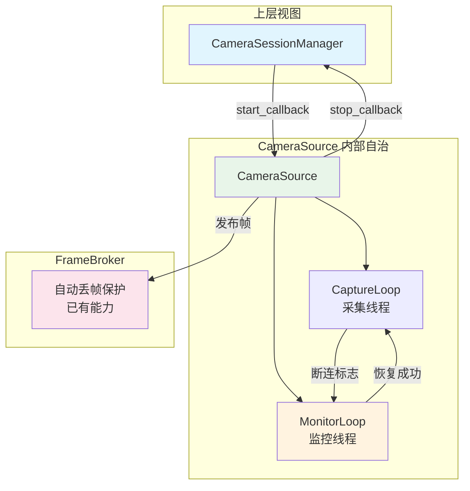
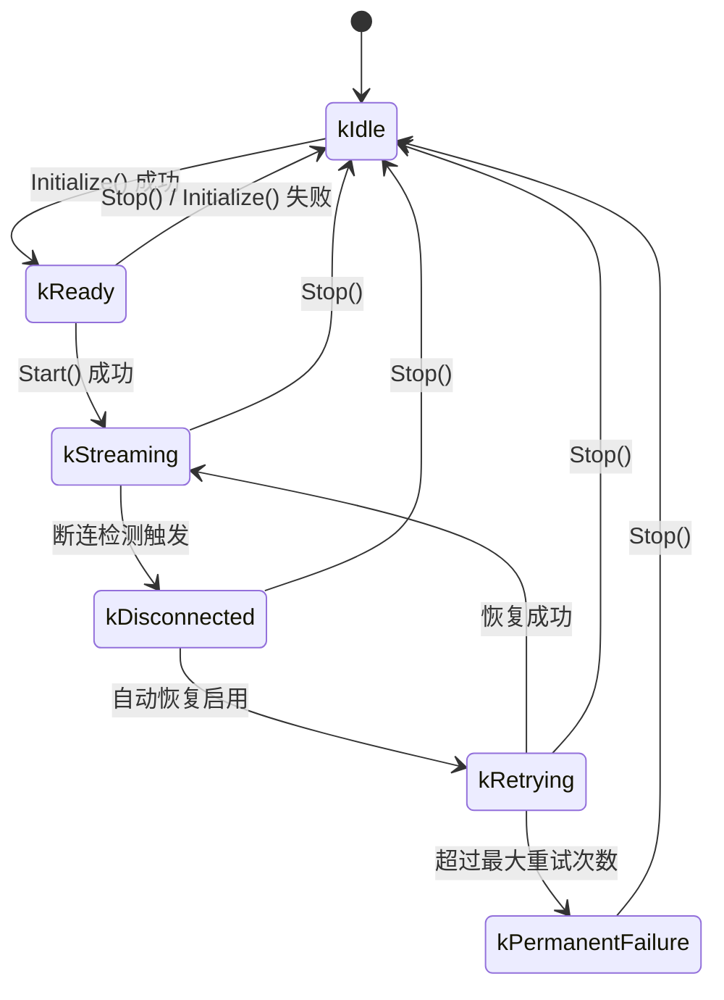

# CameraSource 设备断连检测与恢复设计

**文档版本:** v0.2  
**最后更新:** 2026-05-10  
**适用范围:** CameraSubsystem `CameraSource` 内部状态机扩展  
**关联文档:** [ARCHITECTURE_REVIEW.md](ARCHITECTURE_REVIEW.md)（ARCH-007）、[AGENTS.md](../AGENTS.md)（2.2 写代码前置规则）、[DMA_BUF_ZERO_COPY_ARCHITECTURE.md](DMA_BUF_ZERO_COPY_ARCHITECTURE.md)

---

## 目录

- [1. 需求收敛](#1-需求收敛)
- [2. 当前现状与问题](#2-当前现状与问题)
- [3. 目标架构](#3-目标架构)
- [4. 线程模型](#4-线程模型)
- [5. 状态机设计](#5-状态机设计)
- [6. 接口设计](#6-接口设计)
- [7. 断连检测策略](#7-断连检测策略)
- [8. 恢复流程](#8-恢复流程)
- [9. 与现有模块的交互](#9-与现有模块的交互)
- [10. Metrics 扩展](#10-metrics-扩展)
- [11. 风险点与缓解](#11-风险点与缓解)
- [12. 编码就绪检查清单](#12-编码就绪检查清单)

---

## 1. 需求收敛

**一句话：** 在 `CameraSource` 中增加 V4L2 设备断连检测与可控恢复状态机，使 USB 摄像头被拔掉或驱动异常时，采集线程能检测到断连、进入重试而非直接崩溃退出，并在设备恢复后自动重新初始化并恢复采集。

**不修改的边界：**
- 不修改 `CameraSessionManager` 的接口和回调契约（`start_callback_` / `stop_callback_` 签名不变）
- 不修改 `FrameBroker`、`DataPlaneV2`、Web/Codec 上层链路
- 不修改现有的 `Initialize()` / `Start()` / `Stop()` 公共接口语义（向后兼容）
- 自动恢复默认关闭，通过 `CameraConfig` 显式启用；不启用时保持原有行为（采集线程 break 后停止）
- MPLANE 路径与 single-planar 路径共用同一套断连检测逻辑
- 不引入外部依赖

**验证方案：**
- 本地构建 `./scripts/build.sh` + `ctest --output-on-failure` 通过
- 本地 mock 测试：构造 `ENODEV` 场景验证状态机转换
- 板端 USB 拔插验证：拔掉 `/dev/video45` 观察断连检测与日志；重插后观察自动恢复
- 新增单元测试：`test_camera_source_recovery.cpp`，覆盖状态迁移、重试退避、最大次数上限、并发 Start/Stop

---

## 2. 当前现状与问题

**当前 `CameraSource::CaptureLoop` 错误处理：**

```cpp
int ret = select(device_fd_ + 1, &fds, nullptr, nullptr, &tv);
if (ret == -1)
{
    if (errno == EINTR) { continue; }
    // ... 记录错误日志后直接 break
    break;
}

if (Xioctl(device_fd_, VIDIOC_DQBUF, &buf) < 0)
{
    if (errno == EAGAIN) { continue; }
    // ... 记录错误日志后直接 break
    break;
}
```

**问题：**
1. `select` 失败（非 `EINTR`）或 `DQBUF` 失败（非 `EAGAIN`）时，`CaptureLoop` 直接 `break`，`is_running_` 保持 `true`，但采集线程已结束
2. 上层 `CameraSessionManager` 认为 session 仍在 `is_streaming=true` 状态，因为没有人通知它 CameraSource 已停止
3. 设备恢复后，必须人工重启 publisher 示例才能恢复采集
4. 没有断连计数和恢复尝试计数，无法通过 Metrics 观测设备稳定性

---

## 3. 目标架构



**核心原则：**
1. **断连恢复是 CameraSource 内部自治行为**：不向上层暴露新回调，不破坏 `CameraSessionManager` 的引用计数模型
2. **状态机只读暴露**：上层可以通过 `GetState()` 查询当前状态，但不能直接驱动状态迁移
3. **向后兼容**：默认关闭自动恢复，现有代码行为完全不变
4. **资源安全**：断连后必须释放 V4L2 buffer、关闭 fd、清理 DMA-BUF export，避免 fd 泄漏
5. **线程安全**：采集线程永不执行 join 操作；所有 join 和状态迁移由监控线程或主线程执行

---

## 4. 线程模型

`CameraSource` 从单线程（采集）扩展为双线程模型：

| 线程 | 启动时机 | 停止时机 | 职责 |
|------|----------|----------|------|
| `capture_thread_` | `Start()` | `Stop()` 或断连 break | 执行 `CaptureLoop`；断连时设置 `disconnected_ = true`，`is_running_ = false`，break |
| `monitor_thread_` | `Start()` | `Stop()` 或永久失败 | 等待 `capture_thread_` 结束；断连时执行清理和恢复；正常结束时退出 |

**关键保证：** `capture_thread_` 内部永不调用 `join()`，也永不调用任何可能触发 `Stop()` 的方法（如 `Initialize()`）。所有资源清理和线程 join 由 `monitor_thread_` 或主线程执行。

---

## 5. 状态机设计



**状态定义：**

| 状态 | 说明 |
|------|------|
| `kIdle` | 初始状态或 `Stop()` 后；未初始化或已完全清理 |
| `kReady` | `Initialize()` 成功；V4L2 设备已打开、buffer 已分配、但未 STREAMON |
| `kStreaming` | 正常采集中；`CaptureLoop` 正在运行 |
| `kDisconnected` | 检测到断连；`StopStream()` + `CleanupBuffers()` + `CloseDevice()` 已执行；这是一个瞬态，外部通常不可见 |
| `kRetrying` | 监控线程正在执行指数退避重试 |
| `kPermanentFailure` | 超过最大重试次数；不再自动重试；`is_running_ = false` |

**状态迁移规则：**

| 迁移 | 触发条件 | 动作 | 执行线程 |
|------|----------|------|----------|
| `kIdle → kReady` | `Initialize()` 成功 | 打开设备、分配 buffer | 主线程 |
| `kReady → kStreaming` | `Start()` 成功 | 启动 `capture_thread_` 和 `monitor_thread_` | 主线程 |
| `kStreaming → kDisconnected` | 断连检测触发 | `MonitorLoop` 执行 `StopStream/Cleanup/Close` | 监控线程 |
| `kDisconnected → kRetrying` | 自动恢复启用 | 进入指数退避重试循环 | 监控线程 |
| `kDisconnected → kIdle` | `Stop()` 被调用（未启用恢复） | 清理状态 | 主线程 |
| `kRetrying → kStreaming` | 恢复成功 | 重新初始化并启动新的 `capture_thread_` | 监控线程 |
| `kRetrying → kPermanentFailure` | 超过最大重试次数 | 记录永久失败日志，停止监控线程 | 监控线程 |
| `kRetrying → kIdle` | `Stop()` 被调用 | 停止退避，清理状态 | 主线程 |
| `kStreaming → kIdle` | `Stop()` 被调用 | 正常停止 | 主线程 |
| `kReady → kIdle` | `Stop()` / `Initialize()` 失败 | 清理资源 | 主线程 |
| `kPermanentFailure → kIdle` | `Stop()` 被调用 | 清理状态 | 主线程 |

---

## 6. 接口设计

### 6.1 CameraConfig 扩展

```cpp
struct CameraConfig
{
    // ---- 现有字段 ----
    uint32_t width_;
    uint32_t height_;
    PixelFormat format_;
    uint32_t fps_;
    uint32_t buffer_count_;
    uint32_t io_method_;

    // ---- 新增：恢复策略配置 (20 bytes) ----
    bool enable_auto_recovery = false;        // 默认关闭，向后兼容
    uint32_t disconnect_threshold = 3;        // 连续失败/超时阈值
    uint32_t max_recovery_attempts = 10;      // 最大重试次数
    uint32_t recovery_backoff_base_ms = 1000; // 退避基数 (ms)
    uint32_t recovery_backoff_max_ms = 30000; // 退避上限 (ms)

    uint8_t reserved_[44]; // 预留扩展空间 (原 64，结构总大小保持 88 bytes)
};
```

**ABI 兼容说明：** 新增字段替换 `reserved_` 空间，结构总大小 `sizeof(CameraConfig)` 保持 88 bytes 不变。现有代码使用默认构造函数或字段初始化列表不受影响。

### 6.2 StreamMetrics 扩展

```cpp
struct StreamMetrics
{
    // ---- 现有字段 (59 行，保持不变) ----
    std::string stream_id;
    uint64_t timestamp_ns = 0;
    uint64_t capture_frame_count = 0;
    uint64_t capture_dropped_count = 0;
    uint64_t dma_buf_frame_count = 0;
    uint64_t lease_exhausted_count = 0;
    size_t active_lease_count = 0;
    uint64_t broker_published_count = 0;
    uint64_t broker_dispatched_count = 0;
    uint64_t broker_dropped_count = 0;
    size_t broker_queue_depth = 0;
    size_t broker_subscriber_count = 0;
    uint64_t v2_sent_frame_count = 0;
    uint64_t v2_send_failure_count = 0;
    uint64_t release_pending_count = 0;
    uint64_t release_timeout_count = 0;
    uint64_t release_reclaimed_count = 0;

    // ---- 新增：断连与恢复指标 ----
    uint64_t disconnection_count = 0;       // 断连发生次数
    uint64_t recovery_attempt_count = 0;    // 恢复尝试总次数
    uint32_t current_state = 0;             // 当前 SourceState 值
};
```

### 6.3 CameraSource 新增公共接口

```cpp
namespace camera_subsystem {
namespace camera {

enum class SourceState : uint32_t
{
    kIdle = 0,
    kReady,
    kStreaming,
    kDisconnected,
    kRetrying,
    kPermanentFailure
};

class CameraSource : public core::IMetricsProvider
{
public:
    // ---- 现有接口保持不变 ----
    // ...

    // ---- 新增状态查询 ----
    SourceState GetState() const;
    uint64_t GetDisconnectionCount() const;
    uint64_t GetRecoveryAttemptCount() const;

    // ---- IMetricsProvider 扩展 ----
    void FillMetrics(core::StreamMetrics* metrics) const override;
};

} // namespace camera
} // namespace camera_subsystem
```

### 6.4 状态转换的线程安全

- `state_` 使用 `std::atomic<SourceState>`，读操作无锁
- 状态写操作通过 `state_mutex_` 串行化
- `Start()` 检查 `state_` 为 `kReady` 时才允许启动
- `Stop()` 在任何非 `kIdle` 状态下均可执行，最终状态变为 `kIdle`

---

## 7. 断连检测策略

### 7.1 检测点

| 检测位置 | 触发条件 | 动作 |
|----------|----------|------|
| `select` 返回 -1 | `errno != EINTR` | 增加 `consecutive_errors_` |
| `select` 返回 0（超时）| 单次 | 增加 `consecutive_errors_` |
| `VIDIOC_DQBUF` 返回 -1 | `errno != EAGAIN` | 增加 `consecutive_errors_` |
| `VIDIOC_STREAMON` 返回 -1 | `errno == ENODEV` | 立即判定为断连 |
| `VIDIOC_QBUF` 返回 -1 | `errno == ENODEV` | 立即判定为断连 |

### 7.2 判定逻辑

```cpp
void CameraSource::CaptureLoop()
{
    uint32_t consecutive_errors = 0;

    while (is_running_.load())
    {
        // select 等待帧就绪
        int ret = select(device_fd_ + 1, &fds, nullptr, nullptr, &tv);
        if (ret == -1)
        {
            if (errno == EINTR) { continue; }

            ++consecutive_errors;
            if (CheckDisconnection(errno) ||
                consecutive_errors >= config_.disconnect_threshold)
            {
                disconnected_.store(true);
                is_running_.store(false);
                break;
            }
            continue;
        }

        if (ret == 0)
        {
            ++consecutive_errors;
            if (consecutive_errors >= config_.disconnect_threshold)
            {
                disconnected_.store(true);
                is_running_.store(false);
                break;
            }
            continue;
        }

        // select 成功，重置错误计数
        consecutive_errors = 0;

        // DQBUF
        if (Xioctl(device_fd_, VIDIOC_DQBUF, &buf) < 0)
        {
            if (errno == EAGAIN) { continue; }

            ++consecutive_errors;
            if (CheckDisconnection(errno) ||
                consecutive_errors >= config_.disconnect_threshold)
            {
                disconnected_.store(true);
                is_running_.store(false);
                break;
            }
            continue;
        }

        // DQBUF 成功，重置错误计数
        consecutive_errors = 0;
        HandleDequeuedBuffer(buf, planes);
    }

    // 通知监控线程采集已结束
    capture_thread_exited_.store(true);
    monitor_cv_.notify_one();
}
```

### 7.3 CheckDisconnection 判断规则

```cpp
bool CameraSource::CheckDisconnection(int error_code) const
{
    switch (error_code)
    {
        case ENODEV:  // 设备不存在（USB 拔掉）
        case ENXIO:   // 设备或地址不存在
        case EIO:     // I/O 错误（硬件故障）
            return true;
        default:
            // 其他错误由连续失败阈值兜底
            return false;
    }
}
```

**非断连错误（如 `EINVAL`）的处理：**
- 单独记录错误日志
- 增加 `consecutive_errors` 局部计数器
- 当 `consecutive_errors >= disconnect_threshold` 时，同样触发断连
- 每次成功 `select` 或 `DQBUF` 后重置 `consecutive_errors`

---

## 8. 恢复流程

### 8.1 监控线程 MonitorLoop

```cpp
void CameraSource::MonitorLoop()
{
    while (monitor_running_.load())
    {
        // 等待 capture_thread_ 结束或 Stop() 被调用
        {
            std::unique_lock<std::mutex> lock(monitor_mutex_);
            monitor_cv_.wait(lock, [this]() {
                return !monitor_running_.load() || capture_thread_exited_.load();
            });
        }

        if (!monitor_running_.load())
        {
            break;
        }

        if (!capture_thread_exited_.exchange(false))
        {
            continue;
        }

        // capture_thread_ 已结束，join 它
        if (capture_thread_.joinable())
        {
            capture_thread_.join();
        }

        // 检查是否是断连导致的结束
        if (!disconnected_.exchange(false))
        {
            // 正常结束（Stop() 被调用）
            break;
        }

        // ---- 断连处理 ----
        HandleDisconnection();

        if (!config_.enable_auto_recovery)
        {
            std::lock_guard<std::mutex> lock(state_mutex_);
            state_ = SourceState::kIdle;
            is_running_ = false;
            break;
        }

        // ---- 自动恢复 ----
        {
            std::lock_guard<std::mutex> lock(state_mutex_);
            state_ = SourceState::kRetrying;
        }

        uint32_t attempt = 0;
        uint32_t backoff_ms = config_.recovery_backoff_base_ms;

        while (monitor_running_.load() && attempt < config_.max_recovery_attempts)
        {
            std::this_thread::sleep_for(std::chrono::milliseconds(backoff_ms));

            if (!monitor_running_.load())
            {
                break;
            }

            if (TryRecover())
            {
                std::lock_guard<std::mutex> lock(state_mutex_);
                state_ = SourceState::kStreaming;
                recovery_attempt_count_.fetch_add(attempt + 1);
                is_running_ = true;
                capture_thread_ = std::thread(&CameraSource::CaptureLoop, this);
                break; // 回到外循环，等待新的 capture_thread_ 结束
            }

            ++attempt;
            backoff_ms = std::min(backoff_ms * 2, config_.recovery_backoff_max_ms);
        }

        if (!monitor_running_.load())
        {
            break;
        }

        if (attempt >= config_.max_recovery_attempts)
        {
            platform::PlatformLogger::Log(
                core::LogLevel::kError, "camera_source",
                "Recovery failed after %u attempts, entering permanent failure",
                attempt);

            std::lock_guard<std::mutex> lock(state_mutex_);
            state_ = SourceState::kPermanentFailure;
            is_running_ = false;
            break;
        }
    }
}
```

### 8.2 HandleDisconnection

```cpp
void CameraSource::HandleDisconnection()
{
    std::lock_guard<std::mutex> lock(state_mutex_);

    if (state_ != SourceState::kStreaming)
    {
        return;
    }

    state_ = SourceState::kDisconnected;
    disconnection_count_.fetch_add(1);

    StopStream();
    CleanupBuffers();
    CleanupDmaBufExports();
    CleanupMPlaneProbeBuffers();
    CloseDevice();

    {
        std::lock_guard<std::mutex> lock(requeue_context_->mutex);
        requeue_context_->active = false;
        requeue_context_->device_fd = -1;
    }

    platform::PlatformLogger::Log(
        core::LogLevel::kWarning, "camera_source",
        "Device disconnected: stream=%s device=%s disconnection_count=%" PRIu64,
        stream_identity_.stream_id.data(), device_path_.c_str(),
        disconnection_count_.load());
}
```

### 8.3 TryRecover

```cpp
bool CameraSource::TryRecover()
{
    // 不调用 Initialize()（其内部会调用 Stop()，可能导致 monitor_thread_ join 自己）
    // 手动执行清理+初始化流程

    if (!OpenDevice())
    {
        return false;
    }

    if (!SelectCaptureBufferType(device_capabilities_))
    {
        CloseDevice();
        return false;
    }

    bool init_ok = false;
    if (capture_buffer_type_ == V4L2_BUF_TYPE_VIDEO_CAPTURE_MPLANE)
    {
        init_ok = InitMPlaneBuffers();
    }
    else
    {
        if (ConfigureDevice() && InitMMap())
        {
            pool_buffer_size_ = 0;
            if (!buffers_.empty())
            {
                pool_buffer_size_ = buffers_[0].length;
            }
            if (pool_buffer_size_ == 0)
            {
                pool_buffer_size_ = CalculateBufferSize(config_);
            }
            init_ok = buffer_pool_.Initialize(config_.buffer_count_, pool_buffer_size_);
        }
    }

    if (!init_ok)
    {
        CleanupDmaBufExports();
        CleanupMPlaneProbeBuffers();
        CleanupBuffers();
        CloseDevice();
        return false;
    }

    if (!StartStream())
    {
        StopStream();
        CleanupDmaBufExports();
        CleanupMPlaneProbeBuffers();
        CleanupBuffers();
        CloseDevice();
        return false;
    }

    {
        std::lock_guard<std::mutex> lock(requeue_context_->mutex);
        requeue_context_->device_fd = device_fd_;
        requeue_context_->active = true;
    }

    return true;
}
```

### 8.4 Stop() 修改

```cpp
void CameraSource::Stop()
{
    if (!is_running_ && state_ != SourceState::kRetrying &&
        state_ != SourceState::kPermanentFailure)
    {
        return;
    }

    is_running_ = false;
    monitor_running_ = false;
    monitor_cv_.notify_one();

    if (monitor_thread_.joinable())
    {
        monitor_thread_.join();
    }

    if (capture_thread_.joinable())
    {
        capture_thread_.join();
    }

    {
        std::lock_guard<std::mutex> lock(requeue_context_->mutex);
        requeue_context_->active = false;
    }

    StopStream();

    std::lock_guard<std::mutex> lock(state_mutex_);
    state_ = SourceState::kIdle;
}
```

### 8.5 Start() 修改

```cpp
bool CameraSource::Start()
{
    if (is_running_)
    {
        return true;
    }

    if (!config_.IsValid() || buffers_.empty())
    {
        platform::PlatformLogger::Log(core::LogLevel::kError, "camera_source",
                                      "CameraSource not initialized");
        return false;
    }

    if (!StartStream())
    {
        return false;
    }

    {
        std::lock_guard<std::mutex> lock(requeue_context_->mutex);
        requeue_context_->device_fd = device_fd_;
        requeue_context_->active = true;
    }

    is_running_ = true;
    frame_count_ = 0;
    dropped_frames_ = 0;
    disconnected_ = false;
    capture_thread_exited_ = false;
    monitor_running_ = true;

    capture_thread_ = std::thread(&CameraSource::CaptureLoop, this);
    monitor_thread_ = std::thread(&CameraSource::MonitorLoop, this);

    std::lock_guard<std::mutex> lock(state_mutex_);
    state_ = SourceState::kStreaming;
    return true;
}
```

---

## 9. 与现有模块的交互

### 9.1 CameraSessionManager

**不修改交互契约：**
- `CameraSessionManager` 的 `start_callback_` 只在首次订阅时调用一次
- `CameraSessionManager` 的 `stop_callback_` 只在最后退订时调用一次
- `CameraSource` 内部断连恢复**不触发** `stop_callback_`，也不触发 `start_callback_`
- 原因：引用计数模型不应因设备临时断连而变动；如果断连触发了 `stop_callback_`，`CameraSessionManager` 会删除 session，导致所有订阅者被踢出

**状态查询（可选）：**
- publisher 示例可以通过 `runtime->source.GetState()` 在日志中输出当前状态
- 但不强制要求 `CameraSessionManager` 感知该状态

### 9.2 FrameBroker

**利用已有背压能力：**
- 断连期间 `CaptureLoop` 停止，没有新帧进入 `FrameBroker`
- 如果断连前队列中有积压任务，`FrameBroker` 的背压参数化会自动处理（按 subscriber 丢帧）
- 恢复后，`FrameBroker` 继续正常接收帧，无需任何改动

### 9.3 DataPlaneV2 / ReleaseTracker

**断连时的 lease 处理：**
- `HandleDisconnection()` 调用 `CleanupDmaBufExports()`，其中会等待 `active_leases` 归零（最多 200ms）
- 对于已发出的 `FrameLease`，subscriber 仍可通过 `ReleaseFrame` 通道返回 release
- 但 `RequeueBuffer` 此时无法执行（`device_fd` 已设为 -1），这些 release 会被静默丢弃
- `CleanupDmaBufExports()` 超时后强制关闭 dma_buf_fd；subscriber 持有的 fd 变为无效，但关闭 fd 是 subscriber 的责任

---

## 10. Metrics 扩展

`CameraSource::FillMetrics()` 新增字段：

```cpp
void CameraSource::FillMetrics(core::StreamMetrics* metrics) const
{
    // ... 现有字段 ...

    metrics->disconnection_count = disconnection_count_.load();
    metrics->recovery_attempt_count = recovery_attempt_count_.load();
    metrics->current_state = static_cast<uint32_t>(state_.load());
}
```

---

## 11. 风险点与缓解

| 风险 | 影响 | 缓解策略 |
|------|------|----------|
| 采集线程 self-join 死锁 | `EnterDisconnectedState` 在 `CaptureLoop` 中调用 `capture_thread_.join()` | 采集线程只设标志，所有 join 由监控线程执行 |
| `Initialize()` 内部调用 `Stop()` 导致 monitor_thread join 自己 | RecoveryLoop 中调用 `Initialize()` 会触发 `Stop()` → `join(monitor_thread_)` | 恢复路径调用 `TryRecover()` 手动执行初始化，不调用 `Initialize()` |
| 重试期间 `is_running_` 与上层状态不一致 | `CameraSessionManager` 认为仍在 streaming，但无帧输出 | `is_running_` 保持 true 符合设计意图（引用计数模型不因临时断连变动）；publisher 日志输出 `GetState()` 供人工排查 |
| 重试频率过高占用 CPU | 指数退避失效时可能频繁尝试 open | 指数退避上限 30s；`OpenDevice` 使用 `O_NONBLOCK`；最大重试次数 10 次后进入永久失败 |
| 恢复时并发 `Start()` / `Stop()` 调用 | 用户主动 Stop 时 MonitorLoop 仍在 sleep | `monitor_running_` 原子标志 + `monitor_cv_.notify_one()` 唤醒；`Stop()` 先 join `monitor_thread_` |
| 断连期间 pending lease 未释放导致 fd 泄漏 | subscriber 持有 dma_buf_fd 但 CameraSource 已关闭底层 buffer | `CleanupDmaBufExports()` 等待 `active_leases` 归零（最多 200ms），超时后强制清理；subscriber 的 release 在设备关闭后被静默丢弃 |
| MPLANE 路径断连检测遗漏 | MPLANE 的 DQBUF/QBUF 错误码可能与 single-planar 不同 | `CheckDisconnection` 只判断 `errno`（ENODEV/ENXIO/EIO），与 buffer type 无关；所有路径共用同一套检测逻辑 |
| 恢复后格式/能力变化 | USB 摄像头重插后可能枚举为不同设备节点 | 不处理此场景；恢复时使用构造时传入的 `device_path_`；如果设备节点变化，需人工重启 publisher |
| `CameraConfig` 字段变更导致 ABI 不兼容 | 新增字段可能改变 sizeof | 新增 20 bytes 字段，reserved_ 从 64 缩小到 44，总大小保持 88 bytes 不变 |

---

## 12. 编码就绪检查清单

- [x] 需求收敛到一句话，边界明确
- [x] 架构文档已阅读：`ARCHITECTURE_REVIEW.md` ARCH-007、`DMA_BUF_ZERO_COPY_ARCHITECTURE.md`
- [x] 当前代码已调研：`CameraSource::CaptureLoop`、`StartStream`、`StopStream`、`CameraSessionManager` 回调契约、`metrics.h`、`camera_config.h`
- [x] 线程模型明确：双线程（capture + monitor），采集线程永不 join
- [x] 状态机设计明确：6 个状态、11 条迁移规则，含 `kDisconnected → kIdle`
- [x] 断连检测策略明确：统一 `consecutive_errors` 计数器、`CheckDisconnection` 规则、连续失败阈值
- [x] 恢复流程明确：`MonitorLoop` → `HandleDisconnection` → `TryRecover` → 指数退避 → 手动初始化
- [x] self-join 死锁风险已识别并修复：`EnterDisconnectedState` 从采集线程中移除
- [x] `Initialize()` → `Stop()` 死锁风险已识别并修复：恢复路径调用 `TryRecover()` 不调用 `Initialize()`
- [x] 与现有模块交互明确：CameraSessionManager 契约不变、FrameBroker 利用背压、DataPlaneV2 lease 静默丢弃
- [x] 接口设计明确：`SourceState`、`CameraConfig` 扩展（保持 sizeof）、`StreamMetrics` 扩展（3 字段）、`GetState()`
- [x] Metrics 扩展明确：`FillMetrics()` 新增 3 个字段
- [x] 风险清单已闭合，每项有明确缓解策略
- [x] 验证方案明确：本地构建 + mock 单元测试 + 板端 USB 拔插验证
- [x] 向后兼容：自动恢复默认关闭；`CameraConfig` 保持 sizeof；公共接口语义不变
- [x] 不引入外部依赖

**结论：文档就绪，请求确认后开始编码。**
