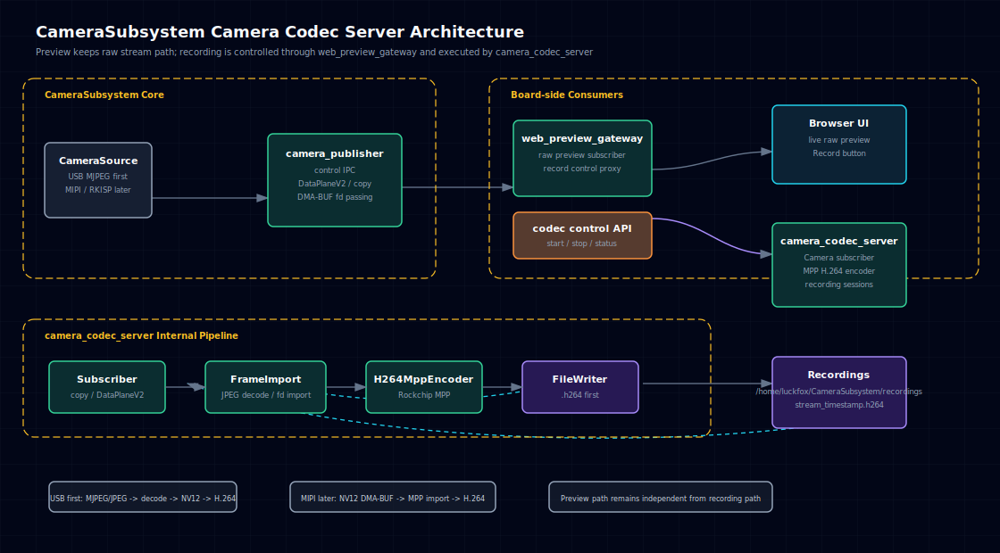
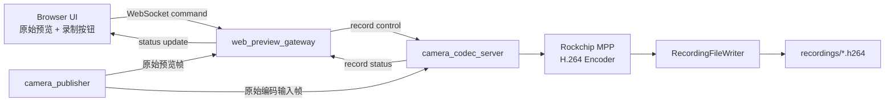
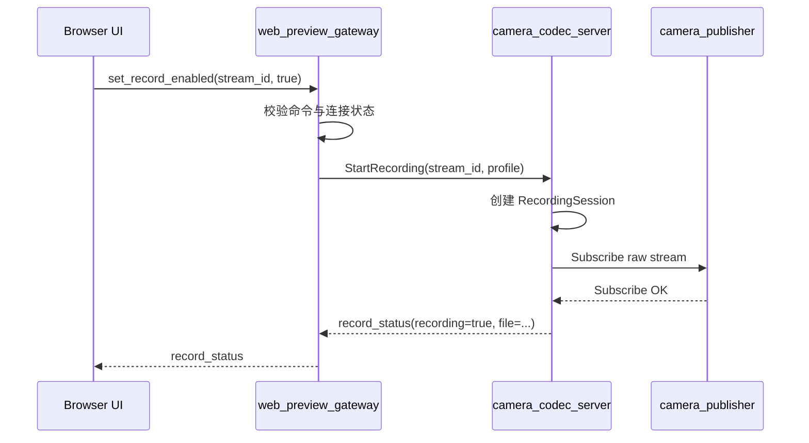
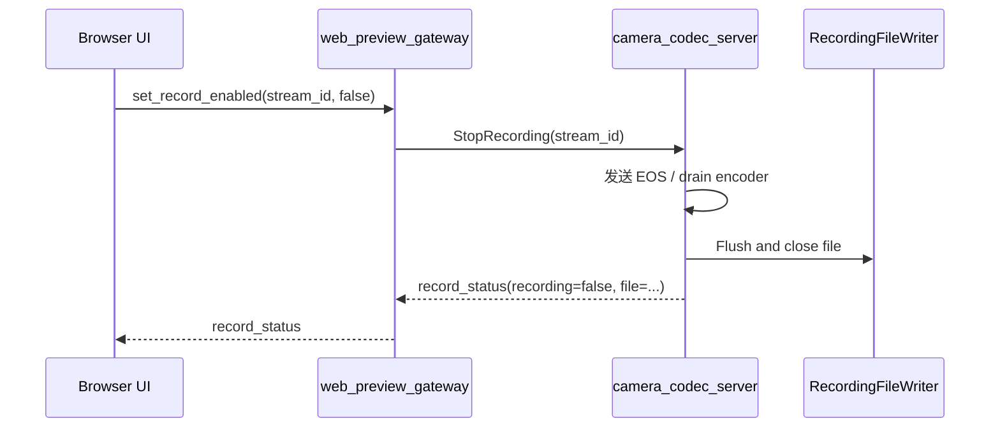
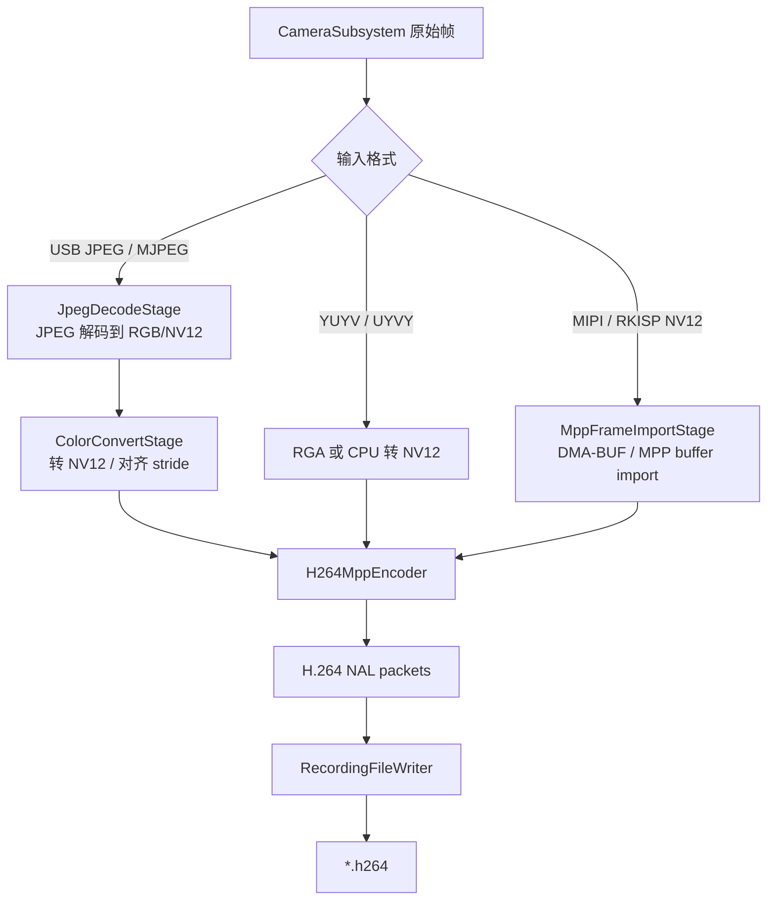
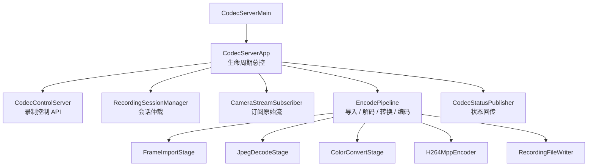
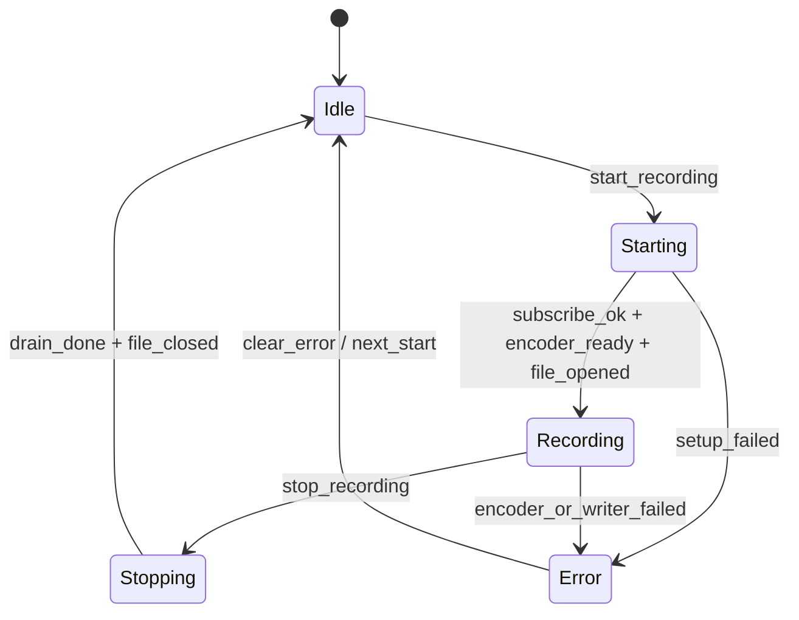

# Camera Codec Server 架构设计

**最后更新:** 2026-04-28<br>
**阶段定位:** 第一版代码已开工，当前完成最小进程骨架、文件写入、JSON line 控制面、录制状态机、v1 copy 数据面订阅、MPP JPEG decode 和 MPP H.264 encode 主链路接入<br>
**第一阶段目标:** USB 摄像头也支持录制 H.264，先打通端到端链路；MIPI/RKISP 按可扩展路径预留

> **文档硬规范**
>
> - 本项目的系统架构图、模块框图、部署拓扑图、数据路径框图和工程结构框图必须使用 `architecture-diagram` skill 生成独立 HTML / inline SVG 图表产物；每个 HTML 图必须同步导出同名 `.svg`，Markdown 中默认直接显示 SVG，并附完整 HTML 图表链接。
> - 时序图、状态机图、纯目录结构图等仍使用 Mermaid fenced code block（语言标识为 `mermaid`）。
> - 禁止新增 ASCII art/text 框图；普通日志、命令输出、代码片段按其原始语言使用 fenced code block。
> - 本文只做架构设计，不包含 C++ / TypeScript 实现代码。

---

## 目录

- [1. 背景与目标](#1-背景与目标)
- [2. 当前事实与边界](#2-当前事实与边界)
- [3. 总体架构](#3-总体架构)
- [4. 为什么独立 camera_codec_server](#4-为什么独立-camera_codec_server)
- [5. 录制控制流](#5-录制控制流)
- [6. 编码数据流](#6-编码数据流)
- [7. 输入格式策略](#7-输入格式策略)
- [8. camera_codec_server 模块划分](#8-camera_codec_server-模块划分)
- [9. 控制协议建议](#9-控制协议建议)
- [10. H.264 编码与文件策略](#10-h264-编码与文件策略)
- [11. Web Preview 集成边界](#11-web-preview-集成边界)
- [12. 硬件与依赖选择](#12-硬件与依赖选择)
- [13. 命名与工程目录](#13-命名与工程目录)
- [14. 可编码接口契约](#14-可编码接口契约)
- [15. 构建与部署边界](#15-构建与部署边界)
- [16. 第一阶段实现顺序](#16-第一阶段实现顺序)
- [17. MVP 范围](#17-mvp-范围)
- [18. 后续扩展路线](#18-后续扩展路线)
- [19. TODO 与待确认项](#19-todo-与待确认项)

---

## 1. 背景与目标

CameraSubsystem 当前已经具备核心发布端、订阅端、Web Preview 和 DataPlaneV2 + DMA-BUF 的阶段性验证基础。下一步录制能力不应直接塞进 `web_preview_gateway` 或 `camera_publisher`，而应通过独立 `camera_codec_server` 订阅原始视频流，在后台完成 H.264 编码和文件保存。

进程命名采用 `camera_codec_server`，原因是它和当前 `camera_publisher`、`camera_subscriber` 命名风格一致，也明确表达该服务属于 CameraSubsystem 的 Camera 数据链路，而不是一个泛用媒体编码守护进程。文档中保留 “Camera Codec Server” 作为模块名，落地进程名、二进制名和日志 tag 均使用 `camera_codec_server`。

第一阶段明确目标：

1. Web 页面实时画面仍然显示原始预览数据流，不切换到编码后视频流。
2. 用户在 Web 页面点击某一路录制按钮后，后台启动对应流的录制任务。
3. 第一阶段即使当前只有 USB 摄像头，也要支持 USB 摄像头录制 H.264，先打通完整控制链路和文件落盘链路。
4. 对 MIPI/RKISP 摄像头做可扩展设计，后续走 NV12 / DMA-BUF / MPP import 的低拷贝路径。
5. 编码服务不直接访问 Camera 设备节点，仍通过 CameraSubsystem 订阅原始帧。
6. 第一阶段输出裸 H.264 文件，后续再扩展 MP4/MKV 封装、分段录制、RTSP 或远端推流。

非目标：

1. 不在 `camera_publisher` 内部实现录制。
2. 不让浏览器接收编码文件数据或参与视频编码。
3. 不在第一阶段实现 RKNN import 验证。
4. 不在第一阶段承诺 MIPI/RKISP live frame 的完整零拷贝编码闭环，先保留接口和数据模型。

## 2. 当前事实与边界

当前已经具备的事实：

| 项目 | 当前状态 | 对 camera_codec_server 的影响 |
|------|----------|------------------------|
| Web Preview 前端 | 已有 `set_record_enabled` 命令类型和录制按钮占位，但按钮当前禁用 | UI 入口存在，后续需要启用并接入录制状态 |
| `web_preview_gateway` | 当前作为原始预览订阅端，负责 HTTP + WebSocket | 应作为录制控制代理，不承担编码 |
| DataPlaneV2 | 已支持 `SCM_RIGHTS` fd 传递和独立 ReleaseFrame 通道 | `camera_codec_server` 可作为高优先级订阅端接入 |
| DMA-BUF import 探测 | RGA import 和 MPP buffer import 已在 RKISP/RKVpss 节点验证 | MIPI/RKISP 后续可走 MPP import 低拷贝路径 |
| USB 摄像头 | 当前主要验证对象是 `/dev/video45`，输出 JPEG/MJPEG | USB H.264 录制需要 JPEG decode 到 NV12/YUV 后再编码 |
| RK3576 编码能力 | Luckfox 官方规格显示 VPU 支持 H.264/H.265 硬编码 4K@60fps | 第一选择应是 Rockchip MPP，而不是软件编码 |

当前不支持的部分：

1. Web 录制按钮没有接入可用后台服务。
2. `web_preview_gateway` 没有录制控制路由。
3. 编码参数还没有从前端请求或启动参数完整传入 encoder。
4. 还没有长时间稳定性验证、播放兼容性验证和异常恢复策略。
5. DataPlaneV2 / DMA-BUF / MIPI/RKISP NV12 还没有接入编码主链路。

## 3. 总体架构



[打开完整 Camera Codec Server HTML 图表](images/codec-server-architecture.html)

推荐架构：

1. `camera_publisher` 仍然独占底层 Camera 设备或采集后端。
2. `web_preview_gateway` 继续订阅原始帧并提供浏览器实时预览。
3. `camera_codec_server` 作为独立订阅端订阅原始帧，不直接访问 `/dev/video*`。
4. 浏览器点击录制后，只发送控制命令；实际编码与文件保存都在开发板上的 `camera_codec_server` 内完成。
5. `camera_codec_server` 输出录制状态、文件路径、错误原因和基础统计，由 `web_preview_gateway` 转发到前端。

核心链路：



## 4. 为什么独立 camera_codec_server

不建议把编码录制放入 `web_preview_gateway`：

1. Gateway 的主职责是预览、协议适配和前端服务，编码会引入长耗时状态、文件 IO、硬件 encoder session 和错误恢复。
2. 录制是生产链路能力，不能被浏览器连接生命周期直接影响。
3. 未来同一路流可能同时有预览、录制、AI、转推等多个订阅者，需要保持消费者进程边界清晰。
4. 编码链路需要更严格的背压、时间戳、GOP、码率、文件切片和异常恢复策略，这些不适合混进调试预览服务。
5. `camera_codec_server` 可以独立重启、独立调参、独立做板端长稳验证。

不建议把编码录制放入 `camera_publisher`：

1. `camera_publisher` 应保持原始帧发布职责，不应被某个上层业务阻塞。
2. 录制失败不应影响核心采集和其他订阅者。
3. 后续可能有多个编码策略，核心发布端不应承载这些策略分支。

结论：

> `camera_codec_server` 是普通订阅端，也是板端编码/录制能力的所有者；`web_preview_gateway` 只是录制控制代理。

## 5. 录制控制流

浏览器控制命令通过 WebSocket 发给 `web_preview_gateway`，Gateway 校验后转发给 `camera_codec_server`。`camera_codec_server` 负责判断流是否存在、是否已录制、输出路径是否可写、编码器是否可用，并返回状态。



停止录制：



## 6. 编码数据流

第一阶段需要同时考虑 USB 和后续 MIPI：



### 6.1 USB 摄像头第一阶段路径

USB 摄像头当前更可能输出 JPEG/MJPEG。H.264 encoder 需要原始 YUV/NV12 输入，因此第一阶段 USB H.264 录制必须包含解码/转换：

```text
USB JPEG/MJPEG frame -> JPEG decode -> NV12/RGBA -> MPP H.264 encode -> .h264 file
```

USB 第一阶段的目标不是零拷贝，而是打通：

1. Web 控制录制。
2. `camera_codec_server` 订阅原始流。
3. JPEG/MJPEG 解码。
4. MPP H.264 编码。
5. 文件落盘和状态回传。

### 6.2 MIPI/RKISP 后续路径

MIPI/RKISP 通常输出 NV12、NV16、YUYV 或多平面 buffer。后续主路径应优先走：

```text
MIPI/RKISP NV12 DMA-BUF fd -> DataPlaneV2 -> MPP buffer import -> MPP H.264 encode -> .h264 file
```

该路径才是长期低拷贝录制的主收益点。

## 7. 输入格式策略

| 输入格式 | 第一阶段策略 | 后续策略 |
|----------|--------------|----------|
| JPEG / MJPEG | 解码到 NV12 或 RGB 后编码 H.264 | 评估 libjpeg-turbo、MPP 解码或硬件 JPEG 解码 |
| YUYV / UYVY | CPU 或 RGA 转 NV12 后编码 | 优先 RGA 转换，降低 CPU 压力 |
| RGB / RGBA | 转 NV12 后编码 | RGA 转换或 shader/硬件转换 |
| NV12 / NV21 | 直接进入 MPP encoder | DMA-BUF import，减少复制 |
| 多平面 MIPI buffer | 第一阶段预留 metadata，不强依赖 | DataPlaneV2 多 fd / offset / stride 完整接入 |
| H.264 输入流 | 不作为第一阶段输入 | 可直接保存或转封装，不重复编码 |

关键约束：

1. 像素格式转换不是视频编码。
2. USB JPEG 到 H.264 无法避免解码步骤。
3. MIPI/RKISP NV12 才是长期零拷贝录制路径。
4. 录制路径允许比预览路径更低帧率或独立帧率，避免影响实时预览。

## 8. camera_codec_server 模块划分



模块职责：

| 模块 | 职责 |
|------|------|
| `CodecServerApp` | 进程生命周期、配置加载、启动停止、信号处理 |
| `CodecControlServer` | 接收 `web_preview_gateway` 的 start/stop/status 控制请求 |
| `RecordingSessionManager` | 管理每路流的录制状态，防止重复启动，维护 session id |
| `CameraStreamSubscriber` | 作为订阅端接入 CameraSubsystem，优先支持 DataPlaneV2 |
| `FrameImportStage` | 识别输入帧 memory type、pixel format、stride、plane、timestamp |
| `JpegDecodeStage` | USB JPEG/MJPEG 解码，第一阶段可用软件库 |
| `ColorConvertStage` | 转 NV12、对齐 stride，后续优先 RGA |
| `H264MppEncoder` | 封装 Rockchip MPP H.264 encoder session |
| `RecordingFileWriter` | 写裸 H.264 文件，管理文件命名、flush、close |
| `CodecStatusPublisher` | 输出 recording、file、fps、bitrate、dropped frames、error |

## 9. 控制协议建议

第一阶段可以使用 Unix Domain Socket 上的 JSON line 或简洁二进制结构。为了调试方便，建议先用 JSON line，待协议稳定后再评估二进制化。

启动录制：

```json
{
  "type": "start_recording",
  "request_id": "web-0001",
  "stream_id": "usb_camera_0",
  "codec": "h264",
  "container": "raw_h264",
  "output_dir": "/home/luckfox/recordings",
  "profile": {
    "width": 1920,
    "height": 1080,
    "fps": 30,
    "bitrate": 4000000,
    "gop": 60
  }
}
```

停止录制：

```json
{
  "type": "stop_recording",
  "request_id": "web-0002",
  "stream_id": "usb_camera_0"
}
```

状态返回：

```json
{
  "type": "record_status",
  "request_id": "web-0001",
  "stream_id": "usb_camera_0",
  "recording": true,
  "codec": "h264",
  "container": "raw_h264",
  "file": "/home/luckfox/recordings/usb_camera_0_20260427_153000.h264",
  "encoded_frames": 0,
  "dropped_frames": 0
}
```

错误返回：

```json
{
  "type": "record_status",
  "request_id": "web-0001",
  "stream_id": "usb_camera_0",
  "recording": false,
  "error": "jpeg_decoder_not_available"
}
```

第一阶段必须定义的错误码：

| 错误码 | 含义 |
|--------|------|
| `stream_not_found` | 请求的 stream 不存在或不可订阅 |
| `already_recording` | 该流已经在录制 |
| `not_recording` | 停止请求对应的流未在录制 |
| `output_dir_not_writable` | 输出目录不存在或不可写 |
| `encoder_not_available` | MPP encoder 初始化失败 |
| `unsupported_input_format` | 当前输入格式不可编码 |
| `jpeg_decoder_not_available` | USB JPEG 解码依赖不可用 |
| `recording_io_error` | 文件写入失败 |

## 10. H.264 编码与文件策略

### 10.1 编码器选择

RK3576 官方规格显示 VPU 支持 H.264/H.265 硬编码，SDK 中也存在 Rockchip MPP、MPP encoder test、GStreamer rockchipmpp 插件源码。因此第一阶段推荐：

1. **首选 Rockchip MPP**：作为板端 H.264 encoder API。
2. **GStreamer rockchipmpp**：作为后续快速验证 pipeline 或复杂封装的备选。
3. **FFmpeg/libavformat**：更适合第二阶段做 MP4/MKV 封装。
4. **x264/OpenH264**：只作为软件 fallback，不作为 RK3576 生产主路径。

参考资料：

1. Luckfox Omni3576 产品介绍：<https://wiki.luckfox.com/zh/Luckfox-Omni3576/Luckfox-Omni3576-Introduction>
2. Luckfox Omni3576 quick start：<https://wiki.luckfox.com/zh/Luckfox-Omni3576/Luckfox-Omni3576-quick-start/>
3. 本地 SDK 参考：`external/mpp/test/mpi_enc_test.c`
4. 本地 SDK 参考：`external/gstreamer-rockchip/gst/rockchipmpp/gstmpph264enc.c`

### 10.2 文件输出

第一阶段建议输出裸 H.264 elementary stream：

```text
/home/luckfox/recordings/<stream_id>_<YYYYMMDD_HHMMSS>.h264
```

原因：

1. 最小可验证，避免第一阶段引入 muxer。
2. MPP encoder 输出 packet 后可以直接写入。
3. 文件可用 `ffplay`、`ffmpeg` 或其他工具验证。

第二阶段再支持：

| 格式 | 说明 |
|------|------|
| MP4 | 需要 muxer，适合用户直接播放 |
| MKV | 容错较好，适合异常断电场景 |
| 分段 H.264 | 按时长或大小切片，适合长时间运行 |
| 索引文件 | 记录开始时间、结束时间、分辨率、码率和错误状态 |

## 11. Web Preview 集成边界

Web 页面设计原则：

1. 实时画面一直显示原始数据流，即 `web_preview_gateway` 当前订阅到的预览流。
2. 点击录制后，不切换到 H.264 流，不从浏览器下载视频。
3. 录制状态通过 Gateway 转发，例如 recording、duration、file、error。
4. 录制按钮只影响 `camera_codec_server` 的后台录制 session。
5. Snapshot 仍可保持浏览器端保存当前 canvas，与后台录制解耦。

前端状态建议：

| UI 状态 | 含义 |
|---------|------|
| `idle` | 未录制 |
| `starting` | 已发送开始录制命令，等待后台确认 |
| `recording` | 后台正在录制 |
| `stopping` | 已发送停止录制命令，等待 flush/close |
| `error` | 后台返回错误 |

Gateway 职责：

1. 接收浏览器 `set_record_enabled`。
2. 转换为 `camera_codec_server` 的 `start_recording` / `stop_recording`。
3. 聚合录制状态并转发给浏览器。
4. 不保存视频文件，不执行编码。
5. 不直接访问 Camera 设备节点。

## 12. 硬件与依赖选择

### 12.1 Rockchip MPP

MPP 是 RK3576 第一阶段 H.264 编码的首选：

1. 官方规格具备 VPU H.264/H.265 硬编码能力。
2. SDK 中已有 MPP encoder 示例和 `librockchip_mpp.so`。
3. 当前已验证 MPP buffer 层可以 import V4L2 exported DMA-BUF fd。
4. 后续 MIPI/RKISP NV12 路径可以向低拷贝演进。

### 12.2 JPEG 解码

USB 第一阶段需要 JPEG/MJPEG 解码。候选：

| 方案 | 优点 | 风险 |
|------|------|------|
| libjpeg-turbo | 成熟、CPU 解码性能较好、易集成 | 需要确认 RK3576 sysroot / 板端依赖 |
| MPP JPEG decode | 可能利用硬件能力 | 需要确认 API 和输入输出 buffer 管理 |
| FFmpeg sw decode | 格式支持广 | 依赖重，交叉编译和部署成本较高 |

当前评估结论：

1. **板端 Debian 运行环境可用 libjpeg-turbo 兼容库**。RK3576 板端存在 `/usr/include/jpeglib.h`、`/usr/lib/aarch64-linux-gnu/libjpeg.so` 和 `libjpeg.pc`，包形态接近 `libjpeg62-turbo-dev`。板端没有发现 `turbojpeg.h` 或 `libturbojpeg.so`。
2. **现有交叉工具链 sysroot 不包含 libjpeg 头文件和库**。`cmake/toolchains/rk3576.cmake` 使用的 GCC sysroot 中未发现 `jpeglib.h`、`turbojpeg.h`、`libjpeg.so` 或 `libturbojpeg.so`，因此不能直接在当前交叉编译链路中 `find_package(JPEG)`。
3. **SDK 中有 Rockit 侧 JPEG/TurboJPEG 运行库但缺头文件**。`external/rockit/lib/lib64/` 下存在 aarch64 `libjpeg.so` 和 `libturbojpeg.so`，符号中包含 `jpeg_*` 与 `tj*` API；但 SDK 当前未找到对应 public include，因此不能无风险直接接入。
4. **MPP JPEG decode 有明确 SDK 参考路径**。SDK 中 `external/mpp/test/mpi_dec_test.c` 支持 `MPP_VIDEO_CodingMJPEG`，`external/gstreamer-rockchip/gst/rockchipmpp/gstmppjpegdec.c` 也使用 `MPP_VIDEO_CodingMJPEG` 并支持输出 NV12/RGBA 等格式。
5. **FFmpeg 可作为后备但不适合作为第一选择**。板端存在 `libavcodec.so`、`libavformat.so`、`libswscale.so` 和开发头文件，但 SDK 交叉 sysroot未直接带 FFmpeg 头文件/库；引入 FFmpeg 会显著增加依赖和部署复杂度。

第一阶段建议调整为：

1. 保留主机无 MPP 构建下的 `JpegDecodeStage` stub 和 `jpeg_decoder_not_available` 错误返回。
2. **MPP JPEG decode probe 已验证通过**。`mpp_jpeg_decode_probe` 已在 RK3576 上使用 `/home/luckfox/camera_v2_frames/frame_0.jpg` 验证 `MPP_VIDEO_CodingMJPEG` 可输出 NV12：输入 1920x1080 JPEG，输出 NV12，`hor_stride=1920`、`ver_stride=1088`、`errinfo=0`、`discard=0`。
3. **live 录制 pipeline 已接入 MPP JPEG decode**。RK3576 `/dev/video45` smoke 已验证 `input_frames=95`、`decoded_frames=95`、`decode_failures=0`。
4. 如果 MPP JPEG decode 在 live 链路中遇到稳定性或延迟问题，再补 `libjpeg` sysroot 依赖并实现 CPU fallback。
5. 暂不引入 FFmpeg decode 到主链路；FFmpeg 后续更适合承担 MP4/MKV mux 或离线验证工具。

### 12.3 色彩转换

JPEG 解码后的输出可能是 RGB/RGBA，也可能能直接解到 YUV。MPP H.264 encoder 通常更适合 NV12/YUV 输入。

策略：

1. 如果解码库能输出 NV12/YUV，优先直接送 MPP。
2. 如果只能得到 RGB/RGBA，第一阶段可 CPU 转 NV12，后续改 RGA。
3. 对 YUYV/UYVY 输入，后续优先 RGA 转 NV12。

## 13. 命名与工程目录

### 13.1 命名约定

| 项目 | 名称 |
|------|------|
| 进程名 / 二进制名 | `camera_codec_server` |
| 模块目录 | `extensions/codec_server/` |
| C++ namespace | `camera_subsystem::extensions::codec_server` |
| CameraSubsystem 控制 socket | `/tmp/camera_subsystem_control.sock` |
| CameraSubsystem 数据 socket | `/tmp/camera_subsystem_data.sock` |
| DataPlaneV2 release socket | `/tmp/camera_subsystem_release_v2.sock` |
| 编码服务控制 socket | `/tmp/camera_subsystem_codec.sock` |
| 默认录制目录 | `/home/luckfox/recordings` |
| 默认客户端 ID | `camera_codec_server` |
| 日志 tag | `camera_codec_server` |

### 13.2 目录规划

建议第一阶段创建独立扩展目录，不直接塞进 `examples/`：

```text
extensions/codec_server/README.md
extensions/codec_server/CMakeLists.txt
extensions/codec_server/include/codec_server/codec_server_app.h
extensions/codec_server/include/codec_server/codec_server_config.h
extensions/codec_server/include/codec_server/codec_control_protocol.h
extensions/codec_server/include/codec_server/codec_control_server.h
extensions/codec_server/include/codec_server/recording_session_manager.h
extensions/codec_server/include/codec_server/camera_stream_subscriber.h
extensions/codec_server/include/codec_server/encode_pipeline.h
extensions/codec_server/include/codec_server/jpeg_decode_stage.h
extensions/codec_server/include/codec_server/color_convert_stage.h
extensions/codec_server/include/codec_server/h264_mpp_encoder.h
extensions/codec_server/include/codec_server/recording_file_writer.h
extensions/codec_server/src/main.cpp
extensions/codec_server/src/codec_server_app.cpp
extensions/codec_server/src/codec_control_server.cpp
extensions/codec_server/src/recording_session_manager.cpp
extensions/codec_server/src/camera_stream_subscriber.cpp
extensions/codec_server/src/encode_pipeline.cpp
extensions/codec_server/src/jpeg_decode_stage.cpp
extensions/codec_server/src/color_convert_stage.cpp
extensions/codec_server/src/h264_mpp_encoder.cpp
extensions/codec_server/src/recording_file_writer.cpp
extensions/codec_server/scripts/run-camera-codec-server-rk3576.sh
```

第一阶段可以先纳入根 CMake 的可选目标，条件是 RK3576 SDK 中存在 MPP headers/libs。若依赖暂未整理进 sysroot，可先按现有 RGA/MPP probe 的方式显式引用 SDK 路径。

## 14. 可编码接口契约

本节给出第一版实现可以直接对齐的最小契约。具体 C++ 结构体可以在实现时调整，但语义不应漂移。

### 14.1 启动参数

建议 `camera_codec_server` 第一版支持：

```bash
./camera_codec_server \
  --control-socket /tmp/camera_subsystem_control.sock \
  --data-socket /tmp/camera_subsystem_data.sock \
  --release-socket /tmp/camera_subsystem_release_v2.sock \
  --codec-socket /tmp/camera_subsystem_codec.sock \
  --device /dev/video45 \
  --camera-id default_camera \
  --output-dir /home/luckfox/recordings \
  --input-format mjpeg \
  --codec h264 \
  --width 1920 \
  --height 1080 \
  --fps 30 \
  --bitrate 4000000 \
  --gop 60
```

第一版参数策略：

1. `--data-plane v1|v2` 可选，默认先跟随现有可用链路；USB 第一版可先走 copy payload，后续接 DataPlaneV2。
2. `--input-format auto|mjpeg|jpeg|yuyv|nv12`，默认 `auto`。
3. `--codec h264` 第一版只接受 `h264`。
4. 如果输出目录不存在，服务可以尝试创建；创建失败则启动失败或 start recording 返回 `output_dir_not_writable`。
5. `--device` 是向当前 CameraSubsystem 发布端发起订阅时使用的设备标识或请求参数，不表示 `camera_codec_server` 直接打开 `/dev/video*`。编码服务仍必须通过 `camera_publisher` 获取帧。
6. `--codec-socket` 是 `web_preview_gateway` 与 `camera_codec_server` 之间的录制控制 socket，不是 CameraSubsystem 现有控制面 socket。

### 14.2 内部帧输入契约

`CameraStreamSubscriber` 输出给 `EncodePipeline` 的最小帧语义：

| 字段 | 说明 |
|------|------|
| `stream_id` | 流 ID，第一版可由 `camera_id` 或 device path 归一化生成 |
| `frame_id` | CameraSubsystem 原始帧 ID |
| `timestamp_ns` | 原始采集时间戳 |
| `width` / `height` | 输入帧尺寸 |
| `pixel_format` | JPEG / MJPEG / YUYV / NV12 等 |
| `memory_type` | copy payload 或 DMA-BUF |
| `payload` | copy 模式下的帧数据 |
| `descriptor` | DMA-BUF 模式下的 fd、plane、stride、offset、bytesused |
| `release_token` | DataPlaneV2 模式下用于 release 的 token |

约束：

1. copy payload 模式下，`EncodePipeline` 持有自己的 payload 生命周期。
2. DMA-BUF 模式下，`EncodePipeline` 必须在 encoder/import 完成后 release，不允许泄漏 lease。
3. USB JPEG/MJPEG 第一阶段可以先只用 copy payload，降低编码 MVP 风险。
4. MIPI/RKISP NV12 后续必须优先走 descriptor / fd import。

### 14.3 编码输入契约

`H264MppEncoder` 接收的输入应统一为 `EncoderInputFrame` 语义：

| 字段 | 说明 |
|------|------|
| `width` / `height` | 编码尺寸 |
| `hor_stride` / `ver_stride` | MPP 输入 stride |
| `format` | 第一阶段目标为 NV12/YUV420SP |
| `timestamp_ns` | 用于 PTS |
| `frame_id` | 透传用于日志和状态 |
| `mpp_buffer` | MPP import 或内部分配 buffer |
| `eos` | 停止时发送 EOS / drain |

USB 第一阶段允许 `JpegDecodeStage + ColorConvertStage` 产生 MPP 内部分配 buffer；MIPI/RKISP 后续再用 `MppFrameImportStage` 把 DMA-BUF fd import 为 MPP buffer。

### 14.4 状态与统计契约

`camera_codec_server` 至少输出以下状态：

| 字段 | 说明 |
|------|------|
| `recording` | 是否正在录制 |
| `state` | idle / starting / recording / stopping / error |
| `file` | 当前或最近一次录制文件路径 |
| `encoded_frames` | 已编码帧数 |
| `dropped_frames` | 编码链路丢帧数 |
| `input_frames` | 订阅到的原始帧数 |
| `encode_failures` | 编码失败次数 |
| `write_failures` | 文件写失败次数 |
| `last_error` | 最近错误码 |

### 14.5 RecordingSession 状态机

第一版实现必须把录制状态收敛到一个明确状态机，避免 start/stop、订阅失败、编码失败和文件 IO 失败互相穿透。



状态语义：

| 状态 | 进入条件 | 允许命令 |
|------|----------|----------|
| `idle` | 未录制或上一轮已关闭 | `start_recording` |
| `starting` | 已收到 start，正在订阅、初始化 encoder、打开文件 | `stop_recording` 可取消 |
| `recording` | 已开始写 H.264 packet | `stop_recording` / `status` |
| `stopping` | 正在 drain encoder、flush、close file | `status` |
| `error` | 初始化、编码或写文件失败 | `status` / 下一次 `start_recording` 可清理后重试 |

命令裁决：

1. `idle + stop_recording` 返回 `not_recording`。
2. `starting/recording + start_recording` 返回 `already_recording`。
3. `stopping + start_recording` 返回 `already_recording` 或 `busy`，第一版建议返回 `already_recording`。
4. `error + start_recording` 可以清理旧 session 后重试；如果清理失败，返回原始错误。

### 14.6 线程与背压契约

第一版不需要复杂线程池，但需要避免编码阻塞预览和采集。建议最小线程模型：

| 线程 / 循环 | 职责 |
|-------------|------|
| `control_loop` | 接收 Gateway 控制命令，更新 session 状态 |
| `subscriber_loop` | 从 CameraSubsystem 读取原始帧，推入编码输入队列 |
| `encode_loop` | 解码、转换、MPP 编码、写文件 |

队列策略：

1. 每个 RecordingSession 使用有界输入队列，默认深度建议 2 到 4 帧。
2. 队列满时优先丢弃旧帧或拒绝新帧，第一版建议丢弃旧帧并增加 `dropped_frames`。
3. 对 DataPlaneV2 / DMA-BUF 帧，丢帧前必须先 release lease，不能泄漏 fd 或阻塞 QBUF。
4. 编码链路不保证每帧必达，目标是录制文件可持续生成且不反向拖垮 `camera_publisher`。
5. USB JPEG/MJPEG 第一阶段可先用 copy payload，队列内持有自有 bytes；后续 DMA-BUF 队列只持有 descriptor + release token。

## 15. 构建与部署边界

### 15.1 构建依赖

第一阶段依赖建议：

| 依赖 | 用途 | 策略 |
|------|------|------|
| CameraSubsystem core/ipc | 订阅原始流、复用 IPC 协议 | 必需 |
| Rockchip MPP | H.264 硬编码 | RK3576 构建必需 |
| JPEG 解码库 | USB JPEG/MJPEG 解码 | 当前优先评估 MPP JPEG decode；libjpeg 作为 CPU fallback 需要先补交叉 sysroot 依赖 |
| RGA | 后续颜色转换/缩放 | 第一阶段可选 |

为了尽快开工，建议第一版拆成两个构建层次：

1. `camera_codec_server_core`：控制协议、session、文件写入等与 MPP 弱相关的代码。
2. `camera_codec_server`：RK3576 上启用 MPP/JPEG 依赖的最终二进制。

### 15.2 部署模型

板端第一阶段运行模型：

```bash
./camera_publisher_example /dev/video45 \
  /tmp/camera_subsystem_control.sock \
  /tmp/camera_subsystem_data.sock \
  --io-method mmap

./camera_codec_server \
  --control-socket /tmp/camera_subsystem_control.sock \
  --data-socket /tmp/camera_subsystem_data.sock \
  --codec-socket /tmp/camera_subsystem_codec.sock \
  --output-dir /home/luckfox/recordings

./web_preview_gateway \
  --device /dev/video45 \
  --port 8080 \
  --static-root /home/luckfox/web_dist \
  --codec-socket /tmp/camera_subsystem_codec.sock
```

说明：

1. 第一阶段允许 `camera_codec_server` 和 `web_preview_gateway` 都订阅原始流。
2. `camera_publisher` 不感知录制行为。
3. Gateway 启动时如果 `camera_codec_server` 不存在，应把录制按钮置为不可用或返回明确错误。
4. 后续可由部署脚本或 systemd 管理三个进程。

## 16. 第一阶段实现顺序

建议按以下顺序写代码，避免一开始同时处理 Web、JPEG、MPP、DataPlaneV2：

| 顺序 | 任务 | 验收 |
|------|------|------|
| 1 | 创建 `extensions/codec_server/` 目录和最小 CMake 目标 | RK3576 交叉编译生成 `camera_codec_server` 空进程 |
| 2 | 实现 `CodecServerConfig` 和启动参数解析 | `--help` 可见关键参数，默认 socket/path 正确 |
| 3 | 实现 `RecordingFileWriter` | ✅ 本机验证工具能创建 `.h264` 文件并写入 bytes |
| 4 | 实现 `CodecControlServer` JSON line 控制面 | ✅ 可用 `nc -U` 发送 start/status/stop |
| 5 | 实现 `RecordingSessionManager` 状态机 | ✅ 已录制重复 start 返回 `already_recording`，stop 后进入 idle |
| 6 | 接入 `CameraStreamSubscriber` copy 数据面 | ✅ RK3576 `/dev/video45` live publisher 联调已验证 `input_frames` 增长 |
| 7 | 接入 JPEG decode stub / 真实解码库探测 | ✅ MPP JPEG decode 已封装进 `JpegDecodeStage` 并接入 live 录制 pipeline，主机无 MPP 时保留 stub fallback |
| 8 | 接入 `H264MppEncoder` 最小编码 | ✅ RK3576 合成 NV12 输入可输出 H.264 packet |
| 9 | 串联 USB live JPEG/MJPEG -> H.264 文件 | ✅ RK3576 `/dev/video45` live smoke 已生成非空 `.h264` 文件 |
| 10 | 接入 `web_preview_gateway` 录制控制转发 | 前端按钮能启动/停止后台录制并显示状态 |

第一阶段不要求 DataPlaneV2 立刻进入编码路径；在 USB JPEG/MJPEG 录制稳定后，再接 DataPlaneV2 和 MIPI/RKISP NV12。

### 16.1 当前实现进度

截至 2026-04-28，当前已完成第一阶段前九步的最小闭环：

| 项目 | 状态 | 说明 |
|------|------|------|
| `extensions/codec_server/` 目录 | 已完成 | 已新增独立扩展目录、README、include/src/scripts 规划 |
| `camera_codec_server` 目标 | 已完成 | 根 CMake 通过 `CAMERA_SUBSYSTEM_BUILD_CODEC_SERVER=ON` 可选启用；本目录也可独立 CMake 构建 |
| 启动参数解析 | 已完成 | 已支持 `--control-socket`、`--data-socket`、`--release-socket`、`--codec-socket`、`--output-dir`、`--input-format`、`--data-plane`、`--width`、`--height`、`--fps`、`--bitrate`、`--gop` 等第一阶段参数 |
| 本机构建验证 | 已完成 | `cmake --build build-codec --target camera_codec_server` 通过 |
| RK3576 交叉编译 | 已完成 | `scripts/build-rk3576.sh` 已生成 `bin/rk3576/camera_codec_server` |
| RK3576 板端最小运行 | 已完成 | 已上传到 `/home/luckfox/camera_codec_server`，`--help` 和参数解析输出正常 |
| `RecordingFileWriter` | 已完成 | 支持创建输出目录、生成 `<stream_id>_<YYYYMMDD_HHMMSS>.h264`、写入 packet、flush、close、统计和重复文件名避让 |
| `CodecControlServer` | 已完成最小版 | 支持 Unix Domain Socket JSON line start/status/stop；本机 `nc -U` 已验证 |
| `RecordingSessionManager` | 已完成最小版 | 支持 idle / starting / recording / stopping / error 状态裁决，重复 start、重复 stop 和 writer 错误映射已验证；start recording 已接入 `CameraStreamSubscriber` |
| `CameraStreamSubscriber` | 已完成当前切片 | 已实现 v1 copy 数据面连接、控制面 Subscribe / Unsubscribe、帧头/帧 payload 读取和 `input_frames` / `input_bytes` 统计；RK3576 `/dev/video45` smoke 已验证 start/status/stop |
| `JpegDecodeStage` | 已接入主链路 | RK3576 交叉构建启用 MPP `MPP_VIDEO_CodingMJPEG` 解码，输出 NV12 `DecodedImageFrame`；主机无 MPP 时返回 `jpeg_decoder_not_available` |
| `H264MppEncoder` | 已接入主链路 | RK3576 交叉构建启用 MPP `MPP_VIDEO_CodingAVC` 编码；合成 NV12 测试 5/5 通过；live 链路已写出裸 `.h264` 文件 |
| 本机 writer/session 验证 | 已完成 | `recording_file_writer_test` 41/41 通过；`recording_session_manager_test` 7/7 通过 |

当前尚未实现：

1. Web Preview Gateway 录制控制转发。
2. 更长时间编码稳定性验证。
3. 编码参数从请求或启动参数传入 `H264MppEncoder`。

RK3576 v1 copy 数据面 smoke 结果：

| 项目 | 结果 |
|------|------|
| publisher | `/dev/video45`，MMAP copy 数据面，30fps 发送正常 |
| codec start | 返回 `recording=true`，创建 `/home/luckfox/codec_records/*.h264` |
| codec status | 3 秒后 `input_frames=69`、`decoded_frames=69`、`encoded_frames=69`、`decode_failures=0`、`write_failures=0` |
| codec stop | 返回 `recording=false`、`state=idle`，最终 `input_frames=94`、`decoded_frames=94`、`encoded_frames=94`、`decode_failures=0` |
| 输出文件 | 已生成非空 `.h264` 文件，约 1.5MB |

下一步建议进入 Web Preview Gateway 录制控制转发和长稳验证：前端点击录制后转发到 `camera_codec_server`，同时补充更长时间 smoke 观察编码延迟、丢帧和文件可播放性。

当前实现边界：

1. `CodecServerApp::Run()` 已变成长驻控制服务，start recording 会打开输出文件、订阅 Camera v1 copy 数据面、执行 MPP JPEG decode 和 MPP H.264 encode，并写入裸 `.h264` packet。
2. RK3576 交叉构建中 `camera_codec_server` 会链接 MPP；主机构建仍只依赖 C++ 标准库和 pthread，并通过 stub 保持可测试。
3. 当前 RK3576 运行验证证明 USB MJPEG live payload 可以进入 MPP JPEG decode 和 MPP H.264 encode；仍需更长时间稳定性与播放兼容性验证。
4. `scripts/build-rk3576.sh` 已显式打开 `CAMERA_SUBSYSTEM_BUILD_CODEC_SERVER=ON`，用于保证板端产物持续构建；根 CMake 默认仍保持关闭，避免影响普通开发构建。

## 17. MVP 范围

第一阶段必须做：

| 项目 | 说明 |
|------|------|
| `camera_codec_server` 独立进程 | 作为 CameraSubsystem 订阅端，不直接访问 Camera 设备 |
| 控制 API | 支持 start/stop/status recording |
| Web Preview 控制接入 | 前端启用录制按钮，Gateway 转发命令和状态 |
| USB JPEG/MJPEG 到 H.264 | 先打通 USB 摄像头录制链路 |
| Rockchip MPP H.264 encoder | 板端优先硬件编码 |
| 裸 H.264 文件输出 | 写入 `/home/luckfox/recordings/*.h264` |
| 基础状态回传 | recording、file、duration、encoded_frames、dropped_frames、error |
| 编码背压 | 允许丢帧，优先保证预览和采集不被录制拖垮 |

第一阶段暂不做：

| 项目 | 说明 |
|------|------|
| RKNN import 验证 | 暂不做 |
| MP4/MKV 封装 | 第二阶段再引入 muxer |
| RTSP/推流 | 后续扩展 |
| 多客户端录制控制仲裁 | 第一阶段只支持单控制入口 |
| 多路高码率长稳 | 先单路打通，再扩展 |
| 完整 MIPI/RKISP live 编码 | 先预留架构，等待 sensor/media pipeline 出帧 |
| H.265 | H.264 稳定后再扩展 |

## 18. 后续扩展路线

推荐路线：

1. **MVP-0：离线编码验证**：用固定 JPEG/NV12 文件验证 JPEG decode、NV12 转换、MPP H.264 编码和 `.h264` 输出。

2. **MVP-1：USB live 录制**：`camera_codec_server` 订阅 `/dev/video45` 原始 JPEG/MJPEG 帧，后台编码保存 H.264。

3. **MVP-2：Web 控制闭环**：前端录制按钮启用，Gateway 转发控制命令，状态回传 UI。

4. **MVP-3：DataPlaneV2 接入**：`camera_codec_server` 支持 DataPlaneV2，明确 copy path 和 fd path 的选择。

5. **MVP-4：MIPI/RKISP NV12 录制**：接入真实 MIPI sensor/media pipeline 后，验证 NV12 DMA-BUF -> MPP encoder。

6. **MVP-5：容器封装与长稳**：支持 MP4/MKV、分段录制、断电恢复、磁盘空间保护。

## 19. TODO 与待确认项

### 19.1 USB 第一阶段

- TODO：确认当前 USB 摄像头实际输出是 JPEG、MJPEG 还是 YUYV。
- 已确认：板端存在 `jpeglib.h` 和 `libjpeg.so`，但当前交叉工具链 sysroot 不包含 libjpeg 头文件/库；板端未发现 `turbojpeg.h` / `libturbojpeg.so`。
- 已确认：SDK 的 MPP/GStreamer 路径存在 `MPP_VIDEO_CodingMJPEG` JPEG decode 参考。
- 已验证：`mpp_jpeg_decode_probe` 可将板端 `/home/luckfox/camera_v2_frames/frame_0.jpg` 解码为 NV12，输出 1920x1080，`hor_stride=1920`，`ver_stride=1088`，`frame_errinfo=0`，`frame_discard=0`。
- 已决策：MPP JPEG decode 已封装进 `JpegDecodeStage`；如果 live 链路稳定性不足，再补 libjpeg sysroot 依赖并实现 CPU fallback。
- 已验证：MPP JPEG decode 已接入 v1 copy live 录制 pipeline，RK3576 smoke 结果为 `input_frames=95`、`decoded_frames=95`、`decode_failures=0`。
- TODO：确认 MPP JPEG decode 在更长时间连续 live MJPEG 帧下的延迟、内存复用和错误恢复策略。
- TODO：确认 USB H.264 录制目标分辨率、帧率、码率和 GOP 默认值。

### 19.2 MPP 编码

- 已实现：`H264MppEncoder` 已基于 `external/mpp/test/mpi_enc_test.c` 的最小参数路径接入 `MPP_VIDEO_CodingAVC`。
- 已验证：RK3576 合成 NV12 帧编码测试通过，live USB MJPEG -> NV12 -> H.264 smoke 通过。
- 已实现：第一帧编码前通过 `MPP_ENC_GET_HDR_SYNC` 显式写入 SPS/PPS header。
- TODO：确认 MPP encoder 输入支持的更多 `MppFrameFormat` 与 stride 对齐要求。
- TODO：确认 MPP encoder drain/EOS 流程和停止录制时的 flush 语义。

### 19.3 camera_codec_server 控制面

- 已决策：第一阶段进程名和二进制名使用 `camera_codec_server`。
- 已决策：第一阶段默认编码服务控制 socket 使用 `/tmp/camera_subsystem_codec.sock`。
- 已决策：第一阶段控制协议优先使用 JSON line，便于手工调试；后续稳定后再评估二进制 POD。
- 已决策：同一路重复 start 返回 `already_recording`。
- TODO：确认 Gateway 与 `camera_codec_server` 断连后的 UI 状态和重连策略。

### 19.4 文件与磁盘

- 已决策：默认录制目录使用 `/home/luckfox/recordings`。
- 已决策：第一阶段文件命名规则为 `<stream_id>_<YYYYMMDD_HHMMSS>.h264`。
- TODO：确认磁盘剩余空间阈值，低于阈值时拒绝开始录制或自动停止。
- TODO：确认异常退出时 `.h264` 文件是否保留，以及是否写 sidecar metadata。

### 19.5 MIPI/RKISP 后续扩展

- TODO：接入真实 MIPI sensor 后，确认 NV12 live frame 的 `bytesused`、stride、timestamp 和 sequence。
- TODO：确认 DataPlaneV2 多 fd / 多 plane metadata 是否满足 MPP encoder 输入。
- TODO：确认 RGA 是否需要参与 YUYV/UYVY/RGB 到 NV12 转换。
- TODO：确认 MIPI/RKISP 录制是否需要独立帧率、缩放或裁剪。
