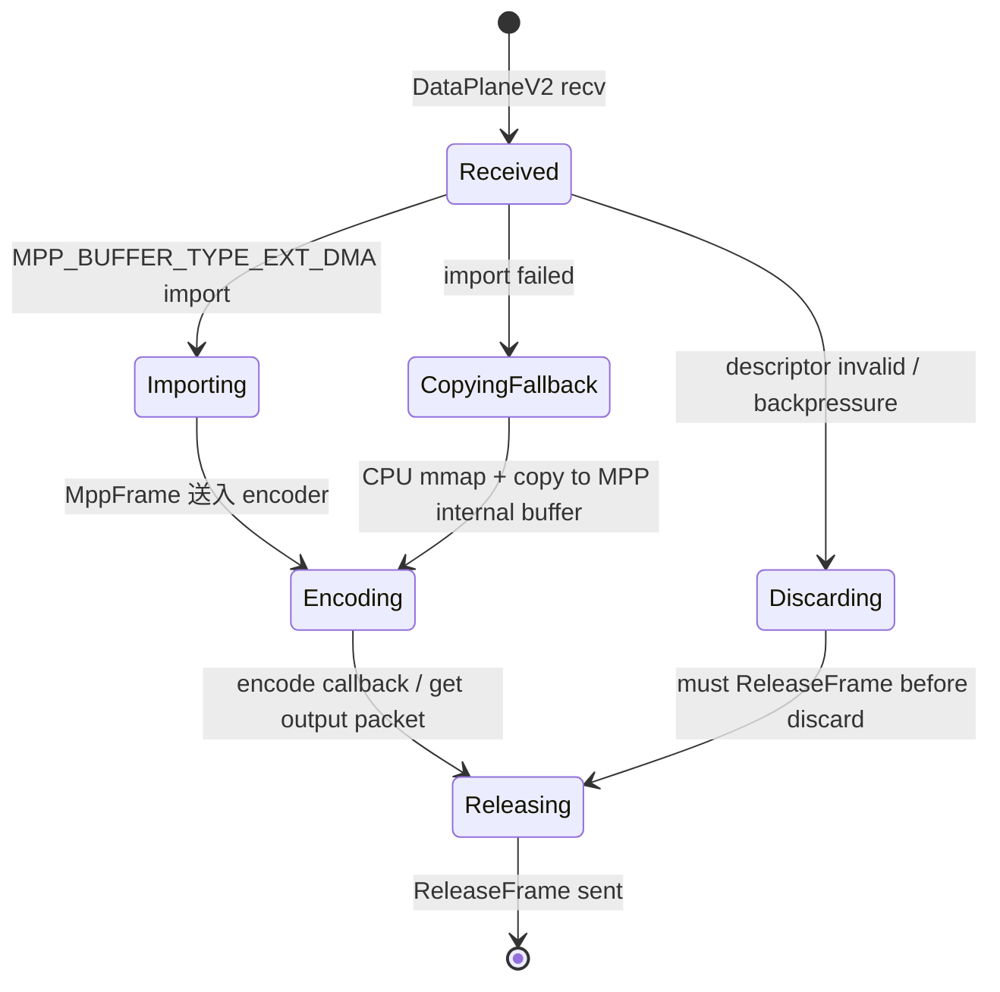

# DataPlaneV2 → MPP 低拷贝录制设计

**文档版本:** v0.1  
**最后更新:** 2026-05-10  
**适用范围:** `camera_codec_server` 接入 CameraSubsystem DataPlaneV2，实现 MIPI/RKISP NV12 DMA-BUF 低拷贝录制路径  
**关联文档:** [DMA_BUF_ZERO_COPY_ARCHITECTURE.md](DMA_BUF_ZERO_COPY_ARCHITECTURE.md)、[CODEC_SERVER_ARCHITECTURE.md](CODEC_SERVER_ARCHITECTURE.md)、[MULTI_CAMERA_ARCHITECTURE.md](MULTI_CAMERA_ARCHITECTURE.md)

> **硬性约束**
>
> - 本文只做设计，不承载实现代码。所有标注 **「待 MIPI sensor 验证」** 的假设在真实 sensor 到位前不可编码为生产路径。
> - 任何偏离本文契约的编码必须先更新本文并重新评审。

---

## 目录

- [1. 背景与目标](#1-背景与目标)
- [2. 两条录制路径：copy path 与 fd path](#2-两条录制路径copy-path-与-fd-path)
- [3. DataPlaneV2 subscriber 接入契约](#3-dataplanev2-subscriber-接入契约)
- [4. MPP import 输入契约](#4-mpp-import-输入契约)
- [5. ReleaseFrame 时序设计](#5-releaseframe-时序设计)
- [6. Fallback 策略](#6-fallback-策略)
- [7. 多路并发约束](#7-多路并发约束)
- [8. 风险与待验证项](#8-风险与待验证项)
- [9. 编码就绪检查清单](#9-编码就绪检查清单)

---

## 1. 背景与目标

当前 `camera_codec_server` 走 v1 copy 数据面：USB MJPEG payload → MPP JPEG decode → NV12 → MPP H.264 encode → 文件落盘。该路径功能已验证，但存在两次数据拷贝（socket copy + JPEG decode 内部 buffer 复制）。

MIPI/RKISP 输出 NV12 时，目标路径应为：

```text
RKISP NV12 DMA-BUF fd
  → DataPlaneV2 (SCM_RIGHTS fd 传递 + FrameDescriptor)
  → camera_codec_server (MPP buffer import)
  → MPP H.264 encode
  → 文件落盘
```

该路径的核心收益是**消除 socket payload copy 和 CPU 格式转换**，使 NV12 帧从 V4L2 buffer 直达 MPP encoder。

**本文目标：** 在编码前明确以下四个契约：
1. 什么条件下走 fd path，什么条件下必须走 copy path
2. DataPlaneV2 subscriber 如何接入、如何消费 descriptor、如何管理 fd 生命周期
3. MPP `MPP_BUFFER_TYPE_EXT_DMA` import 的精确输入要求
4. ReleaseFrame 与 MPP 异步编码的时序同步点

---

## 2. 两条录制路径：copy path 与 fd path

### 2.1 选择决策矩阵

| 输入源 | 像素格式 | fd 指向的数据 | 能否 fd path | 原因 |
|--------|----------|---------------|--------------|------|
| USB UVC | MJPEG | JPEG 压缩流 | ❌ 否 | MPP encoder 需要原始 NV12，fd 指向压缩数据无法直接 import |
| USB UVC | YUYV | 原始 YUV | ❌ 否（第一版） | YUYV 不是 MPP encoder 原生支持格式，需要颜色转换；fd path 节省 copy 但省不掉转换，优先级低于 MIPI NV12 |
| MIPI/RKISP | NV12 | 原始 NV12 | ✅ 是 | MPP encoder 原生支持 NV12，`MPP_BUFFER_TYPE_EXT_DMA` 可直接 import |
| MIPI/RKISP | NV16 / YUYV | 原始 YUV | ❌ 否（第一版） | 同 YUYV，需转换后再编码；后续评估 RGA 转换后是否仍走 fd path |
| MIPI/RKISP | 多平面 NV12 | 多 plane fd | ✅ 是（预留） | 待真实 sensor 验证 per-plane fd 和 offset 映射 |

### 2.2 运行时选择逻辑

`FrameImportStage` 在收到第一帧时做出路径选择，选择后整个 session 固定不变（不在录制中途切换）：

```
if descriptor.memory_type == kDmaBuf
   and descriptor.pixel_format == NV12
   and descriptor.plane_count == 1
   and MppFrameImportStage::Probe(descriptor) == OK:
       path = fd_path
else:
       path = copy_path
```

**关键约束：**
- 路径选择只在录制启动时执行一次，**不允许中途切换**。中途切换会导致帧大小/stride/layout 突变，encoder 状态不可恢复。
- 如果 fd path 初始化成功但后续某一帧的 descriptor 不符合预期（如 `bytesused == 0`、`plane_count` 变化），该帧丢弃并记录错误，不触发路径切换。

### 2.3 两条路径的数据流对比

**copy path（当前已实现）：**
```text
publisher --[v1 copy socket]--> codec_server
  → socket read 到 heap buffer
  → JpegDecodeStage (if MJPEG)
  → ColorConvertStage (if needed)
  → MPP encoder input buffer (MppFrame with internal MPP buffer)
  → encode
```

**fd path（本文设计目标）：**
```text
publisher --[DataPlaneV2 SCM_RIGHTS]--> codec_server
  → receive fd + FrameDescriptor
  → MppFrameImportStage: MppFrame with MPP_BUFFER_TYPE_EXT_DMA
  → MPP encoder input buffer (零拷贝引用)
  → encode
  → ReleaseFrame → publisher requeue V4L2 buffer
```

---

## 3. DataPlaneV2 subscriber 接入契约

### 3.1 subscriber 身份注册

`camera_codec_server` 作为 DataPlaneV2 subscriber 接入时，必须携带：
- `stream_id`：与 RecordingSession 的 `stream_id` 一致
- `consumer_id`：由 DataPlaneV2 server 分配，用于 ReleaseFrame 路由
- `role`：固定为 `kSubscriber`

**多路隔离：** 每路 `RecordingSession` 独立创建一个 `CameraStreamSubscriber`，独立 consumer_id。ReleaseFrame 的 key 为 `(stream_id, frame_id, buffer_id, consumer_id)`，确保一路的 release 不会误触另一路的 lease。

### 3.2 帧接收与 fd 管理

subscriber 收到 `FramePacket` 后：

1. **立即验证 descriptor 合法性：**
   - `stream_id` 必须与当前 session 匹配
   - `pixel_format` 必须为预期值（NV12）
   - `memory_type` 必须为 `kDmaBuf`
   - `fd_count > 0` 且所有 fd 有效（`fcntl(fd, F_GETFD)` 不返回 -1）
   - `width`、`height` 与 encoder 配置一致（不一致时触发 session 错误，不自动重配 encoder）

2. **fd 所有权转移：**
   - DataPlaneV2 通过 `SCM_RIGHTS` 传递的 fd 在 subscriber 进程中是**独立文件描述符**（dup 后的引用）
   - subscriber 必须 `dup()` 或直接使用该 fd，但不能关闭原始 fd（原始 fd 由 DataPlaneV2 socket 层管理）
   - 实际上，subscriber 直接使用接收到的 fd 即可，因为 `recvmsg` 已经将 fd 映射到当前进程的文件描述符表

3. **lease 持有：**
   - subscriber 持有 `FramePacket.lease`（`std::shared_ptr<core::DmaBufFrameLease>`）
   - lease 的 release 操作（即发送 `ReleaseFrame`）必须在 MPP 完成该帧编码后执行
   - 如果 subscriber 在编码前丢弃该帧（如背压丢帧），也必须先发送 ReleaseFrame，再丢弃

### 3.3 每帧处理状态机



---

## 4. MPP import 输入契约

### 4.1 MPP buffer import API

使用 MPP 的 external DMA buffer 机制：

```cpp
MppBufferInfo info;
info.type = MPP_BUFFER_TYPE_EXT_DMA;
info.fd = descriptor.fds[0];           // DMA-BUF fd
info.size = descriptor.total_bytes_used; // 或 plane[0].length
info.ptr = nullptr;                     // fd path 不需要 CPU 虚拟地址

MppBuffer buffer;
mpp_buffer_import(&buffer, &info);

MppFrame frame;
mpp_frame_init(&frame);
mpp_frame_set_buffer(frame, buffer);
mpp_frame_set_fmt(frame, MPP_FMT_YUV420SP); // NV12
mpp_frame_set_width(frame, descriptor.width);
mpp_frame_set_height(frame, descriptor.height);
mpp_frame_set_hor_stride(frame, descriptor.planes[0].stride);
mpp_frame_set_ver_stride(frame, descriptor.height); // 或对齐后的高度
mpp_frame_set_pts(frame, timestamp_to_pts(descriptor.timestamp_ns));
```

### 4.2 字段映射规则

| FrameDescriptor 字段 | MppFrame/MppBuffer 字段 | 说明 |
|----------------------|------------------------|------|
| `fds[0]` | `MppBufferInfo.fd` | DMA-BUF fd，必须有效 |
| `total_bytes_used` | `MppBufferInfo.size` | buffer 总大小；**待 MIPI sensor 验证**：是否用 `plane[0].length` 更准确 |
| `width` | `mpp_frame_set_width` | 图像宽度 |
| `height` | `mpp_frame_set_height` | 图像高度 |
| `planes[0].stride` | `mpp_frame_set_hor_stride` | 水平 stride，MPP encoder 必需 |
| `planes[0].offset` | 不设置 | 如果 `fd_index` 指向共享 fd，offset 由 MPP 内部处理；**待验证** |
| `timestamp_ns` | `mpp_frame_set_pts` | 转换为 90kHz 或 1MHz PTS，取决于容器需求 |
| `pixel_format` | `mpp_frame_set_fmt` | NV12 → `MPP_FMT_YUV420SP`；NV21 → `MPP_FMT_YUV420SP_VU` |
| `sequence` | 不设置 | MPP encoder 内部管理帧序号 |

### 4.3 多平面处理（预留）

RKISP/RKVpss MPLANE 可能输出多 plane（如 NV12 的 Y plane 和 UV plane 分别有两个 fd）。当前第一版只处理单 plane（`plane_count == 1`）。多平面扩展时：

1. `FrameDescriptor` 已支持 `fd_count <= kMaxFrameFds` 和 `planes[]` 数组
2. MPP 的 `MPP_BUFFER_TYPE_EXT_DMA` 是否支持 multi-fd 需要进一步验证
3. 如果 MPP 不支持 multi-fd，可能需要在 import 前将多 plane 合并为连续 buffer，或改为 copy path

**待 MIPI sensor 验证：** 真实 RKISP NV12 输出是单 plane（Y+UV interleaved）还是多 plane（Y 和 UV 分离）。

### 4.4 Stride 对齐约束

MPP encoder 对 stride 有对齐要求（通常是 16 字节或 64 字节对齐）。

- 如果 `descriptor.planes[0].stride` 已满足对齐要求：直接 import
- 如果不满足：fd path 失败，fallback 到 copy path（在 copy 时做 stride padding）

**待 MIPI sensor 验证：** RKISP NV12 输出的 stride 是否天然满足 MPP encoder 对齐要求。

---

## 5. ReleaseFrame 时序设计

### 5.1 核心原则

**V4L2 buffer 在 ReleaseFrame 发送前不能被 publisher 复用。** 如果 codec server 提前发送 ReleaseFrame，而 MPP encoder 尚未完成该帧的读取，可能导致图像撕裂或编码错误。

### 5.2 MPP 异步编码模型

MPP encoder 是异步的：
1. 调用 `mpi->encode_put_frame(enc_ctx, mpp_frame)` 将输入帧送入 encoder
2. 在另一个线程或回调中调用 `mpi->encode_get_packet(enc_ctx, &mpp_packet)` 获取编码输出
3. `encode_put_frame` 返回**不意味着** MPP 已经完成对该帧的读取

这意味着：不能在 `encode_put_frame` 返回后立即 ReleaseFrame。

### 5.3 同步方案选择

**方案 A：阻塞等待 encode 完成（不推荐）**
- 在 `encode_put_frame` 后循环调用 `encode_get_packet` 直到该帧的 packet 返回
- 优点：简单，时序明确
- 缺点：阻塞 subscriber 线程，降低帧率；与 MPP 异步设计相悖

**方案 B：引用计数 + 异步 release（推荐）**
- `MppFrame` 关联一个自定义 user data（通过 `mpp_frame_set_user_data`）
- user data 中包含 `std::shared_ptr<core::DmaBufFrameLease>`
- MPP 内部完成读取后，`MppBuffer` 的引用计数归零，触发 buffer 释放回调
- 在 buffer 释放回调中发送 ReleaseFrame

**但 MPP 不保证提供 buffer 释放回调。** 需要进一步确认 MPP API。

**方案 C：帧级序列号跟踪 + get_packet 时释放（推荐，可落地）**
- 为每个输入帧分配单调递增的 `input_sequence`
- `encode_put_frame` 时记录 `(input_sequence, lease)` 到 `in_flight_frames` map
- 在 `encode_get_packet` 的循环中，MPP 的 output packet 通常携带对应的 input 信息（或通过 PTS 关联）
- 当确认某 input_sequence 已完成编码（packet 已返回），从 `in_flight_frames` 中移除并发送 ReleaseFrame

**具体实现：**

```cpp
// 伪代码
void OnFrameReceived(const FramePacket& packet)
{
    auto lease = packet.lease;
    uint64_t seq = next_input_seq_++;

    MppFrame mpp_frame = BuildMppFrame(packet.descriptor, seq);
    mpi_->encode_put_frame(enc_ctx_, mpp_frame);

    std::lock_guard<std::mutex> lock(in_flight_mutex_);
    in_flight_frames_[seq] = lease;
}

void EncodeThreadLoop()
{
    while (running_)
    {
        MppPacket packet;
        mpi_->encode_get_packet(enc_ctx_, &packet);
        if (packet)
        {
            WritePacket(packet);

            // 通过 packet 的 PTS 关联回 input frame
            int64_t pts = mpp_packet_get_pts(packet);
            ReleaseFrameByPts(pts);
        }
    }
}

void ReleaseFrameByPts(int64_t pts)
{
    std::lock_guard<std::mutex> lock(in_flight_mutex_);
    // 找到对应 pts 的 input_sequence，发送 ReleaseFrame
    auto it = in_flight_frames_.find(pts_to_seq_[pts]);
    if (it != in_flight_frames_.end())
    {
        // ReleaseFrame 通过独立 release channel 发送
        SendReleaseFrame(it->second);
        in_flight_frames_.erase(it);
    }
}
```

**关键约束：**
- `in_flight_frames` 的大小上限必须受控。如果 encoder 内部堆积过多帧，说明 encoder 速度跟不上输入帧率，应触发背压丢帧。
- 如果 session stop，所有 `in_flight_frames` 中的 lease 必须批量发送 ReleaseFrame，确保 V4L2 buffer 被回收。

### 5.4 ReleaseFrame 协议

ReleaseFrame 消息格式（与现有 DataPlaneV2 release 通道兼容）：

```cpp
struct ReleaseFrameMessage {
    uint32_t camera_id;
    uint64_t frame_id;
    uint32_t buffer_id;
    uint32_t consumer_id;  // codec server 的 consumer_id
};
```

发送方式：通过 DataPlaneV2 的独立 Unix Domain Socket release channel 异步发送。

---

## 6. Fallback 策略

### 6.1 Fallback 触发条件

fd path 在以下情况失败时，自动回退到 copy path：

| 失败场景 | Fallback 时机 | 行为 |
|----------|---------------|------|
| `MppFrameImportStage::Probe()` 失败 | 录制启动时 | 整个 session 走 copy path |
| `mpp_buffer_import()` 返回错误 | 某一帧 | 该帧丢弃，记录错误；如果连续 10 帧 import 失败，session 降级为 copy path |
| stride 不满足对齐要求 | 录制启动时 | 走 copy path（copy 时做 padding） |
| `bytesused == 0` | 某一帧 | 该帧丢弃，不 fallback；连续 10 帧为 0 则 session 报错停止 |
| fd 无效（`fcntl == -1`） | 某一帧 | 该帧丢弃，记录错误；连续 3 帧 fd 无效则 fallback 到 copy path |

### 6.2 Fallback 不中断录制

- Fallback 决策在 session 启动时做出，录制过程中不重新决策
- 如果是启动时 Probe 失败，session 以 copy path 启动，不报错给用户
- 如果是录制中连续失败触发降级，当前文件继续写入（copy path 接管），前端收到 `warning` 级别事件

### 6.3 USB 路径不变

USB MJPEG 固定走 copy path，不尝试 fd path。即使未来 USB 驱动支持 DMA-BUF export，MJPEG 压缩数据也无法直接 MPP import，因此 USB 路径永远不走 fd path。

---

## 7. 多路并发约束

### 7.1 每路独立 consumer

```
RecordingSession(usb0)  → CameraStreamSubscriber(consumer_id=1) → DataPlaneV2
RecordingSession(mipi0) → CameraStreamSubscriber(consumer_id=2) → DataPlaneV2
```

- 每个 subscriber 独立维护 `in_flight_frames`
- ReleaseFrame 的 `consumer_id` 确保 publisher 知道哪一路已释放

### 7.2 MPP 硬件资源上限

RK3576 VPU 支持 H.264 4K@60fps，但多路并发时总带宽受限。

- 最大并发路数：由 `RecordingSessionManager` 配置，默认 2 路
- 第 3 路 start 请求返回明确错误：`record_status(recording=false, error="codec_resource_exhausted")`
- 多路总帧率超过 VPU 能力时，MPP encoder 内部自然背压，`encode_put_frame` 阻塞或返回错误，codec server 触发丢帧

### 7.3 fd 泄漏防护

每路 session 的 `in_flight_frames` 在 session stop 时必须全部释放：

```cpp
void RecordingSession::Stop()
{
    // 1. 停止接收新帧
    subscriber_->Stop();

    // 2. 等待 encoder 排空
    DrainEncoder();

    // 3. 批量发送所有未释放的 ReleaseFrame
    for (auto& item : in_flight_frames_)
    {
        SendReleaseFrame(item.second);
    }
    in_flight_frames_.clear();

    // 4. 关闭 encoder 和文件
    encoder_->Stop();
    writer_->Close();
}
```

**DrainEncoder 超时：** 如果 encoder 在 5 秒内无法排空（极端情况），强制发送所有 ReleaseFrame 并关闭。可能损失最后几帧的编码输出，但不泄漏 V4L2 buffer。

---

## 8. 风险与待验证项

| 风险/假设 | 影响 | 验证方式 | 状态 |
|-----------|------|----------|------|
| MPP `MPP_BUFFER_TYPE_EXT_DMA` 是否支持 multi-fd | 多平面 NV12 无法直接 import | 阅读 MPP SDK 源码或文档 | 待确认 |
| RKISP NV12 输出的 stride 是否满足 MPP 对齐要求 | 不满足时 fd path 必须 fallback | 真实 MIPI sensor 出帧后测量 | **待 MIPI sensor 验证** |
| `encode_get_packet` 返回的 PTS 是否能精确关联回 input frame | ReleaseFrame 时序错误 | 代码实验 + MPP 文档 | 待确认 |
| MPP 是否会在 `encode_put_frame` 返回后仍异步读取 buffer | 提前 ReleaseFrame 导致图像撕裂 | 代码实验（import 后 sleep 再 release，观察编码输出） | 待确认 |
| RKISP NV12 是单 plane 还是多 plane | 决定第一版是否支持 fd path | 真实 MIPI sensor 出帧后 QUERYBUF | **待 MIPI sensor 验证** |
| 多路并发时 MPP encoder session 是否互相干扰 | 一路编码错误影响另一路 | 两路同时录制长稳测试 | **待 MIPI sensor 验证** |
| `total_bytes_used` vs `plane[0].length` 哪个更适合 `MppBufferInfo.size` | buffer size 不匹配导致 import 失败 | 代码实验 | 待确认 |

---

## 9. 编码就绪检查清单

**以下检查项全部满足后，方可开始 fd path 的代码实现：**

- [ ] 真实 MIPI sensor 到位，RKISP NV12 STREAMON 成功
- [ ] 验证 RKISP NV12 的 `bytesused > 0`、`stride`、单/多 plane、`timestamp` 正确性
- [ ] 验证 `mpp_buffer_import(MPP_BUFFER_TYPE_EXT_DMA)` 可成功 import RKISP NV12 fd
- [ ] 验证 MPP encoder 输出正确（无撕裂、无绿屏、PTS 连续）
- [ ] 确认 `encode_get_packet` 的 PTS 与 input frame 的关联方式
- [ ] 确认 MPP 是否在 `encode_put_frame` 返回后仍异步读取 buffer（决定 ReleaseFrame 时机）
- [ ] 多路并发录制长稳测试通过（2 路同时录制 60 秒，无 fd 泄漏、无 buffer 过早复用）

**在当前阶段（无 MIPI sensor），可以安全编码的内容：**

- [x] copy path 的框架不动
- [x] `FrameImportStage` 的路径选择逻辑（if-else 骨架，fd path 分支留空或打桩）
- [x] `in_flight_frames` 跟踪结构（可用 copy path 的 mock lease 测试生命周期）
- [x] ReleaseFrame 批量发送逻辑（ DrainEncoder 超时保护）

---

**本文档由 Agent 在 `personal_kimi_vibe_develop` 分支维护，不直接修改 `main`。**
