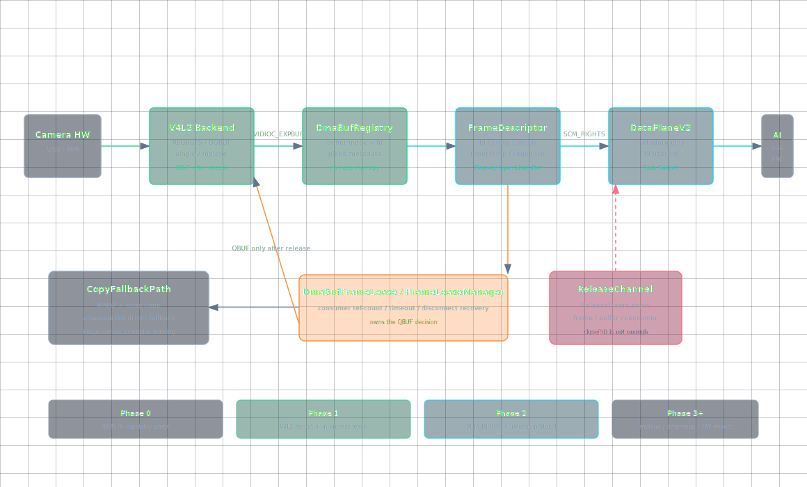
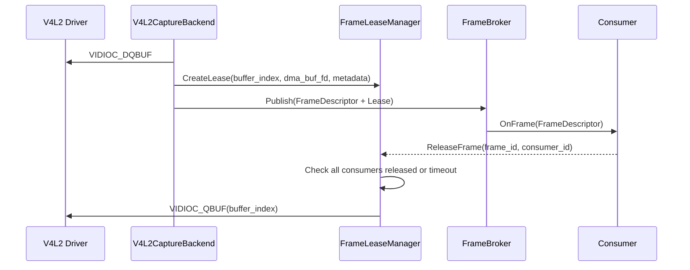

# DMA-BUF 零拷贝主链路架构设计

**最后更新:** 2026-04-26<br>
**Phase 1 代码状态:** 已落地（提交 2cb8017），待板端集成验证

> **文档硬规范**
>
> - 本项目的系统架构图、模块框图、部署拓扑图、数据路径框图和工程结构框图必须使用 `architecture-diagram` skill 生成独立 HTML / inline SVG 图表产物；每个 HTML 图必须同步导出同名 `.svg`，Markdown 中默认直接显示 SVG，并附完整 HTML 图表链接。
> - 时序图、状态机图、纯目录结构图等仍使用 Mermaid fenced code block（语言标识为 `mermaid`）。
> - 禁止新增 ASCII art/text 框图；普通日志、命令输出、代码片段按其原始语言使用 fenced code block。
> - 本文只做架构设计，不包含 C++ 实现代码。

---

## 目录

- [1. 背景与结论](#1-背景与结论)
- [2. 当前链路基线](#2-当前链路基线)
- [3. 目标架构](#3-目标架构)
- [4. 推荐演进路线](#4-推荐演进路线)
- [5. 核心模块边界](#5-核心模块边界)
- [6. Phase 1 可编码契约](#6-phase-1-可编码契约)
- [7. Buffer 生命周期与背压](#7-buffer-生命周期与背压)
- [8. 跨进程数据面协议](#8-跨进程数据面协议)
- [9. CPU 访问与 Cache 同步](#9-cpu-访问与-cache-同步)
- [10. RK3576 验证计划](#10-rk3576-验证计划)
- [11. MVP 范围](#11-mvp-范围)
- [12. TODO 与风险](#12-todo-与风险)
  - [12.1 待确认项](#121-待确认项)
  - [12.2 下一步开发计划](#122-下一步开发计划)
  - [12.3 主要风险](#123-主要风险)
  - [12.4 不应在第一版做的事](#124-不应在第一版做的事)

---

## 1. 背景与结论

当前 CameraSubsystem 在 RK3576 / Debian 上已经完成 V4L2/MMAP 采集、BufferPool 生命周期治理、发布端/订阅端双进程示例和 Web Preview 验证。DMA-BUF Phase 1 已开始代码落地，当前已接入 `FrameDescriptor` / `FrameLease` / `DmaBufFrameLease` 基础模型，并在显式 `IoMethod::kDmaBuf` 时尝试 V4L2 `VIDIOC_EXPBUF` 导出；如果驱动或板端环境不支持导出，仍回退到 MMAP + copy。

结论：

1. **可以继续演进 DMA-BUF 零拷贝主链路**。现有 `FrameHandle` 已预留 `MemoryType::kDmaBuf`、`buffer_fd_`、plane、stride、offset 等字段，方向上具备承接基础。
2. **第一阶段应优先打通 V4L2 buffer export 路径**，即仍由 V4L2 驱动分配采集 buffer，CameraSubsystem 通过 `VIDIOC_EXPBUF` 导出 DMA-BUF fd，避免采集帧再复制到 heap `BufferPool`。
3. **不能过早 QBUF 复用底层 V4L2 buffer**。只要消费者还在使用该帧对应的 DMA-BUF，生产端就不能把同一个 V4L2 buffer 重新入队，否则消费者可能读到被覆盖的新帧。
4. **跨进程零拷贝需要数据面协议 v2**。当前 `CameraDataFrameHeader + payload` 是复制链路；生产级零拷贝需要通过 Unix Domain Socket `SCM_RIGHTS` 传递 fd，并增加 `ReleaseFrame` 或等价回收协议。
5. **多平面和 RKISP/MIPI 是必须纳入设计的能力**。当前 USB MJPEG 预览可以继续走 JPEG payload 透传，但 MIPI/RKISP 常见 NV12、多平面 buffer 才是 DMA-BUF 零拷贝的主要收益场景。

### 1.1 本轮架构评审结论

从高级架构评审角度看，当前方向没有致命缺陷，但实现前必须解决以下约束，否则很容易在板端出现帧率抖动、buffer 过早复用或后续多平面接口重构：

1. Phase 1 必须基于 `VIDIOC_REQBUFS` 实际返回的 buffer 数量计算 lease 上限，不能只使用配置值。
2. Phase 1 必须先定义 `FrameDescriptor`，即使第一版只实现单 fd 单平面，也要避免后续多平面阶段大改数据结构。
3. `DmaBufFrameLease` 与现有 `BufferGuard` 不能混为一类资源，应通过统一 `FrameLease` 概念并列管理。
4. Phase 0 必须探测 MMAP + EXPBUF 组合是否可用，不能假设具体 V4L2 驱动完全符合预期路径。
5. Phase 2 的 `ReleaseFrame` 不应复用当前低频 control socket，推荐独立 release channel。
6. 只要 Phase 1 存在 CPU mmap DMA-BUF 的调试读路径，就必须预留 DMA-BUF sync helper 或明确 fallback。

本文后续章节已经把这些评审结论转化为 Phase 1 可编码契约、MVP 范围、验收标准和风险表。

## 2. 当前链路基线

**Phase 1 代码已落地（提交 2cb8017），当前状态：待板端集成验证。**

当前代码事实：

| 模块 | 当前状态 | 对 DMA-BUF 的影响 |
|------|----------|-------------------|
| `CameraSource` | 当前为 V4L2/MMAP 采集实现；显式 `IoMethod::kDmaBuf` 时尝试 `VIDIOC_EXPBUF` 导出，失败则回退 copy | 默认链路仍保留 CPU memcpy；DMA-BUF Phase 1 需要板端验证 |
| `BufferPool` / `BufferGuard` | 管理 heap buffer 生命周期和池耗尽丢帧 | 生命周期治理可复用，但 buffer 来源需要扩展 |
| `FrameHandle` | 已包含 `memory_type_`、`buffer_fd_`、plane、stride、offset、size | 可承载单 fd DMA-BUF，但多 fd 多平面表达不足 |
| `FrameHandleEx` | 用 `shared_ptr<BufferGuard>` 绑定生命周期 | 可演进为 C++ 侧 lease 载体 |
| `FrameDescriptor` / `FramePacket` | **已实现**（Phase 1），承载 fd、plane、bytes_used、buffer_id 与 `FrameLease` | 当前先服务进程内 DMA-BUF export 闭环，后续可映射到 DataPlaneV2 |
| `FrameLease` / `DmaBufFrameLease` | **已实现**（Phase 1），基础生命周期抽象，release 后触发 V4L2 buffer QBUF | 当前为 Phase 1 基础闭环，跨进程 release 尚未实现 |
| `CameraDataFrameHeader` | 只包含 width、height、format、frame_size、frame_id、timestamp、sequence | 不足以表达 fd、plane、stride、offset、buffer index |
| 示例数据面 IPC | Unix Socket 写入 header + frame bytes | 是复制链路，不是零拷贝数据面 |
| Web Preview | 对 USB MJPEG/JPEG 做 payload 透传 | 对 JPEG 调试链路足够，但不代表主链路零拷贝 |

当前热路径可以概括为：

```text
V4L2 MMAP buffer -> memcpy -> BufferPool heap buffer -> FrameHandle -> socket payload copy -> subscriber
```

当前已接入的 Phase 1 代码路径可以概括为：

```text
V4L2 MMAP buffer -> VIDIOC_EXPBUF -> DMA-BUF fd -> FramePacket(FrameDescriptor + FrameLease) -> in-process consumer -> Release -> QBUF
```

该路径仍需在 RK3576 板端验证 `VIDIOC_EXPBUF` 支持、lease 回收时序、CPU mmap 读路径 cache 行为和不同摄像头节点兼容性。

DMA-BUF 目标路径应变为：

```text
V4L2 kernel buffer -> DMA-BUF fd -> FrameHandle/FrameLease -> broker -> fd metadata -> subscriber import
```

## 3. 目标架构



[打开完整 HTML 图表](images/dmabuf-zero-copy-architecture.html)

目标架构分成四层：

1. **采集层**：`V4L2CaptureBackend` 负责设备能力发现、格式协商、buffer 申请、DQBUF/QBUF 和 DMA-BUF export/import。
2. **帧描述层**：`FrameHandle` / 后续 `FrameDescriptor` 表达 fd、plane、stride、offset、modifier、timestamp、sequence、buffer index 等元数据。
3. **生命周期层**：`DmaBufFrameLease` / `FrameLeaseManager` 管理消费者引用计数、超时回收、QBUF 时机和异常断连恢复。
4. **数据面层**：进程内订阅直接传递 frame lease；跨进程订阅通过 `DataPlaneV2` 发送 metadata，并通过 `SCM_RIGHTS` 传递 DMA-BUF fd。

核心约束：

1. `camera_publisher` 仍然独占底层 Camera 设备。
2. DMA-BUF fd 是帧数据句柄，不是所有权本身；底层 V4L2 buffer 的复用权仍由生产端控制。
3. fd 传递后，消费者关闭 fd 不能自动通知生产端，因此必须设计显式 release 或超时回收。
4. 慢消费者不能长期占用 V4L2 buffer。每个订阅端必须有 in-flight 上限和丢帧策略。
5. 对不支持 DMA-BUF export/import 的设备保留 MMAP + copy fallback。
6. Phase 1 开始就引入 `FrameDescriptor` 的数据模型，但实现可以先只填单 fd 单平面字段，避免后续多平面阶段大改 lease 和数据面接口。
7. Phase 2 的 `ReleaseFrame` 建议使用独立反向 release channel，不复用当前低频同步控制面 socket。

## 4. 推荐演进路线

### 4.1 Phase 0：RK3576 能力探测

本阶段不改主链路，只确认板端能力。

**已完成验证结果（2026-04-26）：**

| 探测项 | 结果 | 说明 |
|--------|------|------|
| `/dev/video45` (uvcvideo) `VIDIOC_EXPBUF` | **支持** | 4 buffer 全部导出成功，fd 有效，mmap 可读 |
| `/dev/video45` MMAP + EXPBUF 组合 | **可用** | 先 REQBUFS(MMAP) 再 EXPBUF，驱动允许同一 buffer 同时 MMAP 映射和 EXPBUF 导出 |
| `/dev/video45` `VIDIOC_REQBUFS` 实际返回 | **4** | 请求 4 个 buffer，驱动返回 4 个 |
| RKISP/MIPI 节点 (`/dev/video0-4`) | **不可用** | `v4l2-ctl` 返回 "No such device"，MIPI 摄像头未接入 |
| `/dev/dma_heap/*` | 待确认 | 尚未探测 |
| RGA/NPU/编码器 import | 待确认 | 尚未探测 |

**剩余待确认项：**

1. RKISP/MIPI 相关 `/dev/video*` 节点是否为 `V4L2_BUF_TYPE_VIDEO_CAPTURE_MPLANE`（需接入 MIPI 摄像头后验证）。
2. 目标格式是 MJPEG、YUYV、NV12、NV16 还是多平面 NV12。
3. 板端是否存在 `/dev/dma_heap/*`，以及后续是否需要走外部分配。
4. RGA / NPU / 编码器是否能直接 import 采集侧导出的 DMA-BUF fd。
5. CPU mmap DMA-BUF 后是否需要显式 `DMA_BUF_IOCTL_SYNC`（V4L2 DQBUF 通常已做 cache invalidation，但跨 fd 传递后消费者 mmap 可能需要显式 sync）。

### 4.2 Phase 1：V4L2 export 零拷贝，进程内闭环

这是第一版真正可落地的最小零拷贝闭环。

设计：

1. `CameraSource` 或新的 `V4L2CaptureBackend` 仍使用 `VIDIOC_REQBUFS + V4L2_MEMORY_MMAP` 让驱动分配 buffer。
2. 初始化阶段对每个 V4L2 buffer 调用 `VIDIOC_EXPBUF`，缓存对应 DMA-BUF fd。
3. Phase 1 即定义 `FrameDescriptor` 数据模型，字段覆盖单平面和多平面；实现上先只填单 fd 单平面字段，并同步填充兼容用的 `FrameHandle`：
   - `memory_type_ = MemoryType::kDmaBuf`
   - `buffer_fd_ = exported_fd`
   - `virtual_address_ = nullptr`，除非调试时显式 mmap
   - plane、stride、offset、size 来自 V4L2 buffer / plane metadata
4. 通过 `DmaBufFrameLease` 绑定 V4L2 buffer index、fd、frame metadata 和 release 回调。
5. 所有进程内订阅端释放 lease 后，生产端才对该 V4L2 buffer 执行 QBUF。

Phase 1 必须显式约束 V4L2 buffer 数量和 lease in-flight：

| 参数 | 建议 |
|------|------|
| `v4l2_buffer_count` | 以 `VIDIOC_REQBUFS` 实际返回值为准 |
| `min_queued_capture_buffers` | 默认按 buffer 数量动态计算，优先保留 2 个 queued buffer；buffer 很少时至少保留 1 个 |
| `global_lease_in_flight_max` | `max(1, v4l2_buffer_count - min_queued_capture_buffers)` |
| `consumer_lease_in_flight_max` | 默认 1；高优先级 AI/编码可配置为 2；Web Preview 默认 0 或 copy fallback |
| buffer 全部被 lease 占用 | 不无限等待；按消费者优先级丢帧或触发 lease 超时回收 |

`min_queued_capture_buffers` 推荐规则：

| 实际 V4L2 buffer 数量 | `min_queued_capture_buffers` | `global_lease_in_flight_max` | 说明 |
|-----------------------|------------------------------|------------------------------|------|
| 2 | 1 | 1 | 只能做最小功能验证，不适合多消费者 |
| 3 | 2 | 1 | 保守验证单消费者，降低采集停顿 |
| 4 | 2 | 2 | 第一版推荐配置 |
| 5+ | 2 或更多 | `count - reserved` | 可按平台实测放宽 |

如果 `VIDIOC_REQBUFS` 实际只返回 2 到 3 个 buffer，Phase 1 不应追求多消费者全量投递。此时应优先验证单消费者零拷贝路径，并让 Web Preview、保存图片等调试链路走 copy fallback，避免把采集端拖入频繁停顿。

收益：

1. 去掉采集线程中的 heap memcpy。
2. 验证 `FrameHandle` 对 DMA-BUF 元数据的表达是否足够。
3. 先不引入跨进程 fd 传递复杂度，降低第一阶段风险。
4. 同时验证 lease 上限、超时回收和 QBUF 时机是否稳定。

### 4.3 Phase 2：DataPlaneV2，跨进程 fd 传递

在 Phase 1 稳定后，引入跨进程零拷贝。

设计：

1. 新增数据面协议版本 `CameraDataFrameDescriptorV2`，只发送元数据，不发送完整 payload。
2. 使用 Unix Domain Socket `sendmsg + SCM_RIGHTS` 传递 DMA-BUF fd。
3. 每个消费者收到 fd 后自行 import 到 AI、RGA、编码器或必要时 CPU mmap。
4. 消费者处理完成后发送 `ReleaseFrame`：
   - `stream_id`
   - `frame_id`
   - `buffer_id`
   - `consumer_id`
   - `status`
5. `ReleaseFrame` 走独立反向 release channel，不复用当前控制面同步请求-响应 socket。
6. 生产端 `FrameLeaseManager` 收齐 release 或超时后 QBUF。

Release channel 决策：

| 方案 | 结论 | 原因 |
|------|------|------|
| 复用 control socket | 不作为推荐方案 | 当前控制面是 Subscribe / Unsubscribe / Ping 等低频同步请求-响应；`ReleaseFrame` 是每帧每消费者一次的高频异步消息，混用会增加延迟和状态机复杂度 |
| 新增独立 release channel | Phase 2 推荐方案 | release 与控制命令解耦，便于做高频批量 release、断连清理、发送缓冲区阈值和独立统计 |
| 复用 data socket 反向消息 | 可作为备选 | 如果数据面连接本身是双向长连接，可以在协议层区分 frame descriptor 与 release message，但实现仍应与 control socket 分离 |

不建议在第一版把 fd 传递和外部分配同时做完。跨进程 fd 传递本身已经需要新的控制面、错误恢复和背压策略。

### 4.4 Phase 3：多平面 MIPI/RKISP 支持

RKISP/MIPI 场景通常比 USB MJPEG 更需要零拷贝。

设计要求：

1. 支持 `V4L2_BUF_TYPE_VIDEO_CAPTURE_MPLANE`。
2. 每帧需要表达 plane 数量、每个 plane 的 fd、offset、stride、length、bytesused。
3. 兼容两类驱动行为：
   - 多个 plane 共享同一个 DMA-BUF fd，以 offset 区分。
   - 每个 plane 独立 DMA-BUF fd。
4. `FrameHandle` 现有 `buffer_fd_` 只能表达单 fd，因此 Phase 1 就应定义 `FrameDescriptor` 的多 fd 字段，但第一版实现只填单 fd 单平面。
5. 不建议把 `plane_fds_[3]` 塞入 `reserved_` 作为长期方案。`reserved_` 可以临时防 ABI 断裂，但主线设计应使用显式 `FrameDescriptor` / `FrameHandleV2`。

### 4.5 Phase 4：外部分配与硬件链路

最后再考虑外部分配：

1. 通过 dma-heap 分配 buffer。
2. 以 `V4L2_MEMORY_DMABUF` QBUF 给 Camera 驱动。
3. 同一批 buffer 在 Camera、RGA、NPU、编码器之间流转。
4. 引入 cache sync、modifier、color space、fence 等更完整的硬件同步语义。

该阶段复杂度明显高于 V4L2 export，不建议作为第一版目标。

## 5. 核心模块边界

| 模块 | 责任 | 第一阶段要求 |
|------|------|--------------|
| `V4L2CaptureBackend` | 封装 V4L2 单平面/多平面、MMAP、EXPBUF、DQBUF/QBUF | 可先从当前 `CameraSource` 内部拆出或逻辑分层 |
| `DmaBufRegistry` | 保存 V4L2 buffer index 到 exported fd / plane fd 的映射 | 初始化时 export，Stop 时关闭 fd |
| `FrameDescriptor` | 描述帧元数据、plane、fd、stride、offset、size | Phase 1 定义数据模型，先支持单 fd 单平面，字段预留多平面 |
| `FrameLease` | 抽象 lease 基类或概念接口，统一 heap buffer 与 DMA-BUF buffer 生命周期 | Phase 1 推荐新增，避免让 `FrameHandleEx` 只绑定 `BufferGuard` |
| `HeapFrameLease` | 包装现有 `BufferGuard` / `BufferPool` 生命周期 | 兼容当前 MMAP + copy fallback |
| `DmaBufFrameLease` | 绑定 frame metadata、buffer index、release callback | 确保 release 前不 QBUF |
| `FrameLeaseManager` | 管理每帧引用计数、订阅端 in-flight、超时回收 | 第一版至少支持单 publisher 多订阅 |
| `DataPlaneV2` | 通过 metadata + SCM_RIGHTS 传递 fd | Phase 2 开始实现 |
| `ReleaseChannel` | 接收消费者 `ReleaseFrame`，驱动 `FrameLeaseManager` 回收 | Phase 2 推荐独立于 control socket |
| `ConsumerRuntime` | 订阅端 import fd，并显式 release | Phase 2 开始实现 |
| `CopyFallbackPath` | 不支持 DMA-BUF 时回退到当前复制链路 | 必须保留 |

`DmaBufFrameLease` 与现有 `BufferGuard` / `FrameHandleEx` 的关系：

1. `BufferGuard` 继续服务 heap buffer，也就是当前 MMAP + copy fallback。
2. `DmaBufFrameLease` 不应继承 `BufferGuard`。两者管理的资源不同：`BufferGuard` 归还 `BufferPool` 中的 heap block；`DmaBufFrameLease` 释放后触发 V4L2 buffer QBUF 或通知 `FrameLeaseManager`。
3. 建议引入统一的 `FrameLease` 概念，让 `HeapFrameLease` 和 `DmaBufFrameLease` 并列共存。
4. `FrameHandleEx` 当前只携带 `shared_ptr<BufferGuard>`，Phase 1 不建议强行修改其语义。推荐新增 `FramePacket` / `FrameEnvelope` / `FrameHandleExV2` 之一，用于承载：
   - `FrameDescriptor`
   - 兼容用 `FrameHandle`
   - `shared_ptr<FrameLease>`
5. 发布端内部逐步切到 `FrameDescriptor + FrameLease`，公共 API 是否替换 `FrameHandleEx` 单独评估，避免一次性破坏现有示例和测试。

## 6. Phase 1 可编码契约

本节把 Phase 1 收敛到可以开始写代码的程度。若后续板端探测发现驱动不支持 `VIDIOC_EXPBUF` 或 MMAP + EXPBUF 组合，则 Phase 1 自动降级为 copy fallback，不继续推进 DMA-BUF export 模式。

### 6.1 第一版新增概念

| 概念 | 设计定位 | 第一版要求 |
|------|----------|------------|
| `FrameDescriptor` | 新的帧元数据描述，覆盖 fd、plane、stride、offset、bytesused、buffer index | 定义完整字段；实现先支持单 fd 单平面 |
| `FrameLease` | 生命周期抽象，表示某个 frame 的底层 buffer 暂不可复用 | 可以是接口、抽象类或轻量对象概念；不要求跨进程 |
| `HeapFrameLease` | 当前 `BufferGuard` 的兼容包装 | 用于 MMAP + copy fallback |
| `DmaBufFrameLease` | V4L2 buffer lease，release 后由生产端 QBUF | 不继承 `BufferGuard` |
| `FramePacket` | 进程内投递单元，承载 `FrameDescriptor + FrameHandle + shared_ptr<FrameLease>` | 名称可最终确认，但第一版需要有等价对象 |
| `V4L2DmaBufExporter` | 封装 `VIDIOC_EXPBUF` 与 fd 缓存 | 可先作为 `CameraSource` 内部 helper |
| `DmaBufSyncHelper` | 封装 CPU mmap 读路径的 DMA-BUF sync | 只用于调试读路径和 fallback 验证 |

`FramePacket` 是文档中的推荐名称。实现前如果选择 `FrameEnvelope` 或 `FrameHandleExV2`，必须保持同一语义：一个对象同时携带帧描述、兼容句柄和生命周期 lease。

### 6.2 第一版默认行为

| 项目 | 决策 |
|------|------|
| 默认运行模式 | 继续使用当前 MMAP + copy 链路，保证现有示例和 Web Preview 不受影响 |
| 启用 DMA-BUF | 通过 `CameraConfig::io_method_ = IoMethod::kDmaBuf` 或等价配置显式启用 |
| 探测失败 | 自动降级到 MMAP + copy，并记录原因 |
| 多消费者 | 第一版只保证一个高优先级进程内消费者走 DMA-BUF lease；其他消费者默认 copy fallback 或降帧 |
| Web Preview | 不作为第一版 DMA-BUF 主消费者，继续优先使用 JPEG/copy 路径 |
| 跨进程 fd | 不进入 Phase 1 |
| 多平面实现 | 不进入 Phase 1，但 `FrameDescriptor` 字段必须先定义 |
| 外部分配 | 不进入 Phase 1 |

### 6.3 第一版状态机

```mermaid
stateDiagram-v2
    [*] --> Probe
    Probe --> CopyFallback: no EXPBUF or no MMAP+EXPBUF
    Probe --> ExportBuffers: supported
    ExportBuffers --> StreamReady: fd cache ready
    ExportBuffers --> CopyFallback: export failed
    StreamReady --> Streaming
    Streaming --> Leased: DQBUF + create DmaBufFrameLease
    Leased --> Requeue: all releases or timeout
    Requeue --> Streaming: VIDIOC_QBUF
    Streaming --> CopyFallback: runtime DMA-BUF error
    CopyFallback --> [*]: stop
    Streaming --> [*]: stop
```



状态含义：

| 状态 | 含义 |
|------|------|
| `Probe` | 查询设备能力、buffer type、EXPBUF、MMAP+EXPBUF、实际 buffer 数量 |
| `ExportBuffers` | 对 V4L2 buffer 执行 `VIDIOC_EXPBUF` 并缓存 fd |
| `StreamReady` | DMA-BUF fd、descriptor 模板和 lease 策略准备完成 |
| `Streaming` | 正常 DQBUF，构造 `FramePacket` 并投递 |
| `Leased` | 某个 V4L2 buffer 已出队并被消费者持有，不能 QBUF |
| `Requeue` | lease release 或超时后由生产端统一 QBUF |
| `CopyFallback` | 使用当前 MMAP + BufferPool copy 路径 |

### 6.4 第一版实现顺序

1. 新增能力探测路径，只输出结果，不改变采集行为。
2. 定义 `FrameDescriptor` 和 `FramePacket` 数据模型，先不替换现有调用链。
3. 增加 `HeapFrameLease` 包装当前 `BufferGuard`，证明新投递对象可以兼容旧路径。
4. 增加 `V4L2DmaBufExporter`，初始化时 export V4L2 buffer fd。
5. 增加 `DmaBufFrameLease`，把 DQBUF 后的 buffer index 绑定到 release callback。
6. 在 `CameraSource` 内部增加 DMA-BUF 分支，显式启用时才走新路径。
7. 增加 lease 上限、超时、metrics 和 copy fallback。
8. 增加板端 smoke test：至少验证 DQBUF 后不 memcpy、release 后 QBUF、停止时 fd 全部关闭。

### 6.5 第一版验收标准

| 验收项 | 标准 |
|--------|------|
| 不破坏现有链路 | 默认配置下 `camera_publisher_example` / `camera_subscriber_example` 行为不变 |
| 探测可观测 | 日志能输出 EXPBUF、MMAP+EXPBUF、buffer 数量、fallback 原因 |
| DMA-BUF 路径无 heap memcpy | 显式 DMA-BUF 模式下，采集线程不把帧数据复制到 `BufferPool` |
| QBUF 时机正确 | consumer release 前不 QBUF；release 或超时后由生产端 QBUF |
| lease 上限生效 | 超过 `global_lease_in_flight_max` 时丢帧或 fallback，不无限等待 |
| fd 生命周期正确 | Stop / error / fallback 时关闭所有 export fd，不泄漏 |
| fallback 稳定 | EXPBUF 不支持时自动回到现有 MMAP + copy |
| CPU 读可控 | CPU mmap 路径必须经过 `DmaBufSyncHelper` 或显式标记不可用 |

### 6.6 不变量

1. 订阅端永远不直接操作 Camera 设备节点。
2. 订阅端永远不执行 V4L2 QBUF。
3. `DmaBufFrameLease` 析构或 release 必须幂等。
4. 同一个 V4L2 buffer 同一时间只能关联一个 active `DmaBufFrameLease`。
5. `FrameDescriptor` 中的 fd 字段只描述可访问句柄，不表达 QBUF 所有权。
6. Copy fallback 不能依赖 DMA-BUF 模块初始化成功。

## 7. Buffer 生命周期与背压

DMA-BUF 主链路的核心不是“拿到 fd”，而是“控制 buffer 何时可以复用”。

推荐生命周期：



背压策略：

| 场景 | 策略 |
|------|------|
| 无订阅者 | 不启动采集，保持当前按订阅启停策略 |
| 单个消费者慢 | 超过 in-flight 上限后不再投递新帧，只保留最新帧或直接丢帧 |
| 所有 buffer 被占用 | 采集端不无限等待；优先丢弃低优先级消费者，必要时触发 lease 超时回收 |
| 消费者进程断连 | 控制面标记 consumer dead，释放其持有的 lease |
| release 超时 | 记录错误并强制回收，必要时重启采集流 |
| 调试 Web Preview | 默认走 JPEG payload 或低帧率 copy fallback，不阻塞主链路 |

V4L2 buffer 数量与 lease 上限的硬约束：

```text
min_queued_capture_buffers = actual_v4l2_buffer_count >= 4 ? 2 : 1
global_lease_in_flight_max = max(1, actual_v4l2_buffer_count - min_queued_capture_buffers)
```

说明：

1. `actual_v4l2_buffer_count` 必须使用 `VIDIOC_REQBUFS` 返回的实际数量。
2. `min_queued_capture_buffers` 用于降低所有 buffer 都被 lease 占用后采集端完全停顿的风险。4 个及以上 buffer 默认保留 2 个给驱动队列周转；2 到 3 个 buffer 时至少保留 1 个。
3. 对 3 到 4 个 V4L2 buffer 的常见配置，第一版不应允许每个消费者都持有多帧。建议先限定一个高优先级消费者零拷贝，其他消费者 copy fallback 或只接收降帧数据。
4. 如果 `global_lease_in_flight_max` 长期耗尽，应把它视为背压事件，而不是普通等待。日志和 metrics 需要暴露 `lease_exhausted_count`、`lease_timeout_count`、`qbuf_delayed_count`。

关键约束：

1. 不能因为慢 Web 客户端阻塞 AI/编码等主消费者。
2. 不能让跨进程订阅端无限持有 fd。
3. 不能用“消费者 close(fd)”替代 release 协议。
4. QBUF 必须由生产端统一执行。
5. QBUF 延迟会直接减少驱动可用 buffer，进而影响采集帧率；因此 lease 策略属于采集主链路策略，不是消费者局部实现细节。

## 8. 跨进程数据面协议

当前 `CameraDataFrameHeader` 不足以表达 DMA-BUF。建议新增 v2 协议，不破坏当前复制链路。

### 8.1 FrameDescriptor 建议字段

| 字段 | 说明 |
|------|------|
| `magic` | 协议识别 |
| `version` | 协议版本，建议 v2 |
| `stream_id` | 流 ID 或 camera ID |
| `frame_id` | 帧序号，建议统一为 64-bit |
| `buffer_id` | 生产端 buffer index 或 lease id |
| `timestamp_ns` | 采集时间戳 |
| `sequence` | V4L2 sequence |
| `width` / `height` | 图像尺寸 |
| `pixel_format` | 内部格式枚举或 fourcc 映射 |
| `memory_type` | `DMA_BUF` / `MMAP_COPY` / `SHM` |
| `plane_count` | plane 数量 |
| `plane[i].fd_index` | 对应 SCM_RIGHTS fd 数组索引。Phase 1 先固定为 0；多平面阶段可一 plane 一 fd 或多 plane 共用同一 fd |
| `plane[i].offset` | plane 起始偏移 |
| `plane[i].stride` | 每行跨度 |
| `plane[i].length` | plane 分配长度 |
| `plane[i].bytesused` | 当前帧有效字节数 |
| `flags` | 只读、可写、压缩、关键帧等 |
| `reserved` | 扩展字段 |

### 8.2 fd 传递

跨进程传输使用：

```text
Unix Domain Socket sendmsg()
  normal payload: CameraDataFrameDescriptorV2
  ancillary data: SCM_RIGHTS fd list
```

设计注意：

1. fd 通过 `SCM_RIGHTS` 到达消费者后是新的进程内 fd。
2. 消费者必须关闭自己的 fd。
3. 生产端不能依赖消费者 close fd 感知 release。
4. release 必须走独立 release channel 或数据面反向消息；不推荐复用当前 control socket。
5. `ReleaseFrame` 属于高频异步消息，需要独立统计发送失败、延迟、超时和断连。

### 8.3 ReleaseFrame 建议字段

| 字段 | 说明 |
|------|------|
| `type` | `release_frame` |
| `stream_id` | 流 ID |
| `frame_id` | 帧序号 |
| `buffer_id` | buffer / lease id |
| `consumer_id` | 订阅端 ID |
| `status` | `ok` / `dropped` / `error` / `timeout` |

### 8.4 Release channel 决策

Phase 2 推荐新增独立 release channel：

```text
camera_publisher
  control socket: Subscribe / Unsubscribe / Ping / capability query
  data socket v2: FrameDescriptor + SCM_RIGHTS fd list
  release socket: ReleaseFrame / batch release / consumer disconnect cleanup
```

原因：

1. 当前 control socket 是低频同步请求-响应模型，不适合承载每帧每消费者一次的高频 release。
2. release 是数据面生命周期的一部分，不是普通控制命令。
3. 独立 release channel 可以单独设置发送缓冲区、超时策略、批量 release 和 metrics。
4. 如果后续 data socket 变成全双工长连接，也可以把 release message 放在 data socket 内，但实现上仍应保持与 control command 分离的状态机。

## 9. CPU 访问与 Cache 同步

DMA-BUF 主链路的理想消费者是 RGA、NPU、编码器或 GPU 等硬件模块。但第一阶段调试时可能需要 CPU mmap DMA-BUF，例如：

1. 验证 DMA-BUF 内容是否正确。
2. Web Preview Gateway 读取 JPEG payload 后发送 WebSocket。
3. 保存单帧文件或做最小 checksum 测试。

因此 Phase 1 不能把 cache coherency 完全推迟到后续。策略如下：

| 场景 | Phase 1 策略 |
|------|--------------|
| 消费者不做 CPU mmap，只把 fd 交给硬件 import | 不在消费者侧做 CPU cache sync，依赖硬件接口自身同步语义 |
| 生产端 DQBUF 后仅构造 descriptor，不 CPU 读取 payload | 不做额外 mmap |
| 调试工具或 Web Preview 需要 CPU 读 DMA-BUF | mmap 后按只读路径执行 DMA-BUF sync start/end，或回退到 copy fallback |
| 驱动 / 内核不支持显式 DMA-BUF sync ioctl | 标记为平台限制，Phase 1 CPU 读路径只用于调试，不作为稳定主链路 |

建议的 CPU 读流程：

```text
consumer receives dma_buf fd
mmap(fd, PROT_READ)
DMA_BUF_IOCTL_SYNC START | READ
read bytes / checksum / JPEG forwarding
DMA_BUF_IOCTL_SYNC END | READ
munmap()
close(fd)
ReleaseFrame()
```

说明：

1. V4L2 `DQBUF` 通常会处理采集设备到 CPU 可见性的同步，但跨 fd、跨进程、消费者 mmap 后是否还需要显式 sync 取决于驱动和内核实现。
2. 为降低调试阶段偶发脏数据风险，凡是消费者 CPU mmap 读取 DMA-BUF，Phase 1 设计上都应预留 sync helper。
3. Web Preview 不是 DMA-BUF 主链路的首要消费者。若 JPEG payload 透传需要稳定性优先，可以继续走当前 copy/JPEG fallback，避免调试 UI 牵动主链路。

## 10. RK3576 验证计划

当前 RK3576 上已经验证 USB 摄像头 `/dev/video45` 可用，Web Preview 可初步显示 MJPEG/JPEG。DMA-BUF 主链路建议从能力探测开始，不要假设所有节点都支持同一套 V4L2 行为。

建议验证顺序：

1. **USB 节点验证**
   - 目标：确认 `/dev/video45` 是否支持 `VIDIOC_EXPBUF`。
   - 目标：确认同一个 buffer 是否可同时 MMAP 和 EXPBUF。
   - 目标：确认 `VIDIOC_REQBUFS` 实际返回 buffer 数量。
   - 价值：如果支持，可快速验证单平面 DMA-BUF export。
   - 风险：USB MJPEG 本身已经是压缩 payload，对零拷贝收益有限。

2. **RKISP/MIPI 节点验证**
   - 目标：确认 RKISP capture 节点、buffer type、plane 数量、NV12/YUYV 等格式。
   - 价值：这是后续 AI/RGA/编码链路真正需要的 raw frame 零拷贝场景。
   - 风险：可能需要先补 `VIDEO_CAPTURE_MPLANE` 支持。

3. **消费者 import 验证**
   - 目标：确认 RGA、NPU、编码器或测试进程能 import 采集侧 DMA-BUF fd。
   - 价值：证明 fd 不是只在 V4L2 内部可用。

4. **跨进程 fd 传递验证**
   - 目标：最小 UDS `SCM_RIGHTS` demo，发送 fd，消费者 mmap 或交给硬件模块。
   - 价值：验证 DataPlaneV2 的基础可行性。

5. **CPU mmap 与 cache sync 验证**
   - 目标：消费者 CPU mmap DMA-BUF 后做 checksum 或 JPEG 文件保存。
   - 目标：验证显式 DMA-BUF sync helper 是否可用。
   - 价值：降低后续 Web Preview 或调试工具读到脏数据的风险。

## 11. MVP 范围

第一版 DMA-BUF MVP 建议只包含：

| 项目 | 是否纳入 | 说明 |
|------|----------|------|
| V4L2 `VIDIOC_EXPBUF` 能力探测 | 是 | 先确认 RK3576 设备节点能力 |
| MMAP + EXPBUF 组合探测 | 是 | 确认 Phase 1 路径是否成立 |
| 实际 V4L2 buffer 数量探测 | 是 | 用于计算 lease in-flight 上限 |
| 单平面 DMA-BUF export | 是 | 优先验证最小闭环 |
| `FrameDescriptor` 数据模型 | 是 | Phase 1 已定义，先填单 fd 单平面 |
| `FrameHandle` 兼容填充 `kDmaBuf` | 是 | 显式 DMA-BUF 路径不再把该帧复制到 heap buffer |
| `FrameLease` 概念 | 是 | `HeapFrameLease` 与 `DmaBufFrameLease` 并存 |
| `DmaBufFrameLease` | 是 | release 后才 QBUF |
| 进程内订阅零拷贝 | 是 | 已提供 `FramePacketCallback` 接入点，先绕开跨进程 fd 传递复杂度 |
| lease in-flight 上限 | 是 | 默认按 `min_queued_capture_buffers` 计算，4 个及以上 buffer 优先保留 2 个 queued buffer |
| CPU mmap sync helper | 待实现 | 仅用于调试 CPU 读路径或 fallback 验证，不阻塞当前基础闭环 |
| MMAP + copy fallback | 是 | 确保原有示例不被破坏 |
| DataPlaneV2 + `SCM_RIGHTS` | 第二阶段 | 不阻塞第一阶段 |
| 独立 release channel | 第二阶段 | Phase 2 推荐，不复用 control socket |
| 多平面 MIPI/RKISP | 第二阶段 | Phase 1 先定义字段，后实现 |
| dma-heap 外部分配 | 后续 | 不作为第一版目标 |
| RGA/NPU/编码器完整接入 | 后续 | 先验证 import 能力 |

## 12. TODO 与风险

### 12.1 待确认项

- ~~TODO：确认 `/dev/video45` 是否支持 `VIDIOC_EXPBUF`。~~ **已确认：支持**（2026-04-26 板端 C 测试验证，4 buffer 全部导出成功）
- ~~TODO：确认 `/dev/video45` 是否支持同一个 buffer 同时 MMAP 和 EXPBUF。~~ **已确认：可用**（先 REQBUFS(MMAP) 再 EXPBUF，驱动允许）
- ~~TODO：确认 `/dev/video45` 的 `VIDIOC_REQBUFS` 实际返回 buffer 数量。~~ **已确认：4**（请求 4 返回 4）
- TODO：确认 RKISP/MIPI capture 节点、buffer type、主要格式和 plane 布局（需接入 MIPI 摄像头）。
- TODO：确认 RKISP/MIPI 节点是否需要 `V4L2_BUF_TYPE_VIDEO_CAPTURE_MPLANE` 和每 plane 独立 fd。
- TODO：确认 RK3576 板端是否存在 `/dev/dma_heap/*`，以及权限配置。
- TODO：确认 RGA、NPU、编码器是否可 import V4L2 export 出来的 DMA-BUF fd。
- ~~TODO：确认当前 `FrameHandle` 是否长期保持 ABI 不变。~~ **已决策：Phase 1 新增 `FrameDescriptor`，并兼容填充 `FrameHandle`，不破坏旧 ABI**
- ~~TODO：确认 `FramePacket` 是否作为长期公开命名。~~ **已决策：Phase 1 使用 `FramePacket`，后续 DataPlaneV2 前可重命名**
- TODO：确认 Phase 2 独立 release channel 的 socket path、连接生命周期和 batch release 格式。
- ~~TODO：确认 DMA-BUF CPU mmap 后可用的 sync ioctl / helper，以及失败时的 fallback 行为。~~ **已确认：`dmabuf_smoke_test` 在 `/dev/video45` 上 CPU mmap 120 次成功，`DMA_BUF_IOCTL_SYNC` start/end 失败数均为 0**

### 12.2 下一步开发计划

Phase 1 代码已落地（提交 2cb8017），并已完成 RK3576 `/dev/video45` 板端集成 smoke。按优先级排序：

| 优先级 | 任务 | 说明 |
|--------|------|------|
| P0 | 板端集成验证：用 `IoMethod::kDmaBuf` 配置启动 publisher，确认 EXPBUF 路径在完整进程中工作 | ✅ `camera_publisher_example --io-method dmabuf` 已在 RK3576 `/dev/video45` 验证，`dmabuf_enabled=1`、`export_fail=0`、`lease_exhausted=0` |
| P0 | 补 DMA-BUF probe/smoke test：在 `camera_publisher_example` 中增加 `--io-method dmabuf` 参数，启动时输出 EXPBUF 探测结果 | ✅ 已支持 `--io-method mmap|dmabuf`，并补充 `dmabuf_smoke_test` |
| P0 | 验证 lease release 后 QBUF 时序：在板端运行 DMA-BUF 模式，观察 lease 计数、QBUF 时机、帧率是否稳定 | ✅ `dmabuf_smoke_test /dev/video45 5`：120 帧、`active_leases=0`、`max_active_leases=1`、`lease_exhausted=0` |
| P1 | 衡 `ShouldUseDmaBufPath()` 性能优化：缓存 `frame_packet_callback_` 布尔值，避免每帧加锁 | ✅ 已用原子布尔缓存 callback 状态 |
| P1 | 衡 DMA-BUF 统计 metrics：暴露 `dma_buf_export_failures`、`lease_exhausted_count`、`lease_timeout_count` 到 publisher stats | ✅ 已暴露 export_fail、lease_exhausted、dmabuf_frame_count、active_leases、lease_max、min_queued |
| P1 | 衡 `DmaBufSyncHelper`：封装 CPU mmap 读路径的 `DMA_BUF_IOCTL_SYNC` | 部分完成：`dmabuf_smoke_test` 内部已有 start/end sync 调试读路径；生产级 helper 后续抽象 |
| P1 | 验证 CPU mmap DMA-BUF cache 行为：消费者 mmap 后读帧数据，对比 MMAP copy 路径的帧内容 | ✅ smoke test CPU mmap 120 次成功，sync start/end 失败数为 0 |
| P2 | 接入 MIPI 摄像头后验证 RKISP 节点 EXPBUF 和多平面 | 依赖硬件接入，不阻塞当前 USB 验证 |
| P2 | 验证 RGA/NPU/编码器 import DMA-BUF fd | 依赖硬件模块接入 |
| P2 | DataPlaneV2 设计与实现 | Phase 1 稳定后启动 |

### 12.3 主要风险

| 风险 | 影响 | 缓解 |
|------|------|------|
| 驱动不支持 `VIDIOC_EXPBUF` | 无法走 V4L2 export | 保留 MMAP copy，评估 dma-heap import |
| 驱动不支持 MMAP + EXPBUF 组合 | Phase 1 路径需要调整 | Phase 0 强制探测，失败时不进入 DMA-BUF export 模式 |
| 多平面表达不足 | MIPI/RKISP 不能正确跨进程传递 | 新增 `FrameDescriptor`，不要硬塞进旧结构 |
| 慢消费者持有 buffer | 采集停顿或延迟累积 | in-flight 上限、超时 release、低优先级丢帧 |
| V4L2 buffer 数量过少 | 所有 buffer 被 lease 占用，帧率抖动 | 按 `min_queued_capture_buffers` 保留驱动队列周转 buffer，先限制单高优先级消费者 |
| fd 传递后生命周期不清 | buffer 过早复用或泄漏 | 显式 `ReleaseFrame` 协议 |
| ReleaseFrame 复用 control socket | 低频控制命令和高频 release 互相影响 | Phase 2 推荐独立 release channel |
| cache coherency 未处理 | CPU 读写看到脏数据 | Phase 1 CPU mmap 读路径预留 DMA-BUF sync helper |
| Web Preview 阻塞主链路 | 调试页面影响生产链路 | Web 默认低优先级和 copy/JPEG fallback |

### 12.4 不应在第一版做的事

1. 不直接重写完整数据面 IPC。
2. 不把所有格式转换、RGA、NPU、编码器接入一次性完成。
3. 不删除当前 MMAP + copy 链路。
4. 不让订阅端直接 QBUF 或操作 Camera 设备节点。
5. 不把 DMA-BUF 描述写成 RK3576 私有实现，核心设计仍保持 Linux / 嵌入式通用性。
