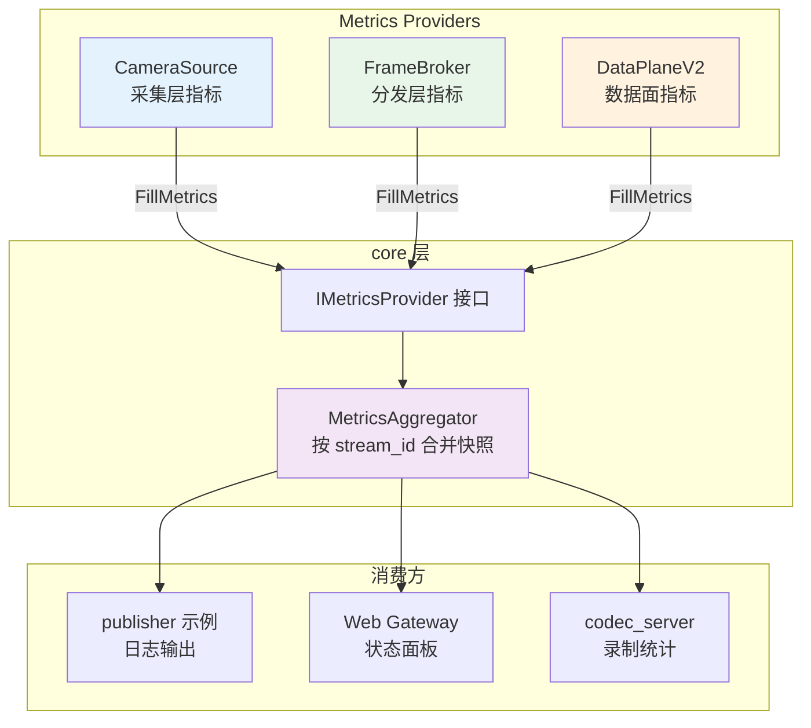

# 统一 Metrics 接口设计

**文档版本:** v0.2<br>
**最后更新:** 2026-05-14<br>
**适用范围:** CameraSubsystem 核心链路统一可观测性指标<br>
**当前状态:** `StreamMetrics`、`IMetricsProvider`、`MetricsAggregator` 已落地；下一步是把 metrics 快照接入板端 smoke 自动判定<br>
**关联文档:** [ARCHITECTURE_REVIEW.md](ARCHITECTURE_REVIEW.md)（P1 风险 — 指标体系不足，ARCH-009）、[AGENTS.md](../AGENTS.md)（2.2 写代码前置规则）

> **文档硬规范**
>
> - 本项目的系统架构图、模块框图、部署拓扑图、数据路径框图和工程结构框图必须使用 `architecture-diagram` skill 生成独立 HTML / inline SVG 图表产物；每个 HTML 图必须同步导出同名 `.svg`，Markdown 中默认直接显示 SVG，并附完整 HTML 图表链接。
> - 时序图、状态机图、纯目录结构图等仍使用 Mermaid fenced code block（语言标识为 `mermaid`）。
> - 禁止新增 ASCII art/text 框图；普通日志、命令输出、代码片段按其原始语言使用 fenced code block。
> - 每份项目文档必须在文档元信息和硬规范之后维护 `## 目录`，目录至少覆盖二级标题，并使用相对链接或页内锚点。

---

## 目录

- [1. 需求收敛](#1-需求收敛)
- [2. 当前现状与问题](#2-当前现状与问题)
- [3. 目标架构](#3-目标架构)
- [4. 接口设计](#4-接口设计)
- [5. 指标字段定义](#5-指标字段定义)
- [6. 聚合与导出](#6-聚合与导出)
- [7. 风险点与缓解](#7-风险点与缓解)
- [8. 编码就绪检查清单](#8-编码就绪检查清单)

---

## 1. 需求收敛

**一句话：** 定义 `core::StreamMetrics` 统一结构和 `IMetricsProvider` 填充接口，将当前分散在 `CameraSource`、`FrameBroker`、`DataPlaneV2` 中的计数器按 `stream_id` 标签聚合，使 publisher 示例和上层模块能通过统一入口获取每路流的完整指标快照。

**不修改的边界：**
- 不引入外部依赖（Prometheus、statsd、第三方 metrics 库）
- 不改动各模块内部的原子计数器实现方式
- 不新增线程或后台任务（聚合由调用方触发）
- 不修改控制面/数据面 IPC 协议
- `StreamMetrics` 结构第一版只覆盖已存在的指标，不预留给未来可能废弃的字段

**验证方案：**
- 本地 `./scripts/build.sh` + `ctest --output-on-failure` 通过
- 新增 unit test：验证 `CameraSourceMetricsProvider` / `FrameBrokerMetricsProvider` 填充值与内部计数器一致
- publisher 示例中替换现有手动聚合逻辑，日志输出格式不变

---

## 2. 当前现状与问题

**分散统计现状：**

| 模块 | 当前统计 | 访问方式 |
|------|----------|----------|
| `CameraSource` | `frame_count_`, `dropped_frames_`, `dma_buf_frame_count_`, `lease_exhausted_count_`, `active_leases` | 独立 `Get*Count()` 方法 |
| `FrameBroker` | `published_frames_`, `dispatched_tasks_`, `dropped_tasks_`, `queue_size`, `subscriber_stats` | `GetStats()` |
| `DataPlaneV2` (release tracker) | `registered_frames`, `received_releases`, `reclaimed_frames`, `expired_reclaims` | `GetServerStats()` |
| `publisher 示例` | 手动聚合上述所有字段 | 每秒遍历 `runtimes` 和 `stats` 结构 |

**问题：**
1. 指标命名不统一：`dropped_frames`（CameraSource）vs `dropped_tasks`（FrameBroker）vs `v2_send_fail`（publisher 示例）
2. 没有按 `stream_id` 标签聚合：publisher 示例中通过遍历 `runtimes_by_stream` 手动聚合，容易遗漏字段
3. 缺少统一入口：上层模块（Web、Codec）需要分别查询 CameraSource、FrameBroker、DataPlaneV2 才能获取完整指标
4. 没有标准化导出格式：当前是 publisher 示例的自定义日志格式，不可复用

---

## 3. 目标架构



**核心原则：**
1. **每个模块只填充自己的字段**：CameraSource 不填 FrameBroker 的字段，避免跨模块耦合
2. **聚合点负责合并**：按 `stream_id` 将多个 provider 的 `StreamMetrics` 合并为完整视图
3. **读快照，不改写**：`FillMetrics()` 是只读操作，不影响模块内部状态
4. **向后兼容**：现有 `GetStats()` / `Get*Count()` 方法保留，新的 Metrics 接口作为补充

---

## 4. 接口设计

### 4.1 StreamMetrics 结构

定义在 `core/metrics.h`（或 `core/types.h`）：

```cpp
namespace camera_subsystem::core {

/**
 * @brief 单路流指标快照
 *
 * 各模块通过 IMetricsProvider::FillMetrics() 填充自己负责的字段，
 * 未负责字段保持默认值 0。
 */
struct StreamMetrics
{
    std::string stream_id;
    uint64_t timestamp_ns = 0;

    // ---- 采集层 (CameraSource 负责) ----
    uint64_t capture_frame_count = 0;      // 总采集帧数
    uint64_t capture_dropped_count = 0;    // 采集丢帧数（DQBUF 失败、lease 耗尽等）
    uint64_t dma_buf_frame_count = 0;      // DMA-BUF 路径帧数
    uint64_t lease_exhausted_count = 0;    // lease 耗尽次数
    size_t active_lease_count = 0;         // 当前活跃 lease 数

    // ---- 分发层 (FrameBroker 负责) ----
    uint64_t broker_published_count = 0;   // FrameBroker 收到发布的帧数
    uint64_t broker_dispatched_count = 0;  // 成功分发给 subscriber 的帧数
    uint64_t broker_dropped_count = 0;     // FrameBroker 背压丢弃的帧数
    size_t broker_queue_depth = 0;         // 当前任务队列深度
    size_t broker_subscriber_count = 0;    // 当前活跃 subscriber 数

    // ---- 数据面 (DataPlaneV2 / publisher 负责) ----
    uint64_t v2_sent_frame_count = 0;      // DataPlaneV2 发送帧数
    uint64_t v2_send_failure_count = 0;    // DataPlaneV2 发送失败数
    uint64_t release_pending_count = 0;    // 待 release 帧数
    uint64_t release_timeout_count = 0;    // release 超时次数
    uint64_t release_reclaimed_count = 0;  // 成功回收帧数
};

} // namespace camera_subsystem::core
```

### 4.2 IMetricsProvider 接口

```cpp
namespace camera_subsystem::core {

class IMetricsProvider
{
public:
    virtual ~IMetricsProvider() = default;

    /**
     * @brief 填充指标快照
     * @param metrics 输出参数，provider 只填充自己负责的字段
     *
     * @note 实现方应保证线程安全（通常读取内部原子计数器）
     * @note metrics->stream_id 在调用前已由聚合方设置，provider 不应修改
     */
    virtual void FillMetrics(StreamMetrics* metrics) const = 0;
};

} // namespace camera_subsystem::core
```

### 4.3 MetricsAggregator

```cpp
namespace camera_subsystem::core {

class MetricsAggregator
{
public:
    void RegisterProvider(const std::string& stream_id, IMetricsProvider* provider);
    void UnregisterProvider(const std::string& stream_id, IMetricsProvider* provider);

    /**
     * @brief 获取单路流指标快照
     */
    StreamMetrics GetStreamMetrics(const std::string& stream_id) const;

    /**
     * @brief 获取所有流指标快照
     */
    std::vector<StreamMetrics> GetAllStreamMetrics() const;

    /**
     * @brief 格式化输出为日志字符串
     */
    static std::string FormatForLog(const StreamMetrics& metrics);

private:
    mutable std::mutex mutex_;
    std::unordered_map<std::string, std::vector<IMetricsProvider*>> providers_by_stream_;
};

} // namespace camera_subsystem::core
```

---

## 5. 指标字段定义

| 字段名 | 类型 | 负责模块 | 说明 |
|--------|------|----------|------|
| `stream_id` | string | 聚合方 | 流身份标识 |
| `timestamp_ns` | uint64 | 聚合方 | 快照采集时间 |
| `capture_frame_count` | uint64 | CameraSource | `CameraSource::frame_count_` |
| `capture_dropped_count` | uint64 | CameraSource | `CameraSource::dropped_frames_` |
| `dma_buf_frame_count` | uint64 | CameraSource | `CameraSource::dma_buf_frame_count_` |
| `lease_exhausted_count` | uint64 | CameraSource | `CameraSource::lease_exhausted_count_` |
| `active_lease_count` | size_t | CameraSource | `CameraSource::GetDmaBufActiveLeaseCount()` |
| `broker_published_count` | uint64 | FrameBroker | `FrameBroker::published_frames_` |
| `broker_dispatched_count` | uint64 | FrameBroker | `FrameBroker::dispatched_tasks_` |
| `broker_dropped_count` | uint64 | FrameBroker | `FrameBroker::dropped_tasks_` |
| `broker_queue_depth` | size_t | FrameBroker | `FrameBroker::task_queue_.size()` |
| `broker_subscriber_count` | size_t | FrameBroker | `FrameBroker::GetSubscriberCount()` |
| `v2_sent_frame_count` | uint64 | publisher / DataPlaneV2 | `data_v2_server` 发送计数 |
| `v2_send_failure_count` | uint64 | publisher / DataPlaneV2 | `data_v2_server` 发送失败计数 |
| `release_pending_count` | uint64 | publisher / release server | `release_server.PendingFrameCount()` |
| `release_timeout_count` | uint64 | publisher / release server | `release_server.GetServerStats().expired_reclaims` |
| `release_reclaimed_count` | uint64 | publisher / release server | `release_server.GetServerStats().reclaimed_frames` |

---

## 6. 聚合与导出

### 6.1 聚合流程

```cpp
// publisher 示例中
for (const auto& item : runtimes_by_stream) {
    StreamMetrics metrics;
    metrics.stream_id = item.first;
    metrics.timestamp_ns = GetTimestampNs();
    
    // 填充采集层指标
    runtime->source.FillMetrics(&metrics);
    
    // 填充分发层指标（如果 broker 与该 stream 关联）
    // 当前 FrameBroker 是全局的，不区分 stream，后续多 broker 时扩展
    
    // 输出
    PlatformLogger::Log(LogLevel::kInfo, "metrics",
                        "%s", MetricsAggregator::FormatForLog(metrics).c_str());
}
```

### 6.2 日志格式

保持与当前 publisher 示例输出兼容：

```
stream=usb0 | capture=1848 | dropped=0 | dmabuf=1848 | leases=0 | lease_exhausted=0 | queue=0 | subscribers=2 | v2_sent=3693 | v2_fail=0 | release_pending=0 | release_timeout=0
```

### 6.3 扩展路线

- **第二阶段**：增加 `MetricType`（Counter / Gauge / Histogram），支持延迟分布
- **第三阶段**：支持导出到文件（CSV/JSON line）或网络（HTTP / Unix Socket）
- **第四阶段**：接入 Prometheus 或嵌入式 monitoring agent

---

## 7. 风险点与缓解

| 风险 | 影响 | 缓解策略 |
|------|------|----------|
| `StreamMetrics` 结构频繁变更 | 所有 provider 和聚合点都需要同步修改 | 第一版只包含已稳定存在的指标；新增指标通过扩展字段而非重构结构 |
| `FillMetrics()` 读取内部原子计数器引入性能开销 | 高频聚合（如每帧）可能影响帧率 | 聚合由调用方控制频率（如每秒一次），不在热路径调用 |
| `FormatForLog` 字符串拼接开销 | 大量 metrics 时日志输出变慢 | 使用 `snprintf` 预分配 buffer，避免多次 `std::string` 拼接 |
| 多 stream 时 `MetricsAggregator` 的 providers_by_stream_ 查找开销 | 指标聚合延迟增加 | provider 数量通常 <10，unordered_map 查找为 O(1)，可忽略 |

---

## 8. 编码就绪检查清单

- [x] 需求收敛到一句话，边界明确
- [x] 架构文档已阅读：`ARCHITECTURE_REVIEW.md` ARCH-009
- [x] 当前代码已调研：CameraSource、FrameBroker、DataPlaneV2 现有统计分布
- [x] 接口设计明确：`StreamMetrics`、`IMetricsProvider`、`MetricsAggregator`
- [x] 风险清单已闭合，每项有明确缓解策略
- [x] 验证方案明确：本地构建 + 新增 unit test + publisher 示例替换
- [x] 向后兼容：`GetStats()` / `Get*Count()` 保留不变
- [x] 不引入外部依赖

**结论：文档就绪，请求确认后开始编码。**
