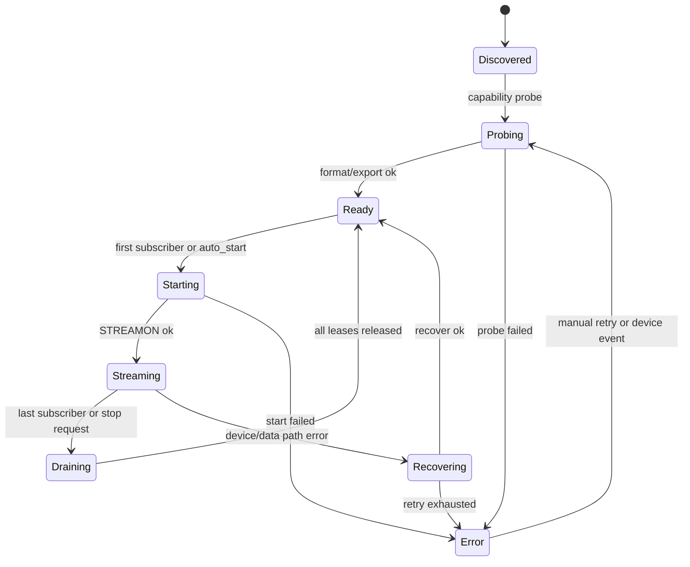

# 多路摄像头架构纠偏

**文档版本:** v0.1 
**最后更新:** 2026-05-08 
**适用范围:** CameraSubsystem 同时接入 USB/UVC 与 MIPI/RKISP 多路摄像头的目标架构、当前偏差、迁移顺序和验收口径 
**关联文档:** [README.md](../README.md)、[ARCHITECTURE_REVIEW.md](ARCHITECTURE_REVIEW.md)、[DMA_BUF_ZERO_COPY_ARCHITECTURE.md](DMA_BUF_ZERO_COPY_ARCHITECTURE.md)、[CODEC_SERVER_ARCHITECTURE.md](CODEC_SERVER_ARCHITECTURE.md)、[IMPLEMENTATION_STATUS.md](../IMPLEMENTATION_STATUS.md)

> **文档硬规范**
>
> - 本项目的系统架构图、模块框图、部署拓扑图、数据路径框图和工程结构框图必须使用 `architecture-diagram` skill 生成独立 HTML / inline SVG 图表产物；每个 HTML 图必须同步导出同名 `.svg`，Markdown 中默认直接显示 SVG，并附完整 HTML 图表链接。
> - 时序图、状态机图、纯目录结构图等仍使用 Mermaid fenced code block（语言标识为 `mermaid`）。
> - 禁止新增 ASCII art/text 框图；普通日志、命令输出、代码片段按其原始语言使用 fenced code block。
> - 每份项目文档必须在文档元信息和硬规范之后维护 `## 目录`，目录至少覆盖二级标题，并使用相对链接或页内锚点。
> - `README.md` 是团队入口文档，开头必须维护工程结构概览、项目文档索引和常用入口链接。
> - 评审建议、风险、ARCH-* 跟踪项只维护在 [ARCHITECTURE_REVIEW.md](ARCHITECTURE_REVIEW.md)，其他文档只链接引用，避免重复漂移。

---

## 目录

- [1. 纠偏目标](#1-纠偏目标)
- [2. 当前严重偏离](#2-当前严重偏离)
- [3. 目标架构原则](#3-目标架构原则)
- [4. 核心对象模型](#4-核心对象模型)
- [5. 进程与生命周期模型](#5-进程与生命周期模型)
- [6. 数据面与 release 纠偏](#6-数据面与-release-纠偏)
- [7. 编码录制纠偏](#7-编码录制纠偏)
- [8. Web 与运维纠偏](#8-web-与运维纠偏)
- [9. 分阶段迁移计划](#9-分阶段迁移计划)
- [10. 验收标准](#10-验收标准)

---

## 1. 纠偏目标

最终目标不是“能切换不同摄像头”，而是 **同一套 CameraSubsystem 运行时可以同时管理多路摄像头**：

1. USB/UVC 摄像头和 MIPI/RKISP sensor 可以同时存在、同时启动、同时被订阅。
2. 任意一路摄像头的启动、停止、掉线、慢消费者、录制失败不能影响其他路。
3. 控制面、数据面、ReleaseFrame、录制、Web 预览和 metrics 都以稳定流身份路由，不依赖临时字符串或单个全局 `CameraSource`。
4. USB 首阶段可以继续走 copy/JPEG/MJPEG 路径；MIPI/RKISP 优先走 MPLANE + DMA-BUF + DataPlaneV2 + MPP/RGA/RKNN import 的低拷贝路径。

本次文档只做架构纠偏，不改代码。后续代码开发必须按本文先修正身份模型和运行时边界，再继续扩展 MIPI live、DataPlaneV2 低拷贝录制或多路 Web UI。

## 2. 当前严重偏离

| 优先级 | 偏离项 | 当前风险 | 纠偏方向 |
|--------|--------|----------|----------|
| P0 | `camera_publisher_example` 运行时只有一个全局 `CameraSource` | 新订阅一路 endpoint 会 stop/reinit 当前源，天然不能同时采集多路 | publisher 运行时改为 `stream_id -> CameraStreamRuntime` 映射 |
| P0 | `CameraSource` 产出的帧身份仍有单路假设 | frame / descriptor 无法稳定表达真实 camera/stream 身份，多路后会路由错乱 | 所有帧必须携带 `CameraStreamIdentity` 派生出的 `stream_id` 与 numeric `camera_id` |
| P0 | DataPlaneV2 publisher 侧部分 pending lease 只按 `frame_id` 管理 | 多路同时出帧时 `frame_id` 可能碰撞，release 可能释放错误 lease | pending/release key 统一为 `(stream_id, frame_id, buffer_id, consumer_id)` |
| P0 | `camera_codec_server` 的 `RecordingSessionManager` 是单 session 模型 | 只能录一路；第二路录制会覆盖状态、writer 和统计 | 改为 `stream_id -> RecordingSession`，每路独立 writer、encoder、状态 |
| P1 | stream identity 命名混乱 | 文档和示例里同时存在 `usb_camera_0`、`0`、numeric `camera_id` | 引入稳定命名规范，禁止业务层直接拼临时流 ID |
| P1 | Web/gateway 与板端脚本默认单 device/single stream | 适合 smoke，不适合生产多路部署 | smoke 保留单路默认，生产配置显式声明多 stream topology |
| P1 | `CameraSessionManager` 数据模型强于 app 实现 | `CameraEndpoint` 可表达多 endpoint，但 publisher app 没有多 runtime 承接 | 保留 session model，先改 app 层运行时，再决定是否下沉为库 |

## 3. 目标架构原则

1. **身份先行**：任何跨模块对象都必须先能回答“这是哪一路流”。`frame_id` 只在某一路流内有序，不允许作为全局唯一键。
2. **一路一个运行时**：每个物理摄像头或平台输出流对应一个 `CameraStreamRuntime`，包含采集源、分发器、数据面客户端集合、release tracker、统计和状态机。
3. **publisher 是多流容器**：核心 publisher 进程可以拥有多路 runtime；不要用多个互相不知道的单路 publisher 拼生产系统。
4. **失败隔离**：一路设备初始化失败、DQBUF 失败、release 超时或 codec 失败，只改变该路 stream 状态，不触发其他 stream stop。
5. **USB 与 MIPI 分层处理**：USB 可以以 MJPEG/YUYV copy 路径作为调试和兼容输入；MIPI/RKISP 不做错误的多平面摊平 fallback，优先保证 descriptor、fd 和 release 语义正确。

## 4. 核心对象模型

建议以 `CameraStreamIdentity` 作为跨模块身份源，后续可从 `CameraEndpoint` 派生或合并：

| 字段 | 说明 |
|------|------|
| `stream_id` | 对外稳定字符串 ID，例如 `usb0`, `mipi0_main`, `mipi0_isp`, `mipi1_raw` |
| `camera_id` | 进程内 numeric ID，用于紧凑协议字段和旧接口兼容；不能单独作为业务唯一 ID |
| `bus_type` | `usb` / `mipi` / `virtual` / `file` |
| `bus_index` | 同类总线下的稳定序号 |
| `device_path` | 当前 Linux 设备节点，例如 `/dev/video45` |
| `role` | `main` / `sub` / `raw` / `isp` / `codec` 等角色 |
| `pixel_format` | 当前输出格式，USB 常见 MJPEG/YUYV，MIPI 常见 NV12/NV16 |
| `memory_type` | `mmap_copy` / `dmabuf` / `shm` |

多路运行时关系先用结构化对象约束表达，后续如果需要完整模块图，应按项目文档硬规范使用 `architecture-diagram` skill 生成 HTML/SVG 产物。

| 层级 | 目标对象 | 说明 |
|------|----------|------|
| 配置层 | `CameraTopologyConfig` | 声明 USB/MIPI/virtual 等 stream 列表、设备节点、格式、io method 和启动策略 |
| 注册层 | `CameraRegistry` | 负责把配置、探测结果和稳定 `CameraStreamIdentity` 绑定 |
| 运行时层 | `CameraStreamRuntime` | 每一路 stream 独立持有采集源、数据面客户端、release tracker、统计和状态 |
| 采集层 | `CameraSource` / 后续 backend | USB 使用 single-planar 路径；MIPI/RKISP 使用 MPLANE 路径 |
| 消费层 | Web / Codec / AI subscriber | 按 `stream_id` 订阅一路或多路流 |

`CameraTopologyConfig` 是后续生产配置入口，至少描述 stream identity、设备节点、期望格式、io method、是否自动启动和允许的 consumer 类型。USB-only smoke 可以继续通过命令行单 `--device` 生成默认 topology，但生产模式不应依赖隐式默认流。

## 5. 进程与生命周期模型

目标进程模型：

1. 一个 `camera_publisher` 进程管理多路 `CameraStreamRuntime`。
2. control socket 负责订阅、退订、能力查询、stream list 和状态查询。
3. data socket 可以先保持单 socket multiplex，多路用 descriptor 中的 `stream_id` 区分；如后续性能需要，再扩展 per-stream data socket。
4. release socket 也可以先保持单 socket multiplex，但 release key 必须包含 `stream_id`。
5. `camera_codec_server`、Web gateway、AI 进程都作为订阅端按 `stream_id` 选择一路或多路流。

单路生命周期必须独立：

关键约束：

1. lifecycle lock 只能保护本 stream 状态，不能让一路 start/stop 阻塞全局订阅管理。
2. publisher 退出时按 stream 做 drain，release timeout 后逐路 reclaim，最后统一清理 socket。
3. 同一路的 slow consumer 不能阻塞该路正常 consumer；一路的 lease exhausted 不能影响其他路。

## 6. 数据面与 release 纠偏

DataPlaneV2 已具备 `FrameDescriptor + SCM_RIGHTS + ReleaseFrame` 基础能力，但多路化前必须修正键值边界：

| 对象 | 当前多路风险 | 目标键值 |
|------|--------------|----------|
| Frame descriptor | `stream_id` 语义不稳定时无法路由 | `stream_id + camera_id + frame_id + buffer_id` |
| publisher pending lease | 只按 `frame_id` 会跨流碰撞 | `stream_id + frame_id + buffer_id + consumer_id` |
| ReleaseFrame | release 到错误 stream 会提前 QBUF | `stream_id + frame_id + buffer_id + consumer_id + status` |
| metrics | 单 counter 无法定位是哪一路异常 | 所有计数加 `stream_id` 标签 |
| log | 现场排障无法区分 USB/MIPI | 采集、发送、release、codec 日志都带 `stream_id` |

DataPlaneV2 多路化的第一原则是 **不改变 fd 生命周期语义，只扩大路由键**。消费者收到 fd 后仍负责关闭本进程 fd，并通过 release channel 显式归还；生产端仍由 lease/release tracker 决定何时 QBUF。

## 7. 编码录制纠偏

`camera_codec_server` 当前已经能完成 USB MJPEG -> H.264/MP4 的首路闭环，但多路目标下不能继续保持单 `RecordingSessionManager` 状态。

目标模型：

1. `RecordingSessionManager` 管理 `stream_id -> RecordingSession`。
2. 每个 `RecordingSession` 独立持有 subscriber、decoder/importer、encoder、writer、统计和错误状态。
3. 同一个 codec server 可以录多路；也允许配置最大并发路数，超出时返回明确错误。
4. MP4 writer、raw H.264 writer、后续分段 writer 都只属于单 session。
5. MIPI/RKISP 低拷贝录制必须以 DataPlaneV2 descriptor 和 MPP import 契约为入口，不从 Web gateway 或 publisher 直接取私有 fd。

## 8. Web 与运维纠偏

Web Preview 和板端脚本当前以单路调试为主，这个阶段是合理的，但生产多路化需要补以下能力：

1. `streams` API 返回完整 stream list、状态、格式、fps、memory type、recording capability。
2. 前端状态 store 以 `stream_id` 为一级 key，不能把录制状态、帧率、错误提示写成单全局状态。
3. WebSocket frame event 必须携带 `stream_id`，浏览器只渲染当前选中的流或多画面布局。
4. 板端 smoke 保留 `DEVICE=/dev/video45` 快速入口，同时新增 topology 配置 smoke，覆盖 USB + MIPI 同时启动。
5. 现场日志目录按 stream 分组，至少能快速定位 `usb0`、`mipi0_main` 的 publisher/data/release/codec 日志。

## 9. 分阶段迁移计划

| 阶段 | 优先级 | 任务 | 验收口径 |
|------|--------|------|----------|
| M0 | P0 | 文档与架构纠偏 | 本文、README、实现状态、架构评审、DMA-BUF/Codec 文档引用一致 |
| M1 | P0 | 引入 `CameraStreamIdentity` 与 stream 命名规范 | 已完成基础贯通：`CameraEndpoint`、`CameraSessionManager`、`CameraSource`、`FrameDescriptor`、DataPlaneV2 descriptor 和关键日志已携带稳定 `stream_id` |
| M2 | P0 | publisher 改为 `stream_id -> CameraStreamRuntime` | 已完成第一刀：publisher 示例已使用 runtime map，两个 stream 不再共享同一个全局 `CameraSource`；多路 release key 仍归 M3 |
| M3 | P0 | DataPlaneV2/release key 多路化 | 已完成：publisher pending lease 使用 stream/frame/buffer key，ReleaseFrame tracker 以 stream/frame/buffer 隔离并跟踪 consumer release set |
| M4 | P1 | codec server 多 `RecordingSession` | 已完成第一阶段：`RecordingSessionManager` 使用 `stream_id -> RecordingSession`，同一进程可同时管理多路录制状态，单路 stop 不影响其他路 |
| M5 | P1 | Web/gateway 多 stream 状态 | 已完成设计入口：短期采用 sideband status 映射 `stream_index -> stream_id`，避免立即破坏 WebFrameHeader V1；下一步实现 W1-W2 |
| M6 | P1 | USB + MIPI 板端联合 smoke | USB live + MIPI live 或 MIPI probe 同时运行，互不影响 |
| M7 | P2 | MIPI DataPlaneV2 -> MPP 低拷贝录制 | NV12 DMA-BUF descriptor import 编码，并完成 release 闭环 |

阶段 M1-M3 是真正的架构纠偏主线。MIPI live、低拷贝录制、多路 Web UI 都不应绕过这三步直接实现，否则会把单路假设继续固化到更多模块里。

## 10. 验收标准

多路摄像头架构纠偏完成时，至少满足：

1. 单 publisher 进程中可以配置两路以上 stream，启动一路不会 stop 另一路。
2. 所有 frame、descriptor、release、record status、Web event、metrics 和关键日志都能追溯到稳定 `stream_id`；WebFrameHeader V1 的 numeric stream index 必须能通过 status 映射回字符串身份。
3. DataPlaneV2 pending lease 不存在跨 stream `frame_id` 碰撞风险。
4. codec server 能表达多路 session 状态，即使实际并发路数受硬件能力限制也要返回明确错误。
5. USB copy path 和 MIPI MPLANE/DMA-BUF path 可以共存于同一 topology。
6. 板端 smoke 至少覆盖 USB 单路、MIPI probe-only、USB + MIPI probe 同时存在三类场景。
