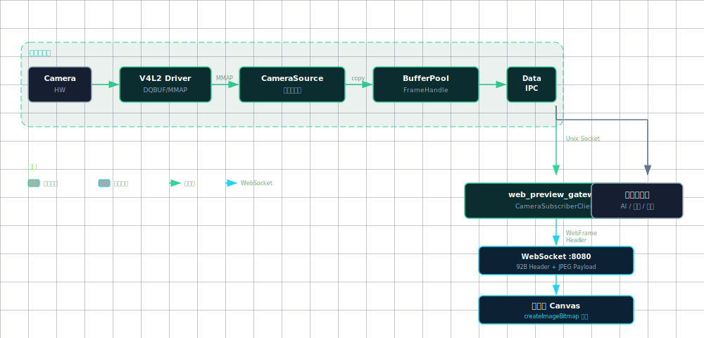

# CameraSubsystem 项目概览

**最后更新:** 2026-04-26

> **文档硬规范**
>
> - 本项目的系统架构图、模块框图、部署拓扑图、数据路径框图和工程结构框图必须使用 `architecture-diagram` skill 生成独立 HTML / inline SVG 图表产物；每个 HTML 图必须同步导出同名 `.svg`，Markdown 中默认直接显示 SVG，并附完整 HTML 图表链接。
> - 时序图、状态机图、纯目录结构图等仍使用 Mermaid fenced code block（语言标识为 `mermaid`）。
> - 禁止新增 ASCII art/text 框图；普通日志、命令输出、代码片段按其原始语言使用 fenced code block。
> - 每份项目文档必须在文档元信息和硬规范之后维护 `## 目录`，目录至少覆盖二级标题，并使用相对链接或页内锚点。
> - `README.md` 是团队入口文档，开头必须维护工程结构概览、项目文档索引和常用入口链接。
> - 评审建议、风险、ARCH-* 跟踪项只维护在 [ARCHITECTURE_REVIEW.md](ARCHITECTURE_REVIEW.md)，其他文档只链接引用，避免重复漂移。

## 目录

- [项目简介](#项目简介)
- [核心特性](#核心特性)
- [系统架构](#系统架构)
- [技术栈](#技术栈)
- [性能指标](#性能指标)
- [适用场景](#适用场景)
- [编码规范](#编码规范)
- [项目状态](#项目状态)
- [快速开始](#快速开始)
- [贡献指南](#贡献指南)
- [许可证](#许可证)
- [联系方式](#联系方式)
- [致谢](#致谢)

## 项目简介

CameraSubsystem 是一个面向边缘视觉应用的通用 Camera 数据流基座。它作为 AI 推理、视频编码、预览显示等上层应用的统一数据来源，当前已形成采集后端适配、BufferPool 生命周期治理、发布端/订阅端双进程示例和交叉编译链路；DMA-BUF Phase 1 已接入基础帧描述、lease 和 V4L2 export 尝试路径，生产级跨进程零拷贝数据面仍是下一阶段目标。

项目不把架构绑定到单一 SoC 或单一采集 API。当前实现以 Linux V4L2/MMAP 后端和 RK3576 / Debian 板端验证为基线，后续可继续扩展 Android Camera HAL、厂商媒体栈、USB/UVC、MIPI/CSI 多平面链路或其他平台私有后端。

本文档只描述项目定位、能力边界、技术栈和快速开始。架构评审建议统一维护在 [ARCHITECTURE_REVIEW.md](ARCHITECTURE_REVIEW.md)，DMA-BUF 零拷贝主链路设计维护在 [DMA_BUF_ZERO_COPY_ARCHITECTURE.md](DMA_BUF_ZERO_COPY_ARCHITECTURE.md)，接口细节统一维护在 [../API_REFERENCE.md](../API_REFERENCE.md)。

## 核心特性

### 性能特性

- **当前链路**: 已落地 Linux V4L2/MMAP 后端，默认采集后拷贝到 BufferPool，适合本机与板端初期联调。
- **DMA-BUF Phase 1**: 已新增 `FrameDescriptor` / `FrameLease` / V4L2 `VIDIOC_EXPBUF` 尝试路径；驱动不支持时自动保留 copy fallback。
- **生产目标**: 后续打通跨进程 DMA-BUF fd 传递或共享内存数据面，降低 CPU 拷贝成本。
- **调度基础**: 已具备线程池分发、Buffer 复用和基础丢帧保护。
- **指标口径**: 4K 高帧率、端到端延迟、内存占用等指标需要按具体平台和采集后端实测。

### 并发能力

- **多 Camera 支持**: 支持多路 Camera 并行采集（路数由平台能力决定）
- **多订阅者**: 支持多个订阅者同时消费同一帧数据
- **线程池调度**: 动态扩展的线程池，支持 CPU 核心数自适应

### 稳定性

- **RAII 资源管理**: 严格的资源管理，杜绝资源泄漏
- **线程安全**: 完善的同步机制，避免死锁和竞态条件
- **错误恢复**: 已有基础错误处理，设备断连恢复仍待完善
- **长期运行**: 已具备压力测试入口，7x24 稳定性仍待板端验证

### 可维护性

- **跨平台抽象**: 核心逻辑与平台 API 解耦
- **模块化设计**: 支持插件式扩展
- **完善日志**: 分级日志系统，便于问题排查
- **规范编码**: 遵循工业级编码规范

## 系统架构

### 分层架构


[打开完整 HTML 图表](images/system-architecture.html)

### 数据流向



[打开完整 HTML 图表](images/data-path.html)

### 发布端/订阅端解耦架构调整

当前项目增加发布端/订阅端解耦演进方向，满足“唯一核心发布端直连采集后端 + 多子发布端/订阅端”的业务场景：

1. 核心发布端实例 `camera_publisher_core` 统一管理摄像头与分发，并独占设备访问。
2. 子发布端实例 `camera_sub_publisher`（可选）作为核心发布端的订阅者，执行编解码/转封装后可再发布。
3. 一个或多个纯订阅端实例 `camera_subscriber` 独立接入业务处理。
4. 某路 Camera 仅在存在订阅时启动采集，无订阅时停止并释放资源。

典型用户故事（开发阶段示例）：

1. 示例使用 1 个核心发布端 + 1 个订阅端做联调。
2. 订阅端收到一帧后 `sleep 5ms` 模拟上层处理。
3. 订阅端每 1 秒保存 1 张图片。
4. 最多保留 10 张，槽位 `0~9` 循环覆盖。

实际场景中，可以有多个子发布端和多个订阅端并发订阅同一路或多路 Camera。

示例程序（双进程）：

1. 核心发布端：`bin/camera_publisher_example`
2. 订阅端：`bin/camera_subscriber_example`

启动步骤：

1. 先启动发布端（终端 1）：

```bash
./bin/camera_publisher_example
```

2. 再启动订阅端（终端 2）：

```bash
./bin/camera_subscriber_example
```

3. 两端默认无限运行，按 `Ctrl+C` 退出（`SIGINT/SIGTERM` 优雅退出）。

参数说明：

1. 发布端：

```bash
./bin/camera_publisher_example [device_path] [control_socket] [data_socket]
```

- `device_path`：默认 `CAMERA_SUBSYSTEM_DEFAULT_CAMERA`（通常 `/dev/video0`）
- `control_socket`：默认 `/tmp/camera_subsystem_control.sock`
- `data_socket`：默认 `/tmp/camera_subsystem_data.sock`

2. 订阅端：

```bash
./bin/camera_subscriber_example [output_dir] [control_socket] [data_socket] [device_path]
```

- `output_dir`：默认 `./subscriber_frames`
- `control_socket`：默认 `/tmp/camera_subsystem_control.sock`
- `data_socket`：默认 `/tmp/camera_subsystem_data.sock`
- `device_path`：默认 `CAMERA_SUBSYSTEM_DEFAULT_CAMERA`（通常 `/dev/video0`）

运行期输出：

1. 发布端每秒打印：`sec | frames | fps | clients | sent_bytes | send_fail`
2. 订阅端每秒打印：`sec | frames | fps | received_bytes | save_fail | image`
3. 订阅端每秒保存 1 张图片，槽位 `0~9` 循环覆盖。

故障排查：

1. `connect control socket failed` / `connect data socket failed`：
   确认发布端已启动并运行，且控制面与数据面 socket 路径参数一致。
2. Camera 打开失败（如 `/dev/video0`）：
   检查设备节点 `ls /dev/video0` 与用户权限（`video` 组），必要时用 `sudo` 验证。
3. socket bind 失败（Address already in use）：
   清理残留 socket 文件后重试：

```bash
rm -f /tmp/camera_subsystem_control.sock /tmp/camera_subsystem_data.sock
```

4. 订阅端无图或 `save_fail` 增长：
   检查输出目录写权限，并先用 `camera_source_stress_test` 验证采集链路。

协议协定（规划）：

1. 公共头文件：`include/camera_subsystem/ipc/camera_channel_contract.h`
2. 默认设备宏：`CAMERA_SUBSYSTEM_DEFAULT_CAMERA`（默认 `/dev/video0`）
3. 支持可扩展 Camera 类型：默认、MIPI、USB、平台私有类型。

### 核心组件

#### 1. CameraSource

- **职责**: 负责 Camera 设备的初始化、参数配置、流控及原始帧数据的捕获
- **特性**: 已落地 V4L2/MMAP 采集后端、Buffer 预分配与复用、RK3576 交叉编译适配；DMA-BUF 单 fd export 基础路径已接入，板端能力验证、多平面、其他采集后端、设备热插拔恢复待完善

#### 2. FrameBroker

- **职责**: 系统中枢，管理订阅关系，将帧数据分发给所有订阅者
- **特性**: 线程池调度、弱引用管理、优先级队列、订阅过滤

#### 3. FrameHandle

- **职责**: 帧数据的元数据描述符，包含内存句柄而非数据指针
- **特性**: C 风格 POD 结构，预留 Stride、多平面和零拷贝句柄扩展

#### 4. PlatformLayer

- **职责**: 封装操作系统相关接口（Epoll, Thread, Log）
- **特性**: 跨平台适配、统一错误码、资源抽象

## 技术栈

### 开发语言

- **C++17**: 框架层，提供面向对象和现代 C++ 特性
- **C (POD)**: 数据层，确保跨语言兼容性，并为后续零拷贝句柄传递预留接口形态

### 核心依赖

- **spdlog**: 高性能 C++ 日志库
- **pthread**: POSIX 线程库
- **V4L2**: Linux 视频设备驱动接口

### 测试框架

- **Google Test**: C++ 单元测试框架

### 构建工具

- **CMake**: 跨平台构建系统

## 性能指标

以下是生产化目标口径，不是当前实现的板端实测结论。当前事实以 [../IMPLEMENTATION_STATUS.md](../IMPLEMENTATION_STATUS.md) 和 [ARCHITECTURE_REVIEW.md](ARCHITECTURE_REVIEW.md) 为准。

### 吞吐量

- 目标支持 4K@60fps 稳定采集
- 目标支持多路并发采集（具体路数由平台媒体栈、内存带宽和业务负载决定）
- 目标支持多订阅者同时消费同一路 Camera 数据

### 延迟

- 目标端到端延迟 < 10ms (4K@30fps)
- 目标采集延迟 < 2ms
- 目标分发延迟 < 3ms

### 资源占用

- 目标单路 4K@30fps 内存占用 < 100MB
- 目标 CPU 占用率 < 30% (单核)
- 长时间运行不得出现 Buffer 泄漏

### 稳定性

- 目标支持 7x24 小时稳定运行
- 目标 MTBF > 10000 小时
- 目标支持设备热插拔恢复

## 适用场景

### 包含的功能

- Camera 设备管理（设备发现、打开、配置、关闭）
- 采集后端流控（当前 V4L2 后端已覆盖格式协商、Buffer 管理、流控制）
- 帧数据封装（FrameHandle 构建、元数据管理）
- 进程内高性能分发（发布订阅、任务队列、线程池）
- 线程池管理（任务调度、负载均衡）
- 平台抽象层（Epoll、Thread、Log 跨平台封装）

### 不包含的功能

- 具体的 AI 算法实现
- 音视频编码协议实现（如 H.264/H.265 编码器内部逻辑）
- 跨进程通信（IPC）机制
- UI 渲染逻辑
- 网络传输协议

## 编码规范

### 命名规范

- **类名**: 大驼峰 (PascalCase) - 例如: `CameraSource`, `FrameBroker`
- **函数名**: 大驼峰 (PascalCase) - 例如: `StartStreaming()`, `Publish()`
- **成员变量**: 小写 + 下划线后缀 - 例如: `device_fd_`, `is_running_`
- **局部变量**: 小写 + 下划线 - 例如: `frame_count`, `buffer_ptr`
- **常量**: k 前缀 + 大驼峰 - 例如: `kMaxBufferCount = 4`

### 代码格式

- **缩进**: 4 个空格
- **大括号**: 独立占一行
- **行宽**: 不超过 100 字符
- **空行**: 函数之间空 2 行，逻辑块之间空 1 行

### 注释规范

- 使用 Doxygen 风格注释
- 文件头注释：包含文件名、简介、作者、日期
- 类注释：描述类的职责和用途
- 函数注释：包含参数说明、返回值、注意事项

## 项目状态

### 当前版本

- **版本号**: v0.2
- **状态**: 开发中
- **完成度**: 约 80%

### 已完成模块

- ✅ 核心数据结构设计
- ✅ 平台抽象层实现
- ✅ 分发层实现（FrameBroker）
- ✅ 信号处理工具（utils/signal_handler）
- ✅ CameraSource（当前已落地 V4L2 + MMAP 采集后端）
- ✅ BufferPool（统一生命周期与复用池，拷贝模式）
- ✅ Buffer 生命周期治理（BufferGuard / BufferState / 泄漏检测）
- ✅ CameraSessionManager（按订阅引用计数启停）
- ✅ 控制面 IPC（CameraControlServer/Client）
- ✅ 数据面 IPC（示例协议与双进程收发链路）
- ✅ DMA-BUF Phase 1 基础模型（FrameDescriptor / FrameLease / DmaBufFrameLease）
- ✅ 构建系统配置
- ✅ RK3576 官方工具链交叉编译入口（`cmake/toolchains/rk3576.cmake` / `scripts/build-rk3576.sh`）
- ✅ 单元测试框架
- ✅ 压测程序（PlatformLayer / FrameBroker / CameraSource）
- ✅ 双进程示例程序（`camera_publisher_example` / `camera_subscriber_example`）

### 进行中模块

- 🚧 CameraSource 高级能力（RK3576 DMA-BUF 板端验证 / 多平面 / cache sync）
- 🚧 背压策略完善（延迟阈值 / DropPolicy 参数化）
- 🚧 设备恢复机制（自动重连 / 降级策略）

### 计划中模块

- ⏳ 工具类实现
- ⏳ 集成测试
- ⏳ 性能测试
- ⏳ 统一指标与观测接口（Metrics/Tracing）

### 架构评审与详细设计入口

本文档不维护 ARCH-* 明细和风险优先级，只保留项目状态摘要。详细内容按职责分流：

| 阅读目标 | 入口 |
|----------|------|
| 查看系统/代码架构评审、风险和 ARCH-* 跟踪 | [ARCHITECTURE_REVIEW.md](ARCHITECTURE_REVIEW.md) |
| 查看完整架构设计长文和历史设计语境 | [../structure.md](../structure.md) |
| 查询公开接口、数据结构和 IPC 协议 | [../API_REFERENCE.md](../API_REFERENCE.md) |
| 查看模块完成度、测试状态和下一步计划 | [../IMPLEMENTATION_STATUS.md](../IMPLEMENTATION_STATUS.md) |

## 快速开始

### 环境要求

- Ubuntu 18.04+ / Debian 10+
- GCC 7.0+ (支持 C++17)
- CMake 3.10+
- spdlog（推荐以 third_party 方式集成）
- Google Test（推荐以 third_party/googletest 方式集成）

### spdlog 安装与集成（推荐）

本项目的 CMake 已支持以下优先级：

1. `find_package(spdlog CONFIG)`（系统已安装时）
2. `third_party/spdlog`（推荐）
3. `third_party/spdlog_stub`（仅兜底）

推荐将 spdlog 作为子模块放入 `third_party/spdlog`：

```bash
# 在仓库根目录执行
git submodule add https://github.com/gabime/spdlog.git third_party/spdlog
git submodule update --init --recursive
```

可选方案（系统安装，适合 CI / 统一环境）：

```bash
sudo apt-get update
sudo apt-get install -y libspdlog-dev
```

完成上述任一方式后，直接构建即可：

```bash
rm -rf build
./scripts/build.sh
```

### Google Test 安装与配置（推荐）

本项目的 CMake 已支持以下优先级：

1. `find_package(GTest CONFIG)`（系统已安装时）
2. `third_party/googletest`（推荐）
3. 未找到时跳过测试目标（不影响库构建）

推荐将 googletest 作为子模块放入 `third_party/googletest`：

```bash
# 在仓库根目录执行
git submodule add https://github.com/google/googletest.git third_party/googletest
git submodule update --init --recursive
```

可选方案（系统安装，适合 CI / 统一环境）：

```bash
sudo apt-get update
sudo apt-get install -y libgtest-dev
```

### 边缘设备与交叉编译

当前已接入 RK3576 / Debian 交叉编译示例，使用 Luckfox Omni3576 SDK 自带 GCC 10.3 aarch64 工具链：

- Toolchain 文件：`cmake/toolchains/rk3576.cmake`
- 构建脚本：`scripts/build-rk3576.sh`
- SDK 默认路径：`../Omni3576-sdk`，可用 `OMNI3576_SDK_ROOT` 覆盖
- 运行产物：`bin/rk3576/camera_publisher_example` 与 `bin/rk3576/camera_subscriber_example`
- 交叉构建默认关闭单元测试与宿主机系统依赖查找，避免误链接 x86_64 包

完成配置后，建议全量重新构建并执行测试：

```bash
rm -rf build
./scripts/build.sh
cd build
ctest --output-on-failure
```

交叉编译示例（RK3576）：

```bash
./scripts/build-rk3576.sh
```

### 编译步骤

```bash

# 克隆仓库

git clone https://github.com/SuycxZMZ/CameraSubsystem.git
cd CameraSubsystem

# 编译项目

./scripts/build.sh

# 运行测试（需已配置 Google Test）

cd build
ctest --output-on-failure
```

### 使用示例

推荐直接使用当前双进程示例进行联调验证：

```bash
# 终端 1：核心发布端（默认 /dev/video0）
./bin/camera_publisher_example
```

```bash
# 终端 2：订阅端（默认输出目录 ./subscriber_frames）
./bin/camera_subscriber_example
```

可选参数：

```bash
./bin/camera_publisher_example [device_path] [control_socket] [data_socket]
./bin/camera_subscriber_example [output_dir] [control_socket] [data_socket] [device_path]
./bin/camera_subscriber_example subscriber_frames /tmp/camera_subsystem_control.sock /tmp/camera_subsystem_data.sock /dev/videoX
```

运行行为：

- 两端默认无限运行，按 `Ctrl+C` 退出
- 订阅端每秒打印统计并保存 1 张图片（最多 10 张循环覆盖）
- 默认设备宏：`CAMERA_SUBSYSTEM_DEFAULT_CAMERA`（默认值 `/dev/video0`）

## 贡献指南

我们欢迎所有形式的贡献！请遵循以下步骤：

1. Fork 本仓库
2. 创建特性分支 (`git checkout -b feature/AmazingFeature`)
3. 提交更改 (`git commit -m 'Add some AmazingFeature'`)
4. 推送到分支 (`git push origin feature/AmazingFeature`)
5. 开启 Pull Request

### 代码规范

- 遵循项目的编码规范（详见 NAMING_CONVENTION.md）
- 添加适当的单元测试
- 更新相关文档
- 确保所有测试通过

## 许可证

本项目采用 MIT 许可证。详见 LICENSE 文件。

## 联系方式

- **项目维护者**: CameraSubsystem Team
- **问题反馈**: [GitHub Issues](https://github.com/yourusername/CameraSubsystem/issues)
- **文档**: [项目文档](https://github.com/yourusername/CameraSubsystem/tree/main/docs)

## 致谢

感谢所有为本项目做出贡献的开发者！

---

**最后更新**: 2026-02-03
**文档版本**: v0.1
