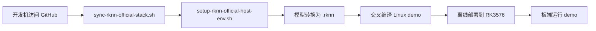

# RK3576 官方 RKNN 新栈接入指南

**最后更新:** 2026-05-17  
**适用范围:** 在不覆盖 `Omni3576-sdk` 现有 `2.0.0b0` 基线的前提下，并行接入 Rockchip 官方最新 `rknn-toolkit2` / `rknn_model_zoo`；`rknn-llm` 只作为未来可选扩展保留记录  
**当前目标:** 以官方 `yolo11` 示例打通 host 同步、模型转换、交叉编译和板端离线运行闭环；当前该闭环已完成

---

## 目录

- [1. 为什么要并行引入官方新栈](#1-为什么要并行引入官方新栈)
- [2. 当前边界](#2-当前边界)
- [3. 目录与脚本入口](#3-目录与脚本入口)
- [4. 推荐工作流](#4-推荐工作流)
- [5. 当前默认示例：yolo11](#5-当前默认示例yolo11)
- [6. 与旧 SDK 基线的关系](#6-与旧-sdk-基线的关系)
- [7. 已知风险与后续计划](#7-已知风险与后续计划)
- [8. 当前实测结果](#8-当前实测结果)

---

## 1. 为什么要并行引入官方新栈

当前 `Omni3576-sdk` 自带 RKNN 链路已经证明了 RK3576 板端 NPU 基本可用，但它的 user-space AI 栈明显偏老：

1. 当前板端基线实际验证的是 `librknnrt 2.0.0b0`
2. 当前 SDK 自带 host toolkit wheel 只覆盖旧 Python 版本
3. 后续如果要接更现代的检测模型，继续围绕 `2.0.0b0` 打补丁没有工程价值

因此这里采用的策略不是“覆盖旧 SDK”，而是：

1. **保留旧 SDK 基线**，继续作为回退路径
2. **并行拉起官方最新 AI 栈**
3. **主机联网、板端离线部署**
4. **先验证 CV 新栈；`rknn-llm` 不纳入当前主线**

---

## 2. 当前边界

当前文档和脚本只解决下面这条闭环：



明确不做的事：

1. 不直接改写 `Omni3576-sdk/external/rknpu2`
2. 不要求板端访问 GitHub
3. 不在这一轮接入 CameraSubsystem 主链路里的 AI 订阅端
4. 不把未来可能引入的 `rknn-llm` 和普通视觉 demo 混在同一条运行链路中

---

## 3. 目录与脚本入口

| 路径 | 作用 |
|------|------|
| `scripts/sync-rknn-official-stack.sh` | 主机侧同步官方最新 `rknn-toolkit2` / `rknn_model_zoo`；`rknn-llm` 仅在显式开启时同步 |
| `scripts/setup-rknn-official-host-env.sh` | 主机侧建立 RKNN 官方新栈 venv，不使用 conda |
| `scripts/rk3576-rknn-official-demo.sh` | 主机侧一键完成 sync / host-env / convert / build / deploy / run |
| `../official-ai-latest/` | 默认官方镜像目录，位于 `CameraSubsystem` 同级目录 |
| `logs/rknn_official_yolo11/` | 默认板端运行日志与结果拉回目录 |

---

## 4. 推荐工作流

### 4.1 只同步官方最新栈

```bash
./scripts/sync-rknn-official-stack.sh
```

默认会同步：

1. `airockchip/rknn-toolkit2`
2. `airockchip/rknn_model_zoo`
3. `airockchip/rknn-llm`（仅在 `SYNC_RKNN_LLM=1` 时同步）

脚本行为：

1. 通过 GitHub Releases API 获取最新 release tag
2. 下载对应 tag 的源码压缩包
3. 解压到 `../official-ai-latest/`
4. 在每个目录下写入 `.camera_subsystem_sync_meta`

如果 GitHub API 或代理环境不稳定，可以直接在环境变量里钉住版本：

```bash
RKNN_TOOLKIT2_REF=v2.3.2 \
RKNN_MODEL_ZOO_REF=v2.3.2 \
SYNC_RKNN_LLM=1 \
RKNN_LLM_REF=release-v1.2.3 \
./scripts/sync-rknn-official-stack.sh
```

如果命令行环境里已经带了本地代理，但代理进程没启动，`curl` 可能直接报：

```text
Failed to connect to 127.0.0.1:7897
```

这时不要误判成脚本错误，直接按下面二选一处理：

1. 启动正确的本地代理
2. 在直连网络可用时显式关闭代理：

```bash
CURL_EXTRA_ARGS="--noproxy *" ./scripts/sync-rknn-official-stack.sh
```

### 4.2 建立主机侧 venv

```bash
./scripts/setup-rknn-official-host-env.sh
```

该脚本会：

1. 使用当前 `python3` 建立 `.venv-rknn-official`
2. 在同步后的 `rknn-toolkit2` 目录里查找与当前 Python ABI 匹配的 wheel
3. 先以 `--no-deps` 安装官方 `rknn_toolkit2` wheel
4. 再补最小依赖集（`numpy / onnx / onnxruntime / opencv-python / scipy` 等）
5. 默认安装 **CPU 版 `torch`**，避免落到 CUDA 依赖树
6. 如果 `rknn_model_zoo/examples/<demo>/` 下存在 `requirements*.txt`，一并安装

这样做的原因很直接：当前主机只承担模型转换，不承担训练；直接照官方 wheel 的完整依赖树安装，会把 `torch + CUDA` 全家桶拉下来，成本过高。

另外，当前实测 `rknn-toolkit2 2.3.2 + python 3.12` 在 `yolo11` 转换场景下需要把 `onnx` 钉到 `1.16.1`。如果放开到 `1.21.x`，会因为 `onnx.mapping` 接口移除而在 `load_onnx()` 阶段失败。

如需覆盖默认策略：

```bash
# 默认：CPU torch
RKNN_INSTALL_TORCH=cpu ./scripts/setup-rknn-official-host-env.sh

# 完整官方依赖树，不推荐
RKNN_INSTALL_TORCH=full ./scripts/setup-rknn-official-host-env.sh
```

### 4.3 一键跑通默认官方示例

```bash
BOARD_HOST=192.168.31.9 \
BOARD_USER=luckfox \
BOARD_PASSWORD=luckfox \
./scripts/rk3576-rknn-official-demo.sh all
```

该入口顺序执行：

1. `sync`
2. `host-env`
3. `convert`
4. `build`
5. `deploy`
6. `run`

如果你只想分步执行：

```bash
./scripts/rk3576-rknn-official-demo.sh sync
./scripts/rk3576-rknn-official-demo.sh host-env
./scripts/rk3576-rknn-official-demo.sh convert
./scripts/rk3576-rknn-official-demo.sh build
./scripts/rk3576-rknn-official-demo.sh deploy
./scripts/rk3576-rknn-official-demo.sh run
```

---

## 5. 当前默认示例：yolo11

当前默认用 `rknn_model_zoo/examples/yolo11` 作为验证入口，原因很直接：

1. `RK3576` 在官方 `yolo11` 示例支持列表中
2. `convert.py` 已明确支持 `rk3576`
3. 官方 Linux demo 路径清晰，交叉编译脚本统一

默认参数：

| 变量 | 默认值 |
|------|--------|
| `DEMO_NAME` | `yolo11` |
| `MODEL_VARIANT` | `yolo11n` |
| `TARGET_SOC` | `rk3576` |
| `TARGET_ARCH` | `aarch64` |
| `MODEL_DTYPE` | `i8` |

默认转换命令等价于：

```bash
cd ../official-ai-latest/rknn_model_zoo/examples/yolo11/python
python convert.py ../model/yolo11n.onnx rk3576 i8 ../model/yolo11.rknn
```

默认交叉编译命令等价于：

```bash
cd ../official-ai-latest/rknn_model_zoo
export GCC_COMPILER=../Omni3576-sdk/prebuilts/gcc/linux-x86/aarch64/gcc-arm-10.3-2021.07-x86_64-aarch64-none-linux-gnu/bin/aarch64-none-linux-gnu
./build-linux.sh -t rk3576 -a aarch64 -d yolo11 -b Release
```

默认安装输出目录：

```text
../official-ai-latest/rknn_model_zoo/install/rk3576_linux_aarch64/rknn_yolo11_demo/
```

板端默认部署目录：

```text
/home/luckfox/CameraSubsystem/rknn_official_demo/rknn_yolo11_demo/
```

---

## 6. 与旧 SDK 基线的关系

旧 SDK 基线仍然保留，并且职责明确：

| 链路 | 用途 |
|------|------|
| `docs/RKNN_SDK_DEMO_GUIDE.md` + `scripts/rk3576-rknn-demo.sh` | 当前 `2.0.0b0` 基线，证明板端 NPU 和旧 runtime 可用 |
| `docs/RKNN_OFFICIAL_STACK_GUIDE.md` + `scripts/rk3576-rknn-official-demo.sh` | 官方新栈并行入口，验证更现代模型和后续扩展能力 |

这两条链路不能混用：

1. 不要拿旧 `2.0.0b0` runtime 去跑新 model zoo 转出来的模型
2. 不要在没有完成成套验证前，用新 runtime 直接覆盖旧 SDK 目录

---

## 7. 已知风险与后续计划

### 7.1 当前已知风险

1. 当前 Agent 环境里 GitHub tarball 下载链路存在代理/解析不稳定现象，因此脚本已改成“主机侧独立同步入口”，不要把这一步塞进板端
2. `rknn-llm` 与普通检测模型是两条不同路线，后续即使需要引入，也必须单独建文档和脚本，不与 `yolo11` demo 共用闭环
3. `yolo11` 只是当前默认入口，不代表最终模型上限；后续可以替换为官方当时最新且支持 `RK3576` 的检测模型

### 7.2 后续计划

1. 继续保持“主机联网、板端离线部署”的边界，不把 GitHub 访问下放到板端
2. 在官方 model zoo 后续支持更现代模型时，优先替换 `DEMO_NAME` / `MODEL_VARIANT` 验证，不直接污染 CameraSubsystem 主链路
3. 再讨论是否把“官方新 runtime”逐步引入 CameraSubsystem 的 AI 订阅端
4. 大语言模型相关工作不是当前必选项；若未来确有需求，再单独走 `rknn-llm` 路线，不复用本页脚本

## 8. 当前实测结果

当前已经完成下面这条真实链路：

1. 主机侧同步 `rknn-toolkit2 v2.3.2`、`rknn_model_zoo v2.3.2`
2. 主机侧用 `python 3.12` 建立 `.venv-rknn-official`
3. 用 `rknn_model_zoo/examples/yolo11/python/convert.py` 成功将 `yolo11n.onnx` 转为 `yolo11.rknn`
4. 用 `Omni3576-sdk` 交叉编译出 `rknn_yolo11_demo` 与 `rknn_yolo11_demo_zero_copy`
5. 离线部署到 RK3576 Debian12 板端并成功运行
6. 从板端回收 `run.log` 与 `out.png`

实测结论：

1. 当前 host 侧推荐组合为 `rknn-toolkit2 2.3.2 + python 3.12 + onnx 1.16.1 + torch 2.4.0 cpu`
2. `onnx` 如果放大到 `1.21.x`，会因 `onnx.mapping` 接口移除导致 `load_onnx()` 失败，因此这里明确钉住 `1.16.1`
3. 板端 `yolo11` demo 已成功识别 `bus` 和多个人体目标，并生成 `out.png`
4. 结果拉回目录固定为 `logs/rknn_official_yolo11/`
