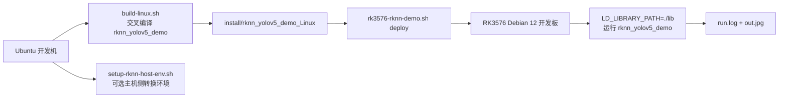

# RK3576 RKNN Demo 适配指南

**最后更新:** 2026-05-17  
**适用范围:** 基于当前 `Omni3576-sdk` 自带 `rknpu2 / rknn-toolkit2` 版本，在 RK3576 Debian 12 板端完成一条最小可运行的 RKNN 目标检测 demo 闭环  
**当前结论:** 当前 SDK 自带版本适合先跑通 `rknn_yolov5_demo`；`yolov8 / yolov10` 不作为这一阶段的强目标

> **文档硬规范**
>
> - 本项目的系统架构图、模块框图、部署拓扑图、数据路径框图和工程结构框图必须使用 `architecture-diagram` skill 生成独立 HTML / inline SVG 图表产物；每个 HTML 图必须同步导出同名 `.svg`，Markdown 中默认直接显示 SVG，并附完整 HTML 图表链接。
> - 时序图、状态机图、纯目录结构图等仍使用 Mermaid fenced code block（语言标识为 `mermaid`）。
> - 禁止新增 ASCII art/text 框图；普通日志、命令输出、代码片段按其原始语言使用 fenced code block。
> - 每份项目文档必须在文档元信息和硬规范之后维护 `## 目录`，目录至少覆盖二级标题，并使用相对链接或页内锚点。

## 目录

- [1. 目标](#1-目标)
- [2. 为什么当前阶段不强追 yolov8/yolov10](#2-为什么当前阶段不强追-yolov8yolov10)
- [3. 当前 SDK 可用链路](#3-当前-sdk-可用链路)
- [4. 一键脚本](#4-一键脚本)
- [5. 主机侧模型转换环境](#5-主机侧模型转换环境)
- [6. 板端运行产物](#6-板端运行产物)
- [7. 后续升级条件](#7-后续升级条件)

## 1. 目标

这一阶段的目标不是追最新模型，而是先证明下面三件事在你当前 SDK 上闭环成立：

1. 可以复用 `Omni3576-sdk` 自带交叉工具链完成 RK3576 RKNN demo 编译。
2. 可以把 demo 与依赖库部署到板端并成功执行。
3. 可以把主机侧模型转换环境整理成无 conda 的轻量脚手架。

## 2. 为什么当前阶段不强追 yolov8/yolov10

当前 `Omni3576-sdk` 自带的 RKNN 相关版本明显偏老：

1. `external/rknn-toolkit2/rknn-toolkit2/packages/` 中只有 `cp310` / `cp311` wheel，版本为 `2.0.0b0`。
2. 当前开发机默认 `python3` 是 `3.12.3`，不能直接安装 SDK 自带 wheel。
3. `external/rknpu2/examples/` 中直接可用、版本闭环完整的是 `rknn_yolov5_demo`，而不是 `yolov8 / yolov10`。

因此当前最稳妥的路径是：

- **先以 SDK 自带 `rknn_yolov5_demo` 跑通 RK3576 板端推理**
- 后续如果要切到 `yolov8 / yolov10`，再升级 host toolkit + board runtime，并重新验证模型转换与后处理兼容性

## 3. 当前 SDK 可用链路

当前可直接复用的 SDK 资源：

| 路径 | 用途 |
|------|------|
| `../Omni3576-sdk/prebuilts/gcc/.../aarch64-none-linux-gnu-*` | RK3576 AArch64 交叉工具链 |
| `../Omni3576-sdk/external/rknpu2/examples/rknn_yolov5_demo/` | 当前最稳的 Linux RKNN 检测 demo |
| `../Omni3576-sdk/external/rknpu2/runtime/Linux/librknn_api/aarch64/librknnrt.so` | RKNN runtime |
| `../Omni3576-sdk/external/rknn-toolkit2/rknn-toolkit2/packages/` | 主机侧模型转换 wheel 与 requirements |

当前推荐闭环如下：



## 4. 一键脚本

当前项目内新增两个相关脚本：

### 4.1 主机侧轻量 RKNN Toolkit 环境

```bash
./scripts/setup-rknn-host-env.sh
```

说明：

1. 不使用 conda。
2. 当前只支持 `python3.10` 或 `python3.11`。
3. 如果机器上只有 `python3.12`，脚本会明确失败并提示安装兼容 Python。

### 4.2 RK3576 demo 构建 / 部署 / 运行

```bash
./scripts/rk3576-rknn-demo.sh all
```

可拆分执行：

```bash
./scripts/rk3576-rknn-demo.sh build
./scripts/rk3576-rknn-demo.sh deploy
./scripts/rk3576-rknn-demo.sh run
```

默认行为：

1. 使用 `Omni3576-sdk` 自带 `rknn_yolov5_demo`
2. 使用 SDK 自带 AArch64 工具链
3. 部署到板端 `/home/luckfox/CameraSubsystem/rknn_demo`
4. 板端运行：

```bash
export LD_LIBRARY_PATH=./lib
./rknn_yolov5_demo model/RK3576/yolov5s-640-640.rknn model/bus.jpg letterbox out.jpg
```

## 5. 主机侧模型转换环境

当前开发机如果要承担“权重转 `.rknn`”的工作，建议按以下原则执行：

1. **不装 conda**
2. 单独准备 `python3.10` 或 `python3.11`
3. 用 `venv` 隔离 RKNN Toolkit 依赖

当前这份 SDK 自带的 toolkit 版本限制是：

| 条件 | 当前状态 |
|------|----------|
| Python 3.12 | 不兼容 SDK 自带 wheel |
| Python 3.10/3.11 | 可兼容 SDK 自带 wheel |
| 直接转 yolov8/yolov10 | 不建议作为当前 SDK 的第一目标 |

如果只是为了验证“模型转换能力存在”，本阶段做到 host venv 脚手架就足够；真正切模型版本应等 runtime/toolkit 同步升级后再做。

## 6. 板端运行产物

`./scripts/rk3576-rknn-demo.sh run` 执行后，默认会把以下结果拉回本机：

| 本机路径 | 含义 |
|----------|------|
| `logs/rknn_demo/run.log` | 板端标准输出日志 |
| `logs/rknn_demo/out.jpg` | 板端推理结果图 |

## 7. 后续升级条件

只有满足下面条件后，才建议把当前链路从 `yolov5 demo` 升级到 `yolov8 / yolov10`：

1. 主机侧拿到与当前 Python 版本匹配的 `rknn-toolkit2` wheel。
2. 板端 `librknnrt.so` 与 host toolkit 版本对齐。
3. 对应模型的后处理 demo 与算子支持列表经过验证。
4. 至少完成一次：
   - ONNX -> RKNN 转换
   - RK3576 交叉编译
   - 板端推理
   - 输出图像与日志回传

在此之前，把“当前 SDK 的 RKNN 推理闭环”先跑通，才是正确顺序。
