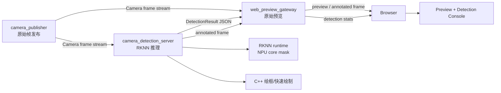
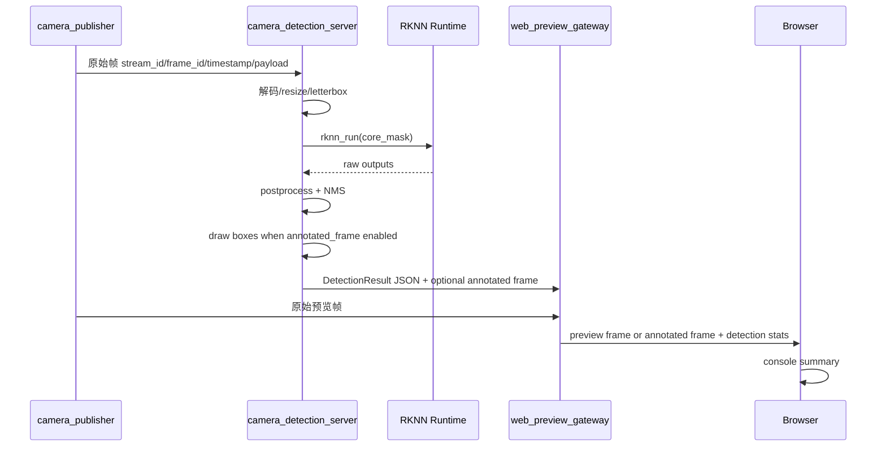

# Camera Target Detection Pipeline 架构设计

**最后更新:** 2026-05-17<br>
**阶段定位:** RK3576 官方 RKNN 新栈已完成 `yolo11` host 转换、交叉编译和板端离线运行；下一阶段准备把目标检测作为独立订阅端接入 CameraSubsystem 原始视频流<br>
**当前目标:** 文档先行，先明确目标检测服务、NPU core 约束、结果发布格式、Web overlay/console 行为和编码准入条件；本文不包含 C++ / TypeScript 实现代码

> **文档硬规范**
>
> - 本项目的系统架构图、模块框图、部署拓扑图、数据路径框图和工程结构框图必须使用 `architecture-diagram` skill 生成独立 HTML / inline SVG 图表产物；每个 HTML 图必须同步导出同名 `.svg`，Markdown 中默认直接显示 SVG，并附完整 HTML 图表链接。
> - 时序图、状态机图、纯目录结构图等仍使用 Mermaid fenced code block（语言标识为 `mermaid`）。
> - 禁止新增 ASCII art/text 框图；普通日志、命令输出、代码片段按其原始语言使用 fenced code block。
> - 本文只做架构设计，不包含 C++ / TypeScript 实现代码。

---

## 目录

- [1. 背景与目标](#1-背景与目标)
- [2. 当前 RK3576 NPU 实测结论](#2-当前-rk3576-npu-实测结论)
  - [2.5 板端高性能模式开关](#25-板端高性能模式开关)
- [3. 总体架构](#3-总体架构)
- [4. 进程与职责边界](#4-进程与职责边界)
- [5. 数据流与控制流](#5-数据流与控制流)
- [6. 输出模式与 Web 行为](#6-输出模式与-web-行为)
- [7. 结果数据契约](#7-结果数据契约)
- [8. NPU core 使用策略](#8-npu-core-使用策略)
- [9. 背压、丢帧与时序策略](#9-背压丢帧与时序策略)
- [10. Metrics 与日志](#10-metrics-与日志)
- [11. 第一阶段实现顺序](#11-第一阶段实现顺序)
- [12. 风险与缓解](#12-风险与缓解)
- [13. 需要拍板的决策](#13-需要拍板的决策)

---

## 1. 背景与目标

CameraSubsystem 当前已经具备稳定的 RK3576 USB 主链路、Web Preview、Codec Server、DataPlaneV2 和 RKNN 官方新栈验证基础。目标检测链路不应直接塞进 `camera_publisher` 或 `web_preview_gateway`，而应和 `camera_codec_server` 一样作为独立扩展服务接入。

推荐新增独立进程：

```text
camera_detection_server
```

第一阶段目标：

1. `camera_detection_server` 作为普通订阅端订阅 CameraSubsystem 原始视频流。
2. 推理使用 RKNN 官方新栈，默认模型入口沿用已跑通的 `yolo11`。
3. 默认只占用一个明确指定的 NPU core，避免单个检测任务吃满全部 NPU。
4. 推理结果以结构化目标框 metadata 发布。
5. 目标框绘制默认放在 `camera_detection_server` 端完成，前端不承担重型逐帧绘制。
6. Web Preview 可选择只显示 console，也可接收 detection server 输出的已绘制目标框图像帧。
7. console 每秒刷新一次关键日志，不逐帧刷屏。
8. 第一阶段优先跑通 USB copy path；MIPI/RKISP NV12 DMA-BUF 低拷贝输入后移。

非目标：

1. 不把 RKNN 推理放入 `camera_publisher`。
2. 不让 `web_preview_gateway` 直接持有 RKNN runtime。
3. 不在第一阶段做训练、模型自动下载或云端训练管理。
4. 不把 `rknn-llm` 纳入当前目标检测主线。
5. 不在第一阶段承诺多模型、多任务 NPU 调度器，只保留 core mask 配置边界。
6. 不在第一阶段做前端 Canvas/WebGL 重型绘制；前端只做状态展示、按钮控制和低频 console。

## 2. 当前 RK3576 NPU 实测结论

### 2.1 是否走 NPU

当前板端目标检测 demo 使用的是 RKNN runtime，运行日志包含：

```text
rknn_api/rknnrt version: 2.3.2 (...), driver version: 0.9.7
```

同时，`rknn_benchmark` 对 `core_mask` 的变化会产生明显推理性能差异，可以确认当前推理路径不是 CPU-only 路径。

### 2.2 core mask 语义

RKNN C API 中 `rknn_set_core_mask` 暴露以下 mask：

| mask | 含义 |
|------|------|
| `0` | auto |
| `1` | NPU core 0 |
| `2` | NPU core 1 |
| `4` | NPU core 2 |
| `3` | NPU core 0 + core 1 |
| `7` | NPU core 0 + core 1 + core 2 |

说明：官方 `rknn_benchmark` 文档仍写有“仅 RK3588 支持 core mask”的历史备注；但当前 RK3576 + `rknnrt 2.3.2` 实测可以传入不同 mask，并观察到性能差异。工程决策以板端实测为准，但实现上必须保留 mask 设置失败时的日志与 fallback。

### 2.3 yolo11n 实测数据

测试条件：

1. 板端：RK3576 / Debian12 / `driver 0.9.7`
2. Runtime：`rknnrt 2.3.2`
3. 模型：`yolo11n`，`640x640`，INT8
4. 工具：官方 `rknn_benchmark`
5. 每组：`120` 次循环，输入为 `bus.jpg`
6. CPU 负载：按 `/proc/stat` 总 CPU delta 粗略估算
7. 内存：按 `MemAvailable` delta 粗略估算，短测会受 page cache 和输出文件影响
8. IO：benchmark 会保存 `rt_output*.npy`，因此写入扇区主要反映测试工具输出，不代表后续流式推理链路

| NPU mask | core 配置 | 平均耗时 ms | 推理 FPS | CPU 粗略占用 | MemAvailable delta | 读扇区 | 写扇区 | 结论 |
|----------|-----------|-------------|----------|--------------|--------------------|--------|--------|------|
| `0` | auto | `37.36` | `26.77` | `3.10%` | `-2348 KB` | `0` | `20528` | 接近单核，不适合作为独占策略 |
| `1` | core 0 | `37.76` | `26.49` | `3.15%` | `-2028 KB` | `0` | `20512` | 可作为默认独占 core |
| `2` | core 1 | `39.14` | `25.55` | `3.03%` | `-1020 KB` | `0` | `19424` | 可作为可配置独占 core |
| `4` | core 2 | `36.01` | `27.77` | `3.06%` | `-1876 KB` | `0` | `19360` | 当前最快单核 |
| `3` | core 0 + core 1 | `26.93` | `37.14` | `3.72%` | `-1440 KB` | `0` | `19360` | 双核有明显收益 |
| `7` | core 0 + core 1 + core 2 | `37.65` | `26.56` | `3.59%` | `-2396 KB` | `0` | `19360` | 当前未体现三核收益，不建议默认使用 |

当前架构结论：

1. 第一阶段目标检测服务默认使用单核 mask，默认值确定为 `1`，保留 `2` / `4` 可配置。
2. 如果后续单任务确实需要更高吞吐，可以显式配置 `3`，但不能默认全开。
3. `7` 当前实测没有收益，不能把“三核全开”当成性能假设。
4. Web 预览链路当前 USB 输入大约 15 FPS，默认 governor 下单核 `yolo11n` 约 25 FPS，单路实时检测在算力上可行。

### 2.4 理论帧率与当前瓶颈分析

官方 `rknn_model_zoo` 当前基准表给出 `RK3576 @single_core` 的 `yolo11n INT8 640x640` 性能为 `77.9 FPS`。从模型复杂度和 RK3576 单核算力看，`50+ FPS` 是合理预期。

我们第一次实测只有 `25-28 FPS`，原因不是 `yolo11n` 模型太大，而是板端频率策略没有进入最高性能状态。板端实测频率状态：

| 项 | 当前值 |
|----|--------|
| NPU `cur_freq` | `300000000` |
| NPU `max_freq` | `950000000` |
| NPU governor | `rknpu_ondemand` |
| CPU policy0 governor | `ondemand` |
| CPU policy4 governor | `ondemand` |

临时将 NPU/CPU governor 切到 `performance` 后，`core0` 单核同一模型同一输入的结果为：

| 模式 | NPU 频率 | 平均耗时 | 推理 FPS |
|------|----------|----------|----------|
| 默认 `rknpu_ondemand` | `300 MHz` 起步 | `37.76 ms` | `26.49` |
| 临时 `performance` | `950 MHz` | `17.08 ms` | `58.56` |

结论：

1. `50+ FPS` 可以达到，至少在 `core0 + performance governor` 下已经实测到 `58.56 FPS`。
2. 与官方 `77.9 FPS` 仍有差距，可能来自 DDR/CPU 频率、benchmark 输入路径、系统后台负载、驱动版本和板厂 Debian 默认调频策略。
3. 目标检测服务第一阶段默认进入已验证的 `npu-cpu` performance profile，避免用户开启检测后仍运行在 `300 MHz` 起步的 ondemand 状态。
4. 后续如果要追官方基准，需要单独做性能专项：锁定 NPU/CPU/DDR、关闭无关后台进程、避免 benchmark 输出 `.npy` 干扰、拆分 preprocess/inference/postprocess 耗时。

建议落地策略：

1. `camera_detection_server` 默认仍使用 `npu_core_mask=1`。
2. 服务启动时记录 NPU governor、`cur_freq`、`max_freq`。
3. 提供 `--performance-profile=none|npu|npu-cpu|full` 配置，默认 `npu-cpu`。
4. 默认启动必须尝试切换 NPU + CPU governor；如果权限不足或 sysfs 节点不存在，服务进入 `Error` 状态并输出明确错误，除非用户显式传入 `--allow-performance-profile-failure=1`。
5. 板端调试脚本可通过 `DETECTION_PERFORMANCE_PROFILE=none` 临时关闭该行为，用于对比调频影响。

### 2.5 板端高性能模式开关

当前工程可参考官方 RKNN LLM 目录中的 `rknn-llm/scripts/fix_freq_rk3576.sh`，但不能原样照搬到本项目主线。该脚本面向 LLM 压测，包含 GPU/DMC 频率设置，并尝试把 RK3576 NPU 固定到 `1000000000`。当前板端 `/sys/class/devfreq/27700000.npu/max_freq` 实测为 `950000000`，因此目标检测链路第一阶段采用更保守、已验证的 governor 方案。

已验证的一键启用命令：

```bash
sudo sh -c 'echo performance > /sys/class/devfreq/27700000.npu/governor; echo performance > /sys/devices/system/cpu/cpufreq/policy0/scaling_governor; echo performance > /sys/devices/system/cpu/cpufreq/policy4/scaling_governor'
```

验证命令：

```bash
cat /sys/class/devfreq/27700000.npu/governor
cat /sys/class/devfreq/27700000.npu/cur_freq
cat /sys/class/devfreq/27700000.npu/max_freq
cat /sys/devices/system/cpu/cpufreq/policy0/scaling_governor
cat /sys/devices/system/cpu/cpufreq/policy4/scaling_governor
```

当前板端验证结果：

| 项 | 结果 |
|----|------|
| NPU governor | `performance` |
| NPU `cur_freq` | `950000000` |
| NPU `max_freq` | `950000000` |
| CPU policy0 governor | `performance` |
| CPU policy4 governor | `performance` |
| `yolo11n` core0 benchmark | `17.08 ms / 58.56 FPS` |

恢复默认调频命令：

```bash
sudo sh -c 'echo rknpu_ondemand > /sys/class/devfreq/27700000.npu/governor; echo ondemand > /sys/devices/system/cpu/cpufreq/policy0/scaling_governor; echo ondemand > /sys/devices/system/cpu/cpufreq/policy4/scaling_governor'
```

`camera_detection_server` 的实现约束：

1. 默认等价于 `--performance-profile=npu-cpu`，启动时先设置 governor，再初始化 RKNN runtime。
2. 只设置 NPU 与 CPU governor，不默认改 GPU/DMC，避免为目标检测扩大系统副作用。
3. 启动日志必须打印切换前后的 NPU/CPU governor 与 NPU `cur_freq/max_freq`。
4. 服务正常退出时不强制恢复 governor，避免多个检测/AI 任务并行时互相踩配置；恢复动作交给板端 debug stack 或用户显式命令。
5. 若后续需要生产级策略，应由统一板端启动脚本或 systemd unit 管理性能档，而不是每个 AI 服务各自抢占全局频率。

## 3. 总体架构



核心原则：

1. `camera_publisher` 仍然只负责采集与帧发布。
2. `camera_detection_server` 是普通订阅者，不直接打开 `/dev/video*`。
3. `web_preview_gateway` 只做结果转发和状态聚合，不持有 RKNN runtime。
4. 浏览器可选择只看 detection console，也可切换到 detection server 输出的 annotated frame。
5. 第一阶段新增检测后帧作为可选输出，但绘制工作在 detection server 侧完成。

## 4. 进程与职责边界

| 进程 | 职责 | 明确不做 |
|------|------|----------|
| `camera_publisher` | 独占 Camera 设备，发布原始帧 | 不加载 RKNN，不做检测 |
| `camera_detection_server` | 订阅原始帧，执行预处理、RKNN 推理、后处理、C++ 绘框，发布检测结果和可选 annotated frame | 不直接访问 Camera 设备，不提供 HTTP 服务 |
| `web_preview_gateway` | 聚合原始预览、检测状态、检测结果和 annotated frame，转发给浏览器 | 不持有 RKNN runtime，不做模型推理，不做目标框绘制 |
| Web 前端 | 展示原始预览或 annotated frame、每秒 console 摘要、检测开关 | 不逐帧刷日志，不做重型绘制 |

建议工程目录：

| 路径 | 作用 |
|------|------|
| `extensions/detection_server/` | 目标检测服务扩展 |
| `extensions/detection_server/src/` | RKNN runtime 封装、订阅、推理 session、结果发布 |
| `extensions/detection_server/include/` | 内部头文件 |
| `extensions/detection_server/tests/` | 结果序列化、状态机、配置解析测试 |
| `docs/TARGET_DETECTION_PIPELINE_DESIGN.md` | 本设计文档 |

## 5. 数据流与控制流

### 5.1 数据流



### 5.2 控制流

第一阶段控制命令只需要覆盖：

| 命令 | 方向 | 说明 |
|------|------|------|
| `start_detection` | Web/Gateway -> Detection | 启动某个 `stream_id` 的检测 |
| `stop_detection` | Web/Gateway -> Detection | 停止检测 |
| `set_detection_config` | Web/Gateway -> Detection | 设置 `core_mask`、阈值、输出模式、推理间隔 |
| `get_detection_status` | Web/Gateway -> Detection | 查询 session 状态和 metrics |

控制协议建议沿用 codec server 的 JSON line 风格，减少新协议复杂度。

## 6. 输出模式与 Web 行为

### 6.1 输出模式

| 模式 | 默认 | 说明 | 第一阶段是否实现 |
|------|------|------|------------------|
| `metadata_only` | 是 | 只发布结构化目标框、类别、置信度、帧号和耗时 | 是 |
| `annotated_frame` | 是 | detection server 输出已绘制目标框的图像帧 | 是 |
| `web_overlay` | 否 | Web 前端基于 metadata 在原始预览上绘制目标框 | 暂缓 |

第一阶段推荐默认组合：

```text
output_mode=metadata_only|annotated_frame
web_overlay=false
annotated_frame=true when user selects drawn boxes
```

原因：

1. metadata 输出带宽低，适合仅消费目标框信息的业务。
2. annotated frame 满足调试和展示需求，并把绘制成本留在板端 C++。
3. Web 前端不承担逐帧框绘制，避免多路摄像头场景下拖慢浏览器。
4. annotated frame 第一阶段可以复用 JPEG/RGB 绘制路径；后续再评估 RGA/NEON 优化。

### 6.2 Web console 行为

Web console 每秒刷新一次摘要，不逐帧刷屏。

建议字段：

| 字段 | 说明 |
|------|------|
| `stream_id` | 当前检测流 |
| `model_name` | 例如 `yolo11n` |
| `npu_core_mask` | 当前 RKNN core mask |
| `input_fps` | detection server 实际接收帧率 |
| `infer_fps` | 完成推理帧率 |
| `dropped_frames` | 因队列或节流丢弃的帧 |
| `latency_ms_avg` | 平均端到端检测耗时 |
| `latency_ms_p95` | p95 检测耗时 |
| `object_count` | 最近一秒目标数 |
| `last_error` | 最近错误 |

## 7. 结果数据契约

DetectionResult 建议使用 JSON line 作为第一阶段结果协议：

```json
{
  "type": "detection_result",
  "stream_id": "usb0",
  "frame_id": 12345,
  "timestamp_ns": 1790000000000,
  "model": {
    "name": "yolo11n",
    "runtime": "rknnrt",
    "runtime_version": "2.3.2",
    "core_mask": 1
  },
  "image": {
    "width": 1920,
    "height": 1080,
    "letterbox_width": 640,
    "letterbox_height": 640
  },
  "metrics": {
    "preprocess_ms": 3.2,
    "inference_ms": 37.8,
    "postprocess_ms": 2.1,
    "total_ms": 43.1
  },
  "objects": [
    {
      "class_id": 5,
      "label": "bus",
      "score": 0.941,
      "bbox_xyxy": [95, 136, 554, 438],
      "bbox_norm_xyxy": [0.1484, 0.2125, 0.8656, 0.6844]
    }
  ]
}
```

契约要求：

1. `stream_id` 必须贯穿结果、状态、日志和 Web event。
2. `frame_id` 必须来自原始帧，不允许 detection server 自己生成无关联帧号。
3. bbox 同时给 pixel 坐标和 normalized 坐标，便于 Web overlay 和后续外部消费。
4. `core_mask` 必须进入结果和状态，便于确认任务没有默认吃满全部 NPU。
5. 结果协议第一阶段使用 JSON line；后续高频或多模型场景再考虑二进制协议。

## 8. NPU core 使用策略

### 8.1 默认策略

默认配置：

```text
npu_core_mask=1
```

允许配置：

| 配置 | 是否允许 | 说明 |
|------|----------|------|
| `1` | 是 | 独占 core 0，已拍板为默认 |
| `2` | 是 | 独占 core 1 |
| `4` | 是 | 独占 core 2，当前单核实测最快 |
| `3` | 是 | 双核，只有用户明确需要更高吞吐时开启 |
| `7` | 不建议默认 | 当前实测无收益，不能作为默认 |
| `0` | 不建议默认 | auto 不满足“任务绑定独立 NPU core”的目标 |

### 8.2 调度原则

1. 单个检测任务默认只占一个 NPU core。
2. `core_mask` 是 detection session 的显式配置项，不隐藏在代码常量里。
3. 如果 `rknn_set_core_mask` 失败，服务必须进入 `Degraded` 或 `Error` 状态，并把失败原因写入 status，不静默 fallback 到 all core。
4. 多模型并行时，必须由上层配置分配 core，例如 detection=1、另一个任务=2、第三个任务=4。

## 9. 背压、丢帧与时序策略

目标检测不是录制，第一阶段不追求逐帧必达。推荐策略：

1. detection server 订阅原始帧后使用小队列，例如 `max_queue_depth=2`。
2. 推理繁忙时丢弃旧帧，只保留最新帧，避免检测显示延迟持续增长。
3. 目标检测默认关闭；用户开启后默认 `infer_every_n_frames=1`，即每帧都进入检测链路。
4. 如果推理耗时超过输入帧周期，仍采用小队列 + 丢旧保新，不让延迟无限增长。
5. annotated frame 必须携带 `stream_id + frame_id + timestamp_ns`，Web 端只显示最新帧。

## 10. Metrics 与日志

Detection server 需要提供自己的 metrics provider，后续接入 `MetricsAggregator` 或由 gateway 单独转发。

建议指标：

| 指标 | 说明 |
|------|------|
| `detection_input_frames` | 收到的原始帧数 |
| `detection_inferred_frames` | 完成推理的帧数 |
| `detection_dropped_frames` | 因背压或节流丢弃的帧数 |
| `detection_result_count` | 输出结果数 |
| `detection_last_object_count` | 最近一帧目标数 |
| `detection_preprocess_ms_avg` | 平均预处理耗时 |
| `detection_inference_ms_avg` | 平均 RKNN 推理耗时 |
| `detection_postprocess_ms_avg` | 平均后处理耗时 |
| `detection_total_ms_p95` | p95 总耗时 |
| `detection_npu_core_mask` | 当前 core mask |
| `detection_npu_cur_freq_hz` | 采样到的 NPU 当前频率 |
| `detection_npu_governor` | 当前 NPU governor |

日志规则：

1. 服务端日志可以逐状态变化输出，但不要逐帧输出完整检测结果。
2. Web console 每秒聚合一次，最多显示最近 N 条。
3. 关键错误必须包含 `stream_id`、`frame_id`、`core_mask`、`model_path`。

## 11. 第一阶段实现顺序

### D1：服务骨架与配置

1. 新增 `extensions/detection_server/`
2. 新增 `camera_detection_server` 可执行程序
3. 支持 CLI：
   - `--control-socket`
   - `--stream-id`
   - `--model-path`
   - `--labels-path`
   - `--npu-core-mask`
   - `--score-threshold`
   - `--nms-threshold`
   - `--output-mode`
   - `--infer-every-n-frames`
   - `--draw-boxes`
   - `--performance-profile`，默认 `npu-cpu`
   - `--allow-performance-profile-failure`
4. 启动后只初始化配置和 RKNN runtime，不接入 Web。

### D2：订阅原始帧并输出 metadata

1. 使用现有 `CameraSubscriberClient` 订阅 publisher。
2. 第一阶段走 copy path，支持当前 USB JPEG/MJPEG 输入。
3. 完成 decode、resize、letterbox、RKNN inference、postprocess。
4. 在 `--draw-boxes=1` 时由 detection server 侧绘制目标框。
5. 通过 JSON line 发布 `DetectionResult`，可选发布 annotated frame。

### D3：Gateway 与 Web 接入

1. Gateway 增加 detection control/status proxy。
2. Web 增加每路 detection 开关、core mask 显示、console 摘要。
3. Web 支持原始预览和 annotated frame 切换。
4. console 每秒刷新一次，不逐帧刷屏。

### D4：板端 smoke

1. `camera_publisher` + `camera_detection_server` + `web_preview_gateway` 串行启动。
2. 默认 `npu_core_mask=1`。
3. `camera_detection_server` 默认开启 `npu-cpu` performance profile，板端验证 NPU governor 为 `performance` 且 `cur_freq=max_freq=950000000`。
4. 验收目标：
   - Web 原始预览不断流
   - console 每秒刷新 FPS/latency/object_count
   - annotated frame 模式可看到目标框
   - detection server 不占用 mask 以外的 NPU 配置

## 12. 风险与缓解

| 风险 | 级别 | 缓解 |
|------|------|------|
| `core_mask=7` 在 RK3576 上无收益 | P1 | 默认单核；双核/三核必须显式配置；文档记录实测结果 |
| annotated frame 与原始预览切换不同步 | P1 | annotated frame 携带 `stream_id/frame_id/timestamp_ns`，Web 只显示最新帧 |
| USB JPEG decode + RKNN 预处理吃 CPU | P2 | 第一阶段先测量；后续可用 RGA 或 MIPI NV12 低拷贝输入优化 |
| detection 队列堆积导致延迟增长 | P1 | 小队列 + 丢旧保新 + `infer_every_n_frames` |
| RKNN runtime 与旧 SDK runtime 混用 | P1 | 新栈独立目录和独立部署；不覆盖 `Omni3576-sdk` |
| detection server 崩溃影响预览 | P1 | 独立进程；Gateway 只显示 detection unavailable，不影响原始预览 |
| JSON 结果过大或频率过高 | P2 | metadata-only 每帧结果可控；console 每秒聚合；后续再考虑二进制协议 |
| 默认 governor 导致 FPS 低于预期 | P1 | detection server 默认进入 `npu-cpu` performance profile；启动时校验 NPU/CPU governor 与频率，失败进入 Error 或显式降级 |
| 服务直接改 governor 带来全局副作用 | P1 | 默认只改 NPU/CPU，不改 GPU/DMC；退出不自动恢复；生产环境后续收敛到统一启动脚本或 systemd unit |

## 13. 需要拍板的决策

以下决策已经确认，可以作为第一阶段编码输入：

1. **默认 NPU core：** 默认仅启用 `core0`，即 `npu_core_mask=1`。
2. **绘框方式：** 前端不做重型逐帧绘制；目标框绘制放在 `camera_detection_server` 端，使用 C++ 绘制路径，后续可引入 RGA/NEON 优化。
3. **结果协议：** 第一阶段接受 JSON line，不引入 protobuf 或复杂二进制协议。
4. **推理节流：** 目标检测默认关闭；用户开启后默认每帧推理，即 `infer_every_n_frames=1`。
5. **模型选择：** 第一阶段固定 `yolo11n.rknn`，链路稳定后再评估替换模型。

仍需实现阶段进一步确认的细节：

1. annotated frame 第一阶段使用 JPEG 输出还是沿用 Gateway 当前帧封装格式。
2. C++ 绘框优先用现有 model zoo `image_drawing`，还是统一封装到 CameraSubsystem 自有绘制工具。
