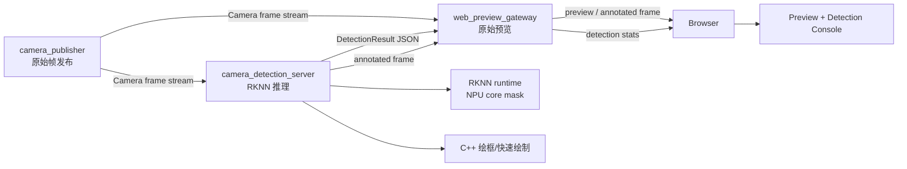
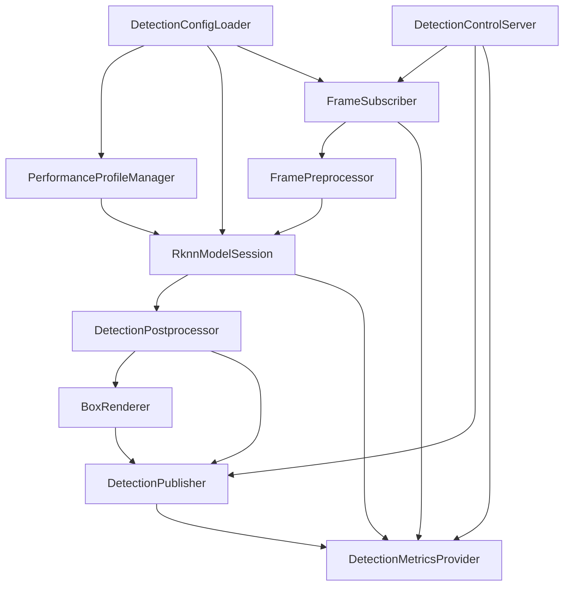
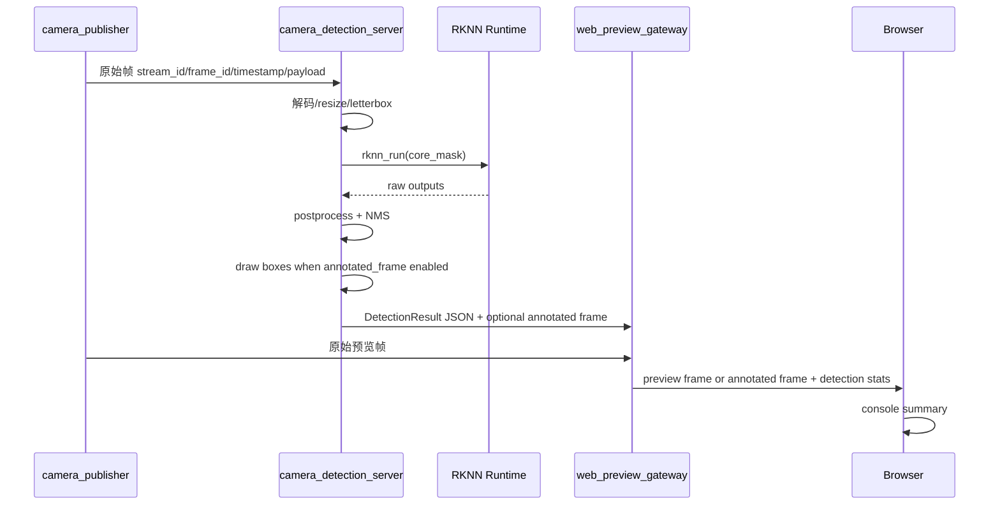
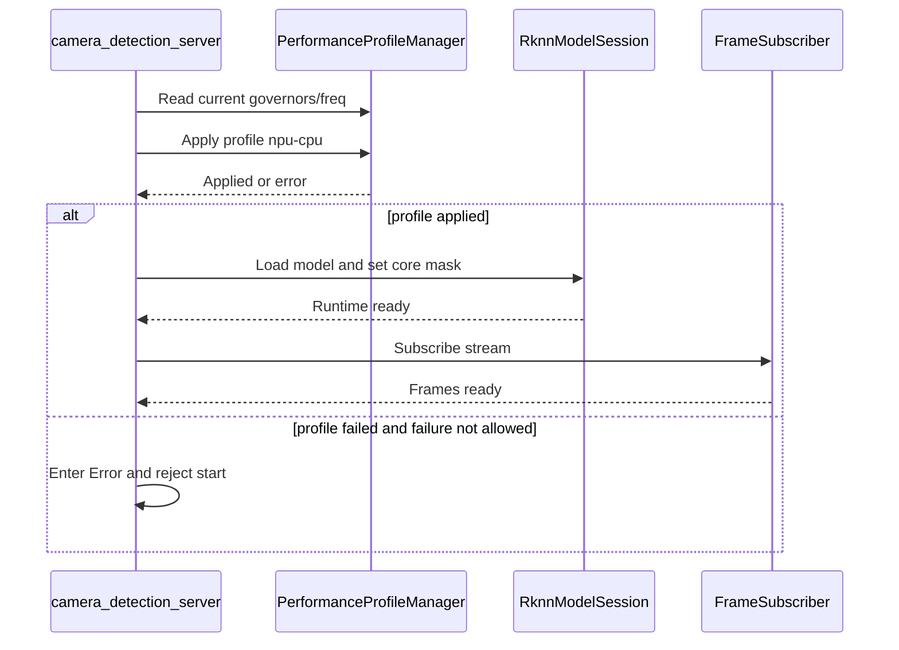
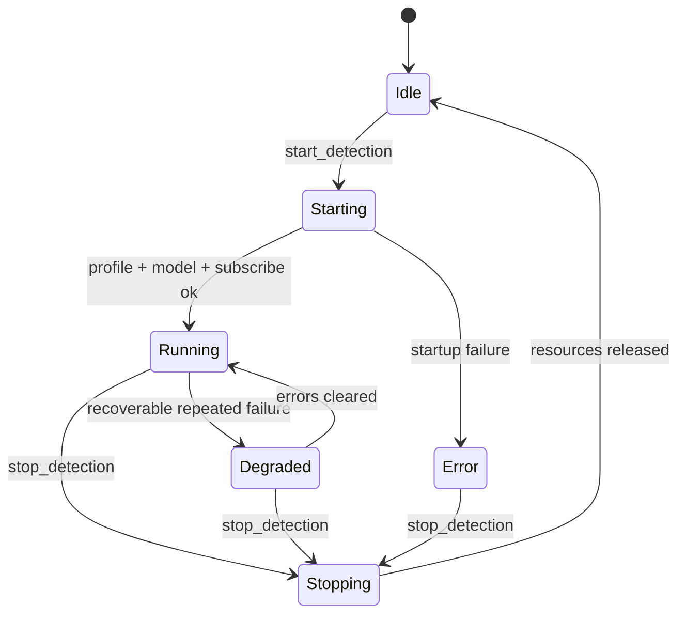

# Camera Target Detection Pipeline 架构设计

**最后更新:** 2026-05-19<br>
**阶段定位:** RK3576 官方 RKNN 新栈已完成 `yolo11` host 转换、交叉编译和板端离线运行；下一阶段准备把目标检测作为独立订阅端接入 CameraSubsystem 原始视频流<br>
**当前目标:** 文档先行，先明确目标检测服务、NPU core 约束、结果发布格式、Web overlay/console 行为和编码准入条件；本文不包含 C++ / TypeScript 实现代码

> **文档硬规范**
>
> - 本项目的系统架构图、模块框图、部署拓扑图、数据路径框图和工程结构框图必须使用 `architecture-diagram` skill 生成独立 HTML / inline SVG 图表产物；每个 HTML 图必须同步导出同名 `.svg`，Markdown 中默认直接显示 SVG，并附完整 HTML 图表链接。
> - 时序图、状态机图、纯目录结构图等仍使用 Mermaid fenced code block（语言标识为 `mermaid`）。
> - 禁止新增 ASCII art/text 框图；普通日志、命令输出、代码片段按其原始语言使用 fenced code block。
> - 本文只做架构设计，不包含 C++ / TypeScript 实现代码。

---

## 目录

- [1. 背景与目标](#1-背景与目标)
- [2. 当前 RK3576 NPU 实测结论](#2-当前-rk3576-npu-实测结论)
  - [2.5 板端高性能模式开关](#25-板端高性能模式开关)
- [3. 总体架构](#3-总体架构)
- [4. 进程与职责边界](#4-进程与职责边界)
- [5. 数据流与控制流](#5-数据流与控制流)
- [6. 输出模式与 Web 行为](#6-输出模式与-web-行为)
- [7. 结果数据契约](#7-结果数据契约)
- [8. NPU core 使用策略](#8-npu-core-使用策略)
- [9. 背压、丢帧与时序策略](#9-背压丢帧与时序策略)
- [10. Metrics 与日志](#10-metrics-与日志)
- [11. 状态机与错误处理](#11-状态机与错误处理)
- [12. 第一阶段实现顺序](#12-第一阶段实现顺序)
- [13. 验收标准](#13-验收标准)
- [14. 风险与缓解](#14-风险与缓解)
- [15. 已确认决策与待实现细节](#15-已确认决策与待实现细节)
- [16. 代码落地蓝图](#16-代码落地蓝图)
- [17. 配置默认值](#17-配置默认值)
- [18. 构建、部署与运行入口](#18-构建部署与运行入口)
- [19. 测试矩阵](#19-测试矩阵)
- [20. 编码准入结论](#20-编码准入结论)

---

## 1. 背景与目标

CameraSubsystem 当前已经具备稳定的 RK3576 USB 主链路、Web Preview、Codec Server、DataPlaneV2 和 RKNN 官方新栈验证基础。目标检测链路不应直接塞进 `camera_publisher` 或 `web_preview_gateway`，而应和 `camera_codec_server` 一样作为独立扩展服务接入。

推荐新增独立进程：

```text
camera_detection_server
```

第一阶段目标：

1. `camera_detection_server` 作为普通订阅端订阅 CameraSubsystem 原始视频流。
2. 推理使用 RKNN 官方新栈，默认模型入口沿用已跑通的 `yolo11`。
3. 默认只占用一个明确指定的 NPU core，避免单个检测任务吃满全部 NPU。
4. 推理结果以结构化目标框 metadata 发布。
5. 目标框绘制默认放在 `camera_detection_server` 端完成，前端不承担重型逐帧绘制。
6. Web Preview 可选择只显示 console，也可接收 detection server 输出的已绘制目标框图像帧。
7. console 每秒刷新一次关键日志，不逐帧刷屏。
8. 第一阶段优先跑通 USB copy path；MIPI/RKISP NV12 DMA-BUF 低拷贝输入后移。

非目标：

1. 不把 RKNN 推理放入 `camera_publisher`。
2. 不让 `web_preview_gateway` 直接持有 RKNN runtime。
3. 不在第一阶段做训练、模型自动下载或云端训练管理。
4. 不把 `rknn-llm` 纳入当前目标检测主线。
5. 不在第一阶段承诺多模型、多任务 NPU 调度器，只保留 core mask 配置边界。
6. 不在第一阶段做前端 Canvas/WebGL 重型绘制；前端只做状态展示、按钮控制和低频 console。

## 2. 当前 RK3576 NPU 实测结论

### 2.1 是否走 NPU

当前板端目标检测 demo 使用的是 RKNN runtime，运行日志包含：

```text
rknn_api/rknnrt version: 2.3.2 (...), driver version: 0.9.7
```

同时，`rknn_benchmark` 对 `core_mask` 的变化会产生明显推理性能差异，可以确认当前推理路径不是 CPU-only 路径。

### 2.2 core mask 语义

RKNN C API 中 `rknn_set_core_mask` 暴露以下 mask：

| mask | 含义 |
|------|------|
| `0` | auto |
| `1` | NPU core 0 |
| `2` | NPU core 1 |
| `4` | NPU core 2 |
| `3` | NPU core 0 + core 1 |
| `7` | NPU core 0 + core 1 + core 2 |

说明：官方 `rknn_benchmark` 文档仍写有“仅 RK3588 支持 core mask”的历史备注；但当前 RK3576 + `rknnrt 2.3.2` 实测可以传入不同 mask，并观察到性能差异。工程决策以板端实测为准，但实现上必须保留 mask 设置失败时的日志与 fallback。

### 2.3 yolo11n 实测数据

测试条件：

1. 板端：RK3576 / Debian12 / `driver 0.9.7`
2. Runtime：`rknnrt 2.3.2`
3. 模型：`yolo11n`，`640x640`，INT8
4. 工具：官方 `rknn_benchmark`
5. 每组：`120` 次循环，输入为 `bus.jpg`
6. CPU 负载：按 `/proc/stat` 总 CPU delta 粗略估算
7. 内存：按 `MemAvailable` delta 粗略估算，短测会受 page cache 和输出文件影响
8. IO：benchmark 会保存 `rt_output*.npy`，因此写入扇区主要反映测试工具输出，不代表后续流式推理链路

| NPU mask | core 配置 | 平均耗时 ms | 推理 FPS | CPU 粗略占用 | MemAvailable delta | 读扇区 | 写扇区 | 结论 |
|----------|-----------|-------------|----------|--------------|--------------------|--------|--------|------|
| `0` | auto | `37.36` | `26.77` | `3.10%` | `-2348 KB` | `0` | `20528` | 接近单核，不适合作为独占策略 |
| `1` | core 0 | `37.76` | `26.49` | `3.15%` | `-2028 KB` | `0` | `20512` | 可作为默认独占 core |
| `2` | core 1 | `39.14` | `25.55` | `3.03%` | `-1020 KB` | `0` | `19424` | 可作为可配置独占 core |
| `4` | core 2 | `36.01` | `27.77` | `3.06%` | `-1876 KB` | `0` | `19360` | 当前最快单核 |
| `3` | core 0 + core 1 | `26.93` | `37.14` | `3.72%` | `-1440 KB` | `0` | `19360` | 双核有明显收益 |
| `7` | core 0 + core 1 + core 2 | `37.65` | `26.56` | `3.59%` | `-2396 KB` | `0` | `19360` | 当前未体现三核收益，不建议默认使用 |

当前架构结论：

1. 第一阶段目标检测服务默认使用单核 mask，默认值确定为 `1`，保留 `2` / `4` 可配置。
2. 如果后续单任务确实需要更高吞吐，可以显式配置 `3`，但不能默认全开。
3. `7` 当前实测没有收益，不能把“三核全开”当成性能假设。
4. Web 预览链路当前 USB 输入大约 15 FPS，默认 governor 下单核 `yolo11n` 约 25 FPS，单路实时检测在算力上可行。

### 2.4 理论帧率与当前瓶颈分析

官方 `rknn_model_zoo` 当前基准表给出 `RK3576 @single_core` 的 `yolo11n INT8 640x640` 性能为 `77.9 FPS`。从模型复杂度和 RK3576 单核算力看，`50+ FPS` 是合理预期。

我们第一次实测只有 `25-28 FPS`，原因不是 `yolo11n` 模型太大，而是板端频率策略没有进入最高性能状态。板端实测频率状态：

| 项 | 当前值 |
|----|--------|
| NPU `cur_freq` | `300000000` |
| NPU `max_freq` | `950000000` |
| NPU governor | `rknpu_ondemand` |
| CPU policy0 governor | `ondemand` |
| CPU policy4 governor | `ondemand` |

临时将 NPU/CPU governor 切到 `performance` 后，`core0` 单核同一模型同一输入的结果为：

| 模式 | NPU 频率 | 平均耗时 | 推理 FPS |
|------|----------|----------|----------|
| 默认 `rknpu_ondemand` | `300 MHz` 起步 | `37.76 ms` | `26.49` |
| 临时 `performance` | `950 MHz` | `17.08 ms` | `58.56` |

结论：

1. `50+ FPS` 可以达到，至少在 `core0 + performance governor` 下已经实测到 `58.56 FPS`。
2. 与官方 `77.9 FPS` 仍有差距，可能来自 DDR/CPU 频率、benchmark 输入路径、系统后台负载、驱动版本和板厂 Debian 默认调频策略。
3. 目标检测服务第一阶段默认进入已验证的 `npu-cpu` performance profile，避免用户开启检测后仍运行在 `300 MHz` 起步的 ondemand 状态。
4. 后续如果要追官方基准，需要单独做性能专项：锁定 NPU/CPU/DDR、关闭无关后台进程、避免 benchmark 输出 `.npy` 干扰、拆分 preprocess/inference/postprocess 耗时。

建议落地策略：

1. `camera_detection_server` 默认仍使用 `npu_core_mask=1`。
2. 服务启动时记录 NPU governor、`cur_freq`、`max_freq`。
3. 提供 `--performance-profile=none|npu|npu-cpu|full` 配置，默认 `npu-cpu`。
4. 默认启动必须尝试切换 NPU + CPU governor；如果权限不足或 sysfs 节点不存在，服务进入 `Error` 状态并输出明确错误，除非用户显式传入 `--allow-performance-profile-failure=1`。
5. 板端调试脚本可通过 `DETECTION_PERFORMANCE_PROFILE=none` 临时关闭该行为，用于对比调频影响。

### 2.5 板端高性能模式开关

当前工程可参考官方 RKNN LLM 目录中的 `rknn-llm/scripts/fix_freq_rk3576.sh`，但不能原样照搬到本项目主线。该脚本面向 LLM 压测，包含 GPU/DMC 频率设置，并尝试把 RK3576 NPU 固定到 `1000000000`。当前板端 `/sys/class/devfreq/27700000.npu/max_freq` 实测为 `950000000`，因此目标检测链路第一阶段采用更保守、已验证的 governor 方案。

已验证的一键启用命令：

```bash
sudo sh -c 'echo performance > /sys/class/devfreq/27700000.npu/governor; echo performance > /sys/devices/system/cpu/cpufreq/policy0/scaling_governor; echo performance > /sys/devices/system/cpu/cpufreq/policy4/scaling_governor'
```

验证命令：

```bash
cat /sys/class/devfreq/27700000.npu/governor
cat /sys/class/devfreq/27700000.npu/cur_freq
cat /sys/class/devfreq/27700000.npu/max_freq
cat /sys/devices/system/cpu/cpufreq/policy0/scaling_governor
cat /sys/devices/system/cpu/cpufreq/policy4/scaling_governor
```

当前板端验证结果：

| 项 | 结果 |
|----|------|
| NPU governor | `performance` |
| NPU `cur_freq` | `950000000` |
| NPU `max_freq` | `950000000` |
| CPU policy0 governor | `performance` |
| CPU policy4 governor | `performance` |
| `yolo11n` core0 benchmark | `17.08 ms / 58.56 FPS` |

恢复默认调频命令：

```bash
sudo sh -c 'echo rknpu_ondemand > /sys/class/devfreq/27700000.npu/governor; echo ondemand > /sys/devices/system/cpu/cpufreq/policy0/scaling_governor; echo ondemand > /sys/devices/system/cpu/cpufreq/policy4/scaling_governor'
```

`camera_detection_server` 的实现约束：

1. 默认等价于 `--performance-profile=npu-cpu`，启动时先设置 governor，再初始化 RKNN runtime。
2. 只设置 NPU 与 CPU governor，不默认改 GPU/DMC，避免为目标检测扩大系统副作用。
3. 启动日志必须打印切换前后的 NPU/CPU governor 与 NPU `cur_freq/max_freq`。
4. 服务正常退出时不强制恢复 governor，避免多个检测/AI 任务并行时互相踩配置；恢复动作交给板端 debug stack 或用户显式命令。
5. 若后续需要生产级策略，应由统一板端启动脚本或 systemd unit 管理性能档，而不是每个 AI 服务各自抢占全局频率。

## 3. 总体架构



核心原则：

1. `camera_publisher` 仍然只负责采集与帧发布。
2. `camera_detection_server` 是普通订阅者，不直接打开 `/dev/video*`。
3. `web_preview_gateway` 只做结果转发和状态聚合，不持有 RKNN runtime。
4. 浏览器可选择只看 detection console，也可切换到 detection server 输出的 annotated frame。
5. 第一阶段新增检测后帧作为可选输出，但绘制工作在 detection server 侧完成。

### 3.1 detection server 内部模块

`camera_detection_server` 第一阶段按以下模块拆分。这里的拆分是代码实现边界，不要求每个模块都独立成库；但接口职责必须保持清晰，避免后续把 RKNN、Web、绘制和订阅逻辑揉在一个主循环里。

| 模块 | 职责 | 关键输入 | 关键输出 | 第一阶段边界 |
|------|------|----------|----------|--------------|
| `DetectionConfigLoader` | 解析 CLI / 环境变量，生成不可变启动配置 | CLI、默认值、模型路径 | `DetectionServerConfig` | 不读取远端配置中心 |
| `PerformanceProfileManager` | 设置并校验 NPU/CPU governor，采样频率状态 | `performance_profile`、sysfs | profile 状态、错误信息 | 默认 `npu-cpu`，不默认改 GPU/DMC |
| `RknnModelSession` | 加载 `yolo11n.rknn`，设置 core mask，执行 `rknn_run` | 模型、core mask、预处理 tensor | raw output、runtime 信息 | 单模型单 session |
| `FrameSubscriber` | 订阅 CameraSubsystem 原始帧，维护小队列 | `stream_id`、subscriber socket | 最新帧、丢帧计数 | copy path，先不接 MIPI DMA-BUF |
| `FramePreprocessor` | 解码、resize、letterbox、格式转换 | 原始帧 payload | RKNN input tensor、letterbox metadata | USB JPEG/MJPEG 优先 |
| `DetectionPostprocessor` | 解析 YOLO 输出，做阈值过滤与 NMS | raw output、阈值 | object list | 固定 yolo11n 输出适配 |
| `BoxRenderer` | 在 server 侧绘制目标框，生成 annotated frame | 原始/解码帧、object list | annotated frame | 第一阶段可用 CPU 绘制，后续再接 RGA/NEON |
| `DetectionPublisher` | 发布 DetectionResult JSON 与 annotated frame | 结果、帧、metrics | JSON line、可选图像帧 | 不直接提供 HTTP |
| `DetectionControlServer` | 接收 start/stop/config/status 控制命令 | Gateway 控制消息 | response、状态切换 | JSON line，沿用 codec server 风格 |
| `DetectionMetricsProvider` | 维护 metrics 快照，供 Gateway/日志读取 | 计数器、耗时、状态 | metrics snapshot | 每秒聚合，不逐帧刷屏 |

模块依赖方向：



实现约束：

1. `RknnModelSession` 不能依赖 Web/Gateway 类型。
2. `FrameSubscriber` 不知道模型、类别、NMS 等推理细节。
3. `BoxRenderer` 只接收后处理后的 bbox，不直接解析 RKNN raw output。
4. `DetectionPublisher` 负责协议封装，但不负责推理策略。
5. `PerformanceProfileManager` 必须可单独测试 sysfs 路径缺失、权限不足和读取失败。

## 4. 进程与职责边界

| 进程 | 职责 | 明确不做 |
|------|------|----------|
| `camera_publisher` | 独占 Camera 设备，发布原始帧 | 不加载 RKNN，不做检测 |
| `camera_detection_server` | 订阅原始帧，执行预处理、RKNN 推理、后处理、C++ 绘框，发布检测结果和可选 annotated frame | 不直接访问 Camera 设备，不提供 HTTP 服务 |
| `web_preview_gateway` | 聚合原始预览、检测状态、检测结果和 annotated frame，转发给浏览器 | 不持有 RKNN runtime，不做模型推理，不做目标框绘制 |
| Web 前端 | 展示原始预览或 annotated frame、每秒 console 摘要、检测开关 | 不逐帧刷日志，不做重型绘制 |

建议工程目录：

| 路径 | 作用 |
|------|------|
| `extensions/detection_server/` | 目标检测服务扩展 |
| `extensions/detection_server/src/` | RKNN runtime 封装、订阅、推理 session、结果发布 |
| `extensions/detection_server/include/` | 内部头文件 |
| `extensions/detection_server/tests/` | 结果序列化、状态机、配置解析测试 |
| `docs/TARGET_DETECTION_PIPELINE_DESIGN.md` | 本设计文档 |

## 5. 数据流与控制流

### 5.1 数据流



### 5.2 控制流

第一阶段控制命令只需要覆盖：

| 命令 | 方向 | 说明 |
|------|------|------|
| `start_detection` | Web/Gateway -> Detection | 启动某个 `stream_id` 的检测 |
| `stop_detection` | Web/Gateway -> Detection | 停止检测 |
| `set_detection_config` | Web/Gateway -> Detection | 设置 `core_mask`、阈值、输出模式、推理间隔 |
| `get_detection_status` | Web/Gateway -> Detection | 查询 session 状态和 metrics |

控制协议建议沿用 codec server 的 JSON line 风格，减少新协议复杂度。

### 5.3 控制协议字段

控制面第一阶段使用 Unix Domain Socket + JSON line，避免引入 HTTP server 或 protobuf。每条请求必须包含 `request_id`，响应必须原样带回。

#### start_detection

```json
{
  "type": "start_detection",
  "request_id": "req-001",
  "stream_id": "usb0",
  "config": {
    "model_path": "/home/luckfox/CameraSubsystem/models/yolo11n.rknn",
    "labels_path": "/home/luckfox/CameraSubsystem/models/coco_80_labels.txt",
    "npu_core_mask": 1,
    "score_threshold": 0.25,
    "nms_threshold": 0.45,
    "output_mode": "metadata_and_annotated_frame",
    "infer_every_n_frames": 1,
    "draw_boxes": true,
    "performance_profile": "npu-cpu"
  }
}
```

成功响应：

```json
{
  "type": "detection_response",
  "request_id": "req-001",
  "ok": true,
  "stream_id": "usb0",
  "state": "running"
}
```

失败响应：

```json
{
  "type": "detection_response",
  "request_id": "req-001",
  "ok": false,
  "stream_id": "usb0",
  "error_code": "PERFORMANCE_PROFILE_FAILED",
  "message": "failed to set /sys/class/devfreq/27700000.npu/governor to performance"
}
```

#### stop_detection

`stop_detection` 只停止指定 `stream_id` 的检测 session，不影响 `camera_publisher` 和原始 Web 预览。

```json
{
  "type": "stop_detection",
  "request_id": "req-002",
  "stream_id": "usb0"
}
```

停止成功后应释放 subscriber、RKNN input/output tensor、annotated frame buffer 和控制面 session 状态。第一阶段不要求恢复 governor。

#### set_detection_config

运行期可修改的字段限制在不会破坏 RKNN session 的轻量项：

| 字段 | 运行期是否允许 | 处理方式 |
|------|----------------|----------|
| `score_threshold` | 是 | 下一帧生效 |
| `nms_threshold` | 是 | 下一帧生效 |
| `output_mode` | 是 | 下一次发布生效 |
| `draw_boxes` | 是 | 下一帧生效 |
| `infer_every_n_frames` | 是 | 下一帧调度生效 |
| `npu_core_mask` | 否 | 返回 `CONFIG_RESTART_REQUIRED` |
| `model_path` | 否 | 返回 `CONFIG_RESTART_REQUIRED` |
| `performance_profile` | 否 | 返回 `CONFIG_RESTART_REQUIRED` |

不允许运行期热切换 `npu_core_mask`，原因是它会改变 RKNN runtime 调度语义，也容易掩盖多任务 NPU 资源分配问题。需要切换 core 时必须 stop 再 start。

#### get_detection_status

状态响应必须同时包含业务状态、性能档状态、模型状态和最近 metrics：

```json
{
  "type": "detection_status",
  "request_id": "req-003",
  "stream_id": "usb0",
  "state": "running",
  "model_name": "yolo11n",
  "npu_core_mask": 1,
  "performance_profile": {
    "name": "npu-cpu",
    "applied": true,
    "npu_governor": "performance",
    "npu_cur_freq_hz": 950000000,
    "npu_max_freq_hz": 950000000,
    "cpu_policy0_governor": "performance",
    "cpu_policy4_governor": "performance"
  },
  "metrics": {
    "input_fps": 15.4,
    "infer_fps": 15.2,
    "dropped_frames": 0,
    "latency_ms_avg": 23.6,
    "latency_ms_p95": 31.4,
    "object_count": 2
  },
  "last_error": ""
}
```

### 5.4 错误码

第一阶段错误码固定为以下集合，避免每个模块自由拼字符串：

| 错误码 | 含义 | 典型处理 |
|--------|------|----------|
| `INVALID_CONFIG` | 配置字段非法 | 拒绝 start/config |
| `PERFORMANCE_PROFILE_FAILED` | governor 设置或验证失败 | 默认拒绝启动 |
| `MODEL_LOAD_FAILED` | RKNN 模型加载失败 | 拒绝启动 |
| `CORE_MASK_FAILED` | `rknn_set_core_mask` 失败 | 拒绝启动 |
| `SUBSCRIBE_FAILED` | 订阅原始帧失败 | session 进入 Error |
| `FRAME_DECODE_FAILED` | 解码或输入格式不支持 | 计数并丢帧，连续失败进入 Degraded |
| `INFERENCE_FAILED` | `rknn_run` 或 output 读取失败 | session 进入 Error |
| `PUBLISH_FAILED` | 结果发布失败 | 计数并继续，连续失败进入 Degraded |

## 6. 输出模式与 Web 行为

### 6.1 输出模式

| 模式 | 默认 | 说明 | 第一阶段是否实现 |
|------|------|------|------------------|
| `metadata_only` | 是 | 只发布结构化目标框、类别、置信度、帧号和耗时 | 是 |
| `annotated_frame` | 是 | detection server 输出已绘制目标框的图像帧 | 是 |
| `web_overlay` | 否 | Web 前端基于 metadata 在原始预览上绘制目标框 | 暂缓 |

第一阶段推荐默认组合：

```text
output_mode=metadata_only|annotated_frame
web_overlay=false
annotated_frame=true when user selects drawn boxes
```

原因：

1. metadata 输出带宽低，适合仅消费目标框信息的业务。
2. annotated frame 满足调试和展示需求，并把绘制成本留在板端 C++。
3. Web 前端不承担逐帧框绘制，避免多路摄像头场景下拖慢浏览器。
4. annotated frame 第一阶段可以复用 JPEG/RGB 绘制路径；后续再评估 RGA/NEON 优化。

### 6.2 annotated frame 同步规则

annotated frame 不是新的 Camera 源，它是 detection server 对某个原始 `frame_id` 的派生结果。同步规则如下：

1. annotated frame 必须携带原始 `stream_id`、`frame_id`、`timestamp_ns`。
2. Gateway 收到 annotated frame 后，只能替换同一 `stream_id` 的检测视图，不能覆盖原始预览流。
3. Web 只显示每个 `stream_id` 最新 annotated frame；如果新到的 annotated frame 的 `frame_id` 小于当前显示帧，必须丢弃。
4. metadata 和 annotated frame 可以分开到达；Web console 以 metadata 为准，画面以 annotated frame 为准。
5. stop detection 后，Web 必须清空该 stream 的 detection overlay/console，但原始预览继续显示。

### 6.3 Web console 行为

Web console 每秒刷新一次摘要，不逐帧刷屏。

建议字段：

| 字段 | 说明 |
|------|------|
| `stream_id` | 当前检测流 |
| `model_name` | 例如 `yolo11n` |
| `npu_core_mask` | 当前 RKNN core mask |
| `input_fps` | detection server 实际接收帧率 |
| `infer_fps` | 完成推理帧率 |
| `dropped_frames` | 因队列或节流丢弃的帧 |
| `latency_ms_avg` | 平均端到端检测耗时 |
| `latency_ms_p95` | p95 检测耗时 |
| `object_count` | 最近一秒目标数 |
| `last_error` | 最近错误 |

console 交互规则：

1. 每个 stream card 增加一个检测开关，默认关闭。
2. 开启后 Web 发送 `start_detection`，按钮进入 pending 状态，直到收到 `running` 或错误响应。
3. 关闭后 Web 发送 `stop_detection`，立即停止展示 detection console 的持续刷新。
4. console 每秒最多追加一行摘要，最多保留最近 60 行。
5. 错误状态必须显示 `error_code` 和简短 message，不显示原始堆栈。

## 7. 结果数据契约

DetectionResult 建议使用 JSON line 作为第一阶段结果协议：

```json
{
  "type": "detection_result",
  "stream_id": "usb0",
  "frame_id": 12345,
  "timestamp_ns": 1790000000000,
  "model": {
    "name": "yolo11n",
    "runtime": "rknnrt",
    "runtime_version": "2.3.2",
    "core_mask": 1
  },
  "image": {
    "width": 1920,
    "height": 1080,
    "letterbox_width": 640,
    "letterbox_height": 640
  },
  "metrics": {
    "preprocess_ms": 3.2,
    "inference_ms": 37.8,
    "postprocess_ms": 2.1,
    "total_ms": 43.1
  },
  "objects": [
    {
      "class_id": 5,
      "label": "bus",
      "score": 0.941,
      "bbox_xyxy": [95, 136, 554, 438],
      "bbox_norm_xyxy": [0.1484, 0.2125, 0.8656, 0.6844]
    }
  ]
}
```

契约要求：

1. `stream_id` 必须贯穿结果、状态、日志和 Web event。
2. `frame_id` 必须来自原始帧，不允许 detection server 自己生成无关联帧号。
3. bbox 同时给 pixel 坐标和 normalized 坐标，便于 Web overlay 和后续外部消费。
4. `core_mask` 必须进入结果和状态，便于确认任务没有默认吃满全部 NPU。
5. 结果协议第一阶段使用 JSON line；后续高频或多模型场景再考虑二进制协议。

### 7.1 输入帧契约

第一阶段输入只承诺当前 USB 主链路可验证路径：

| 输入项 | 第一阶段约束 |
|--------|--------------|
| `stream_id` | 必须由 publisher/control 面贯通，不能写死为 `default` |
| `frame_id` | 必须来自原始帧描述，不允许 detection server 自增替代 |
| `timestamp_ns` | 使用原始帧 timestamp；缺失时才由接收时间补齐并打 warning |
| pixel format | 优先支持当前 USB JPEG/MJPEG 路径 |
| memory type | 第一阶段 copy path；DMA-BUF/RGA 低拷贝输入暂缓 |
| frame ownership | subscriber 处理完成后必须及时 release，不因推理阻塞 release |

不在第一阶段处理：

1. MIPI/RKISP 多平面 NV12 live path。
2. RKNN 直接 import DMA-BUF。
3. RGA 零拷贝 resize/letterbox。
4. 多 stream 同时检测的 NPU core 自动调度。

### 7.2 输出帧契约

annotated frame 第一阶段建议复用 Web preview 已有可显示封装，优先输出 JPEG/RGB 后再由 Gateway 转发。为了避免把格式选择卡死，设计上要求输出层保留以下抽象字段：

| 字段 | 说明 |
|------|------|
| `stream_id` | 原始流 |
| `frame_id` | 对应原始帧 |
| `timestamp_ns` | 对应原始时间戳 |
| `encoding` | `jpeg`、`rgb` 或后续扩展 |
| `width` / `height` | annotated frame 尺寸 |
| `payload_size` | 输出 payload 字节数 |

第一阶段更推荐 `jpeg`，因为现有 Web preview 链路已经围绕浏览器可显示帧工作；RGA/MPP/硬件 JPEG 优化后移。

## 8. NPU core 使用策略

### 8.1 默认策略

默认配置：

```text
npu_core_mask=1
```

允许配置：

| 配置 | 是否允许 | 说明 |
|------|----------|------|
| `1` | 是 | 独占 core 0，已拍板为默认 |
| `2` | 是 | 独占 core 1 |
| `4` | 是 | 独占 core 2，当前单核实测最快 |
| `3` | 是 | 双核，只有用户明确需要更高吞吐时开启 |
| `7` | 不建议默认 | 当前实测无收益，不能作为默认 |
| `0` | 不建议默认 | auto 不满足“任务绑定独立 NPU core”的目标 |

### 8.2 调度原则

1. 单个检测任务默认只占一个 NPU core。
2. `core_mask` 是 detection session 的显式配置项，不隐藏在代码常量里。
3. 如果 `rknn_set_core_mask` 失败，服务必须进入 `Degraded` 或 `Error` 状态，并把失败原因写入 status，不静默 fallback 到 all core。
4. 多模型并行时，必须由上层配置分配 core，例如 detection=1、另一个任务=2、第三个任务=4。

### 8.3 PerformanceProfileManager 策略

profile 枚举：

| profile | NPU | CPU policy0/4 | GPU/DMC | 默认 |
|---------|-----|---------------|---------|------|
| `none` | 不修改 | 不修改 | 不修改 | 否 |
| `npu` | `performance` | 不修改 | 不修改 | 否 |
| `npu-cpu` | `performance` | `performance` | 不修改 | 是 |
| `full` | 暂缓 | 暂缓 | 暂缓 | 否 |

`full` 第一阶段不实现，只保留枚举占位。原因是 GPU/DMC 属于全局资源，目标检测链路当前没有证据证明必须改它们。

启动顺序：



失败策略：

1. 默认 `allow_performance_profile_failure=false`。
2. sysfs 节点不存在、写入失败、写入后回读不匹配都视为失败。
3. 失败时不初始化 RKNN runtime，直接返回 `PERFORMANCE_PROFILE_FAILED`。
4. 用户显式允许失败时，服务可以继续启动，但 status 必须标记 `performance_profile.applied=false`，Web console 必须显示 warning。
5. 服务退出不自动恢复 governor，避免多个 AI 服务并发时互相覆盖；恢复由统一 debug stack、systemd unit 或用户命令完成。

## 9. 背压、丢帧与时序策略

目标检测不是录制，第一阶段不追求逐帧必达。推荐策略：

1. detection server 订阅原始帧后使用小队列，例如 `max_queue_depth=2`。
2. 推理繁忙时丢弃旧帧，只保留最新帧，避免检测显示延迟持续增长。
3. 目标检测默认关闭；用户开启后默认 `infer_every_n_frames=1`，即每帧都进入检测链路。
4. 如果推理耗时超过输入帧周期，仍采用小队列 + 丢旧保新，不让延迟无限增长。
5. annotated frame 必须携带 `stream_id + frame_id + timestamp_ns`，Web 端只显示最新帧。

推荐线程模型：

| 线程 | 职责 | 阻塞边界 |
|------|------|----------|
| control thread | 处理 start/stop/status/config | 不执行推理 |
| subscriber thread | 接收原始帧并放入小队列 | 不等待 RKNN |
| inference thread | 取最新帧、预处理、推理、后处理、绘框、发布 | 可阻塞在 RKNN |
| metrics thread | 每秒聚合日志和 status snapshot | 不访问长耗时路径 |

队列策略：

1. `max_queue_depth=2`。
2. 队列满时丢弃最旧帧，保留最新帧。
3. 被丢弃的帧如果持有 DataPlaneV2 lease，必须先 release。
4. `infer_every_n_frames=1` 表示每个进入 inference thread 的最新帧都推理，不表示队列必须保留每一帧。
5. 当输入 15 FPS、单核 performance 下推理 58 FPS 时，理论上不应出现持续丢帧；如果出现，优先检查 decode/resize/draw/publish，而不是 NPU。

延迟预算第一阶段参考值：

| 阶段 | 目标 | 说明 |
|------|------|------|
| decode + preprocess | `< 15 ms` | USB JPEG/MJPEG 可能成为主要 CPU 开销 |
| RKNN inference | `< 25 ms` | performance + core0 实测 benchmark `17.08 ms` |
| postprocess + draw | `< 10 ms` | yolo11n object 数量有限 |
| publish + gateway | `< 10 ms` | metadata 很小，annotated frame 取决于编码 |
| end-to-end p95 | `< 80 ms` | 单路 USB 调试目标，不作为生产 SLA |

## 10. Metrics 与日志

Detection server 需要提供自己的 metrics provider，后续接入 `MetricsAggregator` 或由 gateway 单独转发。

建议指标：

| 指标 | 说明 |
|------|------|
| `detection_input_frames` | 收到的原始帧数 |
| `detection_inferred_frames` | 完成推理的帧数 |
| `detection_dropped_frames` | 因背压或节流丢弃的帧数 |
| `detection_result_count` | 输出结果数 |
| `detection_last_object_count` | 最近一帧目标数 |
| `detection_preprocess_ms_avg` | 平均预处理耗时 |
| `detection_inference_ms_avg` | 平均 RKNN 推理耗时 |
| `detection_postprocess_ms_avg` | 平均后处理耗时 |
| `detection_total_ms_p95` | p95 总耗时 |
| `detection_npu_core_mask` | 当前 core mask |
| `detection_npu_cur_freq_hz` | 采样到的 NPU 当前频率 |
| `detection_npu_governor` | 当前 NPU governor |
| `detection_performance_profile_applied` | 性能档是否已生效 |
| `detection_profile_failure_count` | 性能档设置失败次数 |
| `detection_decode_failure_count` | 解码失败次数 |
| `detection_publish_failure_count` | 发布失败次数 |

日志规则：

1. 服务端日志可以逐状态变化输出，但不要逐帧输出完整检测结果。
2. Web console 每秒聚合一次，最多显示最近 N 条。
3. 关键错误必须包含 `stream_id`、`frame_id`、`core_mask`、`model_path`。

建议每秒摘要日志格式：

```text
detection_summary stream=usb0 state=running model=yolo11n core_mask=1 profile=npu-cpu profile_applied=1 input_fps=15.4 infer_fps=15.2 dropped=0 latency_avg_ms=23.6 latency_p95_ms=31.4 objects=2 npu_freq=950000000
```

启动关键日志必须包含：

```text
detection_profile before npu_governor=rknpu_ondemand npu_cur=300000000 npu_max=950000000 cpu0=ondemand cpu4=ondemand
detection_profile after npu_governor=performance npu_cur=950000000 npu_max=950000000 cpu0=performance cpu4=performance
detection_runtime model=yolo11n runtime=rknnrt runtime_version=2.3.2 driver_version=0.9.7 core_mask=1
```

禁止日志行为：

1. 禁止逐帧打印完整 JSON result。
2. 禁止把 bbox 列表直接刷到主日志；bbox 只进入 metadata 输出。
3. 禁止在 Web console 中一帧一行刷新。

## 11. 状态机与错误处理

目标检测 session 状态机：



状态定义：

| 状态 | 含义 | Web 行为 |
|------|------|----------|
| `Idle` | 未开启检测 | 按钮可开启，console 清空 |
| `Starting` | 正在设置性能档、加载模型、订阅帧 | 按钮 pending |
| `Running` | 正常推理和发布 | 显示 console/annotated frame |
| `Degraded` | 可恢复异常，例如连续 decode/publish 失败 | 显示 warning，原始预览不受影响 |
| `Error` | 不可继续，例如 profile/model/core mask 失败 | 显示错误，停止检测输出 |
| `Stopping` | 正在释放资源 | 按钮 pending |

资源释放顺序：

1. 停止接收新的控制启动请求。
2. 停止 subscriber 接收，release 未处理帧。
3. 停止 inference thread，释放 RKNN input/output 资源。
4. flush 或关闭 DetectionPublisher。
5. 更新 metrics/status 为 `Idle` 或 `Error`。
6. 不自动恢复 governor。

错误处理原则：

1. 启动前置条件失败必须 fail fast，不能带病运行。
2. 运行时单帧 decode 失败只计数和丢帧，不立即停止 session。
3. 连续 decode/publish 失败超过阈值进入 `Degraded`。
4. RKNN runtime 运行失败进入 `Error`，需要 stop/start 恢复。
5. detection server 崩溃时 Gateway 只标记 detection unavailable，原始 preview 继续。

## 12. 第一阶段实现顺序

### D1：服务骨架与配置

1. 新增 `extensions/detection_server/`
2. 新增 `camera_detection_server` 可执行程序
3. 支持 CLI：
   - `--control-socket`
   - `--stream-id`
   - `--model-path`
   - `--labels-path`
   - `--npu-core-mask`
   - `--score-threshold`
   - `--nms-threshold`
   - `--output-mode`
   - `--infer-every-n-frames`
   - `--draw-boxes`
   - `--performance-profile`，默认 `npu-cpu`
   - `--allow-performance-profile-failure`
4. 实现 `PerformanceProfileManager`，先完成 sysfs 读写、回读校验和错误码。
5. 启动后只初始化配置、性能档和 RKNN runtime，不接入 Web。

### D2：订阅原始帧并输出 metadata

1. 使用现有 `CameraSubscriberClient` 订阅 publisher。
2. 第一阶段走 copy path，支持当前 USB JPEG/MJPEG 输入。
3. 完成 decode、resize、letterbox、RKNN inference、postprocess。
4. 在 `--draw-boxes=1` 时由 detection server 侧绘制目标框。
5. 通过 JSON line 发布 `DetectionResult`，可选发布 annotated frame。

### D3：Gateway 与 Web 接入

1. Gateway 增加 detection control/status proxy。
2. Web 增加每路 detection 开关、core mask 显示、console 摘要。
3. Web 支持原始预览和 annotated frame 切换。
4. console 每秒刷新一次，不逐帧刷屏。

### D4：板端 smoke

1. `camera_publisher` + `camera_detection_server` + `web_preview_gateway` 串行启动。
2. 默认 `npu_core_mask=1`。
3. `camera_detection_server` 默认开启 `npu-cpu` performance profile，板端验证 NPU governor 为 `performance` 且 `cur_freq=max_freq=950000000`。
4. 验收目标：
   - Web 原始预览不断流
   - console 每秒刷新 FPS/latency/object_count
   - annotated frame 模式可看到目标框
   - detection server 不占用 mask 以外的 NPU 配置

### D5：快速收口边界

以下事项不进入第一阶段，避免目标检测链路扩张失控：

1. 不做多模型并发调度器。
2. 不做 MIPI/RKISP NV12 DMA-BUF 低拷贝输入。
3. 不做 Web 前端 overlay 绘框。
4. 不做训练、模型下载、模型管理平台。
5. 不做 LLM 接入。
6. 不做复杂 benchmark dashboard；只保留必要板端 smoke 和每秒摘要。

## 13. 验收标准

第一阶段编码完成后必须满足以下验收项，未满足不得标记为完成：

| 类别 | 验收项 | 判定方式 |
|------|--------|----------|
| 启动 | `camera_detection_server` 可独立启动 | 进程启动并进入 `Idle` 或 `Running` |
| 性能档 | 默认 `npu-cpu` 生效 | NPU governor `performance`，`cur_freq=max_freq=950000000`，CPU policy0/4 `performance` |
| core mask | 默认只用 core0 | status/result 中 `npu_core_mask=1`，`rknn_set_core_mask` 成功 |
| 模型 | 固定 `yolo11n.rknn` 可加载 | 日志输出 runtime/model/core mask |
| 数据输入 | 可订阅当前 USB 原始视频流 | `detection_input_frames` 持续增长 |
| 推理 | 开启检测后每帧进入推理队列 | `infer_every_n_frames=1`，`detection_inferred_frames` 持续增长 |
| metadata | DetectionResult JSON 可被 Gateway/Web 消费 | JSON line 字段完整且带 `stream_id/frame_id` |
| 绘框 | annotated frame 可显示目标框 | Web 切换到 annotated frame 后可见框 |
| console | 每秒输出摘要 | Web console 不刷屏，字段包含 fps/latency/object_count |
| 背压 | 推理慢时不累积无限延迟 | 队列深度不超过 2，丢旧保新计数正确 |
| 隔离 | detection 崩溃不影响原始预览 | 停止 detection server 后 Web 原始预览仍出帧 |
| 关闭 | stop 后资源释放 | subscriber 断开，session 回到 `Idle` |

建议最小板端验证命令后续收敛为一个脚本，但脚本只做编排，不扩展成复杂测试框架：

```bash
BOARD_HOST=192.168.31.9 BOARD_USER=luckfox BOARD_PASSWORD=luckfox \
  ./scripts/rk3576-detection-server-smoke.sh
```

## 14. 风险与缓解

| 风险 | 级别 | 缓解 |
|------|------|------|
| `core_mask=7` 在 RK3576 上无收益 | P1 | 默认单核；双核/三核必须显式配置；文档记录实测结果 |
| annotated frame 与原始预览切换不同步 | P1 | annotated frame 携带 `stream_id/frame_id/timestamp_ns`，Web 只显示最新帧 |
| USB JPEG decode + RKNN 预处理吃 CPU | P2 | 第一阶段先测量；后续可用 RGA 或 MIPI NV12 低拷贝输入优化 |
| detection 队列堆积导致延迟增长 | P1 | 小队列 + 丢旧保新 + `infer_every_n_frames` |
| RKNN runtime 与旧 SDK runtime 混用 | P1 | 新栈独立目录和独立部署；不覆盖 `Omni3576-sdk` |
| detection server 崩溃影响预览 | P1 | 独立进程；Gateway 只显示 detection unavailable，不影响原始预览 |
| JSON 结果过大或频率过高 | P2 | metadata-only 每帧结果可控；console 每秒聚合；后续再考虑二进制协议 |
| 默认 governor 导致 FPS 低于预期 | P1 | detection server 默认进入 `npu-cpu` performance profile；启动时校验 NPU/CPU governor 与频率，失败进入 Error 或显式降级 |
| 服务直接改 governor 带来全局副作用 | P1 | 默认只改 NPU/CPU，不改 GPU/DMC；退出不自动恢复；生产环境后续收敛到统一启动脚本或 systemd unit |
| performance profile 需要 sudo 权限 | P1 | 开发板 debug 环境允许 sudo；生产环境用 systemd unit 或启动脚本预授权；失败必须可观测 |
| annotated frame 编码增加 CPU 开销 | P2 | 先测量 CPU 绘制路径；必要时只开 metadata_only；RGA/NEON 优化后移 |
| metadata 与 annotated frame 乱序 | P2 | 使用 `stream_id/frame_id/timestamp_ns` 去重，只显示最新帧 |
| 过早接入多路/多模型导致主线失焦 | P1 | 第一阶段只做单 USB 单模型单 core；多路调度等 MIPI/多摄像头真实输入到位后再开 |

## 15. 已确认决策与待实现细节

以下决策已经确认，可以作为第一阶段编码输入：

1. **默认 NPU core：** 默认仅启用 `core0`，即 `npu_core_mask=1`。
2. **绘框方式：** 前端不做重型逐帧绘制；目标框绘制放在 `camera_detection_server` 端，使用 C++ 绘制路径，后续可引入 RGA/NEON 优化。
3. **结果协议：** 第一阶段接受 JSON line，不引入 protobuf 或复杂二进制协议。
4. **推理节流：** 目标检测默认关闭；用户开启后默认每帧推理，即 `infer_every_n_frames=1`。
5. **模型选择：** 第一阶段固定 `yolo11n.rknn`，链路稳定后再评估替换模型。
6. **性能档：** `camera_detection_server` 默认启用 `npu-cpu` performance profile，失败默认拒绝启动。
7. **第一阶段输入路径：** 仅承诺 USB copy path；MIPI/RKISP/DMA-BUF/RGA 低拷贝后移。
8. **annotated frame 格式：** 第一阶段使用 JPEG 输出，复用 Web preview 当前浏览器友好的图像显示路径。
9. **绘框实现：** 第一阶段参考/复用 RKNN model zoo `image_drawing` 的 CPU 绘制思路，并封装为 `BoxRenderer`，不把 model zoo 示例代码散落在业务主循环里。

当前无阻塞编码的未决策事项。以下内容只作为后续优化方向，不阻塞第一阶段开工：

1. RGA/NEON 绘框加速。
2. MIPI/RKISP NV12 DMA-BUF 低拷贝输入。
3. 多模型、多 stream 的 NPU core 分配器。

## 16. 代码落地蓝图

本节是第一阶段编码的文件级蓝图。实现时应按这里拆分提交，避免一次性把 RKNN、控制面、Web、绘框和脚本全部塞进同一个改动。

### 16.1 目录与文件清单

新增目录：

```text
extensions/detection_server/
```

第一阶段新增文件：

| 文件 | 类型 | 责任 |
|------|------|------|
| `extensions/detection_server/CMakeLists.txt` | 构建 | 定义 `camera_detection_server` 和可测试的内部静态库 |
| `extensions/detection_server/include/detection_server/detection_config.h` | 头文件 | 配置结构、默认值、枚举 |
| `extensions/detection_server/include/detection_server/detection_types.h` | 头文件 | DetectionResult、bbox、metrics、状态枚举 |
| `extensions/detection_server/include/detection_server/performance_profile_manager.h` | 头文件 | sysfs governor 管理接口 |
| `extensions/detection_server/include/detection_server/rknn_model_session.h` | 头文件 | RKNN runtime 封装接口 |
| `extensions/detection_server/include/detection_server/frame_preprocessor.h` | 头文件 | 解码、resize、letterbox 接口 |
| `extensions/detection_server/include/detection_server/detection_postprocessor.h` | 头文件 | YOLO 输出解析与 NMS 接口 |
| `extensions/detection_server/include/detection_server/box_renderer.h` | 头文件 | CPU 绘框与 JPEG 输出接口 |
| `extensions/detection_server/include/detection_server/detection_publisher.h` | 头文件 | JSON metadata 与 annotated frame 发布接口 |
| `extensions/detection_server/include/detection_server/detection_session.h` | 头文件 | session 状态机、线程生命周期 |
| `extensions/detection_server/src/*.cpp` | 实现 | 对应头文件实现 |
| `extensions/detection_server/src/camera_detection_server_app.cpp` | 入口 | CLI、启动、信号处理 |
| `extensions/detection_server/tests/*.cpp` | 单测 | 配置、profile、序列化、状态机、NMS |
| `scripts/rk3576-detection-server-smoke.sh` | 板端 smoke | 编排 publisher/detection/web 的最小验证 |

修改文件：

| 文件 | 修改内容 |
|------|----------|
| `CMakeLists.txt` | 增加 `extensions/detection_server` 子目录，可用选项控制是否构建 |
| `scripts/build-rk3576.sh` | 确认 detection server 跟随 RK3576 交叉编译 |
| `scripts/rk3576-build-deploy-debug.sh` | 部署 detection server、模型、labels 和 smoke 脚本 |
| `scripts/rk3576-board-debug-stack.sh` | 增加可选 detection 启动/停止入口 |
| `extensions/web_preview/` | 只做 detection control/status proxy 和 UI 开关，不做前端绘框 |

第一阶段不修改：

| 路径 | 原因 |
|------|------|
| `src/camera/` | detection 是订阅端，不改变采集主链路 |
| `src/ipc/camera_data_plane_v2.*` | 第一阶段 copy path，不改 fd 协议 |
| `extensions/codec_server/` | detection 与 codec 平行，不复用 codec session manager |
| `Omni3576-sdk/` | 不覆盖官方 SDK 文件 |

### 16.2 构建目标

建议 CMake 目标：

| target | 类型 | 说明 |
|--------|------|------|
| `camera_detection_server_core` | static library | 配置、profile、RKNN wrapper、postprocess、renderer、publisher、session |
| `camera_detection_server` | executable | 进程入口 |
| `test_detection_config` | unit test | CLI/default/is-valid |
| `test_performance_profile_manager` | unit test | 用临时目录 mock sysfs |
| `test_detection_result_json` | unit test | JSON 字段完整性和转义 |
| `test_detection_postprocessor` | unit test | bbox decode/NMS 边界 |
| `test_detection_session_state` | unit test | 状态机 start/stop/error |

RKNN 依赖接入策略：

1. RK3576 交叉编译时链接官方新栈 `rknnrt 2.3.2`。
2. 本机 x86_64 单测默认不链接 RKNN runtime，`RknnModelSession` 用接口抽象或编译选项隔离。
3. 如果本机缺 RKNN runtime，仍必须能编译和运行非 RKNN 单测。
4. RKNN 真实推理只在 RK3576 smoke 中验证。

### 16.3 数据结构字段

核心数据结构字段必须先落到 `detection_types.h`，再由各模块引用。字段命名保持 snake_case，JSON 字段与结构字段一致。

| 结构 | 必需字段 |
|------|----------|
| `DetectionBox` | `class_id`、`label`、`score`、`x1`、`y1`、`x2`、`y2`、`nx1`、`ny1`、`nx2`、`ny2` |
| `DetectionResult` | `stream_id`、`frame_id`、`timestamp_ns`、`model_name`、`runtime_version`、`driver_version`、`npu_core_mask`、`image_width`、`image_height`、`letterbox_width`、`letterbox_height`、`preprocess_ms`、`inference_ms`、`postprocess_ms`、`total_ms`、`objects` |
| `AnnotatedFrame` | `stream_id`、`frame_id`、`timestamp_ns`、`encoding`、`width`、`height`、`payload` |
| `DetectionMetricsSnapshot` | `state`、`input_frames`、`inferred_frames`、`dropped_frames`、`decode_failures`、`publish_failures`、`input_fps`、`infer_fps`、`latency_avg_ms`、`latency_p95_ms`、`last_object_count`、`npu_core_mask`、`npu_governor`、`npu_cur_freq_hz`、`performance_profile_applied`、`last_error` |
| `PerformanceProfileSnapshot` | `profile`、`applied`、`npu_governor`、`npu_cur_freq_hz`、`npu_max_freq_hz`、`cpu_policy0_governor`、`cpu_policy4_governor`、`error_code`、`message` |

### 16.4 模块实现顺序

推荐小步提交顺序：

1. **配置与类型层：** `detection_config`、`detection_types`、JSON 序列化、单测。
2. **性能档层：** `PerformanceProfileManager`，用 mock sysfs 单测覆盖成功、权限失败、回读不匹配。
3. **RKNN wrapper 骨架：** `RknnModelSession` 接口和 RK3576 编译接入，先支持加载模型、查询 runtime、设置 core mask。
4. **后处理与绘框：** `DetectionPostprocessor` + `BoxRenderer`，用 fixture 覆盖 NMS 和 bbox 坐标。
5. **session 骨架：** 状态机、线程生命周期、队列、metrics，不接 Web。
6. **订阅与发布：** 接 `CameraSubscriberClient`，输出 metadata JSON 和 JPEG annotated frame。
7. **Gateway/Web 最小接入：** detection 开关、status proxy、每秒 console、annotated frame 显示。
8. **板端 smoke：** 单 USB、core0、performance profile、Web 可见结果。

每一步都要求本机可构建；涉及 RKNN 真实运行的步骤再增加 RK3576 验证。

### 16.5 关键实现约束

1. `camera_detection_server_app.cpp` 只负责解析参数、装配对象和处理信号，不写业务逻辑。
2. `PerformanceProfileManager` 不依赖 RKNN，也不依赖 detection session。
3. `RknnModelSession` 不处理 JSON、不处理 Web、不处理 subscriber。
4. `DetectionSession` 只编排模块和状态机，不直接写 sysfs、不直接解析 RKNN raw output。
5. 任何线程退出都必须可重复调用 stop，不允许析构时阻塞无限等待。
6. JSON 序列化必须集中实现，禁止多处手写拼接不同格式。
7. 控制面错误码必须使用第 5.4 节固定集合。

## 17. 配置默认值

第一阶段 CLI 默认值如下，除非板端验证证明不可用，否则实现不得擅自更改。

| 参数 | 默认值 | 说明 |
|------|--------|------|
| `--stream-id` | `usb0` 或 publisher status 中唯一 stream | 单路 USB 调试默认 |
| `--model-path` | `/home/luckfox/CameraSubsystem/models/yolo11n.rknn` | 固定 yolo11n |
| `--labels-path` | `/home/luckfox/CameraSubsystem/models/coco_80_labels.txt` | COCO 标签 |
| `--npu-core-mask` | `1` | core0 |
| `--score-threshold` | `0.25` | YOLO 常用默认 |
| `--nms-threshold` | `0.45` | YOLO 常用默认 |
| `--output-mode` | `metadata_and_annotated_frame` | metadata + JPEG annotated frame |
| `--infer-every-n-frames` | `1` | 开启后每帧进入推理队列 |
| `--draw-boxes` | `1` | server 侧绘框 |
| `--max-queue-depth` | `2` | 丢旧保新 |
| `--performance-profile` | `npu-cpu` | 默认高性能 |
| `--allow-performance-profile-failure` | `0` | 默认 fail fast |
| `--control-socket` | `/tmp/camera_subsystem_detection.sock` | 控制面 UDS |
| `--result-socket` | `/tmp/camera_subsystem_detection_result.sock` | 结果输出 UDS，若实现采用同 socket 可合并但文档需同步 |
| `--metrics-interval-ms` | `1000` | Web console 和摘要日志周期 |

环境变量只允许覆盖板端部署相关字段，不作为业务配置主入口：

| 环境变量 | 作用 |
|----------|------|
| `DETECTION_MODEL_PATH` | 覆盖模型路径 |
| `DETECTION_LABELS_PATH` | 覆盖标签路径 |
| `DETECTION_PERFORMANCE_PROFILE` | 覆盖性能档 |
| `DETECTION_NPU_CORE_MASK` | 覆盖 core mask |

配置校验规则：

1. `npu_core_mask` 只允许 `1`、`2`、`4`、`3`、`7`，默认和推荐值只能是 `1`。
2. `score_threshold`、`nms_threshold` 必须在 `[0.0, 1.0]`。
3. `infer_every_n_frames` 必须大于等于 `1`。
4. `max_queue_depth` 第一阶段只允许 `1` 到 `4`。
5. `performance_profile=full` 第一阶段返回 `INVALID_CONFIG`，不静默降级。
6. 模型和 labels 路径不存在时，start 必须失败。

## 18. 构建、部署与运行入口

### 18.1 本机构建

第一阶段本机构建目标是确保非 RKNN 代码可编译、可测：

```bash
cd CameraSubsystem
./scripts/build.sh
ctest --output-on-failure -R "test_detection_|test_performance_profile"
```

本机不要求真实 RKNN 推理。无法链接 RKNN runtime 时，`camera_detection_server` 可只在 RK3576 交叉编译目标中启用，或者本机以 stub 方式编译非推理路径。

### 18.2 RK3576 交叉编译

```bash
cd CameraSubsystem
./scripts/build-rk3576.sh
```

交叉编译必须产出：

```text
bin/rk3576/camera_detection_server
```

### 18.3 部署目录

板端目录固定为：

```text
/home/luckfox/CameraSubsystem/
```

建议部署后结构：

```text
/home/luckfox/CameraSubsystem/
├── bin/
│   ├── camera_publisher_example
│   ├── camera_subscriber_example
│   ├── camera_detection_server
│   └── web_preview_gateway
├── models/
│   ├── yolo11n.rknn
│   └── coco_80_labels.txt
├── scripts/
│   ├── rk3576-board-debug-stack.sh
│   └── rk3576-detection-server-smoke.sh
└── logs/
```

### 18.4 最小运行命令

板端直接运行 detection server 的最小命令：

```bash
sudo /home/luckfox/CameraSubsystem/bin/camera_detection_server \
  --stream-id usb0 \
  --model-path /home/luckfox/CameraSubsystem/models/yolo11n.rknn \
  --labels-path /home/luckfox/CameraSubsystem/models/coco_80_labels.txt \
  --npu-core-mask 1 \
  --performance-profile npu-cpu \
  --output-mode metadata_and_annotated_frame \
  --draw-boxes 1
```

如果后续通过板端统一脚本启动，则脚本必须暴露：

```bash
/home/luckfox/CameraSubsystem/scripts/rk3576-board-debug-stack.sh start-detection
/home/luckfox/CameraSubsystem/scripts/rk3576-board-debug-stack.sh stop-detection
/home/luckfox/CameraSubsystem/scripts/rk3576-board-debug-stack.sh status
```

## 19. 测试矩阵

测试投入控制在“保障主链路质量”的范围内，不做复杂测试平台。

### 19.1 本机单测

| 测试 | 覆盖点 | 是否必需 |
|------|--------|----------|
| `test_detection_config` | 默认值、非法阈值、非法 core mask、路径校验 | 是 |
| `test_performance_profile_manager` | mock sysfs 成功、写失败、回读不匹配、节点缺失 | 是 |
| `test_detection_result_json` | JSON 字段完整、字符串转义、空 objects | 是 |
| `test_detection_postprocessor` | score threshold、NMS、bbox clamp、空输出 | 是 |
| `test_detection_session_state` | Idle/Starting/Running/Error/Stopping 转换 | 是 |

### 19.2 RK3576 smoke

| 场景 | 预期 |
|------|------|
| 默认启动 | NPU/CPU governor 切到 performance，core mask 为 1 |
| 模型加载 | 日志包含 `rknnrt 2.3.2`、driver、model、core mask |
| USB 输入 | `detection_input_frames` 持续增长 |
| 推理输出 | `detection_inferred_frames` 持续增长，metadata JSON 可解析 |
| annotated frame | Web 可显示带框画面 |
| stop detection | 原始 preview 不断流，detection session 回到 Idle |
| profile 失败 | 无 sudo 或 mock 节点缺失时返回 `PERFORMANCE_PROFILE_FAILED` |

### 19.3 不做的测试

| 测试 | 暂缓原因 |
|------|----------|
| 多路摄像头同时检测 | 当前只有一个 USB 摄像头 |
| MIPI DMA-BUF 低拷贝推理 | 缺真实 sensor 与输入链路 |
| 长时间 AI benchmark dashboard | 不属于当前主线收口目标 |
| LLM/RKNN-LLM 联合调度 | LLM 非当前主线 |

## 20. 编码准入结论

当前文档已经收敛到可以开始第一阶段编码，原因如下：

1. 进程边界明确：detection 独立进程，不侵入 publisher/gateway 推理路径。
2. 模块边界明确：配置、性能档、RKNN、订阅、预处理、后处理、绘框、发布、控制面、metrics 都有责任划分。
3. 控制协议明确：请求、响应、状态、错误码和可热更新字段已定义。
4. 数据契约明确：输入帧、DetectionResult、annotated frame、metrics 字段已定义。
5. 性能策略明确：默认 core0 + `npu-cpu` performance profile，失败默认拒绝启动。
6. 背压策略明确：小队列、丢旧保新、release 不被推理阻塞。
7. 实现顺序明确：先类型/配置/profile，再 RKNN wrapper，再 session，再订阅发布，最后 Web。
8. 验收标准明确：板端 governor、core mask、推理帧数、metadata、annotated frame、console 和崩溃隔离都有判定方式。

建议下一步编码从以下最小提交开始：

```text
[目标检测] 增加 detection server 配置与性能档骨架
```

该提交只应包含：

1. `extensions/detection_server/` CMake 骨架。
2. `DetectionServerConfig` / `DetectionState` / `DetectionErrorCode` / `PerformanceProfile` 类型。
3. `PerformanceProfileManager` sysfs 读写和 mock sysfs 单测。
4. `camera_detection_server` 空进程入口，支持 `--help` 和配置解析。

完成这个提交后，再进入 RKNN model session 接入。这样代码路径最短，风险最容易控制。
