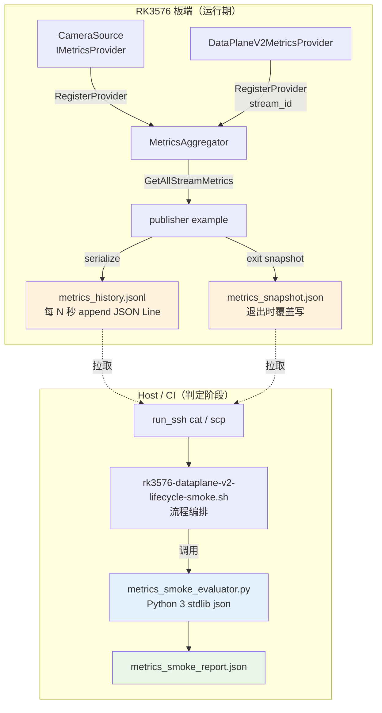
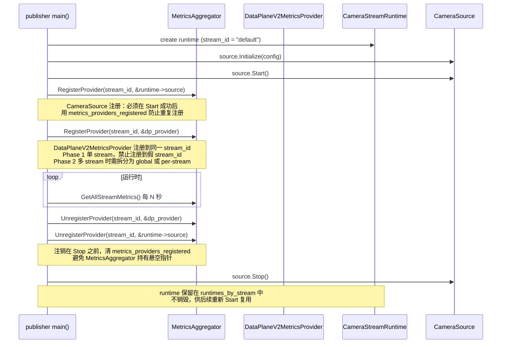

# 板端 Metrics Smoke 自动判定架构设计

**文档版本:** v1.3<br>
**设计日期:** 2026-05-14<br>
**设计范围:** RK3576 板端 `StreamMetrics` + `IMetricsProvider` + `MetricsAggregator` 接入 smoke 自动判定<br>
**前提约束:** 不改 DataPlaneV2 协议、不引入外部依赖、不扩大 Web/Codec 功能<br>
**关联文档:** `docs/ARCHITECTURE_REVIEW.md` (ARCH-009)、`docs/METRICS_INTERFACE_DESIGN.md`、`AGENTS.md`<br>
**文档状态:** 编码就绪（编码前最后修订版）

> **文档硬规范**
>
> - 本项目的系统架构图、模块框图、部署拓扑图、数据路径框图和工程结构框图必须使用 `architecture-diagram` skill 生成独立 HTML / inline SVG 图表产物；每个 HTML 图必须同步导出同名 `.svg`，Markdown 中默认直接显示 SVG，并附完整 HTML 图表链接。
> - 时序图、状态机图、纯目录结构图等仍使用 Mermaid fenced code block（语言标识为 `mermaid`）。
> - 禁止新增 ASCII art/text 框图；普通日志、命令输出、代码片段按其原始语言使用 fenced code block。
> - 每份项目文档必须在文档元信息和硬规范之后维护 `## 目录`，目录至少覆盖二级标题，并使用相对链接或页内锚点。
>
> **本图说明**：本文档中的 Mermaid 图仅为**流程草图**，用于说明数据流向和判定阶段划分，非正式系统架构图。正式架构图以 `docs/ARCHITECTURE_REVIEW.md` 中的 SVG 为准。

---

## 目录

- [1. 设计目标与约束](#1-设计目标与约束)
- [2. 架构总览](#2-架构总览)
- [3. per-stream metrics snapshot 获取机制](#3-per-stream-metrics-snapshot-获取机制)
- [4. quick / full / extended 三档指标矩阵](#4-quick--full--extended-三档指标矩阵)
- [5. PASS/FAIL 阈值与失败原因分类](#5-passfail-阈值与失败原因分类)
- [6. 日志与产物输出格式](#6-日志与产物输出格式)
- [7. 单 USB 摄像头环境兼容](#7-单-usb-摄像头环境兼容)
- [8. MIPI sensor 到位后扩展路径](#8-mipi-sensor-到位后扩展路径)
- [9. MetricsAggregator provider 生命周期](#9-metricsaggregator-provider-生命周期)
- [10. 修改范围清单](#10-修改范围清单)
- [11. 风险清单与缓解](#11-风险清单与缓解)
- [12. 测试计划](#12-测试计划)
- [13. Phase 1 编码任务与退出码约定](#13-phase-1-编码任务与退出码约定)
- [14. 编码就绪检查清单](#14-编码就绪检查清单)

---

## 1. 设计目标与约束

### 1.1 一句话目标
将 `MetricsAggregator::GetAllStreamMetrics()` 的 per-stream 快照，通过**结构化文件导出 + Python 阈值判定**，取代现有基于日志 `grep` 的脆弱计数器提取，使 RK3576 板端 smoke 具备自动、可扩展、多 stream aware 的 PASS/FAIL 判定能力。

### 1.2 硬约束（必须满足）

| 约束 | 满足策略 |
|------|----------|
| **不改动 DataPlaneV2 协议** | 不修改 `camera_data_plane_v2.h` 任何结构、magic、version；release tracker/server 的既有 `GetServerStats()` / `PendingFrameCount()` 仅通过 C++ wrapper 实现 `IMetricsProvider::FillMetrics()`，协议层零变更 |
| **不引入外部依赖** | 板端 JSON 序列化使用 publisher example 内手写紧凑字符串拼接（只输出数字与固定枚举），不引入 nlohmann/json、rapidjson、Prometheus 等任何第三方库；host 侧解析使用 Python 标准库 `json`，不引入额外 pip 包 |
| **不扩大 Web/Codec 功能** | Web Gateway 与 codec_server 不新增任何 metrics provider、不暴露新接口；StreamMetrics 采集范围严格限定在 CameraSource、publisher 示例内的 DataPlaneV2/release 计数器；codec/web suites 保持原有判定逻辑，metrics smoke 只检测 publisher/subscriber 核心链路 |
| **兼容单 USB 摄像头** | 阈值按 USB UVC 帧率波动留 margin；`multi-camera-topology` 的 `REQUIRE_MIPI=0` 模式直接兼容；stream_id 按现有 `"default"` 或 `"usb0"` 规范化映射 |
| **后续可扩展 MIPI** | 阈值环境变量预留 `METRICS_USB_*` / `METRICS_MIPI_*` 前缀；MetricsAggregator 本身已按 `stream_id` 聚合，多路天然支持；脚本侧 `for stream in ${streams}` 循环结构已就绪 |

### 1.3 Signal 处理设计（编码硬性规则）

**禁止在 signal handler 内执行任何 I/O 操作（包括写 metrics snapshot）。**

```cpp
void SignalHandler(int signo)
{
    (void)signo;
    g_running.store(false);   // 唯一操作：通知主循环退出
}
```

**Final snapshot 写入位置**：必须在 `while (g_running.load())` 循环正常退出后、`control_server.Stop()` 之前完成：

```cpp
while (g_running.load()) { /* stats loop */ }

// === 退出路径：先写 final snapshot ===
if (!metrics_snapshot_path.empty()) {
    const auto final_metrics = metrics_aggregator.GetAllStreamMetrics();
    WriteMetricsSnapshot(final_metrics, metrics_snapshot_path);  // 同步写，阻塞 < 10ms
}

// === 再停止各 server ===
control_server.Stop();
release_server.Stop();
data_server.Stop();
data_v2_server.Stop();

// === 再停止 source、清理 runtime ===
// ...
```

**Rationale**：signal handler 中调用非异步信号安全函数（如 `write`、`fopen`、`malloc`）是未定义行为；JSON 序列化涉及字符串拼接和文件 I/O，必须在正常线程上下文中执行。

### 1.4 JSON 解析实现策略（编码硬性规则）

| 层级 | 职责 | 实现 |
|------|------|------|
| **板端（C++）** | 手写 JSON Lines 序列化 | publisher example 内嵌 helper 函数，零依赖 |
| **Host 判定（Python）** | 解析 `metrics_history.jsonl`、执行阈值判定、生成 `metrics_smoke_report.json` | Python 3 标准库 `json`，不引入第三方包 |
| **Host  orchestration（bash）** | 文件拉取、调用 Python、退出码传递、环境变量透传 | `rk3576-dataplane-v2-lifecycle-smoke.sh` 纯 bash，负责流程编排 |
| **调试辅助（可选）** | 人工查看 JSON | `jq` 仅作为可选调试工具，不作为构建或运行依赖 |

**判定脚本结构（Phase 1）：**

```
rk3576-dataplane-v2-lifecycle-smoke.sh  # bash 主脚本：拉文件、调用 Python、做 subscriber/fd/cleanup 检查
└── scripts/metrics_smoke_evaluator.py  # Python 核心：解析 jsonl、做 metrics 阈值判定、生成 report
```

Phase 1 canonical 调用路径只有一条：lifecycle 脚本直接调用 Python evaluator，
不经过中间编排脚本。Python 脚本必须能在无 `jq` 的环境中独立运行；
bash 脚本若检测到 `python3` 不存在，应报错并退出码 2（环境缺失，与判定 FAIL 区分）。

**职责边界**：
- `metrics_smoke_evaluator.py` **仅负责** `streams[]` + `global` 的 metrics 阈值判定
- `rk3576-dataplane-v2-lifecycle-smoke.sh` **负责** subscriber 日志 grep、fd drift 检查、
  cleanup 检查，并调用 Python evaluator 做 metrics 判定

---

## 2. 架构总览



**核心原则：**
1. **聚合由 C++ core 完成**：`MetricsAggregator` 是唯一的 per-stream 合并点，Python 判定脚本不重复计算。
2. **导出由应用层完成**：文件写入是 publisher example 的应用层行为，不属于 core 库职责，core 库保持零 I/O。
3. **判定由 Python 完成**：Python 脚本只读产物文件，不侵入进程内存，不新增板端常驻服务。
4. **编排由 bash 完成**：bash 脚本负责 SCP/SSH、环境变量归一化、调用 Python、传递退出码。

---

## 3. per-stream metrics snapshot 获取机制

### 3.1 当前 Gap 说明

| Gap | 现状 | 本方案处理 |
|-----|------|-----------|
| **Gap A: DataPlaneV2 指标未入 pipeline** | `v2_sent_frame_count` / `release_pending_count` 等由 publisher example 的全局原子计数器直接打印，不经过 `IMetricsProvider` | 新增一个**无状态的 `DataPlaneV2MetricsProvider` wrapper**（无独立线程、无锁、只读全局原子计数器），在 publisher example 中注册到 MetricsAggregator。**Phase 1 只支持单 stream**，`DataPlaneV2MetricsProvider` 注册到该唯一 `stream_id`（如 `"default"`），与 `CameraSource` 共享同一 stream_id。多 stream 场景（需 per-stream dataplane 指标）标注为 **Phase 2**，暂缓 |
| **Gap B: 无结构化导出** | 现有 `FormatForLog()` 输出人类可读单行，但字段顺序不固定、无机器解析契约 | 新增**紧凑 JSON Lines 导出模式**，与 `FormatForLog()` 并存，互不替代 |

> **关于 FrameBroker 的说明**：`FrameBroker` 已实现 `IMetricsProvider::FillMetrics()`，但当前 `camera_publisher_example.cpp`**没有实例化 FrameBroker**（publisher 直接通过 `DataSocketServer` / `DataPlaneV2SocketServer` 发送帧）。因此 Phase 1 的 publisher example **无法提供** `broker_*` 指标。`broker_*` 字段在 Phase 1 metrics smoke 中标记为 `N/A`，其验证保留在 `tests/stress/` 和 `tests/unit/` 中。后续若 publisher example 引入 FrameBroker，按第 9 节生命周期规范注册即可自动启用。

### 3.2 快照导出方案

**方案对比：**

| 方案 | 优点 | 缺点 | 结论 |
|------|------|------|------|
| A. `--metrics-snapshot-path` 退出时覆盖 | 文件小，读取简单；作为兜底 | 无趋势历史 | **辅助兜底** |
| B. `--metrics-history-path` JSON Lines append | 保留时序，支持趋势判定；与现有 `SAMPLE_INTERVAL_SEC` 对齐 | 文件大小增长（每行 < 400B，60s 约 5KB） | **主方案** |
| C. Unix Socket 查询 | 实时性好 | 需新增 socket 生命周期管理，扩大 publisher 复杂度 | **超出范围** |

**选定：方案 B（JSON Lines history）为主，方案 A（exit snapshot）为辅。**

### 3.3 publisher example 参数扩展

新增 CLI 参数（仅影响示例程序，不影响 core 库）：

```text
--metrics-history-path PATH      # 若指定，每 metrics-history-interval 秒将
                                 # GetAllStreamMetrics() 序列化为 JSON Line append 到 PATH
--metrics-history-interval N     # 采样间隔，默认 5 秒，与 smoke SAMPLE_INTERVAL_SEC 对齐
--metrics-snapshot-path PATH     # 若指定，进程退出路径中（while 循环结束后、server stop 前）
                                 # 将最终快照写入 PATH（覆盖写），用于兜底判定
```

### 3.4 JSON Line 格式契约与数据来源边界

板端 JSON writer 有两个独立的数据来源，必须在文档中明确边界：

| 段 | 数据来源 | 生成方式 |
|----|----------|----------|
| `streams[]` | `MetricsAggregator::GetAllStreamMetrics()` | 遍历 aggregator 返回的 `vector<StreamMetrics>`，每个元素序列化为 JSON object |
| `global` | publisher example 的 `PublisherStats` + `release_server` | 直接读取 `stats.v2_sent_frames`、`stats.v2_send_fail_count`、`release_server.PendingFrameCount()`、`release_server.GetServerStats()` |

**为什么 `global` 不来自 MetricsAggregator？**
- `PublisherStats`（`stats.v2_sent_frames` 等）和 `CameraReleaseServer` 是 publisher example 中的**全局单例**，不隶属于任何 stream
- MetricsAggregator 的 `GetAllStreamMetrics()` 按 `stream_id` 聚合，全局计数器没有对应的 `stream_id`
- 若强制把全局计数器塞进某个 stream 的 `StreamMetrics`，会在多 stream 时产生**错误归因**（同一全局值被复制到多路）
- 因此 `global` 段由 JSON writer 独立生成，与 `streams[]` 解耦

格式约定：
- 单行紧凑 JSON，无换行、无缩进
- 字段名使用下划线小写，与 `StreamMetrics` 成员名保持一致
- `stream_id` 仅包含 `[a-zA-Z0-9_]`，无需转义
- 所有数值字段为整数，无浮点；`source_degraded` 为布尔值 `true`/`false`

Phase 1（单 stream）示例：

```json
{"timestamp_ns":1715698935000000000,"streams":[{"stream_id":"default","capture_frame_count":1848,"capture_dropped_count":0,"dma_buf_frame_count":1848,"lease_exhausted_count":0,"active_lease_count":0,"broker_published_count":0,"broker_dispatched_count":0,"broker_dropped_count":0,"broker_queue_depth":0,"broker_subscriber_count":0,"v2_sent_frame_count":3696,"v2_send_failure_count":0,"release_pending_count":0,"release_timeout_count":0,"release_reclaimed_count":3696,"disconnection_count":0,"recovery_attempt_count":0,"current_state":2,"source_degraded":false,"source_requested_fps":30,"source_current_target_fps":30,"source_degradation_count":0,"source_degradation_recovery_count":0,"source_degradation_failure_count":0}],"global":{"v2_sent_frame_count":3696,"v2_send_failure_count":0,"release_pending_count":0,"release_timeout_count":0,"release_reclaimed_count":3696}}
```

**关键设计**：即使单 stream 时也保留 `global` 段，使 Python 解析逻辑统一；Phase 2 多 stream 时，`streams[]` 中各元素的 `v2_*` / `release_*` 字段由对应 stream 的 provider 填充（若已实现 per-stream 计数），`global` 段继续保留用于汇总或兼容性。Phase 1 中 `DataPlaneV2MetricsProvider` 同时填充 `streams[0]` 的 `v2_*` / `release_*` 字段和 `global` 段的同名字段，两者值相同。

### 3.5 采样与读取时序

```
T0:  smoke 脚本启动 publisher（带 --metrics-history-path ${BOARD_DIR}/metrics_history.jsonl）
T0~T1:  publisher 每 N 秒 append 一行 JSON
T1:  smoke 脚本向 publisher 发送 SIGTERM
T1+1s:  publisher while 循环退出，写 final snapshot，停 server，停 source，退出
T1+2s:  smoke 脚本 run_ssh "cat ${BOARD_DIR}/metrics_history.jsonl" > local_metrics.jsonl
T1+3s:  smoke 脚本调用 Python 执行阈值判定
```

---

## 4. quick / full / extended 三档指标矩阵

### 4.1 三档定位

| 档位 | 目标 | 时长参考 | 场景 |
|------|------|----------|------|
| **quick** | 验证"核心链路有数据、无硬错误" | ~15-30s | 每日快速回归、提交前验证 |
| **full** | 验证"单路稳定运行、零泄漏、零异常计数器" | ~60-90s | 合入前完整检查、夜间 CI |
| **extended** | 验证"趋势稳定" | ~5-8m | 版本发布前、重大重构后 |

### 4.2 各档位检查指标矩阵

**数据来源图例：**
- 📊 `StreamMetrics`：来自 `metrics_history.jsonl` 中的 `streams[i]` 或 `global`
- 📄 `subscriber log`：来自 `subscriber-*.log` 中的 summary 行（现有 grep 方式，subscriber 暂无 IMetricsProvider）
- 🔍 `fd sample`：来自 `fd_samples.log`（现有 `/proc/$pid/fd` 采样）
- 🧹 `cleanup check`：来自 `lifecycle_status.log`（现有进程/socket 残留检查）

#### quick 档（最小可用）

| check_id | 数据来源 | 阈值 | 说明 |
|----------|----------|------|------|
| `capture_min_frames` | 📊 StreamMetrics `capture_frame_count` | `>= N * FPS * 0.5` | USB 快速验证，允许 50% 帧率波动 |
| `capture_zero_dropped` | 📊 StreamMetrics `capture_dropped_count` | `== 0` | 无采集丢帧 |
| `v2_min_sent` | 📊 StreamMetrics/global `v2_sent_frame_count` | `>= N * FPS * 0.5 * subscriber_count` | DataPlaneV2 有数据发出 |
| `v2_zero_failures` | 📊 StreamMetrics/global `v2_send_failure_count` | `== 0` | 无发送失败 |
| `disconnection_count` | 📊 StreamMetrics `disconnection_count` | `== 0` | quick 不测试断连，要求零断连 |
| `source_not_degraded` | 📊 StreamMetrics `source_degraded` | `== false` | 不允许降级 |
| `subscriber_min_frames` | 📄 subscriber log `frames` | `>= N * FPS * 0.4` | 每个 subscriber 收到足够帧 |
| `subscriber_save_fail` | 📄 subscriber log `save_fail` | `== 0` | subscriber 零保存失败 |
| `subscriber_release_fail` | 📄 subscriber log `release_fail` | `<= METRICS_MAX_SUBSCRIBER_RELEASE_FAIL` | subscriber release 失败次数在容忍范围内 |

#### full 档（标准稳定）

包含 quick 全部检查（阈值收紧），并新增：

| check_id | 数据来源 | 阈值 | 说明 |
|----------|----------|------|------|
| `capture_min_frames` | 📊 StreamMetrics `capture_frame_count` | `>= N * FPS * 0.7` | 帧率容忍降至 30% |
| `lease_exhausted` | 📊 StreamMetrics `lease_exhausted_count` | `== 0` | 无 lease 耗尽 |
| `active_leases_max` | 📊 StreamMetrics `active_lease_count` | `<= subscriber_count * 2` | lease 不泄漏 |
| `release_pending_max` | 📊 StreamMetrics/global `release_pending_count` | `<= subscriber_count` | 允许正常 inflight |
| `release_timeout` | 📊 StreamMetrics/global `release_timeout_count` | `== 0` | 无 release 超时 |
| `subscriber_release_fail` | 📄 subscriber log `release_fail` | `<= METRICS_MAX_SUBSCRIBER_RELEASE_FAIL` | subscriber release 失败次数在容忍范围内 |
| `fd_publisher_drift` | 🔍 `fd_samples.log` | `<= 4` | 保留现有 fd 泄漏检查 |
| `fd_subscriber_drift` | 🔍 `fd_samples.log` | `<= 4` | 保留现有 fd 泄漏检查 |
| `cleanup_no_process` | 🧹 `lifecycle_status.log` | `remaining == 0` | 进程无残留 |
| `cleanup_no_socket` | 🧹 `lifecycle_status.log` | `sockets_left == 0` | socket 无残留 |

#### extended 档（趋势与故障）

包含 full 全部检查，并新增趋势分析：

| check_id | 数据来源 | 阈值 | 说明 |
|----------|----------|------|------|
| `capture_monotonic` | 📊 StreamMetrics `capture_frame_count` 时序 | 每采样点严格递增 | 检测卡顿/冻结 |
| `queue_depth_stable` | 📊 StreamMetrics `broker_queue_depth` 时序 | 任意连续 3 点增长不超过 5 | 检测队列堆积。当前 publisher example 无 FrameBroker，此检查在 Phase 1 恒为 **SKIP**（待接入 FrameBroker 后启用） |
| `degradation_recovery` | 📊 StreamMetrics `degradation_count/recovery_count/degraded` | 若降级触发过，则 `recovery_count > 0` 且最终 `degraded == false` | 验证恢复闭环 |

> **明确移除的 check_id（原设计中有但无 StreamMetrics 字段支撑）：**
> - `dmabuf_export_fail`：不在 `StreamMetrics` 中，也不在 `global` 中。当前由 `CameraSource::GetDmaBufExportFailureCount()` 提供，是运行时方法调用而非快照字段。Phase 1 不纳入自动判定，保留在 publisher.log 中供人工排查。若后续需自动判定，必须扩展 `StreamMetrics` 或 `global`。
> - `broker_dispatched_min` / `broker_zero_drops`：依赖 `broker_*` 字段，但 publisher example 无 FrameBroker，这些字段恒为 0，无法做有效判定。Phase 1 移除，待 publisher example 引入 FrameBroker 后启用。


---

## 5. PASS/FAIL 阈值与失败原因分类

### 5.1 环境变量命名与优先级

**外层 smoke suite 使用 `TIER` 变量**（与现有 `rk3576-board-smoke-suite.sh` 保持一致）。**metrics 判定脚本内部归一化规则：**

```bash
# 归一化逻辑（写在 rk3576-dataplane-v2-lifecycle-smoke.sh 开头）
METRICS_TIER="${METRICS_TIER:-${TIER:-full}}"
```

即：若 `METRICS_TIER` 已显式设置，优先使用；否则回退到外层传入的 `TIER`；再否则默认 `full`。

所有阈值统一前缀 `METRICS_`，按维度分组：

```bash
# 通用
METRICS_TIER=quick|full|extended          # 档位选择，内部归一化后使用
METRICS_DURATION_SEC=60                   # 测试时长
METRICS_SUBSCRIBER_COUNT=2                # 预期订阅者数
METRICS_REQUESTED_FPS=0                   # 0 表示不覆盖，使用 stream.source_requested_fps

# 采集层（StreamMetrics）
METRICS_MIN_CAPTURE_FRAMES=900            # 覆盖计算后的最小值
METRICS_MAX_CAPTURE_DROPPED=0

# 数据面（StreamMetrics / global）
METRICS_MAX_V2_SEND_FAILURE=0
METRICS_MAX_RELEASE_PENDING=2
METRICS_MAX_RELEASE_TIMEOUT=0
METRICS_MAX_ACTIVE_LEASES=4
METRICS_MAX_LEASE_EXHAUSTED=0

# 健康状态（StreamMetrics）
METRICS_ALLOW_DEGRADED=0                  # 0=不允许，1=允许（USB 低压场景）
METRICS_MAX_DISCONNECTION=0               # full 档预期零断连；failover 脚本覆盖为 >0
METRICS_EXPECTED_STATE=2                  # SourceState::kStreaming = 2

# subscriber（subscriber log grep）
METRICS_MIN_SUBSCRIBER_FRAMES=20
METRICS_MAX_SUBSCRIBER_RELEASE_FAIL=2
METRICS_MAX_SUBSCRIBER_SAVE_FAIL=0

# fd / cleanup（保留现有）
METRICS_MAX_PUBLISHER_FD_DRIFT=4
METRICS_MAX_SUBSCRIBER_FD_DRIFT=4
METRICS_CHECK_CLEANUP=1
```

### 5.2 失败原因分类（Category Code）

| 类别代码 | 含义 | 典型触发 | 严重级别 |
|----------|------|----------|----------|
| `METRICS_CAPTURE_FAIL` | 采集层异常 | `capture_frame_count < MIN`、`capture_dropped > 0`、`disconnection_count > MAX` | P0 |
| `METRICS_BROKER_FAIL` | 分发层异常 | `broker_dropped > 0`、`queue_depth` 持续增长。Phase 1 暂不触发（broker 字段恒为 0） | P0 |
| `METRICS_DATAPLANE_FAIL` | 数据面传输/回收异常 | `v2_send_failure > 0`、`release_timeout > 0`、`active_leases` 泄漏 | P0 |
| `METRICS_DEGRADATION_FAIL` | 降级策略异常 | `source_degraded == true`（unexpected）、`cur_fps < req_fps * 0.8`、`degradation_failure > 0` | P1 |
| `METRICS_RECOVERY_FAIL` | 恢复机制异常 | failover 后 `recovery_attempt == 0`、最终 `state != Running` | P1 |
| `METRICS_FD_LEAK` | 句柄泄漏 | `fd_drift > MAX`（保留现有 `/proc/$pid/fd` 采样逻辑） | P1 |
| `METRICS_SUBSCRIBER_FAIL` | 订阅端异常 | subscriber `frames < MIN`、`save_fail > 0`、`release_fail > MAX` | P0 |
| `METRICS_CLEANUP_FAIL` | 清理异常 | 进程/socket 残留（保留现有逻辑） | P1 |
| `METRICS_TREND_FAIL` | 趋势异常（extended 独有） | `capture_frame_count` 停滞、`queue_depth` 单调增 | P1 |

### 5.3 判定逻辑

```python
# metrics_smoke_evaluator.py 伪代码
for stream in report["streams"]:
    for check in stream_checks[tier]:
        actual = get_value(stream, check.source_field)
        if not check.passes(actual):
            record_fail(check.category, check.check_id, actual, check.threshold)

for check in global_checks[tier]:
    actual = get_value(global, check.source_field)
    if not check.passes(actual):
        record_fail(check.category, check.check_id, actual, check.threshold)

for check in external_checks[tier]:  # subscriber log, fd, cleanup
    actual = extract_from_external_source(check.source)
    if not check.passes(actual):
        record_fail(check.category, check.check_id, actual, check.threshold)

result = "FAIL" if any_failures else "PASS"
```

---

## 6. 日志与产物输出格式

### 6.1 终端/标准输出（人类可读）

保持与现有 smoke 脚本一致的 `key=value` 风格，但增加结构化层次：

```text
=== Stream Metrics Smoke Report ===
tier=full duration=60s device=/dev/video45 streams=1

[stream=default]
  capture: total=1848 dropped=0 dmabuf=1848
  dataplane: v2_sent=3696 v2_fail=0 release_pending=0 release_timeout=0
  health: degraded=false fps=30/30 state=Streaming(2) disconnections=0
  [PASS] capture_min_frames (1848 >= 1260)
  [PASS] capture_zero_dropped (0 == 0)
  [SKIP] broker_zero_drops (publisher example 未接入 FrameBroker)
  ...

[global]
  [PASS] v2_min_sent (3696 >= 1800)
  [PASS] v2_zero_failures (0 == 0)

[external]
  [PASS] subscriber-1.min_frames (920 >= 720)
  [PASS] fd_publisher_drift (2 <= 4)
  [PASS] cleanup_no_process (0 == 0)

result=PASS checks_passed=12/12 skipped=1 categories=[]
```

FAIL 示例：
```text
  [FAIL] capture_min_frames (800 >= 1260) category=METRICS_CAPTURE_FAIL
```

### 6.2 机器可读产物（`metrics_smoke_report.json`）

smoke 脚本在本地 `logs/` 目录生成该文件，**仅包含 metrics 判定结果**
（`streams[]` + `global` 检查），支持 CI 解析：

> **注意**：subscriber 日志检查、fd drift、cleanup 检查由 shell lifecycle 脚本独立执行，
> **不写入** `metrics_smoke_report.json`。报告中的 `summary` 仅反映 metrics 维度，
> 不代表整体验收结果。

```json
{
  "tier": "full",
  "duration_sec": 60,
  "device": "/dev/video45",
  "result": "FAIL",
  "timestamp_iso": "2026-05-14T14:32:15Z",
  "streams": [
    {
      "stream_id": "default",
      "metrics_snapshot_final": { "capture_frame_count": 1848, "capture_dropped_count": 0, "...": "..." },
      "checks": [
        {"check_id": "capture_min_frames", "category": "METRICS_CAPTURE_FAIL", "result": "PASS", "actual": 1848, "threshold": 1260, "op": ">="},
        {"check_id": "broker_zero_drops", "category": "METRICS_BROKER_FAIL", "result": "SKIP", "reason": "FrameBroker not wired in publisher example"}
      ]
    }
  ],
  "global_checks": [
    {"check_id": "v2_min_sent", "result": "PASS", "actual": 3696, "threshold": 1800}
  ],
  "summary": {
    "passed": 11,
    "failed": 0,
    "skipped": 1,
    "failed_categories": []
  }
}
```

### 6.3 与现有产物共存

- 保留 `publisher.log`、`subscriber-*.log`、`fd_samples.log`、`lifecycle_status.log`
- 新增 `metrics_history.jsonl`（从板端拉回）、`metrics_snapshot.json`（从板端拉回，可选）、`metrics_smoke_report.json`（本地生成）
- 现有 dataplane-lifecycle-smoke.sh 中的 **publisher counter grep 判定被 metrics 判定替代**，subscriber summary grep、fd drift、cleanup 检查保留

---

## 7. 单 USB 摄像头环境兼容

### 7.1 当前硬件事实

- 仅 `/dev/video45` 可用，为 USB UVC 摄像头
- RKISP/RKVpss MPLANE 节点（`/dev/video22/23/31/32/41`）已做 readiness probe，但无真实 MIPI sensor，无法 STREAMON
- USB 摄像头已通过 DMA-BUF EXPBUF + DataPlaneV2 fd 传递验证（ARCH-010B）

### 7.2 兼容策略

| 方面 | 策略 |
|------|------|
| **单路 stream_id** | publisher example 当前单路时 stream_id 为 `"default"`。metrics smoke 脚本从 metrics 文件读取实际 `stream_id`，不硬编码 `"usb0"` |
| **无 MIPI 时不检查多路** | `multi-camera-topology` 现有 `REQUIRE_MIPI=0` 模式只启动 USB；metrics smoke 在 `stream_count == 1` 时跳过 `multi_stream_consistency` 检查 |
| **帧率容忍** | USB UVC 帧率受光照、总线带宽影响。`MIN_CAPTURE_FRAMES` 按 `duration * fps * 0.7`（full）或 `0.5`（quick）计算，extended 档使用"单调递增"替代绝对数量作为主要判据 |
| **DMA-BUF 严格性** | 当前 RK3576 `/dev/video45` 实测 DMA-BUF 已通。`dma_buf_frame_count` 已纳入 StreamMetrics，可作为 health indicator，但 `export_fail` 不在 StreamMetrics 中，Phase 1 不做自动判定 |
| **subscriber 数量** | 默认 2 个 subscriber，与现有 lifecycle smoke 一致；单 USB 环境下 subscriber 竞争同一数据 socket，但 DataPlaneV2 已验证双订阅者长稳 |

---

## 8. MIPI sensor 到位后扩展路径

### 8.1 零改动扩展点

`MetricsAggregator` 已按 `stream_id` 聚合，`GetAllStreamMetrics()` 返回 `vector<StreamMetrics>`，天然支持多路。MIPI 接入后：

1. **stream_id 命名**：遵循现有 `MULTI_CAMERA_ARCHITECTURE.md` 约定，如 `"mipi0"`、`"mipi1"`
2. **MetricsAggregator 自动聚合**：无需修改 core 库，publisher example 启动 MIPI runtime 时自动 `RegisterProvider("mipi0", &mipi_source)`
3. **smoke 脚本自动适配**：JSON Lines 中的 `streams` 数组长度变为 N，Python 脚本循环处理即可

### 8.2 需要补充的扩展（非本方案实施）

| 扩展项 | 时机 | 说明 |
|--------|------|------|
| **per-stream-type 阈值** | MIPI 首次接入后 | 新增 `METRICS_MIPI_MIN_CAPTURE_FRAMES` 等环境变量；MIPI 通常帧率更稳定，阈值可严于 USB |
| **publisher example 引入 FrameBroker** | 需要时 | 当 publisher example 引入 FrameBroker 后，按第 9 节生命周期注册 provider，`broker_*` 指标自动生效，`broker_zero_drops` / `queue_depth_stable` 检查从 SKIP 变为 ACTIVE |
| **per-stream DataPlaneV2 指标** | 需要时 | 当前 `v2_sent_frame_count` 等为全局计数。若需 per-stream 区分，需在 `DataPlaneV2SocketServer` / `CameraReleaseServer` 中增加 `std::unordered_map<stream_id, counters>`，再让 `DataPlaneV2MetricsProvider` 按 stream 填充 |
| **MPLANE per-plane 指标** | 需要时 | 可扩展 `StreamMetrics` 增加 `plane_count` 与 `per_plane_dma_buf_count` |
| **multi-camera-topology 联合判定** | MIPI + USB 同时运行 | 现有 `rk3576-multi-camera-topology-smoke.sh` 已有 `USB_DEVICE` 和 `MIPI_DEVICES` 环境变量，metrics smoke 直接为其增加 `--metrics-history-path` 参数即可 |

### 8.3 ARCH-010C 衔接

`mplane_dmabuf_probe` 当前只验证 `REQBUFS + QUERYBUF + EXPBUF`。MIPI sensor 到位后：
- `mplane-readiness` suite 保持现有探针逻辑
- `dataplane-lifecycle` / `multi-camera-topology` suite 增加 MIPI stream 的 metrics 检查
- `StreamMetrics.capture_frame_count` 和 `dma_buf_frame_count` 是验证 MPLANE live STREAMON 是否成功的最直观指标（从 0 开始增长即证明 DQBUF 有真实帧）

---

## 9. MetricsAggregator provider 生命周期

### 9.1 Phase 1 涉及的 Provider

当前 `camera_publisher_example.cpp` 实际使用的模块：

| Provider | 类型 | 生命周期Owner | 注册时机 | 注销时机 |
|----------|------|--------------|----------|----------|
| `CameraSource` | per-stream | `CameraStreamRuntime` | `source.Start()` **成功后**，通过 `runtime->metrics_providers_registered` 状态位避免重复注册 | stop callback 中、`source.Stop()` **之前**；注销后清 `metrics_providers_registered = false` |
| `DataPlaneV2MetricsProvider` | per-stream（Phase 1 绑定到唯一 stream_id） | publisher example `main()` | 与 `CameraSource` 同一次 `source.Start()` 成功后注册；共用 `metrics_providers_registered` 状态位 | 与 `CameraSource` 同一次 stop callback 中注销 |

**字段映射（DataPlaneV2MetricsProvider::FillMetrics 填充到 StreamMetrics）：**

| StreamMetrics 字段 | 数据来源（publisher example 全局对象） |
|-------------------|--------------------------------------|
| `v2_sent_frame_count` | `stats.v2_sent_frames` |
| `v2_send_failure_count` | `stats.v2_send_fail_count` |
| `release_pending_count` | `release_server.PendingFrameCount()` |
| `release_timeout_count` | `release_server.GetServerStats().expired_reclaims` |
| `release_reclaimed_count` | `release_server.GetServerStats().reclaimed_frames` |

### 9.2 注册/注销时序图（Mermaid）



### 9.3 防止悬空指针的规则

1. **注册必须在对象构造完成后、使用开始前**
2. **注销必须在对象停止使用后、析构前**
3. **MetricsAggregator 不拥有 provider 所有权**，只保存裸指针，由 caller（publisher example）保证生命周期
4. **若 runtime 被 `shared_ptr` 管理**，注销后应将 `runtime` 从 `runtimes_by_stream` 中移除，再销毁 `runtime`
5. **DataPlaneV2MetricsProvider 作为 main() 栈对象或 static 对象**，其生命周期覆盖整个进程运行期，最后注销

### 9.4 FrameBroker 生命周期规范（后续接入时遵循）

当 publisher example 引入 FrameBroker 后，遵循以下规范：

| Provider | 类型 | 生命周期Owner | 注册时机 | 注销时机 |
|----------|------|--------------|----------|----------|
| `FrameBroker` | per-stream 或 global | `CameraStreamRuntime` 或 main() | `broker.Start()` 之后、首个 subscriber 订阅前 | `broker.Stop()` 之后、runtime 销毁前 |

**注意**：当前 `FrameBroker` 在 stress test 中是全局单例，为所有 stream 服务。若 publisher example 引入 FrameBroker，Phase 1 单 stream 时注册到该唯一 `stream_id`；Phase 2 多 stream 时的注册方式由彼时架构决定，本文档不做预设。

---

## 10. 修改范围清单

### 10.1 新增文件

| 文件 | 说明 |
|------|------|
| `scripts/metrics_smoke_evaluator.py` | Python 3 判定核心：解析 `metrics_history.jsonl`、执行阈值判定、生成 `metrics_smoke_report.json` |
| `tests/fixtures/metrics_pass.jsonl` | PASS fixture |
| `tests/fixtures/metrics_fail_capture_drop.jsonl` | FAIL fixture（capture drop） |
| `tests/fixtures/metrics_fail_stall.jsonl` | extended tier stall fixture |
| `docs/design/BOARD_METRICS_SMOKE_DESIGN.md` | 本文档（架构设计） |

### 10.2 修改文件

#### 脚本层

| 文件 | 修改内容 |
|------|----------|
| `scripts/rk3576-dataplane-v2-lifecycle-smoke.sh` | ① 启动 publisher 时传入 `--metrics-history-path ${BOARD_DIR}/metrics_history.jsonl --metrics-history-interval ${SAMPLE_INTERVAL_SEC} --metrics-snapshot-path ${BOARD_DIR}/metrics_snapshot.json`；② 停止后拉回 `metrics_history.jsonl`（优先）或 `metrics_snapshot.json`（兜底）；③ **直接调用 `metrics_smoke_evaluator.py` 替代现有 publisher counter grep 判定**，保留 subscriber summary grep、fd drift、cleanup 检查；④ 默认 `REQUESTED_FPS=15` 并显式传给 evaluator，适配 RK3576 单 USB 实际帧率 |

#### C++ 代码层

| 文件 | 修改内容 |
|------|----------|
| `examples/camera_publisher_example.cpp` | ① **新增 `DataPlaneV2MetricsProvider` wrapper**：封装 `stats.v2_sent_frames`、`stats.v2_send_fail_count`、`release_server.PendingFrameCount()`、`release_server.GetServerStats()`，实现 `IMetricsProvider::FillMetrics()`；② **注册 DataPlaneV2MetricsProvider**：在 `source.Start()` **成功后**注册到 MetricsAggregator（与 `CameraSource` 同一时机），通过 `runtime->metrics_providers_registered` 状态位防止重复注册/重复注销，**绑定到该唯一 stream_id**，**禁止注册到 `"__global__"` 假 stream**；③ **新增 JSON writer helper**：手写序列化 `streams[]`（来自 `GetAllStreamMetrics()`）和 `global`（来自 `PublisherStats` + `release_server`），`stream_id` 经过 `JsonEscapeString` 转义；④ **增加 CLI 参数解析**：`--metrics-history-path`、`--metrics-history-interval`、`--metrics-snapshot-path`；⑤ **stats 线程中追加 JSON Lines**；⑥ **while 循环退出后写 final snapshot**：在 `control_server.Stop()` 之前完成 |
| `tests/unit/test_metrics_aggregator.cpp` | 新增单测：验证 DataPlaneV2MetricsProvider 注册/注销后 GetAllStreamMetrics() 包含预期字段 |

#### 文档层

| 文件 | 修改内容 |
|------|----------|
| `docs/README.md` | 在"推荐阅读路径"和"文档职责边界"中增加本文档索引 |
| `docs/METRICS_INTERFACE_DESIGN.md` | 更新"扩展路线"章节，补充 Phase 2"板端 smoke 自动判定"设计；说明 JSON Lines 导出是应用层行为，非 core 库职责 |
| `docs/ARCHITECTURE_REVIEW.md` | 更新 ARCH-009 "下一步"列；更新第 9 节"下一阶段验收标准"第 1 条状态 |
| `CameraSubsystem/AGENTS.md` | 第 1 节更新 metrics smoke 状态；第 4 节 P1 第 3 项更新；第 6 节补充 metrics 产物路径 |
| `IMPLEMENTATION_STATUS.md` | 标记 metrics smoke 自动判定模块完成度 |

### 10.3 不修改的文件（明确边界）

| 文件/模块 | 理由 |
|-----------|------|
| `include/camera_subsystem/ipc/camera_data_plane_v2.h` | 不改 DataPlaneV2 协议 |
| `include/camera_subsystem/core/metrics.h` | `StreamMetrics` / `IMetricsProvider` / `MetricsAggregator` 接口已满足需求，无需变更 |
| `src/camera/camera_source.cpp` | `FillMetrics()` 已实现，无需修改 |
| `src/broker/frame_broker.cpp` | `FillMetrics()` 已实现，但 publisher example 未使用 FrameBroker，Phase 1 不修改 |
| `extensions/web_preview/` | 不扩大 Web 功能 |
| `extensions/codec_server/` | 不扩大 Codec 功能 |

---

## 11. 风险清单与缓解

| 风险 | 级别 | 描述 | 缓解策略 |
|------|------|------|----------|
| **DataPlaneV2MetricsProvider 竞争** | P1 | wrapper 读取 publisher example 中的非原子计数器可能导致撕裂值 | 确认现有 `stats.v2_sent_frames` 等计数器已是 `std::atomic<uint64_t>`；wrapper 严格只读不修改；若存在非原子计数器，先改为原子类型再接入 |
| **手写 JSON 解析失败** | P2 | 序列化代码 bug 导致 malformed JSON，Python 解析抛异常 | ① `JsonEscapeString()` helper 对 `stream_id` 做标准 JSON 字符串转义（`"`、`\`、控制字符）；② 其余字段均为数字或固定枚举，无需转义；③ Python 侧用 `try/except json.JSONDecodeError` 捕获，单行解析失败记 warning 并跳过，不导致整体 FAIL；④ 若有效样本数为 0（全部 malformed），返回退出码 2（输入错误），不返回 FAIL；⑤ Python fixture 测试验证解析兼容性 |
| **USB 帧率波动导致 flaky** | P2 | 低光照或总线竞争时 `capture_frame_count` 低于阈值，CI 不稳定 | ① quick/full 阈值按 `fps * 0.7` 留 margin；② extended 档以"单调递增"和"无异常计数器"为主，降低对绝对数量的敏感度；③ 提供 `METRICS_MIN_CAPTURE_FRAMES` 环境变量供特定板端覆盖 |
| **metrics 文件 I/O 失败** | P2 | 板端 `/tmp` 满、权限错误或 publisher 崩溃未 flush | ① publisher 对 `open/write` 失败写 warn 日志；② smoke 脚本检测文件存在且非空，若缺失直接报 `METRICS_CAPTURE_FAIL`（无法获取 metrics 视为采集异常）；③ 同时尝试读取 `metrics_snapshot.json` 兜底 |
| **与现有 grep 逻辑冲突** | P1 | 新旧两套判定在同一脚本中叠加，可能重复计数或矛盾 | 在 `rk3576-dataplane-v2-lifecycle-smoke.sh` 中，**用 metrics 判定完全替代**现有的 publisher counter grep 判定（保留 subscriber summary grep、fd drift、cleanup）；不叠加，只替换 |
| **多路扩展时阈值失效** | P2 | 单路设计的阈值环境变量在 MIPI 多路时不够用 | 环境变量命名预留 `METRICS_USB_*` / `METRICS_MIPI_*` / `METRICS_GLOBAL_*` 前缀；Python 脚本内部维护 `get_threshold(stream_id, check_id)` 映射函数，默认回退到全局值 |
| **引入额外板端负载** | P3 | 每 5s 手写 JSON 序列化 + 文件写入可能影响帧率 | JSON 长度 < 400B，写入 `/tmp`（tmpfs），耗时 < 1ms；采样频率与现有 `SAMPLE_INTERVAL_SEC` 一致，不新增线程；extended 档如需更高频采样，通过 `METRICS_HISTORY_INTERVAL` 调整，默认 5s 对采集无影响 |
| **Signal handler 中写 snapshot** | P0 | 若在 SIGTERM handler 中执行 I/O，属于未定义行为，可能崩溃或死锁 | **硬性规则**：signal handler 只设置 `g_running = false`；final snapshot 必须在 while 循环退出后的正常线程中写入。已在第 1.3 节明确 |
| **provider 悬空指针** | P1 | runtime 被提前销毁但 MetricsAggregator 中未注销 provider | 严格执行第 9 节生命周期：注销在 Stop 后、析构前；`UnregisterProvider` 后立即从 map/vector 中移除 runtime 引用 |

---

## 12. 测试计划

### 12.1 C++ 单元测试（本地，不依赖板端）

| 测试项 | 文件 | 验证内容 |
|--------|------|----------|
| Provider 注册/注销安全 | `tests/unit/test_metrics_aggregator.cpp`（新增 case） | 注册 mock provider → GetAllStreamMetrics() 包含其数据 → 注销 provider → GetAllStreamMetrics() 不再包含其数据。验证无悬空指针。Phase 1 不测试 `DataPlaneV2MetricsProvider` 本身（定义在 `camera_publisher_example.cpp` 内部，单元测试不可访问） |

> **C++ 单测可访问性说明**：`DataPlaneV2MetricsProvider` 类和 JSON writer helper 若留在 `camera_publisher_example.cpp` 内部（局部类或匿名 namespace），则 `tests/unit/test_metrics_aggregator.cpp` **无法直接访问**。Phase 1 不做拆分，JSON 契约的正确性由 **Python fixture 测试**覆盖。若后续需 C++ 侧强验证，应将 helper/provider 拆分到 `examples/metrics_helpers.h/.cpp` 并接入单测，不在 Phase 1 实施。

### 12.2 脚本单元测试（本地，不依赖板端）

| 测试项 | 方式 | 验证内容 |
|--------|------|----------|
| PASS fixture | `python3 scripts/metrics_smoke_evaluator.py --fixture tests/fixtures/metrics_pass.jsonl` | 构造一个模拟 60s 正常运行的 `metrics_history.jsonl`（capture 单调增、所有异常计数器为 0），验证输出 `result=PASS` |
| FAIL fixture | `python3 scripts/metrics_smoke_evaluator.py --fixture tests/fixtures/metrics_fail_capture_drop.jsonl` | 构造一个 `capture_dropped_count > 0` 的 fixture，验证输出 `result=FAIL`、category 包含 `METRICS_CAPTURE_FAIL` |
| trend FAIL fixture | `python3 scripts/metrics_smoke_evaluator.py --fixture tests/fixtures/metrics_fail_stall.jsonl --tier extended` | 构造一个 capture_frame_count 中途停滞的 fixture，验证 extended 档触发 `METRICS_TREND_FAIL` |
| 环境变量覆盖 | `METRICS_MIN_CAPTURE_FRAMES=100 python3 scripts/metrics_smoke_evaluator.py --fixture ...` | 验证阈值可被环境变量覆盖 |

### 12.3 板端集成测试（依赖 RK3576 硬件）

| 阶段 | 目标 | 命令 |
|------|------|------|
| **Step 1** | dataplane-lifecycle 单 USB 场景接入 metrics | `DEVICE=/dev/video45 ./scripts/rk3576-dataplane-v2-lifecycle-smoke.sh`（修改后版本） |
| **Step 2** | 验证 metrics_history.jsonl 生成与拉回 | 检查本地 `logs/rk3576-dataplane-v2-lifecycle-smoke/metrics_history.jsonl` 存在且非空 |
| **Step 3** | 验证 Python 判定输出 | 检查 `logs/rk3576-dataplane-v2-lifecycle-smoke/metrics_smoke_report.json` 的 `result` 字段 |
| **Step 4** | 验证与现有判定等价 | 对比新旧两种方式的判定结果（应均为 PASS），确认无 regression |
| **Step 5（暂缓）** | failover 场景 | 等 lifecycle 单场景稳定后，再修改 `rk3576-dataplane-v2-failover-smoke.sh` |
| **Step 6（暂缓）** | multi-camera-topology | 等 MIPI sensor 到位后再扩展 |

---

## 13. Phase 1 编码任务与退出码约定

### 13.1 文件清单与明确改动

#### 新增文件（5 个）

| 文件 | 明确改动 |
|------|----------|
| `scripts/metrics_smoke_evaluator.py` | ① 命令行参数 `--history PATH [--snapshot PATH] [--tier quick|full|extended] [--requested-fps N]`；② 逐行读取 `.jsonl`，`json.loads()` 每行，malformed 单行跳过并打印 warning；③ `--requested-fps` 默认 0（未覆盖），显式传入时优先于 `stream.source_requested_fps`，global 阈值在未覆盖时使用首个 stream 的 `source_requested_fps`；④ 如果有效样本数为 0，输出 `"result": "ERROR"` 并退出码 2；⑤ 否则执行阈值判定，生成 `metrics_smoke_report.json`，PASS 退出码 0，FAIL 退出码 1 |
| `tests/fixtures/metrics_pass.jsonl` | 构造 60s 正常运行的 12 行 JSON Lines（每 5s 一行），capture 单调增，所有异常计数器为 0，global 与 stream 字段一致 |
| `tests/fixtures/metrics_fail_capture_drop.jsonl` | 同上结构，但中间某行 `capture_dropped_count=3` |
| `tests/fixtures/metrics_fail_stall.jsonl` | 同上结构，但 extended 档下 capture_frame_count 在第 5 行后停滞 |
| `tests/fixtures/metrics_pass_snapshot.json` | 构造单条最终快照，覆盖 snapshot-only fallback 路径 |

#### 修改文件（2 个代码 + 2 个脚本）

| 文件 | 明确改动 |
|------|----------|
| `examples/camera_publisher_example.cpp` | ① **新增 `DataPlaneV2MetricsProvider` 类**（局部类或匿名 namespace 内），实现 `IMetricsProvider::FillMetrics()`，读取 `stats` 和 `release_server` 的全局计数器；② **注册到 MetricsAggregator**：在 `source.Start()` 成功后，与 `CameraSource` 使用同一 stream_id 注册，使用 `metrics_providers_registered` 防止重复注册/注销，**禁止 `"__global__"`**；③ **新增 `AppendMetricsLine()` / `MetricsToJsonLine()` helper**：手写 JSON，拼接 `timestamp_ns`、`streams[]`（来自 `GetAllStreamMetrics()`）和 `global`（来自 `stats` + `release_server`），`stream_id` 经 `JsonEscapeString()` 转义；④ **新增 CLI 参数**：`--metrics-history-path`、`--metrics-history-interval`、`--metrics-snapshot-path`；⑤ **stats 线程**：每 `metrics-history-interval` 秒 append JSON Lines；⑥ **while 循环退出后**：在 `control_server.Stop()` 之前，若 `--metrics-snapshot-path` 指定，则写 final snapshot（覆盖写） |
| `scripts/rk3576-dataplane-v2-lifecycle-smoke.sh` | ① 启动 publisher 时追加 `--metrics-history-path ${BOARD_DIR}/metrics_history.jsonl --metrics-history-interval ${SAMPLE_INTERVAL_SEC} --metrics-snapshot-path ${BOARD_DIR}/metrics_snapshot.json`；② kill publisher 后，先 `scp` 拉回 `metrics_history.jsonl`，若为空或不存在则尝试 `metrics_snapshot.json`；③ **删除现有的 publisher counter grep 判定代码**（`publisher_line` 提取、`check_eq` / `check_le` 等），改为**直接调用 `metrics_smoke_evaluator.py`**；④ 保留 subscriber summary grep、fd drift、`lifecycle_status.log` cleanup 检查；⑤ 正确透传 Python 退出码（0/1/2），exit 2 打印 ERROR 而非伪装成 FAIL |
| `tests/unit/test_metrics_aggregator.cpp` | 新增 1 个 TEST case：`ProviderUnregisterRemovesData`（注册/注销后 GetAllStreamMetrics 数据存在性验证）。Phase 1 不新增不可访问 helper 的测试 |
| `docs/README.md` | 已更新索引（见前文） |

#### 暂缓修改的文件

| 文件 | 暂缓原因 |
|------|----------|
| `scripts/rk3576-board-smoke-suite.sh` | 等 `stream-metrics` suite 自身验证通过后再接入 tier 列表，避免破坏现有 board-smoke-suite。Phase 2 |
| `scripts/rk3576-dataplane-v2-failover-smoke.sh` | 等 lifecycle 单场景稳定后再接入 metrics，避免同时改两个脚本增加回归难度 |
| `scripts/rk3576-multi-camera-topology-smoke.sh` | 无 MIPI sensor，无法验证多 stream 场景 |
| `src/broker/frame_broker.cpp` | publisher example 未使用 FrameBroker，无需修改 |

### 13.2 退出码约定

| 退出码 | 含义 | 触发条件 |
|--------|------|----------|
| **0** | PASS | 所有检查通过（含 SKIP），无 FAILED 项 |
| **1** | FAIL | 至少一个检查项不满足阈值，或外部检查（fd/cleanup/subscriber）失败 |
| **2** | ERROR（环境/输入错误） | 以下任一：① `python3` 不存在；② `metrics_history.jsonl` 和 `metrics_snapshot.json` 均不存在；③ 所有 JSON Lines 解析失败（有效样本数为 0）；④ final snapshot 解析失败且 history 无有效样本；⑤ 命令行参数错误 |

**传递规则**：
- `metrics_smoke_evaluator.py` 直接返回 0/1/2
- `rk3576-dataplane-v2-lifecycle-smoke.sh` 直接调用 evaluator 并透传其退出码；shell 阶段自身错误（如 `scp` 必需日志失败）返回 2

### 13.3 验证命令与预期结果

**本地 C++ 单元测试：**
```bash
cd CameraSubsystem
./scripts/build.sh
ctest --output-on-failure -R test_metrics_aggregator
# 预期：4/4 新增 tests passed，既有 tests 不回归
```

**本地 Python fixture 单测（无需板端）：**
```bash
cd CameraSubsystem
# PASS
python3 scripts/metrics_smoke_evaluator.py \
  --history tests/fixtures/metrics_pass.jsonl --tier full
# 预期：终端输出 result=PASS，退出码 0，生成 metrics_smoke_report.json

# FAIL（capture dropped）
python3 scripts/metrics_smoke_evaluator.py \
  --history tests/fixtures/metrics_fail_capture_drop.jsonl --tier full
# 预期：终端输出 result=FAIL，退出码 1，failed_categories 含 METRICS_CAPTURE_FAIL

# ERROR（空文件）
python3 scripts/metrics_smoke_evaluator.py \
  --history /dev/null --tier full
# 预期：终端输出 result=ERROR，退出码 2

# 环境变量覆盖
METRICS_MIN_CAPTURE_FRAMES=100 \
  python3 scripts/metrics_smoke_evaluator.py \
  --history tests/fixtures/metrics_pass.jsonl --tier full
# 预期：result=PASS，且 report 中 capture_min_frames 的 threshold 显示为 100
```

**RK3576 交叉编译：**
```bash
cd CameraSubsystem
./scripts/build-rk3576.sh
# 预期：编译通过，无新增警告
```

**板端 dataplane-lifecycle smoke（需 RK3576）：**
```bash
cd CameraSubsystem
DEVICE=/dev/video45 SKIP_BUILD=1 \
  ./scripts/rk3576-dataplane-v2-lifecycle-smoke.sh
# 预期：
# 1. 终端原有 publisher/subscriber/fd/cleanup 输出不变
# 2. 新增 metrics smoke 报告输出，result=PASS
# 3. 本地 logs/ 目录含 metrics_history.jsonl、metrics_smoke_report.json
# 4. 最终退出码 0
# 5. 与修改前 grep 判定结果一致（无 regression）
```

---

## 14. 编码就绪检查清单

- [x] 需求收敛到一句话，边界明确
- [x] 架构文档已阅读：`ARCHITECTURE_REVIEW.md` ARCH-009
- [x] 当前代码已调研：确认 publisher example 未使用 FrameBroker；确认 release_server stats 为全局；确认 signal handler 只设置 g_running
- [x] Signal 处理设计已修正：handler 只设标志位，final snapshot 在正常线程退出路径中完成
- [x] JSON 解析策略已修正：host 侧 Python 标准库 `json` 为主方案，bash 只负责编排，`jq` 为可选调试工具
- [x] 无 StreamMetrics 字段支撑的阈值已清理：`dmabuf_export_fail` REMOVED，`broker_*` Phase 1 SKIP；`subscriber_release_fail` 明确 ACTIVE 并标注从 subscriber log `release_fail` 提取
- [x] DataPlaneV2MetricsProvider 注册策略已修正：Phase 1 注册到实际唯一 `stream_id`（如 `"default"`），**禁止 `"__global__"` 假 stream**；多 stream 为 Phase 2 暂缓
- [x] JSON global 段来源边界已明确：`streams[]` 来自 `MetricsAggregator::GetAllStreamMetrics()`；`global` 由 publisher JSON writer 直接读取 `PublisherStats` + `release_server` 生成，不经过 MetricsAggregator
- [x] MetricsAggregator provider 生命周期已补充：注册点、注销点、销毁顺序、防悬空指针规则
- [x] 环境变量命名已统一：`TIER` 外层使用，`METRICS_TIER` 内部归一化，优先级明确
- [x] C++ 单测可访问性已修正：Phase 1 不测试 `camera_publisher_example.cpp` 内部不可访问的 helper/provider；C++ 只保留现有 `MetricsAggregator` 注册/注销测试；JSON 契约由 Python fixture 覆盖
- [x] malformed JSON 策略与退出码已明确：单行 malformed → warning 跳过；有效样本数为 0 或 snapshot 解析失败且 history 为空 → 退出码 2；FAIL → 1；PASS → 0
- [x] Phase 1 编码任务已输出：文件清单、每个文件的明确改动、暂缓项、验证命令、退出码约定
- [x] 测试计划已补充：C++ 单测、脚本 fixture 单测、板端分阶段集成测试
- [x] 文档索引规则已补充：`docs/README.md` 已更新索引；本文档已补齐项目硬规范；Mermaid 图已标注为流程草图
- [x] 风险清单已闭合，每项有明确缓解策略
- [x] 向后兼容：`FormatForLog()` 保留；现有 subscriber grep、fd drift、cleanup 检查保留
- [x] 不引入外部依赖：板端手写 JSON，host Python 3 stdlib

---

---

## 15. 最终结论

### 是否可以编码：**是**

### Phase 1 文件清单

**新增（4 个）：**
- `scripts/metrics_smoke_evaluator.py`
- `tests/fixtures/metrics_pass.jsonl`
- `tests/fixtures/metrics_fail_capture_drop.jsonl`
- `tests/fixtures/metrics_fail_stall.jsonl`

**修改（3 个）：**
- `examples/camera_publisher_example.cpp`
- `scripts/rk3576-dataplane-v2-lifecycle-smoke.sh`
- `docs/README.md`（已更新）

**文档同步（3 个，编码后可补）：**
- `docs/ARCHITECTURE_REVIEW.md`
- `CameraSubsystem/AGENTS.md`
- `IMPLEMENTATION_STATUS.md`

### Phase 1 验证命令

```bash
# 本地 Python fixture 单测（无需板端）
cd CameraSubsystem
python3 scripts/metrics_smoke_evaluator.py \
  --history tests/fixtures/metrics_pass.jsonl --tier full
# 预期：result=PASS，退出码 0

python3 scripts/metrics_smoke_evaluator.py \
  --history tests/fixtures/metrics_fail_capture_drop.jsonl --tier full
# 预期：result=FAIL，退出码 1

python3 scripts/metrics_smoke_evaluator.py \
  --history /dev/null --tier full
# 预期：result=ERROR，退出码 2

# 本地 C++ 构建与单测
cd CameraSubsystem
./scripts/build.sh
ctest --output-on-failure -R test_metrics_aggregator
# 预期：既有 tests 通过，新增的 ProviderUnregisterRemovesData 通过

# RK3576 交叉编译
./scripts/build-rk3576.sh
# 预期：编译通过

# 板端唯一验收命令（需 RK3576）
DEVICE=/dev/video45 SKIP_BUILD=1 \
  ./scripts/rk3576-dataplane-v2-lifecycle-smoke.sh
# 预期：result=PASS，退出码 0，logs/ 含 metrics_history.jsonl 和 metrics_smoke_report.json
```

### 暂缓项

| 项 | 阶段 |
|----|------|
| `rk3576-board-smoke-suite.sh` 接入 `stream-metrics` | 已进入 Phase 2：新增显式 suite，复用 lifecycle metrics 判定路径 |
| `rk3576-dataplane-v2-failover-smoke.sh` 接入 metrics | Phase 2 |
| `rk3576-multi-camera-topology-smoke.sh` 接入 metrics | Phase 2（等 MIPI） |
| per-stream DataPlaneV2 指标 | Phase 2 |
| publisher example 引入 FrameBroker | 按需 |
| C++ 单测覆盖 JSON writer helper | 拆分 helper 到可测试文件后 |
