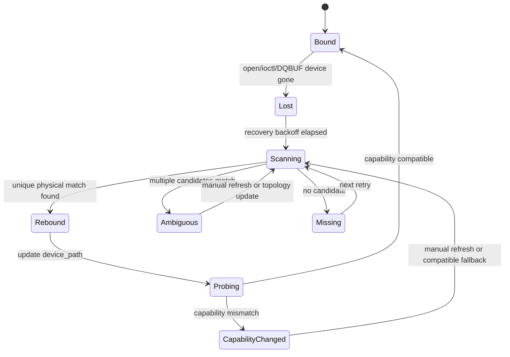

# 设备发现与重枚举恢复设计

**文档版本:** v0.6<br>
**最后更新:** 2026-05-16<br>
**设计范围:** USB 热插拔后设备节点变化、能力变化、MIPI pipeline 缺失时的发现、恢复和状态暴露策略<br>
**当前状态:** 脚本层扫描报告、runtime M0 身份日志与 M1 状态快照已接入；自动化测试只保留最小可选验收入口<br>
**关联文档:** [../MULTI_CAMERA_ARCHITECTURE.md](../MULTI_CAMERA_ARCHITECTURE.md)、[../ARCHITECTURE_REVIEW.md](../ARCHITECTURE_REVIEW.md)、[../../IMPLEMENTATION_STATUS.md](../../IMPLEMENTATION_STATUS.md)

> **文档硬规范**
>
> - 本项目的系统架构图、模块框图、部署拓扑图、数据路径框图和工程结构框图必须使用 `architecture-diagram` skill 生成独立 HTML / inline SVG 图表产物；每个 HTML 图必须同步导出同名 `.svg`，Markdown 中默认直接显示 SVG，并附完整 HTML 图表链接。
> - 时序图、状态机图、纯目录结构图等仍使用 Mermaid fenced code block（语言标识为 `mermaid`）。
> - 禁止新增 ASCII art/text 框图；普通日志、命令输出、代码片段按其原始语言使用 fenced code block。
> - 每份项目文档必须在文档元信息和硬规范之后维护 `## 目录`，目录至少覆盖二级标题，并使用相对链接或页内锚点。
> - 评审建议、风险、ARCH-* 跟踪项只维护在 [../ARCHITECTURE_REVIEW.md](../ARCHITECTURE_REVIEW.md)，其他文档只链接引用，避免重复漂移。

---

## 目录

- [1. 背景](#1-背景)
- [2. 目标与非目标](#2-目标与非目标)
- [3. 身份模型](#3-身份模型)
- [4. 设备发现策略](#4-设备发现策略)
- [5. 恢复状态机](#5-恢复状态机)
- [6. 能力变化处理](#6-能力变化处理)
- [7. 控制面与 Metrics](#7-控制面与-metrics)
- [8. 验证计划](#8-验证计划)
- [9. 编码准入清单](#9-编码准入清单)
- [10. Runtime 接入分阶段方案](#10-runtime-接入分阶段方案)
- [11. M1 状态快照编码方案](#11-m1-状态快照编码方案)
- [12. 自动化测试快速收口](#12-自动化测试快速收口)

---

## 1. 背景

当前 USB 物理热插拔恢复已经通过，但仍隐含一个关键假设：摄像头重插后继续出现在原路径，例如 `/dev/video45`。这个假设在生产系统里不稳定：

1. USB 摄像头重插后可能变成新的 `/dev/videoX`。
2. 多 USB 摄像头同时存在时，仅靠设备节点无法识别“原来的那一路”。
3. MIPI/RKISP 设备节点常驻，但 media pipeline 可能未配置或 sensor 不存在。
4. 订阅端需要知道“设备暂不可用”和“永久配置错误”的区别。

因此下一步不能直接在 `CameraSource` 内做路径重试，而应先定义设备身份、发现、重绑定和状态暴露策略。

## 2. 目标与非目标

### 2.1 目标

| 目标 | 说明 |
|------|------|
| 稳定物理身份 | USB 设备重枚举后仍能映射回同一 `stream_id` |
| 恢复行为可解释 | 区分节点丢失、节点变化、能力变化、格式不兼容 |
| 多路不互相影响 | 一路设备重枚举不触发其他 stream stop |
| 与现有 smoke 兼容 | `/dev/video45` 单 USB 快速入口继续可用 |
| 为 MIPI 留边界 | MIPI pipeline 缺失先暴露 readiness 状态，不假装 live |

### 2.2 非目标

| 非目标 | 原因 |
|--------|------|
| 不引入 udev 常驻 daemon | 当前先做进程内主动扫描，降低部署复杂度 |
| 不重写 `CameraSessionManager` | 先在 publisher/example 层验证策略 |
| 不实现 Web 复杂设备管理 UI | Web/Codec 已要求快速收敛 |
| 不支持任意热插拔策略脚本 | 先覆盖 USB UVC 与 MIPI readiness 两类输入 |

## 3. 身份模型

设备恢复不能以 `/dev/videoX` 为唯一身份。建议拆成三层：

| 层级 | 字段 | 说明 |
|------|------|------|
| stream 身份 | `stream_id` | 业务稳定身份，例如 `usb0`、`mipi0_main` |
| 物理身份 | `bus_type`、`vendor_id`、`product_id`、`serial`、`usb_path` | USB 重枚举匹配依据 |
| 当前节点 | `device_path` | 当前可打开的 `/dev/videoX`，可变化 |

USB 匹配优先级：

1. `serial` 存在时优先匹配 `vendor_id + product_id + serial`。
2. 无 serial 时匹配 `vendor_id + product_id + usb_path`。
3. 仍无法唯一匹配时进入 `Ambiguous` 状态，不自动绑定，避免串流。

MIPI 匹配优先级：

1. 固定 `media_device` + entity name。
2. 固定 video node 作为 fallback。
3. pipeline 不完整时进入 `ReadinessFailed`，不启动 live。

## 4. 设备发现策略

第一阶段使用主动扫描，不依赖 udev 事件：

| 扫描源 | 用途 |
|--------|------|
| `/sys/class/video4linux/video*/device` | 解析 USB bus、vendor/product、serial 路径 |
| `VIDIOC_QUERYCAP` | 获取 driver/card/bus_info，确认 video capture 能力 |
| `VIDIOC_ENUM_FMT` | 判断目标 pixel format 是否仍可用 |
| `media-ctl` 或 media graph | 后续 MIPI pipeline readiness |

脚本层扫描入口：

```bash
BOARD_HOST=192.168.31.9 BOARD_USER=luckfox BOARD_PASSWORD=luckfox \
  ./scripts/rk3576-device-discovery-scan.sh
```

该入口只输出 `device_discovery.tsv` 和 `device_discovery_report.json`，用于观察当前 `/dev/videoX`、driver、card/name、USB vendor/product/serial、sysfs physical path 等信息。它不做 PASS/FAIL 判定，不接入 board suite，避免测试脚本过度扩张。

RK3576 当前扫描结论：

| 项 | 结果 |
|----|------|
| video 节点数量 | 47 |
| USB 摄像头节点 | `/dev/video45`、`/dev/video46` |
| USB driver/name | `uvcvideo` / `WebCamera: WebCamera` |
| USB 物理身份 | `vendor_id=32e6 product_id=9221 serial=202509021958` |
| USB physical path | `/sys/devices/platform/23400000.usb/xhci-hcd.0.auto/usb1/1-1/1-1.2/1-1.2:1.0` |

扫描触发时机：

1. publisher 启动时构建初始 device registry。
2. `CameraSource` 进入断连/恢复失败后触发一次扫描。
3. 手动 control 命令触发 refresh。
4. 后续如需要再接入 inotify/udev，但不是第一阶段。

## 5. 恢复状态机



关键原则：

1. `stream_id` 不因 `device_path` 变化而变化。
2. `device_path` 变化必须写入 status/metrics/log。
3. `Ambiguous` 不自动恢复，避免把 `usb0` 绑定到错误摄像头。
4. `CapabilityChanged` 不自动降级分辨率，除非后续配置明确允许。

## 6. 能力变化处理

| 变化 | 第一阶段策略 |
|------|--------------|
| 设备节点变化但能力兼容 | 自动重绑定并恢复 |
| MJPEG/YUYV 格式仍可用但尺寸变化 | 记录 `CapabilityChanged`，默认不自动改格式 |
| DMA-BUF export 不再可用 | 回退策略另行评审，不在本阶段自动 fallback |
| USB 设备同型号多实例无 serial | 进入 `Ambiguous` |
| MIPI video node 存在但 pipeline 未配置 | `ReadinessFailed`，不进入 STREAMON |

## 7. 控制面与 Metrics

Runtime 设备发现信息按以下原则落点：

1. 字符串类身份字段（`current_device_path`、`physical_id`、`vendor_id`、`product_id`、`serial`、`physical_path`）进入 status/log/后续 control-plane snapshot，不进入 `StreamMetrics`。
2. `StreamMetrics` 继续保持数值健康指标定位。后续如确实需要自动判定，只新增 `device_rebind_count`、`capability_change_count`、`discovery_failure_count` 这类数值计数器。
3. `metrics_history.jsonl` 第一阶段不扩展 device registry 段，避免把设备枚举语义和帧流转健康判定耦合。

建议新增或扩展的可观测字段先在文档冻结，再按阶段落地：

| 字段 | 说明 |
|------|------|
| `current_device_path` | 当前绑定的 `/dev/videoX` |
| `configured_device_path` | 配置中的期望路径 |
| `physical_id` | USB/MIPI 物理身份摘要 |
| `discovery_state` | `Bound/Missing/Ambiguous/CapabilityChanged/ReadinessFailed` |
| `device_rebind_count` | 自动重绑定次数 |
| `capability_change_count` | 能力变化次数 |

日志要求：

1. 发现候选设备时输出 `stream_id`、`physical_id`、`device_path`。
2. 自动重绑定时输出 old/new device path。
3. 进入 `Ambiguous` 时输出候选列表。
4. 所有状态变化进入 `StreamMetrics` 或 status 快照前，必须先有文档评审。

## 8. 验证计划

| 场景 | 当前是否可做 | 方法 |
|------|--------------|------|
| 原路径热插拔 | 已完成 | 继续保留 USB 物理拔插 smoke |
| 节点变化重枚举 | 可设计，需人工或脚本制造 | 拔出后插入不同 USB 口，观察 `/dev/videoX` 是否变化 |
| 同型号多实例歧义 | 暂不可做 | 需要第二个 USB 摄像头 |
| MIPI readiness failed | 可做 | 使用 `REQUIRE_MIPI=1` 或指定错误 `MIPI_DEVICES` |
| 能力变化 | 暂不可做 | 需要可切换格式/固件或第二设备 |

## 9. 编码准入清单

- [x] 明确本阶段先做设备发现/重枚举设计，不直接改 `CameraSource`。
- [x] 明确 `/dev/videoX` 不能作为生产唯一身份。
- [x] 明确 USB 匹配优先级与歧义处理。
- [x] 明确 MIPI readiness 与 live 的边界。
- [x] 评审是否先在脚本层增加设备扫描报告，而不是直接接入 runtime。
- [x] 已新增 `scripts/rk3576-device-discovery-scan.sh`，仅生成扫描报告，不接入 smoke suite。
- [x] RK3576 扫描报告已验证可生成和解析。
- [x] 已评审 discovery 字段落点：字符串身份进入 status/log；`StreamMetrics` 暂不扩展字符串字段。
- [ ] 确认是否有条件制造 `/dev/videoX` 变化的板端测试。

## 10. Runtime 接入分阶段方案

### 10.1 M0：启动期身份解析与日志

M0 是当前可立即编码的最小主线接入点：

| 项 | 策略 |
|----|------|
| 接入位置 | `camera_publisher_example` 的 stream start callback，`CameraSource::Initialize()` 前 |
| 解析范围 | 当前 `endpoint.device_path` 对应的 video 节点 |
| 数据来源 | `/sys/class/video4linux/video*/name`、`device/driver`、`device/subsystem`、USB 父节点 `idVendor/idProduct/serial`、`VIDIOC_QUERYCAP` |
| 输出形式 | publisher 日志，包含 `stream_id`、`device_path`、`physical_id`、driver/name/bus_info |
| 不做事项 | 不改 `CameraEndpoint`、不改 `StreamMetrics`、不自动扫描候选列表、不自动重绑定 |

M0 的价值是把脚本层已经验证过的身份模型接入 runtime，让后续热插拔恢复日志可以明确“当前绑定的是哪个物理设备”。M0 已通过 RK3576 `/dev/video45` 12 秒 lifecycle smoke，publisher 日志可看到：

```text
device discovery snapshot: stream=default0 device=/dev/video45 exists=1 physical_id=usb:32e6:9221:202509021958 driver=uvcvideo name=WebCamera: WebCamera bus_info=usb-xhci-hcd.0.auto-1.2 subsystem=usb vendor_id=32e6 product_id=9221 serial=202509021958
```

### 10.2 M1：状态快照与候选扫描

M1 只在 M0 通过后启动：

| 项 | 策略 |
|----|------|
| Runtime registry | publisher 维护每个 `stream_id` 的 `configured_device_path`、`current_device_path`、`physical_id` |
| 触发时机 | 启动、恢复失败、手动 refresh |
| 输出形式 | 后续 control/status snapshot 或独立 JSON 状态文件 |
| 风险边界 | 仍不自动替换 `CameraSource` 的 `device_path` |

### 10.3 M2：受控重绑定

M2 需要单独评审后再写代码：

1. 只有唯一物理匹配时允许把 `current_device_path` 从旧节点切换到新节点。
2. 切换必须发生在 stream 停止或恢复窗口内，不能在 DQBUF/QBUF 主循环中直接替换 fd。
3. 同型号多实例无 serial 时必须进入 `Ambiguous`，禁止自动绑定。
4. 能力变化默认进入 `CapabilityChanged`，禁止自动改分辨率或 pixel format。

## 11. M1 状态快照编码方案

M1 的目标是把 M0 的“一次性启动日志”收敛为可机器读取的 runtime 状态快照，但仍不做自动重绑定。

### 11.1 数据结构

建议在 publisher 示例内部维护轻量状态结构，先不下沉到 `CameraSource`：

| 字段 | 来源 | 说明 |
|------|------|------|
| `stream_id` | `CameraStreamIdentity` | 稳定业务流 ID |
| `camera_id` | `CameraStreamIdentity` | 兼容 DataPlaneV2 numeric stream key |
| `configured_device_path` | CLI/control endpoint | 配置期望路径 |
| `current_device_path` | runtime endpoint | 当前实际绑定路径，M1 与 configured 相同 |
| `discovery_state` | runtime 判定 | `Bound/Missing/Unknown`，M1 不产生 `Ambiguous` |
| `device_exists` | `InspectVideoDevice()` | sysfs 是否存在 |
| `physical_id` | `VideoDeviceDiscoveryInfo` | 稳定物理身份摘要 |
| `driver/name/bus_info/subsystem` | `VideoDeviceDiscoveryInfo` | 观测字段 |
| `vendor_id/product_id/serial` | `VideoDeviceDiscoveryInfo` | USB 匹配字段 |
| `last_refresh_ns` | publisher clock | 快照刷新时间 |

M1 不把这些字符串字段写入 `StreamMetrics`。如果后续要自动判定，只通过 status JSON 或 control-plane status 扩展读取。

### 11.2 快照输出

M1 编码优先级：

1. publisher 新增可选参数 `--device-discovery-status-path PATH`。
2. stream start callback 中刷新该 stream 的 discovery status。
3. stats 线程或退出路径按需覆盖写入一个小 JSON 文件。
4. 未传入该参数时只保留 M0 日志，不增加额外 I/O。

JSON 形态固定为：

```json
{
  "streams": [
    {
      "stream_id": "default0",
      "camera_id": 0,
      "configured_device_path": "/dev/video45",
      "current_device_path": "/dev/video45",
      "discovery_state": "Bound",
      "device_exists": true,
      "physical_id": "usb:32e6:9221:202509021958",
      "driver": "uvcvideo",
      "name": "WebCamera: WebCamera",
      "bus_info": "usb-xhci-hcd.0.auto-1.2",
      "subsystem": "usb",
      "vendor_id": "32e6",
      "product_id": "9221",
      "serial": "202509021958",
      "last_refresh_ns": 1778934264131000000
    }
  ]
}
```

### 11.3 刷新时机

| 时机 | 是否 M1 实现 | 说明 |
|------|--------------|------|
| stream start callback | 是 | 与 M0 一致，启动时建立初始状态 |
| stats 线程周期刷新 | 可选 | 只在 `--device-discovery-status-path` 指定时执行，默认间隔复用 metrics history interval |
| Stop/退出前 | 是 | 覆盖写最后状态，方便板端 smoke 拉取 |
| recovery failed 后刷新 | 暂缓 | 需要接入 `CameraSource` 恢复回调，进入 M2 前单独评审 |
| control 手动 refresh | 暂缓 | 需要控制协议扩展，不在 M1 |

### 11.4 禁止事项

1. M1 禁止自动改写 `CameraSource::device_path_`。
2. M1 禁止新增 board suite 或复杂 smoke 判定，只允许用现有 lifecycle smoke 人工 grep status 文件。
3. M1 禁止把 discovery 字符串塞进 `StreamMetrics`。
4. M1 禁止新增 udev daemon、inotify 常驻线程或后台扫描线程。

### 11.5 验收标准

1. 本地构建与单元测试通过。
2. RK3576 交叉编译通过。
3. RK3576 `/dev/video45` lifecycle smoke 仍通过。
4. 指定 `--device-discovery-status-path` 后，板端能生成包含 `physical_id=usb:32e6:9221:202509021958` 对应 JSON 字段的状态文件。

## 12. 自动化测试快速收口

设备发现不是当前测试脚本的主战场，自动化只保留一个最小入口：

```bash
BOARD_HOST=192.168.31.9 BOARD_USER=luckfox BOARD_PASSWORD=luckfox \
DEVICE=/dev/video45 DURATION_SEC=12 SAMPLE_INTERVAL_SEC=5 SUBSCRIBER_COUNT=1 \
DEVICE_DISCOVERY_STATUS=1 SKIP_BUILD=1 CHECK_CLEANUP=0 \
LOCAL_LOG_DIR=logs/runtime-device-discovery-status-smoke \
./scripts/rk3576-dataplane-v2-lifecycle-smoke.sh
```

该入口只验证三件事：

1. 现有 lifecycle smoke 仍然 PASS。
2. `publisher.log` 中存在 `device discovery snapshot`。
3. `device_discovery_status.json` 能被拉回，并包含当前 USB 摄像头的 `physical_id`。

禁止把这里扩展为新的复杂 suite。后续只有进入 M2 自动重绑定时，才允许单独设计重枚举验证脚本。
