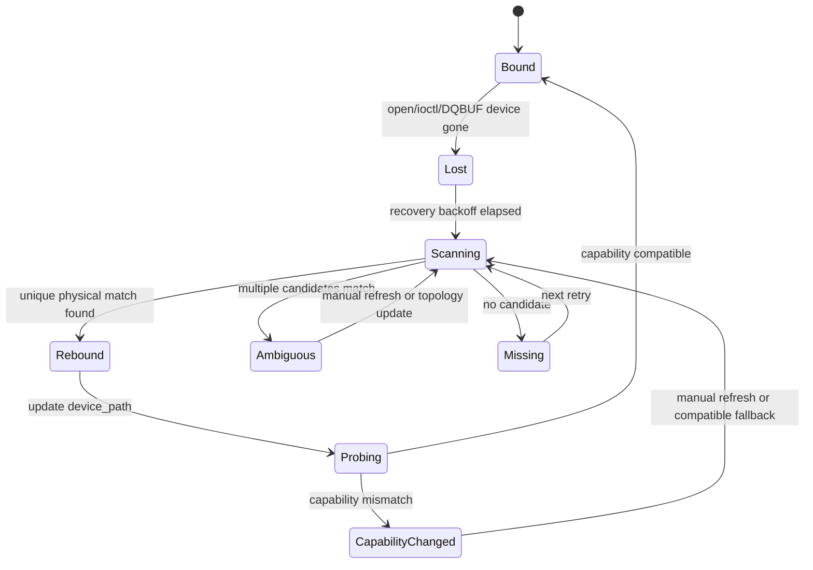

# 设备发现与重枚举恢复设计

**文档版本:** v0.1 
**最后更新:** 2026-05-16 
**设计范围:** USB 热插拔后设备节点变化、能力变化、MIPI pipeline 缺失时的发现、恢复和状态暴露策略 
**当前状态:** 设计阶段，未进入代码开发 
**关联文档:** [../MULTI_CAMERA_ARCHITECTURE.md](../MULTI_CAMERA_ARCHITECTURE.md)、[../ARCHITECTURE_REVIEW.md](../ARCHITECTURE_REVIEW.md)、[../../IMPLEMENTATION_STATUS.md](../../IMPLEMENTATION_STATUS.md)

> **文档硬规范**
>
> - 本项目的系统架构图、模块框图、部署拓扑图、数据路径框图和工程结构框图必须使用 `architecture-diagram` skill 生成独立 HTML / inline SVG 图表产物；每个 HTML 图必须同步导出同名 `.svg`，Markdown 中默认直接显示 SVG，并附完整 HTML 图表链接。
> - 时序图、状态机图、纯目录结构图等仍使用 Mermaid fenced code block（语言标识为 `mermaid`）。
> - 禁止新增 ASCII art/text 框图；普通日志、命令输出、代码片段按其原始语言使用 fenced code block。
> - 每份项目文档必须在文档元信息和硬规范之后维护 `## 目录`，目录至少覆盖二级标题，并使用相对链接或页内锚点。
> - 评审建议、风险、ARCH-* 跟踪项只维护在 [../ARCHITECTURE_REVIEW.md](../ARCHITECTURE_REVIEW.md)，其他文档只链接引用，避免重复漂移。

---

## 目录

- [1. 背景](#1-背景)
- [2. 目标与非目标](#2-目标与非目标)
- [3. 身份模型](#3-身份模型)
- [4. 设备发现策略](#4-设备发现策略)
- [5. 恢复状态机](#5-恢复状态机)
- [6. 能力变化处理](#6-能力变化处理)
- [7. 控制面与 Metrics](#7-控制面与-metrics)
- [8. 验证计划](#8-验证计划)
- [9. 编码准入清单](#9-编码准入清单)

---

## 1. 背景

当前 USB 物理热插拔恢复已经通过，但仍隐含一个关键假设：摄像头重插后继续出现在原路径，例如 `/dev/video45`。这个假设在生产系统里不稳定：

1. USB 摄像头重插后可能变成新的 `/dev/videoX`。
2. 多 USB 摄像头同时存在时，仅靠设备节点无法识别“原来的那一路”。
3. MIPI/RKISP 设备节点常驻，但 media pipeline 可能未配置或 sensor 不存在。
4. 订阅端需要知道“设备暂不可用”和“永久配置错误”的区别。

因此下一步不能直接在 `CameraSource` 内做路径重试，而应先定义设备身份、发现、重绑定和状态暴露策略。

## 2. 目标与非目标

### 2.1 目标

| 目标 | 说明 |
|------|------|
| 稳定物理身份 | USB 设备重枚举后仍能映射回同一 `stream_id` |
| 恢复行为可解释 | 区分节点丢失、节点变化、能力变化、格式不兼容 |
| 多路不互相影响 | 一路设备重枚举不触发其他 stream stop |
| 与现有 smoke 兼容 | `/dev/video45` 单 USB 快速入口继续可用 |
| 为 MIPI 留边界 | MIPI pipeline 缺失先暴露 readiness 状态，不假装 live |

### 2.2 非目标

| 非目标 | 原因 |
|--------|------|
| 不引入 udev 常驻 daemon | 当前先做进程内主动扫描，降低部署复杂度 |
| 不重写 `CameraSessionManager` | 先在 publisher/example 层验证策略 |
| 不实现 Web 复杂设备管理 UI | Web/Codec 已要求快速收敛 |
| 不支持任意热插拔策略脚本 | 先覆盖 USB UVC 与 MIPI readiness 两类输入 |

## 3. 身份模型

设备恢复不能以 `/dev/videoX` 为唯一身份。建议拆成三层：

| 层级 | 字段 | 说明 |
|------|------|------|
| stream 身份 | `stream_id` | 业务稳定身份，例如 `usb0`、`mipi0_main` |
| 物理身份 | `bus_type`、`vendor_id`、`product_id`、`serial`、`usb_path` | USB 重枚举匹配依据 |
| 当前节点 | `device_path` | 当前可打开的 `/dev/videoX`，可变化 |

USB 匹配优先级：

1. `serial` 存在时优先匹配 `vendor_id + product_id + serial`。
2. 无 serial 时匹配 `vendor_id + product_id + usb_path`。
3. 仍无法唯一匹配时进入 `Ambiguous` 状态，不自动绑定，避免串流。

MIPI 匹配优先级：

1. 固定 `media_device` + entity name。
2. 固定 video node 作为 fallback。
3. pipeline 不完整时进入 `ReadinessFailed`，不启动 live。

## 4. 设备发现策略

第一阶段使用主动扫描，不依赖 udev 事件：

| 扫描源 | 用途 |
|--------|------|
| `/sys/class/video4linux/video*/device` | 解析 USB bus、vendor/product、serial 路径 |
| `VIDIOC_QUERYCAP` | 获取 driver/card/bus_info，确认 video capture 能力 |
| `VIDIOC_ENUM_FMT` | 判断目标 pixel format 是否仍可用 |
| `media-ctl` 或 media graph | 后续 MIPI pipeline readiness |

扫描触发时机：

1. publisher 启动时构建初始 device registry。
2. `CameraSource` 进入断连/恢复失败后触发一次扫描。
3. 手动 control 命令触发 refresh。
4. 后续如需要再接入 inotify/udev，但不是第一阶段。

## 5. 恢复状态机

关键原则：

1. `stream_id` 不因 `device_path` 变化而变化。
2. `device_path` 变化必须写入 status/metrics/log。
3. `Ambiguous` 不自动恢复，避免把 `usb0` 绑定到错误摄像头。
4. `CapabilityChanged` 不自动降级分辨率，除非后续配置明确允许。

## 6. 能力变化处理

| 变化 | 第一阶段策略 |
|------|--------------|
| 设备节点变化但能力兼容 | 自动重绑定并恢复 |
| MJPEG/YUYV 格式仍可用但尺寸变化 | 记录 `CapabilityChanged`，默认不自动改格式 |
| DMA-BUF export 不再可用 | 回退策略另行评审，不在本阶段自动 fallback |
| USB 设备同型号多实例无 serial | 进入 `Ambiguous` |
| MIPI video node 存在但 pipeline 未配置 | `ReadinessFailed`，不进入 STREAMON |

## 7. 控制面与 Metrics

建议新增或扩展的可观测字段先在文档冻结，编码前再决定落点：

| 字段 | 说明 |
|------|------|
| `current_device_path` | 当前绑定的 `/dev/videoX` |
| `configured_device_path` | 配置中的期望路径 |
| `physical_id` | USB/MIPI 物理身份摘要 |
| `discovery_state` | `Bound/Missing/Ambiguous/CapabilityChanged/ReadinessFailed` |
| `device_rebind_count` | 自动重绑定次数 |
| `capability_change_count` | 能力变化次数 |

日志要求：

1. 发现候选设备时输出 `stream_id`、`physical_id`、`device_path`。
2. 自动重绑定时输出 old/new device path。
3. 进入 `Ambiguous` 时输出候选列表。
4. 所有状态变化进入 `StreamMetrics` 或 status 快照前，必须先有文档评审。

## 8. 验证计划

| 场景 | 当前是否可做 | 方法 |
|------|--------------|------|
| 原路径热插拔 | 已完成 | 继续保留 USB 物理拔插 smoke |
| 节点变化重枚举 | 可设计，需人工或脚本制造 | 拔出后插入不同 USB 口，观察 `/dev/videoX` 是否变化 |
| 同型号多实例歧义 | 暂不可做 | 需要第二个 USB 摄像头 |
| MIPI readiness failed | 可做 | 使用 `REQUIRE_MIPI=1` 或指定错误 `MIPI_DEVICES` |
| 能力变化 | 暂不可做 | 需要可切换格式/固件或第二设备 |

## 9. 编码准入清单

- [x] 明确本阶段先做设备发现/重枚举设计，不直接改 `CameraSource`。
- [x] 明确 `/dev/videoX` 不能作为生产唯一身份。
- [x] 明确 USB 匹配优先级与歧义处理。
- [x] 明确 MIPI readiness 与 live 的边界。
- [ ] 评审是否先在脚本层增加设备扫描报告，而不是直接接入 runtime。
- [ ] 评审 `StreamMetrics` 是否需要新增 discovery 字段。
- [ ] 确认是否有条件制造 `/dev/videoX` 变化的板端测试。
