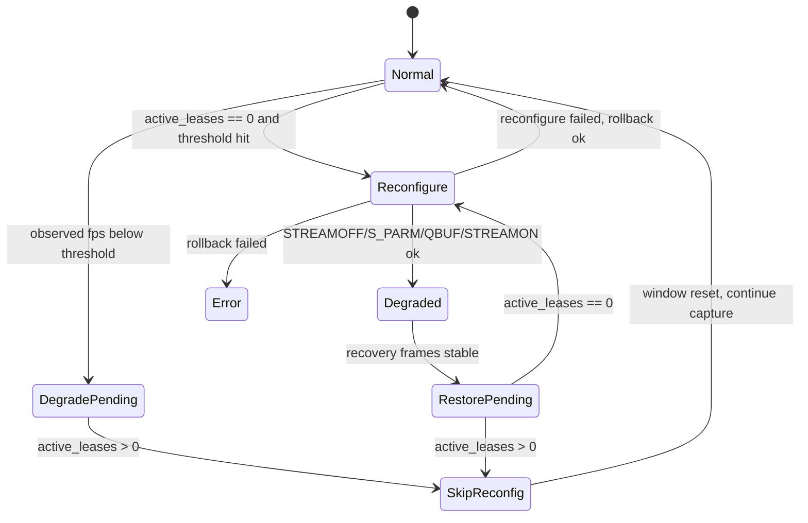

# DMA-BUF 降级重配置验证设计

**文档版本:** v0.2 
**最后更新:** 2026-05-16 
**设计范围:** CameraSource 降帧降级在 DMA-BUF/DataPlaneV2 active lease 场景下的验证方案与编码准入边界 
**当前状态:** slow-consumer backpressure 不误降级验证已通过；active lease skip 需要后续 fault injection 或单测覆盖 
**关联文档:** [../DMA_BUF_ZERO_COPY_ARCHITECTURE.md](../DMA_BUF_ZERO_COPY_ARCHITECTURE.md)、[../MULTI_CAMERA_ARCHITECTURE.md](../MULTI_CAMERA_ARCHITECTURE.md)、[BOARD_METRICS_SMOKE_DESIGN.md](BOARD_METRICS_SMOKE_DESIGN.md)、[../../IMPLEMENTATION_STATUS.md](../../IMPLEMENTATION_STATUS.md)

> **文档硬规范**
>
> - 本项目的系统架构图、模块框图、部署拓扑图、数据路径框图和工程结构框图必须使用 `architecture-diagram` skill 生成独立 HTML / inline SVG 图表产物；每个 HTML 图必须同步导出同名 `.svg`，Markdown 中默认直接显示 SVG，并附完整 HTML 图表链接。
> - 时序图、状态机图、纯目录结构图等仍使用 Mermaid fenced code block（语言标识为 `mermaid`）。
> - 禁止新增 ASCII art/text 框图；普通日志、命令输出、代码片段按其原始语言使用 fenced code block。
> - 每份项目文档必须在文档元信息和硬规范之后维护 `## 目录`，目录至少覆盖二级标题，并使用相对链接或页内锚点。
> - 评审建议、风险、ARCH-* 跟踪项只维护在 [../ARCHITECTURE_REVIEW.md](../ARCHITECTURE_REVIEW.md)，其他文档只链接引用，避免重复漂移。

---

## 目录

- [1. 背景与问题](#1-背景与问题)
- [2. 验证目标](#2-验证目标)
- [3. 当前实现假设](#3-当前实现假设)
- [4. 风险模型](#4-风险模型)
- [5. 验证矩阵](#5-验证矩阵)
- [6. 脚本与指标设计](#6-脚本与指标设计)
- [7. PASS/FAIL 判定](#7-passfail-判定)
- [8. 编码准入清单](#8-编码准入清单)
- [9. 分阶段计划](#9-分阶段计划)

---

## 1. 背景与问题

CameraSource 降帧降级已在 RK3576 `/dev/video45` USB UVC `mmap/v1` 路径完成验证。当前仍未闭合的是 DMA-BUF/DataPlaneV2 场景：

1. DataPlaneV2 订阅端可能持有 DMA-BUF fd lease。
2. 降级重配置需要 `STREAMOFF -> S_PARM -> QBUF -> STREAMON`。
3. 如果 active lease 未 release 时强行 `STREAMOFF/QBUF`，可能导致 subscriber 持有的 fd 与 publisher 侧 buffer 生命周期冲突。
4. 当前策略应当是在 active lease 存在时跳过重配置，等待后续窗口再次尝试。
5. RK3576 slow-consumer smoke 已证明：慢消费者只会造成 backpressure / lease exhausted，CameraSource 仍能持续 DQBUF，因此不会触发降级窗口。这是正确行为，不能用 slow-consumer 直接证明 active lease skip 分支。

这不是新的降级算法设计，而是对现有降级策略在 DMA-BUF active lease 下的边界验证。

## 2. 验证目标

| 目标 | 说明 |
|------|------|
| backpressure 不误降级 | slow consumer 只造成 lease exhausted / release timeout，不应触发降级重配置 |
| active lease 保护 | publisher 检测到 active lease 时不得执行重配置；该分支需要后续 fault injection 或单测覆盖 |
| 后续重试 | active lease 清零后，降级/恢复应允许在后续窗口再次尝试；该分支需要后续 fault injection 或单测覆盖 |
| fd 生命周期稳定 | 慢消费者或延迟 release 不应造成 fd drift |
| release 清理正确 | Stop 或 subscriber 退出后 pending release 能收敛到 0 |
| Metrics 可观测 | 验证结果必须能从 `StreamMetrics` / logs 中判断，不靠人工猜测 |

## 3. 当前实现假设

| 假设 | 当前状态 | 验证要求 |
|------|----------|----------|
| 降级默认关闭 | 已完成 | smoke 必须显式传 `--enable-degradation` |
| DMA-BUF active lease 可统计 | 已有 `active_lease_count` / release pending 指标 | 需要在 smoke 中采样并纳入报告 |
| 慢消费者可制造 active lease | 已有 slow-consumer smoke | 只能验证 backpressure 与 active lease 指标，不足以触发降级 |
| 重配置跳过不算断连 | 降级失败/跳过不应进入断连恢复 | 检查 `disconnection_count == 0` |
| USB `/dev/video45` 可跑 DataPlaneV2 | 已验证 | 当前硬件足够覆盖 USB DMA-BUF 边界，不等待 MIPI |

## 4. 风险模型

必须防止的错误：

1. active lease 未 release 时仍执行 QBUF。
2. 跳过重配置后永久不再尝试。
3. 重配置失败后采集循环中断但 metrics 仍误报 PASS。
4. subscriber 退出后 pending release 不收敛。
5. Stop 后驱动侧 fps 被污染到下一次 Start。

## 5. 验证矩阵

| 场景 | 输入条件 | 预期 |
|------|----------|------|
| D1 默认关闭 | DataPlaneV2 + subscriber 正常 release | 不触发降级，metrics 与现有 lifecycle 一致 |
| D2 enable=1 正常 release | 启用降级但无慢消费者 | 不应非预期降级，`source_degraded=false` |
| D3 backpressure 不误降级 | slow consumer 延迟 release，造成 active lease 与 lease exhausted | 不出现 `Degraded to` / `Reconfigured fps`，`disconnection_count == 0` |
| D4 active lease 跳过 | 通过后续 fault injection 或单测制造低 source fps + active lease | 日志出现跳过重配置，`active_lease_count > 0` 时不 STREAMOFF |
| D5 release 后重试 | D4 条件解除 active lease | 后续窗口允许降级或恢复重配置 |
| D6 Stop 清理 | 降级态、跳过态或 backpressure 态 Stop | `release_pending_count=0`、fd drift 不超阈值 |
| D7 subscriber 退出 | subscriber 崩溃或主动断开 | release timeout/reclaim 后 pending 收敛，publisher 不崩溃 |

## 6. 脚本与指标设计

优先复用现有脚本，避免新增复杂入口：

| 候选脚本 | 改造方向 |
|----------|----------|
| `rk3576-dataplane-v2-slow-consumer-smoke.sh` | 增加降级相关参数透传，作为主验证入口 |
| `rk3576-dataplane-v2-lifecycle-smoke.sh` | 保持默认路径，不塞入慢消费者特例 |
| `metrics_smoke_evaluator.py` | 暂不修改；如需判断降级事件，先通过脚本侧额外 grep/log 判定 |

建议新增或复用的环境变量：

| 变量 | 默认 | 说明 |
|------|------|------|
| `ENABLE_DEGRADATION` | `0` | 传给 publisher 的 `--enable-degradation` |
| `DEGRADATION_TARGET_FPS` | `15` | 降级目标 fps |
| `DEGRADATION_WINDOW_SEC` | `5` | 低 fps 判定窗口 |
| `DEGRADATION_RECOVERY_FRAMES` | `30` | 恢复尝试帧数 |
| `EXPECT_NO_RECONFIG` | `0` | slow-consumer backpressure 场景要求不出现降级/恢复/重配置事件 |
| `EXPECT_RECONFIG_SKIP` | `0` | 仅用于后续 fault injection 或单测；slow-consumer 场景不应打开 |

关键观测点：

1. `active_lease_count`
2. `release_pending_count`
3. `release_timeout_count`
4. `source_degraded`
5. `source_degradation_count`
6. `source_degradation_recovery_count`
7. publisher 日志中的 reconfigure skip / reconfigured / restored 事件

## 7. PASS/FAIL 判定

| check_id | PASS 条件 | FAIL 条件 |
|----------|-----------|-----------|
| `dmabuf_degradation_no_crash` | publisher/subscriber 正常退出 | 任一进程异常残留 |
| `dmabuf_backpressure_no_degrade` | slow-consumer 场景不出现 `Degraded to` / `Reconfigured fps` | backpressure 被误判为 source 降级 |
| `dmabuf_active_lease_skip` | `EXPECT_RECONFIG_SKIP=1` 时出现 active lease skip 日志 | 未观察到跳过，或 active lease 下执行重配置；该项不适用于普通 slow-consumer |
| `dmabuf_release_converged` | 结束时 `release_pending_count == 0` | pending 残留 |
| `dmabuf_fd_drift` | publisher/subscriber fd drift 不超过现有阈值 | fd drift 超阈值 |
| `dmabuf_no_unexpected_disconnect` | `disconnection_count == 0` | 降级过程引发断连恢复 |
| `dmabuf_stop_fps_clean` | Stop 后下一次 Start 仍按原始 fps | fps 被污染 |

## 8. 编码准入清单

- [x] 明确本阶段先验证 DMA-BUF backpressure 下不误触发降级，不改降级算法。
- [x] 明确 slow-consumer smoke 只能制造 backpressure，不能直接证明 active lease skip 分支。
- [x] 明确 active lease skip 需要后续 fault injection 或单测，不在普通 slow-consumer smoke 中强制要求。
- [x] 明确 release pending、fd drift、disconnection、Stop 清理为硬判定项。
- [x] 检查现有 publisher 示例是否已把降级 CLI 透传到 slow-consumer smoke 所用路径。
- [x] slow-consumer smoke 已接入降级参数透传与可选 skip 检查。
- [x] 使用修正后的 backpressure 口径重跑 RK3576 `/dev/video45` slow-consumer smoke。

## 9. 分阶段计划

| 阶段 | 内容 | 状态 |
|------|------|------|
| G0 | 本文档评审与收敛 | 已完成 |
| G1 | 检查 slow-consumer smoke 与 publisher 参数透传现状 | 已完成 |
| G2 | 脚本层接入降级参数和可选 active lease skip 判定 | 已完成 |
| G3 | RK3576 `/dev/video45` backpressure 不误降级验证 | 已完成：`ENABLE_DEGRADATION=1 EXPECT_NO_RECONFIG=1 MAX_RELEASE_TIMEOUT=100` slow-consumer smoke 通过 |
| G4 | active lease skip fault injection / 单测设计 | 待单独设计 |
| G5 | 如 fault injection 暴露真实缺陷，再回到架构文档评审是否需要 C++ 修改 | 暂缓 |
