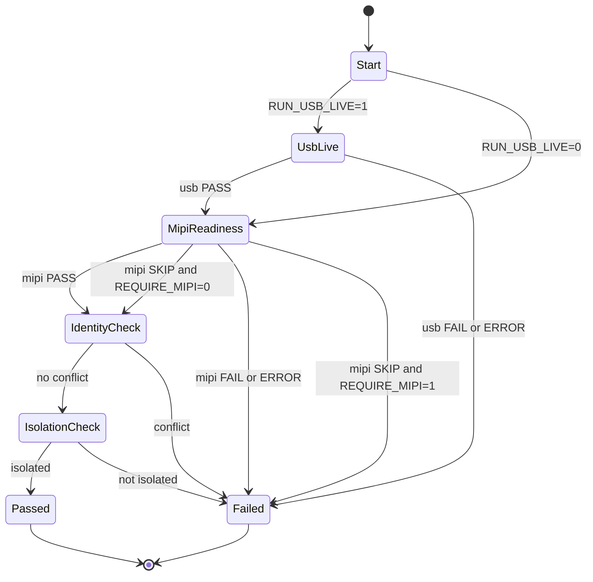
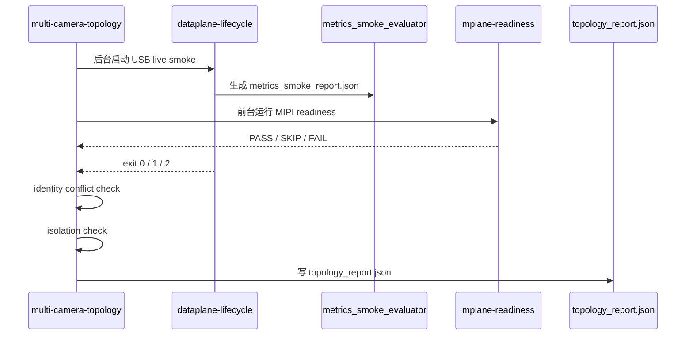

# Multi-Camera Topology Metrics Smoke 设计

**文档版本:** v0.1<br>
**最后更新:** 2026-05-16<br>
**设计范围:** `rk3576-multi-camera-topology-smoke.sh` 接入 `StreamMetrics` 自动判定的 Phase 2 架构设计<br>
**当前状态:** 设计阶段，未进入主干代码开发<br>
**关联文档:** [../MULTI_CAMERA_ARCHITECTURE.md](../MULTI_CAMERA_ARCHITECTURE.md)、[BOARD_METRICS_SMOKE_DESIGN.md](BOARD_METRICS_SMOKE_DESIGN.md)、[../METRICS_INTERFACE_DESIGN.md](../METRICS_INTERFACE_DESIGN.md)、[../../IMPLEMENTATION_STATUS.md](../../IMPLEMENTATION_STATUS.md)

> **文档硬规范**
>
> - 本项目的系统架构图、模块框图、部署拓扑图、数据路径框图和工程结构框图必须使用 `architecture-diagram` skill 生成独立 HTML / inline SVG 图表产物；每个 HTML 图必须同步导出同名 `.svg`，Markdown 中默认直接显示 SVG，并附完整 HTML 图表链接。
> - 时序图、状态机图、纯目录结构图等仍使用 Mermaid fenced code block（语言标识为 `mermaid`）。
> - 禁止新增 ASCII art/text 框图；普通日志、命令输出、代码片段按其原始语言使用 fenced code block。
> - 每份项目文档必须在文档元信息和硬规范之后维护 `## 目录`，目录至少覆盖二级标题，并使用相对链接或页内锚点。
> - 评审建议、风险、ARCH-* 跟踪项只维护在 [../ARCHITECTURE_REVIEW.md](../ARCHITECTURE_REVIEW.md)，其他文档只链接引用，避免重复漂移。
>
> **本图说明**：本文档只使用 Mermaid 描述脚本执行时序与判定状态，不新增正式系统架构图。

---

## 目录

- [1. 目标与非目标](#1-目标与非目标)
- [2. 当前事实基线](#2-当前事实基线)
- [3. Phase 2 设计原则](#3-phase-2-设计原则)
- [4. Topology 判定模型](#4-topology-判定模型)
- [5. USB-only 当前可实施范围](#5-usb-only-当前可实施范围)
- [6. MIPI Readiness 与 Live 边界](#6-mipi-readiness-与-live-边界)
- [7. 产物与报告结构](#7-产物与报告结构)
- [8. 脚本改造方案](#8-脚本改造方案)
- [9. 风险与防误判策略](#9-风险与防误判策略)
- [10. 编码准入清单](#10-编码准入清单)
- [11. 分阶段计划](#11-分阶段计划)

---

## 1. 目标与非目标

### 1.1 目标

本阶段目标是把已经验证通过的 `dataplane-lifecycle` / `stream-metrics` 自动判定能力，纳入 `multi-camera-topology` smoke 的统一拓扑报告中，使板端回归能回答三个问题：

1. USB live 链路是否真实出帧、发送、release、清理并通过 metrics 阈值。
2. MIPI/RKISP 在当前硬件条件下是 `PASS`、`SKIP` 还是 `FAIL`，且不会被误判为 live 已完成。
3. USB live 与 MIPI readiness 并发运行时，设备身份、stream 身份和资源清理是否仍保持隔离。

### 1.2 非目标

| 非目标 | 原因 |
|--------|------|
| 不实现 per-stream DataPlaneV2 计数器拆分 | 当前只有单 USB live，真实多 stream 数据面尚不可验证 |
| 不修改 DataPlaneV2 协议 | Phase 1 evaluator 已能在协议不变的前提下完成判定 |
| 不扩大 Web / Codec 功能面 | 当前重点是主链路可观测与板端回归，不做体验型功能扩展 |
| 不宣称 MIPI live 通过 | 当前没有真实 MIPI sensor，只能做 MPLANE readiness / probe |
| 不把 topology report 与 metrics report 强行合并为一个复杂格式 | Phase 2 先做引用式汇总，避免破坏已验证的 evaluator |

## 2. 当前事实基线

| 项 | 当前事实 |
|----|----------|
| 单 USB live | `rk3576-dataplane-v2-lifecycle-smoke.sh` 已基于 metrics evaluator 通过 RK3576 `/dev/video45` 双订阅者 smoke |
| board suite 入口 | `rk3576-board-smoke-suite.sh stream-metrics` 已复用 lifecycle metrics 判定路径 |
| failover | crash 与 release-disconnect 已迁移到 metrics evaluator 并通过板端 smoke |
| topology smoke | 已支持 USB live、MIPI readiness、并发运行、identity 冲突检测、隔离检查 |
| MIPI 状态 | 仅有 MPLANE probe/readiness 骨架，无真实 sensor live STREAMON |
| 当前硬件 | 只有一个 USB 摄像头，不能验证真实 USB + MIPI 双 live |

因此，Phase 2 的代码改造必须以 **拓扑报告聚合** 为主，而不是修改 C++ 主链路。

## 3. Phase 2 设计原则

1. **复用已验证 evaluator**：`metrics_smoke_evaluator.py` 继续只负责 metrics 阈值，不理解 topology。
2. **topology script 负责编排**：`rk3576-multi-camera-topology-smoke.sh` 负责运行子 smoke、收集子报告、判断 PASS/SKIP/FAIL。
3. **不重复解析 publisher 日志**：USB live 的帧数、release、fd drift、cleanup 结论优先来自 lifecycle smoke 的既有报告与退出码。
4. **SKIP 是一等状态**：无 MIPI sensor 时，MIPI readiness 可以是 SKIP；只有 `REQUIRE_MIPI=1` 时 SKIP 才升级为 FAIL。
5. **只做可验证代码**：当前只有 USB 摄像头，因此只能编码 USB metrics report 聚合、MIPI readiness 状态传播和 topology 总结，不编码真实多 stream 阈值。
6. **所有产物可追溯**：topology 主日志必须记录每个子报告路径，便于团队成员直接打开定位失败。

## 4. Topology 判定模型

### 4.1 状态定义

| 状态 | 含义 | 是否导致 topology 失败 |
|------|------|------------------------|
| `PASS` | 子检查完成且满足阈值 | 否 |
| `SKIP` | 当前硬件或配置未启用该检查 | 默认否；强制模式下是 |
| `FAIL` | 阈值不满足、脚本退出 1、身份冲突或隔离失败 | 是 |
| `ERROR` | 环境错误、产物缺失、脚本退出 2 或不可解析 | 是 |

### 4.2 总体判定规则

| 子项 | 默认要求 | 强制条件 |
|------|----------|----------|
| USB live metrics | `RUN_USB_LIVE=1` 时必须 `PASS` | 无 |
| MIPI readiness | `REQUIRE_MIPI=0` 时允许 `PASS/SKIP` | `REQUIRE_MIPI=1` 时必须 `PASS` |
| identity conflict | 必须 `PASS` | 无 |
| isolation | 必须 `PASS` | 无 |
| cleanup | USB live 子 smoke 必须 `PASS`；topology 自身不重复做远端 cleanup | 无 |

### 4.3 判定状态机



## 5. USB-only 当前可实施范围

当前只有 USB 摄像头时，可以立即编码以下内容：

| 能力 | 做法 | 验收 |
|------|------|------|
| 复用 lifecycle metrics | topology 调用 lifecycle smoke 时保留其 `metrics_history.jsonl`、`metrics_snapshot.json`、`metrics_smoke_report.json` | topology 主日志输出 `usb_metrics_report=...` |
| 子报告状态传播 | lifecycle exit 0/1/2 分别映射为 `PASS/FAIL/ERROR` | topology 退出码与子状态一致 |
| 单 USB stream 合法性 | `stream_count == 1` 时不执行多 stream 一致性阈值 | 不因没有 MIPI live 失败 |
| 并发 readiness 隔离 | USB live 后台运行，MIPI readiness 前台运行，二者结果独立记录 | USB metrics PASS 不被 MIPI SKIP 覆盖 |
| 产物归档 | topology log 中列出 USB 子目录与 metrics report 路径 | 失败后可直接定位子报告 |

当前不应编码的内容：

1. 不新增 `METRICS_USB_*` / `METRICS_MIPI_*` 实际阈值分流逻辑。
2. 不实现多 stream `broker_dropped` 差异检查。
3. 不实现 per-stream DataPlaneV2 release 计数器拆分。
4. 不把 MIPI readiness 的 probe 结果伪装成 `StreamMetrics`。

## 6. MIPI Readiness 与 Live 边界

MIPI 相关状态必须严格区分：

| 场景 | 输入条件 | 允许状态 | 说明 |
|------|----------|----------|------|
| 无 sensor / 无设备节点 | `MIPI_DEVICES` 为空且 probe 未发现 MPLANE 设备 | `SKIP` | 默认开发板现状 |
| 有 MPLANE 设备但 probe 失败 | probe 返回失败 | `FAIL` | 说明 readiness 不满足 |
| 强制 MIPI | `REQUIRE_MIPI=1` | 只允许 `PASS` | `SKIP` 必须升级为 topology `FAIL` |
| 真实 MIPI live | sensor 到位并配置 media pipeline | 后续阶段 | 必须新增 live metrics，不复用 readiness |

MIPI live 的编码准入条件：

1. `media-ctl` pipeline 能稳定配置。
2. `v4l2-ctl --stream-mmap` 或项目 MPLANE probe 能持续 DQBUF。
3. per-plane `bytesused`、timestamp、sequence 可观测。
4. 具备至少一次 60 秒 live smoke 的原始日志。

未满足以上条件前，任何 MIPI live metrics 代码都属于提前固化假设。

## 7. 产物与报告结构

### 7.1 产物路径

| 路径 | 产物 | 说明 |
|------|------|------|
| `logs/rk3576-multi-camera-topology-smoke/topology-YYYYmmdd-HHMMSS.log` | topology 主日志 | 汇总所有子步骤状态和关键路径 |
| `logs/rk3576-multi-camera-topology-smoke/topology_report.json` | topology 汇总报告 | 只记录子检查状态和报告路径 |
| `logs/rk3576-multi-camera-topology-smoke/usb-live/publisher.log` | USB publisher 日志 | lifecycle 子 smoke 产物 |
| `logs/rk3576-multi-camera-topology-smoke/usb-live/subscriber-1.log` | USB subscriber 日志 | lifecycle 子 smoke 产物 |
| `logs/rk3576-multi-camera-topology-smoke/usb-live/fd_samples.log` | fd 采样日志 | lifecycle 子 smoke 产物 |
| `logs/rk3576-multi-camera-topology-smoke/usb-live/lifecycle_status.log` | 清理状态日志 | lifecycle 子 smoke 产物 |
| `logs/rk3576-multi-camera-topology-smoke/usb-live/metrics_history.jsonl` | metrics 历史快照 | metrics evaluator 输入 |
| `logs/rk3576-multi-camera-topology-smoke/usb-live/metrics_snapshot.json` | metrics 退出快照 | history 缺失时的兜底输入 |
| `logs/rk3576-multi-camera-topology-smoke/usb-live/metrics_smoke_report.json` | USB metrics 判定报告 | topology report 引用该文件，不复制明细 |
| `logs/rk3576-multi-camera-topology-smoke/mipi-readiness/mplane-readiness-YYYYmmdd-HHMMSS.log` | MIPI readiness 日志 | 当前无 sensor 时允许记录为 SKIP |

`topology_report.json` 只汇总状态和路径，不复制完整 metrics 明细。metrics 明细继续由 USB 子报告承担。

### 7.2 topology report 最小字段

```json
{
  "result": "PASS",
  "board": "luckfox@192.168.31.9",
  "usb_live": {
    "status": "PASS",
    "device": "/dev/video45",
    "stream_id": "usb0",
    "metrics_report": "usb-live/metrics_smoke_report.json"
  },
  "mipi_readiness": {
    "status": "SKIP",
    "require_mipi": false,
    "devices": []
  },
  "identity_conflict": {
    "status": "PASS"
  },
  "isolation": {
    "status": "PASS"
  }
}
```

### 7.3 退出码

| 退出码 | 含义 |
|--------|------|
| 0 | topology PASS |
| 1 | topology FAIL，硬件链路或阈值不满足 |
| 2 | topology ERROR，环境、产物、解析或脚本依赖异常 |

如果子脚本返回 2，topology 必须返回 2，不能降级成普通 FAIL。

## 8. 脚本改造方案

### 8.1 执行时序



### 8.2 具体改造点

| 文件 | 改造 |
|------|------|
| `scripts/rk3576-multi-camera-topology-smoke.sh` | 捕获 USB 子 smoke exit 0/1/2；记录 `metrics_smoke_report.json` 路径；生成 `topology_report.json`；保留现有 identity/isolation 检查 |
| `docs/design/MULTI_CAMERA_TOPOLOGY_METRICS_DESIGN.md` | 本文档，作为编码准入依据 |
| `docs/README.md` | 增加本文档索引 |
| `IMPLEMENTATION_STATUS.md` | 下一步计划改为 topology metrics Phase 2 文档先行 |

### 8.3 不改文件

| 文件 | 原因 |
|------|------|
| `scripts/metrics_smoke_evaluator.py` | 已验证稳定，职责保持 metrics-only |
| `examples/camera_publisher_example.cpp` | Phase 2 当前不需要 C++ 主链路变化 |
| `include/camera_subsystem/ipc/camera_data_plane_v2.h` | 协议不变 |
| `extensions/web_preview/` | 前端不是本阶段重点 |
| `extensions/codec_server/` | Codec 不参与 topology metrics |

## 9. 风险与防误判策略

| 风险 | 等级 | 防误判策略 |
|------|------|------------|
| MIPI `SKIP` 被误认为通过 live | P0 | report 字段使用 `mipi_readiness.status=SKIP`，禁止输出 `mipi_live=PASS` |
| 子脚本 ERROR 被吞掉 | P0 | exit 2 透传为 topology exit 2 |
| USB 子报告缺失但子脚本 exit 0 | P1 | topology 检查 `metrics_smoke_report.json` 存在；缺失为 ERROR |
| 并发日志互相覆盖 | P1 | USB 与 MIPI 固定写入独立子目录 |
| 单 USB 环境误触发多路一致性失败 | P1 | `stream_count == 1` 时跳过多 stream consistency |
| readiness 与 live 指标混用 | P1 | readiness 只看 probe 结果，不生成 fake `StreamMetrics` |
| 后续真实 MIPI 接入时阈值过早固化 | P2 | 先要求 60 秒原始日志，再定 MIPI live 阈值 |

## 10. 编码准入清单

进入代码前必须满足：

- [x] 明确 Phase 2 当前只做 topology report 聚合，不改 C++ 主链路。
- [x] 明确 USB-only 当前可验证范围。
- [x] 明确 MIPI readiness 与 MIPI live 的状态边界。
- [x] 明确 PASS/SKIP/FAIL/ERROR 与退出码映射。
- [x] 明确 report 产物路径和最小 JSON 字段。
- [x] 明确不改 `metrics_smoke_evaluator.py`、DataPlaneV2 协议、Web、Codec。
- [ ] 完成本文档评审。
- [ ] 评审通过后再开始 `rk3576-multi-camera-topology-smoke.sh` 小步编码。

## 11. 分阶段计划

| 阶段 | 内容 | 是否可立即做 |
|------|------|--------------|
| T0 | 本文档评审与收敛 | 是 |
| T1 | topology script 汇总 USB metrics report、透传子脚本 exit 2、生成 `topology_report.json` | 评审通过后可做 |
| T2 | RK3576 USB-only topology smoke 验证：`REQUIRE_MIPI=0`，MIPI readiness 允许 SKIP | T1 后可做 |
| T3 | `REQUIRE_MIPI=1` 错误路径验证：无 MIPI 时必须 FAIL | T1 后可做 |
| T4 | 真实 MIPI sensor 到位后设计 MIPI live metrics | 暂缓 |
| T5 | per-stream DataPlaneV2 指标拆分 | 暂缓，需真实多 live 输入 |
