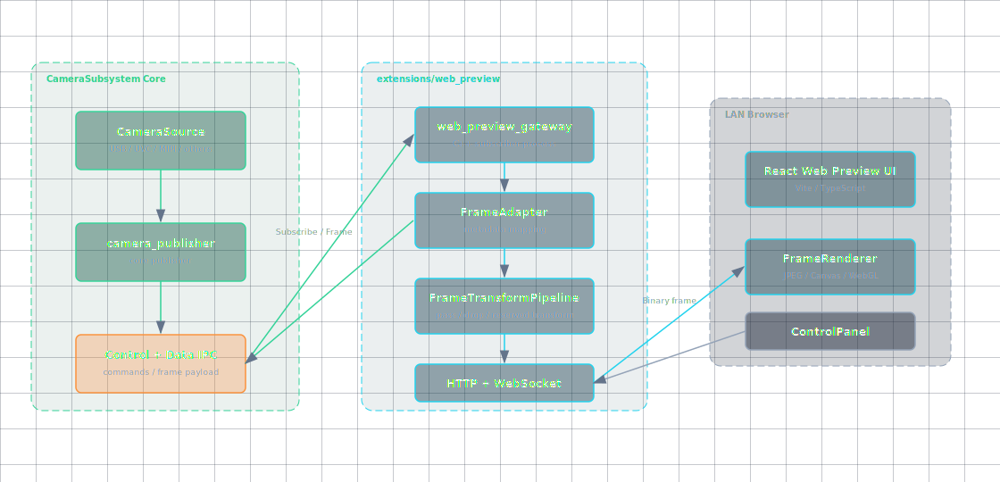
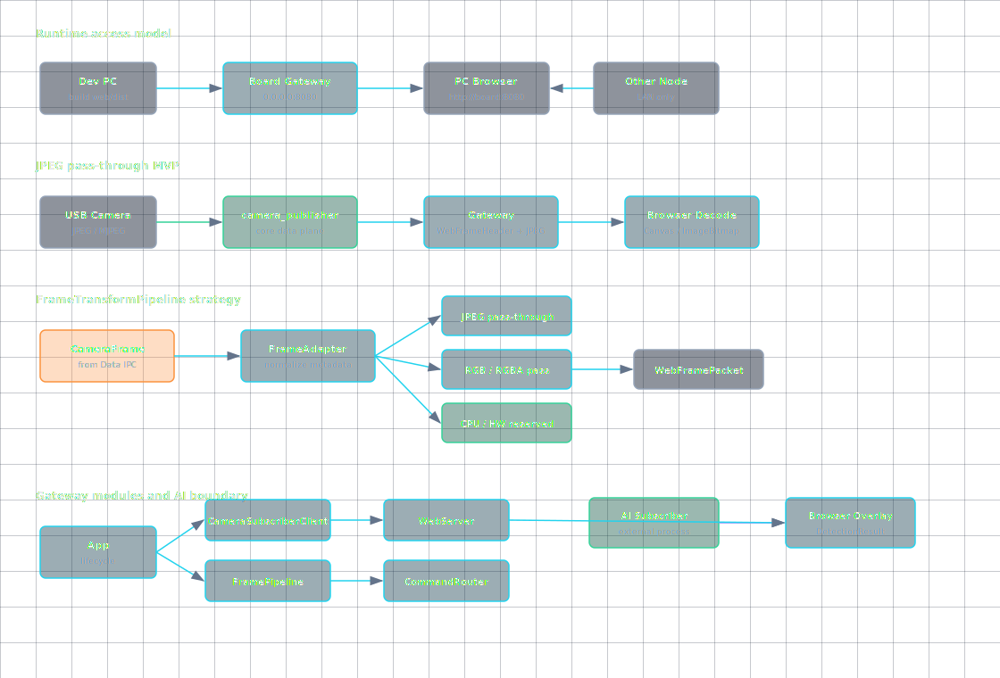
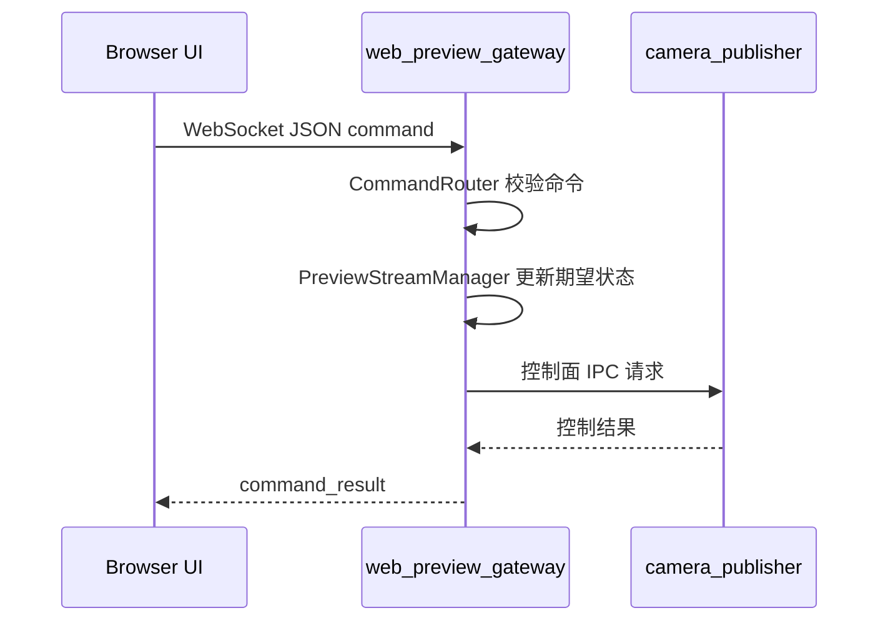
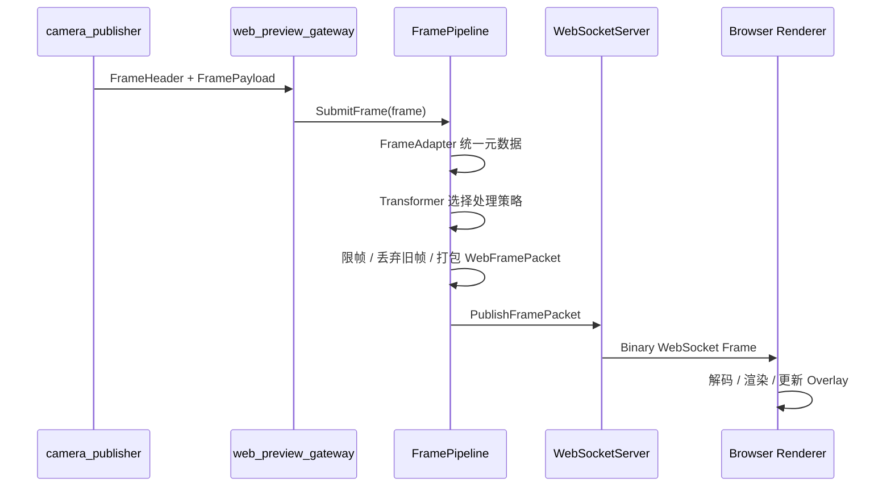
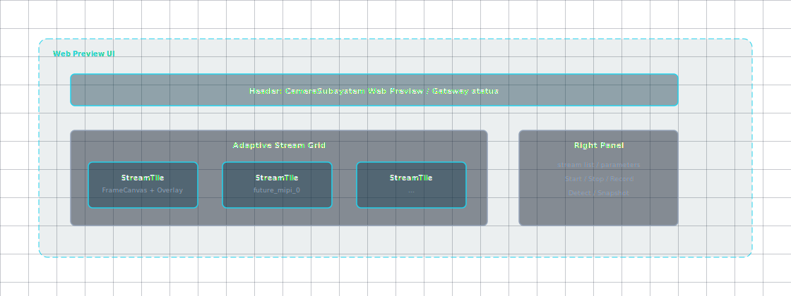

# Web Preview 架构设计

## 1. 背景与目标

当前 CameraSubsystem 已经具备核心发布端、订阅端、控制面 IPC 和数据面 IPC 的基础链路，但板端调试仍不够直观。开发者在 RK3576 / Debian 等边缘设备上验证 Camera 采集时，需要一种可以直接看到实时画面的调试入口，而不是只依赖日志、保存图片或离线抓帧。

Web Preview 的目标是在开发板上运行一个独立的 `web_preview_gateway`，由它作为 CameraSubsystem 的普通订阅端接入核心发布端，并对局域网浏览器提供 HTTP 页面和 WebSocket 数据通道。局域网内任意 PC 或其他节点可以通过浏览器访问开发板 IP，查看实时 Camera 预览页面。

第一阶段主要面对当前已验证的 USB 摄像头场景。该摄像头可输出 JPEG / MJPEG 单帧 payload，因此 Gateway 默认对摄像头输出的原始 JPEG 帧进行透传，不在 Gateway 内执行二次编码，也不引入 H.264 / H.265 / WebRTC 链路。浏览器收到 JPEG payload 后使用浏览器自身解码能力显示画面。

该架构不能写死 JPEG。后续可能接入 MIPI 摄像头、UVC 非 JPEG 格式、NV12、NV21、YUYV、UYVY、RGB/RGBA、多平面 buffer、DMA-BUF 或平台私有帧句柄。因此 Web Preview 需要预留 `FrameTransformPipeline`，用于承接格式识别、元数据补全、可选转换、缩放、硬件加速和 AI 结果叠加。

Web Preview 是 CameraSubsystem 的调试辅助链路，不改变核心发布端、订阅端、控制面 IPC、数据面 IPC 的主架构。它不应反向污染核心数据链路，也不应让浏览器直接理解或耦合 CameraSubsystem 内部 IPC 协议。后续的目标检测、硬件转换都作为扩展能力预留；H.264 编码保存由独立 `camera_codec_server` 承担，Gateway 只作为录制控制代理，详细设计见 [../../../docs/CODEC_SERVER_ARCHITECTURE.md](../../../docs/CODEC_SERVER_ARCHITECTURE.md)。

## 2. 总体架构

最终推荐方案是：Web 页面不直接订阅 CameraSubsystem，而是通过独立 `web_preview_gateway` 接入。

`web_preview_gateway` 采用纯 C++ 实现，是一个独立进程，作为普通订阅端连接 CameraSubsystem，然后对外提供 HTTP + WebSocket 服务。



[打开完整 HTML 图表](diagrams/web_preview_architecture.html)

架构约束如下：

1. `camera_publisher` 仍然是 CameraSubsystem 核心发布端。
2. `web_preview_gateway` 不直接访问摄像头设备节点，不绕过核心发布端。
3. 浏览器不直接接入 CameraSubsystem 内部 IPC。
4. Gateway 负责协议适配、格式适配、背压控制、状态聚合和 Web 服务。
5. 前端工程位于 `CameraSubsystem/extensions/web_preview/web/`。
6. Gateway 工程位于 `CameraSubsystem/extensions/web_preview/gateway/`。

## 3. 为什么不让 Web 端直接订阅

不推荐让 Web 端直接订阅 CameraSubsystem，原因如下：

1. 浏览器无法直接使用当前内部 IPC，也不能直接访问 Unix Domain Socket 等本地进程间通信资源。
2. 不应让前端理解 CameraSubsystem 内部控制协议和数据协议，否则协议演进会影响 Web UI。
3. 后续开关流、保存编码、目标检测等功能需要统一仲裁，不适合分散在浏览器侧。
4. Web 页面刷新、断连、多客户端连接不应直接影响核心发布端的订阅状态和设备生命周期。
5. Gateway 可以做限帧、丢帧、格式转换和状态聚合，避免浏览器消费能力影响核心链路。
6. Gateway 可以作为后续硬件转换、AI 结果显示、录制控制的扩展点。

结论：Web Preview 采用独立 Gateway 方案，Web 页面只和 Gateway 交互。

## 4. 运行与访问模型

`web_preview_gateway` 运行在开发板上。第一阶段建议绑定：

```text
0.0.0.0:8080
```

局域网内 PC 可访问：

```text
http://<board_ip>:8080
```

WebSocket 地址为：

```text
ws://<board_ip>:8080/ws
```

第一阶段只考虑本地局域网访问。防火墙、跨网段访问、多客户端限流、权限认证暂不作为第一阶段范围，后续补充。



[打开完整 HTML 图表](diagrams/web_preview_architecture.html)

## 5. 当前 JPEG 场景的数据路径

当前主要输入来自 USB 摄像头，输出帧为 JPEG / MJPEG 单帧 payload。Gateway 第一版对 JPEG 帧做原始透传，不对 JPEG 做二次编码。浏览器接收到 JPEG payload 后由浏览器解码并绘制到页面。

这属于原始摄像头输出帧转发，不等价于新增视频编码链路。


[打开完整 HTML 图表](diagrams/web_preview_architecture.html)

第一版数据包建议为：

```text
[WebFrameHeader][JPEG Payload]
```

其中：

```text
pixel_format = JPEG
payload = 摄像头输出的原始 JPEG bytes
```

JPEG 场景下，Gateway 只补充 Web 侧帧头和必要状态，不改变 payload 内容。

当前工程事实与映射关系：

1. 当前板端 smoke test 使用 USB 摄像头节点 `/dev/video45`，驱动协商格式为 MJPG，示例订阅端已能保存 `.jpg` 文件。因此第一阶段可以把 `PixelFormat::kMJPEG` 视为 Web 侧 JPEG / MJPEG 帧族处理。
2. 当前数据面 IPC 发送格式已经是 `[CameraDataFrameHeader][FramePayload]`。`CameraDataFrameHeader` 包含 `width`、`height`、`pixel_format`、`frame_size`、`frame_id`、`timestamp_ns`、`sequence`。
3. 对 Web Preview 来说，`frame_size` 映射为 `payload_size`，`frame_id` / `timestamp_ns` 直接映射到 `WebFrameHeader`。
4. 当前数据面 IPC 会把完整 payload 写入 Unix Socket；Gateway 作为订阅端读完 payload 后，应在自身队列中持有该帧数据，不能依赖上游回调返回后的原始内存生命周期。
5. 当前示例数据面头不包含 stride、plane_count、plane_offset、plane_size。`FrameHandle` 内部已有这些字段，但还没有通过示例数据面协议透出。因此 `FrameFormatAdapter` 第一阶段对 JPEG 将 stride 填 0；对 YUV / RGB 原始格式必须等数据面协议补充 stride 后再进入完整支持。

## 6. 格式扩展与 FrameTransformPipeline

Web Preview 不能绑定 JPEG。Gateway 内部需要保留 `FrameTransformPipeline`，让不同输入格式可以选择不同处理策略。


[打开完整 HTML 图表](diagrams/web_preview_architecture.html)

格式策略表：

| 输入格式 | 第一阶段策略 | 后续扩展策略 |
|----------|--------------|--------------|
| JPEG / MJPEG | 原始透传，浏览器解码 | 保持透传 |
| RGB / RGBA | 可直接透传给前端 | 支持缩放、裁剪、Overlay |
| NV12 / NV21 | 第一阶段可标记 TODO 或 CPU fallback | 前端 WebGL Shader 或硬件转换 |
| YUYV / UYVY | 第一阶段可标记 TODO 或 CPU fallback | 前端 WebGL Shader 或硬件转换 |
| 多平面 MIPI buffer | 暂不直接支持 | 结合 DMA-BUF / RGA / GPU 路径 |
| DMA-BUF | 暂不进入 Web 链路 | 后续作为零拷贝或硬件转换输入 |

需要明确：

1. 像素格式转换不是视频编码。
2. RGBA 体积较大，只适合调试场景或低帧率场景。
3. 长期应该优先使用 JPEG 透传、前端 Shader 或硬件转换降低 CPU 压力。
4. 第一版不强行实现所有格式，但接口必须留出来。

当前阶段落点：

1. MVP 只要求 `JpegPassThroughTransformer` 可用。
2. `CpuFrameTransformer` 和 `HardwareFrameTransformer` 先作为模块边界预留，不作为第一阶段交付依赖。
3. 对 NV12 / NV21 / YUYV / UYVY，如果尚未实现转换，Gateway 应返回明确的 stream status，例如 `unsupported_pixel_format`，而不是崩溃或发送错误 payload。
4. Web 侧格式命名建议使用 `JPEG` 表达浏览器可直接解码的压缩图片帧；内部映射时兼容 CameraSubsystem 的 `PixelFormat::kMJPEG`。

## 7. Gateway 内部模块划分

`web_preview_gateway` 内部建议按生命周期、CameraSubsystem 订阅、预览流状态、帧处理、Web 服务和页面命令路由拆分。第一阶段不需要引入复杂继承体系，但模块边界需要清晰。


[打开完整 HTML 图表](diagrams/web_preview_architecture.html)

模块职责表：

| 模块 | 职责 |
|------|------|
| `WebPreviewGatewayApp` | Gateway 进程生命周期、配置加载、启动和停止 |
| `CameraSubscriberClient` | 作为订阅端连接 CameraSubsystem 核心发布端 |
| `PreviewStreamManager` | 管理流列表、订阅状态、最新帧、FPS、丢帧计数 |
| `FramePipeline` | 对输入帧进行格式识别、转换、限帧、打包 |
| `FrameFormatAdapter` | 将 CameraSubsystem 内部帧元数据转换成 Web 预览元数据 |
| `FrameTransformerRegistry` | 根据输入格式选择具体处理器 |
| `JpegPassThroughTransformer` | JPEG 原始透传 |
| `CpuFrameTransformer` | CPU fallback 转换，例如 YUYV / NV12 到 RGBA |
| `HardwareFrameTransformer` | 预留 GPU / RGA / NPU / 厂商 SDK 处理入口 |
| `WebServer` | HTTP 静态资源服务和 WebSocket 服务 |
| `CommandRouter` | 页面控制命令路由 |
| `WebClientManager` | 浏览器连接管理，后续扩展多客户端限流 |

实现边界与当前依赖现状：

1. 当前主工程 CMake 尚未接入 Boost.Beast、libwebsockets 或其他 HTTP / WebSocket 依赖。
2. Gateway 第一版暂不纳入 CameraSubsystem 根 CMake 构建，先作为 `extensions/web_preview/gateway` 下的独立 CMake 子工程推进。
3. 第一阶段 Gateway 运行方式以手动启动或脚本启动为主，systemd service 暂不作为强依赖。
4. Gateway 只复用 CameraSubsystem 公开头文件和 IPC 协议，不应反向修改核心模块以迁就 Web UI。
5. 已评估当前交叉编译环境：RK3576 toolchain sysroot 中没有 Boost.Beast / Boost.Asio 头文件，也没有 libwebsockets 头文件或库。
6. 第一版不引入外部 HTTP / WebSocket 依赖，优先在 Gateway 内实现最小 HTTP + WebSocket 服务；Boost.Beast、libwebsockets 保留为后续替换候选。

## 8. 控制流设计

浏览器控制命令通过 JSON over WebSocket 发送到 Gateway，再由 Gateway 转换为内部控制动作。前端不能直接操作 Camera 设备。

示例命令：

```json
{
  "type": "subscribe_stream",
  "stream_id": "usb_camera_0"
}
```

```json
{
  "type": "set_stream_enabled",
  "stream_id": "usb_camera_0",
  "enabled": true
}
```

```json
{
  "type": "set_record_enabled",
  "stream_id": "usb_camera_0",
  "enabled": true
}
```

```json
{
  "type": "set_detect_enabled",
  "stream_id": "usb_camera_0",
  "enabled": true
}
```

控制策略：

1. `subscribe_stream` / `unsubscribe_stream` 第一阶段需要落地。
2. `set_stream_enabled` 可映射为内部开关流或订阅状态切换，具体取决于当前 CameraSubsystem 已有控制接口。
3. `set_record_enabled` 当前由 Gateway 转发给独立 `camera_codec_server`，不在 Gateway 内部执行编码保存。
4. `set_detect_enabled` 第一阶段只做预留，返回 `not_supported` 或 `external_ai_not_connected`。
5. 不要让前端直接操作 Camera 设备。
6. 控制命令必须由 Gateway 做合法性检查和状态仲裁。
7. `Snapshot` 第一阶段建议优先在浏览器端基于当前画面保存，避免 Gateway 过早承担文件管理职责；如后续需要保存原始 JPEG，再补 Gateway 侧命令。



## 9. 数据流设计

帧从 CameraSubsystem 到浏览器显示的过程如下：



背压策略：

1. Gateway 默认调试预览，不保证每帧必达。
2. 每路流可以只保留最新帧，旧帧可丢弃。
3. 如果浏览器处理不过来，应优先丢弃旧帧，避免延迟持续累积。
4. 第一阶段默认预览帧率建议限制在 5 到 15 FPS。
5. 后续支持前端请求某一路高帧率预览。
6. 多客户端限流后续再做。

当前数据面约束：

1. `CameraDataFrameHeader::frame_size` 当前最大保护逻辑在示例订阅端为 64 MiB，Gateway 也应保留类似上限保护。
2. Gateway 收到帧后应尽快完成必要拷贝或移动，将核心数据面读取线程和 WebSocket 发送线程解耦。
3. WebSocket 发送队列应按 stream 保留最新帧，慢客户端默认丢旧帧。
4. JPEG payload 不做二次压缩；如果需要降低带宽，优先通过限帧或后续缩放转换解决。

## 10. WebFrameHeader 建议

本文档只定义 Web 侧帧头建议字段，不写具体 C++ 结构体实现。

| 字段 | 说明 |
|------|------|
| `magic` | 协议识别 |
| `version` | 协议版本 |
| `header_size` | 帧头大小 |
| `stream_id` | 流 ID 或流索引 |
| `frame_id` | 帧序号 |
| `timestamp_ns` | 原始采集时间戳 |
| `width` | 图像宽 |
| `height` | 图像高 |
| `pixel_format` | JPEG / RGB / RGBA / NV12 / YUYV / UYVY 等 |
| `stride_y` | 主平面 stride |
| `stride_uv` | UV 平面 stride |
| `payload_size` | payload 字节数 |
| `transform_flags` | 是否经过转换、缩放、裁剪 |
| `reserved` | 保留扩展 |

说明：

1. JPEG 场景下 `stride_y` / `stride_uv` 可为 0。
2. 对 YUV / RGB 原始图像，stride 字段必须准确。
3. 后续如果已有 CameraSubsystem 内部 FrameHeader，可通过 `FrameFormatAdapter` 映射，不一定重新定义全部字段。
4. 不要将检测框等 AI 结果塞进 raw frame payload，检测结果应走独立 metadata message。

与当前 CameraSubsystem 数据面头的对应关系：

| WebFrameHeader 字段 | 当前来源 | 当前状态 |
|---------------------|----------|----------|
| `width` | `CameraDataFrameHeader::width` | 已有 |
| `height` | `CameraDataFrameHeader::height` | 已有 |
| `pixel_format` | `CameraDataFrameHeader::pixel_format` | 已有，需要从内部枚举映射到 Web 枚举 |
| `payload_size` | `CameraDataFrameHeader::frame_size` | 已有 |
| `frame_id` | `CameraDataFrameHeader::frame_id` | 已有 |
| `timestamp_ns` | `CameraDataFrameHeader::timestamp_ns` | 已有 |
| `sequence` | `CameraDataFrameHeader::sequence` | 内部可用，Web 侧可选暴露 |
| `stride_y` / `stride_uv` | 当前示例数据面头未提供 | JPEG 可为 0，原始 YUV/RGB 支持前需补充 |
| `transform_flags` | Gateway 内部生成 | 第一阶段 JPEG 透传应标记为未转换 |

## 11. 前端工程设计

前端工程放置在：

```text
CameraSubsystem/extensions/web_preview/web/
```

建议技术栈：

```text
Vite + React + TypeScript + Tailwind CSS + shadcn/ui + lucide-react
```

部署方式：

1. 在开发机上构建前端静态资源。
2. 生成 `dist/`。
3. 拷贝到开发板。
4. 由 `web_preview_gateway` 提供静态资源服务。
5. 开发板运行时不依赖 Node.js。

当前工程规划：

1. 前端源码目录固定为 `extensions/web_preview/web/src/`。
2. 前端构建产物建议固定为 `extensions/web_preview/web/dist/`。
3. `web_preview_gateway` 第一阶段优先直接读取 `web/dist/` 提供静态资源；后续可在安装或部署脚本中复制到板端统一资源目录。
4. `dist/` 属于生成物，是否纳入版本控制由后续部署方式决定，当前不在本架构文档中要求提交。

页面结构建议：



[打开完整 HTML 图表](diagrams/web_preview_architecture.html)

UI 风格说明：

1. 简约、留白充足、圆角卡片。
2. 视频画面上方显示流名称。
3. 视频画面不拉伸变形，默认 contain 显示。
4. 每路显示 resolution、format、fps、latency、drop count。
5. 预留 Start / Stop / Record / Detect / Snapshot 按钮。
6. Record 当前接入 `camera_codec_server` 控制面，负责启动/停止后台 H.264 录制；Detect 第一版只做入口预留。

自适应布局表：

| 流数量 | 默认布局 |
|--------|----------|
| 1 | 1x1 大画面 |
| 2 | 2x1 |
| 3-4 | 2x2 |
| 5-6 | 3x2 |
| 7-9 | 3x3 |
| 更多 | 滚动网格，默认低帧率 |

## 12. 硬件加速与 AI 扩展边界

RK3576 等边缘平台可能具备 GPU / NPU / RGA 等能力，但第一版不强行绑定具体硬件接口，也不能把硬件转换写成已实现事实。Gateway 内部只预留 `HardwareFrameTransformer`，后续可适配 RGA、GPU、OpenCL、OpenGL ES、Vulkan 或厂商媒体接口。

AI 检测由外部 AI 订阅端实现，不塞进 Gateway 主链路。Gateway 只负责按钮入口、状态展示和检测结果 overlay。AI 结果建议通过独立 metadata channel 进入 Gateway。


[打开完整 HTML 图表](diagrams/web_preview_architecture.html)

检测结果示例：

```json
{
  "type": "detection_result",
  "stream_id": "usb_camera_0",
  "frame_id": 1024,
  "objects": [
    {
      "class_id": 1,
      "label": "person",
      "score": 0.92,
      "x": 120,
      "y": 80,
      "w": 240,
      "h": 360
    }
  ]
}
```

说明：

1. AI 结果按 `stream_id + frame_id` 与画面关联。
2. 如果 AI 结果滞后，前端可以根据策略选择显示最近结果或丢弃过期结果。
3. 第一版 Detect 按钮可以返回 `not_supported` 或 `external_ai_not_connected`。

## 13. 第一版实现决策

本节用于把影响第一版代码编写的决策从 TODO 中前移，避免实现阶段反复摇摆。除非后续遇到明确阻塞，第一版按以下边界启动编码。

### 13.1 构建边界

| 项目 | 第一版决策 |
|------|------------|
| 构建归属 | `web_preview_gateway` 暂不纳入 CameraSubsystem 根 CMake。 |
| Gateway 构建目录 | 使用 `extensions/web_preview/gateway/` 下的独立 CMake 子工程。 |
| 核心依赖方式 | Gateway 只引用 CameraSubsystem 公开头文件、IPC 协议和必要静态库或源码目标，不要求核心模块反向依赖扩展模块。 |
| 交叉编译 | 复用现有 RK3576 toolchain 配置思路，但先在扩展目录内形成独立构建闭环。 |
| 启动方式 | 第一版手动启动或通过 `extensions/web_preview/scripts/` 下脚本启动，暂不提供 systemd service。 |

这样处理可以避免 Web 依赖污染当前核心构建，也允许 Gateway 的 HTTP / WebSocket 依赖独立迭代。

### 13.2 HTTP / WebSocket 依赖评估与决策

已对当前交叉编译环境做最小评估：

| 方案 | 当前环境结论 | 第一版决策 |
|------|--------------|------------|
| Boost.Beast | 宿主机存在 Boost 头文件，但 RK3576 toolchain sysroot 中没有 Boost。直接用宿主 `/usr/include/boost` 会混入宿主 glibc 头，交叉编译失败。 | 不作为第一版依赖。 |
| libwebsockets | SDK 中有 buildroot / yocto recipe，但当前 sysroot、宿主环境和板端开发环境没有可直接用于 Gateway 交叉编译的 headers/libs。 | 暂不作为第一版依赖。 |
| 其他第三方轻量库 | 需要新增 vendor 或外部包管理策略，会扩大第一版变量。 | 暂不引入。 |
| Gateway 内置最小实现 | 可基于 C++17 + POSIX socket 完成 HTTP 静态文件和 WebSocket 基础帧收发，不增加核心工程依赖。 | 第一版采用。 |

第一版 `WebServer` 的实现边界：

1. 使用 C++17 + POSIX socket 实现最小 HTTP / WebSocket 服务。
2. HTTP 只要求支持静态资源读取，至少覆盖 `GET /`、`GET /index.html` 和前端构建产物。
3. WebSocket 只要求支持 `GET /ws` Upgrade。
4. Browser -> Gateway 控制消息使用 text frame，payload 为 JSON。
5. Gateway -> Browser 帧数据使用 binary frame，payload 为 `[WebFrameHeader][JPEG Payload]`。
6. 第一版不支持 TLS、压缩扩展、HTTP/2、WebSocket permessage-deflate。
7. 第一版需要支持浏览器客户端发送的 masked frame，并能处理 close / ping / pong 的最小控制帧。
8. WebSocket 握手需要 `Sec-WebSocket-Accept`，Gateway 内部可实现最小 SHA1 + Base64 helper，或将这两个 helper 封装为可替换工具模块。

约束：

1. 依赖选择只影响 `extensions/web_preview/gateway/`，不修改 CameraSubsystem 核心库的依赖集合。
2. 第一版不要求 TLS。
3. 第一版只服务局域网调试场景，监听 `0.0.0.0:8080`。
4. `WebServer` 对上层暴露稳定接口，后续如果切换 Boost.Beast 或 libwebsockets，不影响 `CameraSubscriberClient`、`FramePipeline` 和 `PreviewStreamManager`。

### 13.3 功能边界

| 项目 | 第一版决策 |
|------|------------|
| 输入格式 | 只把 JPEG / MJPEG 透传作为必须支持项。 |
| Web 侧格式名 | Web 侧统一使用 `JPEG` 表达浏览器可直接解码的压缩图片帧，内部兼容 `PixelFormat::kMJPEG`。 |
| 非 JPEG 格式 | 返回 `unsupported_pixel_format` 状态，不做强制 CPU fallback。 |
| 帧率策略 | 默认限制在 5 到 15 FPS，优先低延迟，允许丢帧。 |
| Payload 生命周期 | Gateway 从数据面读完整 payload 后自行持有。 |
| Record | 通过 `camera_codec_server` 控制面启动/停止后台录制，Gateway 只转发命令并回传状态。 |
| Detect | 第一版返回 `not_supported` 或 `external_ai_not_connected`。 |
| Snapshot | 第一版优先由浏览器端基于当前画面保存。 |
| 前端部署 | `web_preview_gateway` 第一版直接读取 `extensions/web_preview/web/dist/`。 |
| HTTP / WebSocket | 第一版采用 Gateway 内置最小实现，不依赖 Boost.Beast 或 libwebsockets。 |

### 13.4 第一版可开始编码的前置输入

第一版编码可以基于以下已知事实展开：

1. 当前数据面 IPC 已提供 `CameraDataFrameHeader + FramePayload`。
2. `CameraDataFrameHeader` 已包含 `width`、`height`、`pixel_format`、`frame_size`、`frame_id`、`timestamp_ns`、`sequence`。
3. 当前 USB 摄像头板端 smoke test 已验证 MJPG / JPEG 帧能经 CameraSubsystem 订阅端保存为 `.jpg`。
4. 示例数据面头暂不包含 stride / plane metadata，因此第一版不承诺原始 YUV / RGB 完整支持。
5. Gateway 作为普通订阅端接入，不直接打开 `/dev/videoX`。

## 14. 第一阶段 MVP 范围

必须做：

| 项目 | 说明 |
|------|------|
| C++ Gateway 进程 | 后续实现，文档先定义架构 |
| HTTP 静态服务 | 提供前端页面 |
| WebSocket 连接 | 传输控制命令和帧数据 |
| JPEG 原始透传 | 当前 USB 摄像头场景 |
| 单路或多路预览 | 根据现有订阅能力决定 |
| 基础状态显示 | stream name、format、resolution、fps、connected |
| 基础按钮预留 | Start / Stop / Record / Detect / Snapshot |
| 背压策略 | 允许丢帧，优先低延迟 |
| 内部枚举映射 | 将 `PixelFormat::kMJPEG` 等内部格式映射为 Web 侧格式 |
| Unsupported 状态 | 对未实现格式返回明确状态，不发送错误帧 |

暂不做：

| 项目 | 说明 |
|------|------|
| H.264 / H.265 编码 | 不属于第一阶段 |
| WebRTC | 不属于第一阶段 |
| 公网访问 | 不属于第一阶段 |
| 权限认证 | 后续补充 |
| 多客户端复杂限流 | 后续补充 |
| AI 推理 | 由外部 AI 订阅端后续实现 |
| DMA-BUF 零拷贝 | 后续结合核心链路演进 |
| 完整硬件转换 | 只预留接口 |
| systemd service | 后续补充 |
| Gateway 内编码保存 | 不在 Gateway 内实现；录制编码由独立 `camera_codec_server` 承担 |

## 15. TODO 与待确认项

以下事项不阻塞第一版 JPEG 透传 Gateway 开始编码，但会影响后续格式扩展、部署固化和生产化能力。

### 15.1 输入格式与元数据

- 已确认：当前示例数据面 `CameraDataFrameHeader` 已包含 `pixel_format`、`width`、`height`、`timestamp_ns`、`frame_id`、`frame_size`，其中 `frame_size` 可映射为 Web 侧 `payload_size`。
- 已确认：当前示例数据面未包含 stride / plane metadata；JPEG 场景可填 0，原始 YUV/RGB 完整支持前需要补充数据面字段或在 `FrameFormatAdapter` 中定义补全规则。
- 已确认：现有数据面 IPC 允许订阅端读取完整 payload；Gateway 读取后应自行持有 payload，不能依赖上游 buffer 生命周期。
- TODO：确认当前 USB 摄像头输出的 JPEG 是单帧 JPEG，还是 UVC MJPEG 连续帧中的单帧 payload。两者对第一阶段透传影响不大，但文档和枚举命名需要统一。

### 15.2 Gateway 实现依赖

- 已确认：Gateway 暂不纳入 CameraSubsystem 根 CMake，第一版作为 `extensions/web_preview/gateway` 下的独立 CMake 子工程推进。
- 已确认：当前 RK3576 toolchain sysroot 没有 Boost.Beast / Boost.Asio 可用头文件，不能直接使用 Boost.Beast。
- 已确认：当前环境没有可直接用于交叉编译的 libwebsockets headers/libs。
- 已确认：第一版采用 Gateway 内置最小 HTTP + WebSocket 实现，不新增外部 Web 依赖。
- 已确认：第一阶段可先手动运行或脚本运行，systemd service 不作为 MVP 强依赖。
- TODO：后续如果要切换 Boost.Beast，需要先把 Boost headers/libs 正式放入 RK3576 sysroot 或扩展模块 vendor 目录，并完成最小交叉编译验证。
- TODO：后续如果要切换 libwebsockets，需要先通过 buildroot / yocto recipe 或独立构建产出目标 headers/libs，并定义部署方式。

### 15.3 前端工程

- 已确认：前端工程规划采用 `Vite + React + TypeScript + Tailwind CSS + shadcn/ui`，并额外建议使用 `lucide-react`。
- 已确认：前端源码目录为 `extensions/web_preview/web/src/`，构建产物建议放在 `extensions/web_preview/web/dist/`。
- 已确认：第一版由 `web_preview_gateway` 直接读取 `extensions/web_preview/web/dist/`。
- TODO：后续确认正式部署时是否安装到指定资源目录。

### 15.4 格式转换与硬件加速

- TODO：确认 RK3576 当前可用的图像硬件转换能力，例如 RGA、GPU、OpenCL、OpenGL ES、Vulkan 或厂商媒体接口。
- TODO：确认后续 MIPI 摄像头可能输出的主要格式，例如 NV12、NV21、YUYV、UYVY、RGB、RGBA 或多平面 buffer。
- 已确认：第一版只要求 JPEG 透传，不要求 CPU fallback 转换 YUYV / NV12 到 RGBA。
- TODO：确认是否需要在 Gateway 中支持缩放，以降低 WebSocket 传输带宽和浏览器渲染压力。

### 15.5 AI 与录制扩展

- TODO：目标检测由外部 AI 订阅端实现，需后续确认 AI 结果如何回传 Gateway。
- TODO：确认 DetectionResult 的字段、坐标系、frame_id 对齐策略和过期结果处理策略。
- 已确认：Record 按钮已接入 `camera_codec_server` 控制面，不在 Gateway 内实现编码保存。
- 已决策：H.264 录制由独立 `camera_codec_server` 订阅原始流并保存文件，Gateway 只负责把前端录制命令转发给 `camera_codec_server` 并回传状态，设计见 [../../../docs/CODEC_SERVER_ARCHITECTURE.md](../../../docs/CODEC_SERVER_ARCHITECTURE.md)。
- 建议：Snapshot 第一版优先由浏览器端保存当前画面；如后续需要保存原始 JPEG 帧，再补 Gateway 侧命令。

### 15.6 网络与安全

- TODO：第一阶段仅支持本地局域网访问，暂不做公网访问和认证。
- TODO：后续需要补充多客户端连接上限、单客户端限帧、WebSocket 发送缓冲区阈值和异常断连处理。
- TODO：后续如需跨网段访问，需要补充防火墙、端口配置和鉴权方案。
